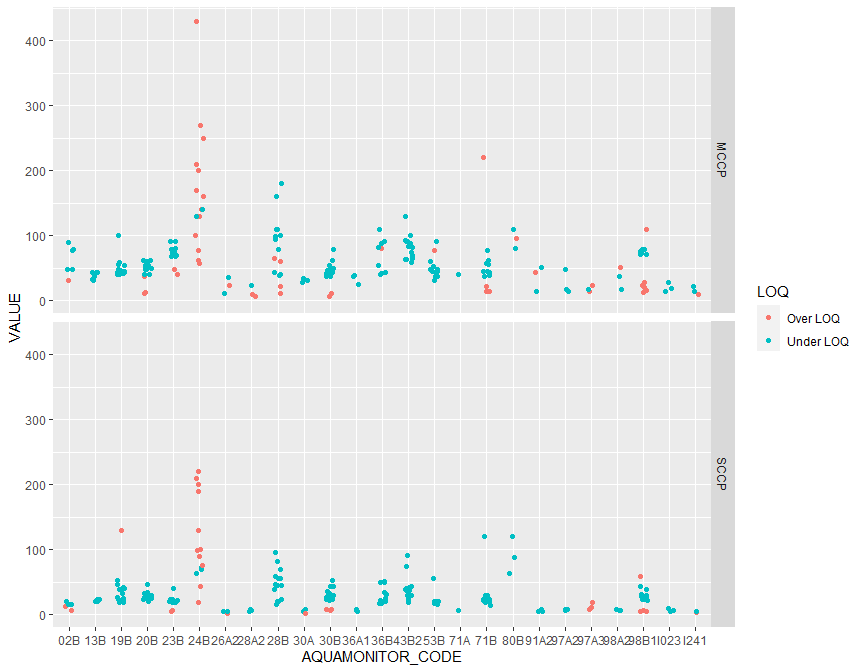

## 1. Libraries


### Settings  

```r
sampling_year <- 2021
```


## 2. Check data in LIMS

- Project 'O 210200.ANAIN' is hard-coded  
- NOTE: no selection for year (but see 3)


```r
df_labware_meta <- get_nivabase_data("select * from NIVADATABASE.LABWARE_CHECK_SAMPLE where PROSJEKT = 'O 210200.ANAIN'")
nrow(df_labware_meta) # 982
```

```
## [1] 2446
```

```r
# get_nivabase_data("select * from NIVADATABASE.LABWARE_IMPORT where rownum < 4")

# One station  
test <- get_nivabase_data(
  "select * from NIVADATABASE.LABWARE_IMPORT where PROSJEKT = 'O 210200.ANAIN' and AQUAMONITOR_CODE = '30B'")

# xtabs(~addNA(PARAM), test)  
# - MCCP and SCCP - not giving 
# xtabs(~addNA(PARAM_I_AQUAMONITOR), test)  # nothing  
```

### Normal indication of <LOQ data  

- ENTRY_QUALIFIER is NA or "<"  
- Example: BDEs  


```r
test %>%
  filter(REPORTED_NAME %in% c("BDE99", "BDE100", "BDE209")) %>%
  xtabs(~REPORTED_NAME + addNA(ENTRY_QUALIFIER), .)
```

```
##              addNA(ENTRY_QUALIFIER)
## REPORTED_NAME  < <NA>
##        BDE100  0   15
##        BDE209 15    0
##        BDE99   0   15
```


#### Indication of <LOQ data for CCPs    

- FORMATTED_ENTRY is a number or "ND"  


```r
test %>%
  filter(REPORTED_NAME %in% c("SCCP eksl. LOQ", "SCCP inkl. LOQ", "MCCP eksl. LOQ", "MCCP inkl. LOQ")) %>%
  xtabs(~REPORTED_NAME + (FORMATTED_ENTRY == "ND"), .)
```

```
##                 FORMATTED_ENTRY == "ND"
## REPORTED_NAME    FALSE TRUE
##   MCCP eksl. LOQ     2   13
##   MCCP inkl. LOQ    15    0
##   SCCP eksl. LOQ     3   12
##   SCCP inkl. LOQ    15    0
```


#### SAMPLE_NUMBER    

```r
test %>%
  count(SAMPLE_NUMBER) %>%
  arrange(SAMPLE_NUMBER) %>%
  group_by(n) %>%
  summarize(
    n = n(),
    min = min(SAMPLE_NUMBER),
    max = max(SAMPLE_NUMBER),
    diff = max-min)
```

```
## # A tibble: 6 × 4
##       n    min    max  diff
##   <int>  <dbl>  <dbl> <dbl>
## 1    15 146472 146486    14
## 2    15 171741 171755    14
## 3    15 155583 155597    14
## 4     5 165445 165450     5
## 5     9 165436 165444     8
## 6    15 147344 147358    14
```


#### TEXT_ID    

```r
test %>%
  count(TEXT_ID) %>%
  arrange(TEXT_ID) %>%
  mutate(TEXT_ID_no = as.numeric(substr(TEXT_ID, 9, 13))) %>%
  group_by(n) %>%
  summarize(
    n = n(),
    min = min(TEXT_ID_no),
    max = max(TEXT_ID_no),
    diff = max-min)
```

```
## # A tibble: 6 × 4
##       n   min   max  diff
##   <int> <dbl> <dbl> <dbl>
## 1    15  8287  8301    14
## 2    15 11309 11323    14
## 3    15   192   206    14
## 4     5  7291  7296     5
## 5     9  7282  7290     8
## 6    15  8752  8766    14
```


## 3. Get data from LIMS  

### Select by project and parameters   


```r
# paste(names(test), collapse = ", ")

vars <- "SAMPLE_TYPE, SAMPLED_DATE, AQUAMONITOR_ID, AQUAMONITOR_CODE, REPORTED_NAME, ENTRY_QUALIFIER, FORMATTED_ENTRY, NUMERIC_ENTRY, UNITS, DESCRIPTION, STATUS, STATUSX, TEXT_ID, PROSJEKT, ANALYSEOPPDRAG, SAMPLE_NUMBER, T_ANALYSIS_METHOD, ANALYS"

df_ccp_all <- get_nivabase_selection(
  vars,
  "LABWARE_IMPORT",
  "REPORTED_NAME",
  c("SCCP eksl. LOQ", "SCCP inkl. LOQ", "MCCP eksl. LOQ", "MCCP inkl. LOQ"), values_are_text = TRUE, 
  extra_sql = "and PROSJEKT = 'O 210200.ANAIN'") %>%
  mutate(
    Month = month(SAMPLED_DATE),
    Year = year(SAMPLED_DATE),
    MYEAR = case_when(
      Month <= 2 ~ Year-1,
      Month >= 3 ~ Year))

xtabs(~MYEAR, df_ccp_all)
```

```
## MYEAR
## 2021 2022 
##  812   60
```

```r
xtabs(~STATUS + STATUSX + MYEAR, df_ccp_all)
```

```
## , , MYEAR = 2021
## 
##       STATUSX
## STATUS Ferdig Midlertidig
##      A    812           0
##      I      0           0
## 
## , , MYEAR = 2022
## 
##       STATUSX
## STATUS Ferdig Midlertidig
##      A      0           0
##      I      0          60
```

```r
# View(df_ccp_all %>% filter(MYEAR == 2022))
```

### Select by status (A = accepted) and year  


```r
df_ccp <- df_ccp_all %>%
  filter(
    STATUS %in% "A",
    MYEAR  %in% sampling_year)
```


#### Tabulate data  

- Eksl. LOQ may be numeric or 'ND'  
- Inkl. LOQ is numeric  
- For one cod station, many samples have 'T' for both   


```r
check1 <- df_ccp %>%
  filter(REPORTED_NAME %in% c("SCCP eksl. LOQ", "SCCP inkl. LOQ")) %>%
  mutate(Type = case_when(
    FORMATTED_ENTRY == "ND" ~ "ND",
    FORMATTED_ENTRY == "T" ~ "T",
    !is.na(as.numeric(sub(",", ".", FORMATTED_ENTRY))) ~ "Numeric",
    TRUE ~ "??"))
```

```
## Warning in eval_tidy(pair$lhs, env = default_env): NAs introduced by coercion
```

```r
# xtabs(~AQUAMONITOR_CODE, check1)

cat("\n\n\n")
```

```r
cat("Eksl. LOQ \n")
```

```
## Eksl. LOQ
```

```r
xtabs(~AQUAMONITOR_CODE + Type, check1 %>% filter(REPORTED_NAME %in% "SCCP eksl. LOQ")) %>% head(10)
```

```
##                 Type
## AQUAMONITOR_CODE ND Numeric  T
##             02B   4       2  0
##             13B   6       0  0
##             19B  14       1  0
##             20B  15       0  0
##             23B  13       2  0
##             24B   3      12  0
##             26A2  2       1  0
##             28A2  3       0  0
##             28B  15       0  0
##             30A   2       1  0
```

```r
cat("==================================\n")
```

```
## ==================================
```

```r
cat("Inkl. LOQ \n")
```

```
## Inkl. LOQ
```

```r
xtabs(~AQUAMONITOR_CODE + Type, check1 %>% filter(REPORTED_NAME %in% "SCCP inkl. LOQ")) %>% head(10)
```

```
##                 Type
## AQUAMONITOR_CODE Numeric  T
##             02B        6  0
##             13B        6  0
##             19B       15  0
##             20B       15  0
##             23B       15  0
##             24B       15  0
##             26A2       3  0
##             28A2       3  0
##             28B       15  0
##             30A        3  0
```

## 4. Get adapted SCCP data  

#### Viewing (for understanding)        

```r
check <- df_ccp %>%
  filter(REPORTED_NAME %in% c("SCCP eksl. LOQ", "SCCP inkl. LOQ")) %>%
  select(AQUAMONITOR_ID, AQUAMONITOR_CODE, TEXT_ID, REPORTED_NAME, FORMATTED_ENTRY) %>%
  tidyr::pivot_wider(names_from = REPORTED_NAME, values_from = FORMATTED_ENTRY) %>%
  arrange(AQUAMONITOR_ID, AQUAMONITOR_CODE, TEXT_ID)


## View data  

# View(check)
```


#### Make data for export      

- Basis is "eksl." data  
- When "eksl." data is numeric, use this (over LOQ) value   
- When "eksl." = "ND", set FLAG1 = < and use the "inkl. LOQ" value as the LOQ value     


```r
params <- c("SCCP eksl. LOQ", "SCCP inkl. LOQ")

df_selected <- df_ccp %>%
  filter(REPORTED_NAME %in% params & !FORMATTED_ENTRY %in% "T") %>%
  select(AQUAMONITOR_ID, AQUAMONITOR_CODE, TEXT_ID, REPORTED_NAME, FORMATTED_ENTRY) %>%
  mutate(Value_temp = as.numeric(sub(',', '.', FORMATTED_ENTRY)))
```

```
## Warning in mask$eval_all_mutate(quo): NAs introduced by coercion
```

```r
check <- xtabs(~FORMATTED_ENTRY, df_selected %>% filter(is.na(Value_temp)))
if (identical(names(check), "ND")){
  message("All FORMATTED_ENTRY are either numeric or 'ND', as expected")
} else {
  stop("Some not-numeric data are something else than 'ND'! Check table called 'check'.")
}
```

```
## All FORMATTED_ENTRY are either numeric or 'ND', as expected
```

```r
df_SCCP <- df_selected %>%
  select(AQUAMONITOR_ID, AQUAMONITOR_CODE, TEXT_ID, REPORTED_NAME, Value_temp) %>%
  tidyr::pivot_wider(names_from = REPORTED_NAME, values_from = Value_temp) %>%
  arrange(AQUAMONITOR_ID, AQUAMONITOR_CODE, TEXT_ID) %>%
  mutate(
    VALUE = case_when(
      !is.na(`SCCP eksl. LOQ`) ~ `SCCP eksl. LOQ`,
      is.na(`SCCP eksl. LOQ`) ~ `SCCP inkl. LOQ`,
    ),
    FLAG1 = case_when(
      !is.na(`SCCP eksl. LOQ`) ~ as.character(NA),
      is.na(`SCCP eksl. LOQ`) ~ "<",
    )
  )
```


## 5, Get adapted MCCP data  

#### Viewing (for understanding)        

```r
check <- df_ccp %>%
  filter(REPORTED_NAME %in% c("MCCP eksl. LOQ", "MCCP inkl. LOQ")) %>%
  select(AQUAMONITOR_ID, AQUAMONITOR_CODE, TEXT_ID, REPORTED_NAME, FORMATTED_ENTRY) %>%
  tidyr::pivot_wider(names_from = REPORTED_NAME, values_from = FORMATTED_ENTRY) %>%
  arrange(AQUAMONITOR_ID, AQUAMONITOR_CODE, TEXT_ID)


## View data  

# View(check)
```


#### Make data for export  

- Basis is "eksl." data  
- When "eksl." data is numeric, use this (over LOQ) value   
- When "eksl." = "ND", set FLAG1 = < and use the "inkl. LOQ" value as the LOQ value     


```r
params <- c("MCCP eksl. LOQ", "MCCP inkl. LOQ")

df_selected <- df_ccp %>%
  filter(REPORTED_NAME %in% params & !FORMATTED_ENTRY %in% "T") %>%
  select(AQUAMONITOR_ID, AQUAMONITOR_CODE, TEXT_ID, REPORTED_NAME, FORMATTED_ENTRY) %>%
  mutate(Value_temp = as.numeric(sub(',', '.', FORMATTED_ENTRY)))
```

```
## Warning in mask$eval_all_mutate(quo): NAs introduced by coercion
```

```r
check <- xtabs(~FORMATTED_ENTRY, df_selected %>% filter(is.na(Value_temp)))
if (identical(names(check), "ND")){
  message("All FORMATTED_ENTRY are either numeric or 'ND', as expected")
} else {
  stop("Some not-numeric data are something else than 'ND'! Check table called 'check'.")
}
```

```
## All FORMATTED_ENTRY are either numeric or 'ND', as expected
```

```r
df_MCCP <- df_selected %>%
  select(AQUAMONITOR_ID, AQUAMONITOR_CODE, TEXT_ID, REPORTED_NAME, Value_temp) %>%
  tidyr::pivot_wider(names_from = REPORTED_NAME, values_from = Value_temp) %>%
  arrange(AQUAMONITOR_ID, AQUAMONITOR_CODE, TEXT_ID) %>%
  mutate(
    VALUE = case_when(
      !is.na(`MCCP eksl. LOQ`) ~ `MCCP eksl. LOQ`,
      is.na(`MCCP eksl. LOQ`) ~ `MCCP inkl. LOQ`,
    ),
    FLAG1 = case_when(
      !is.na(`MCCP eksl. LOQ`) ~ as.character(NA),
      is.na(`MCCP eksl. LOQ`) ~ "<",
    )
  )
```


## 6. Combine  


```r
df_ccp_ready1 <- bind_rows(
  df_SCCP %>% select(AQUAMONITOR_ID, AQUAMONITOR_CODE, TEXT_ID, VALUE, FLAG1) %>% mutate(NAME = "SCCP"),
  df_MCCP %>% select(AQUAMONITOR_ID, AQUAMONITOR_CODE, TEXT_ID, VALUE, FLAG1) %>% mutate(NAME = "MCCP")
)
```


#### Plot  


```r
df_ccp_ready1 %>% 
  mutate(LOQ = case_when(
    is.na(FLAG1) ~ "Over LOQ",
    !is.na(FLAG1) ~ "Under LOQ")
    ) %>% 
  ggplot(aes(AQUAMONITOR_CODE, VALUE, color = LOQ)) +
  geom_jitter(width = 0.15) +
  facet_grid(vars(NAME))
```

<!-- -->


### Add Vannmiljø stations   

- Checking that Kilde_id = AQUAMONITOR_ID with 'NIVA@' in front of it  
- As expected, 20B is not found  
- But can easily be created by adding 'NIVA@' in front of AQUAMONITOR_ID  


```r
df_vm <- readxl::read_excel("Files_to_Vannmiljo/2020/ooa63pi kvalsjekk 18.01.2022.xlsm", sheet = "LOK")

df_vm_stations <- df_vm %>%
  select(Kilde_id, Navn) %>%
  mutate(AQUAMONITOR_ID = sub('NIVA@', '', Kilde_id, fixed = TRUE) %>% as.numeric())

check1 <- df_ccp_ready1 %>%
  left_join(df_vm_stations, by = "AQUAMONITOR_ID")

check2 <- check1 %>%
  filter(is.na(Kilde_id)) %>%
  count(AQUAMONITOR_ID, AQUAMONITOR_CODE)

check2
```

```
## # A tibble: 1 × 3
##   AQUAMONITOR_ID AQUAMONITOR_CODE     n
##            <dbl> <chr>            <int>
## 1          73598 20B                 30
```

## 7. Final data  


```r
df_meta <- df_labware_meta %>%
  distinct(TEXT_ID, SAMPLED_DATE, SPECIES, TISSUE, BIOTA_SAMPLENO)

df_ccp_ready2 <- df_ccp_ready1 %>%
  mutate(
    Kilde_id = paste0('NIVA@', AQUAMONITOR_ID)
  ) %>%
  left_join(
    df_meta, by = "TEXT_ID"
  ) 
```

### Check  

```r
xtabs(~SPECIES + TISSUE, df_ccp_ready2)
```

```
##                 TISSUE
## SPECIES          LI-Lever SB-Whole soft body
##   Gadus morhua        342                  0
##   Mytilus edulis        0                 62
```

```r
xtabs(~addNA(BIOTA_SAMPLENO), df_ccp_ready2)
```

```
## addNA(BIOTA_SAMPLENO)
##    1    2    3    4    5    6    7    8    9   10   11   12   13   14   15   16 
##   50   48   48   24   26   24   22   20   22   22   20   20   20   18   18    2 
## <NA> 
##    0
```


## 8. Save


```r
folder_save <- "Files_to_Jupyterhub_2021/Chlor_paraffins/"

saveRDS(df_ccp_ready2, "Files_to_Jupyterhub_2021/Chlor_paraffins/816_CCP_2021.rda")
saveRDS(df_labware_meta, "Files_to_Jupyterhub_2021/Chlor_paraffins/816_CCP_2021_meta.rda")
saveRDS(df_ccp, "Files_to_Jupyterhub_2021/Chlor_paraffins/816_CCP_2021_labware.rda")

writexl::write_xlsx(df_ccp_ready2,
                    "Files_to_Jupyterhub_2021/Chlor_paraffins/816_CCP_2021.xlsx")
writexl::write_xlsx(df_labware_meta,
                    "Files_to_Jupyterhub_2021/Chlor_paraffins/816_CCP_2021_meta.xlsx")
writexl::write_xlsx(df_ccp,
                    "Files_to_Jupyterhub_2021/Chlor_paraffins/816_CCP_2021_labware.xlsx")
```

### Read saved data  


```r
if (FALSE){
  
  df_ccp_ready2 <- readRDS("Files_to_Jupyterhub_2021/Chlor_paraffins/816_CCP_2021.rda")
  df_ccp_meta <- readRDS("Files_to_Jupyterhub_2021/Chlor_paraffins/816_CCP_2021_meta.rda")

}
```


## 9. For Vannmiljø   

- Not finished - realised this would be too difficult for instance due to 'Provenr'   

```r
df_ccp_ready3 <- df_ccp_ready2 %>%
  mutate(
    # ake 'fake' ID_lokal based on station code and sample number
    ID_lokal = paste0("NIVA@BIO$", AQUAMONITOR_CODE, "_", sprintf("%03.0f", BIOTA_SAMPLENO))
  )
# table(df_ccp_ready3$ID_lokal)

# Select data for liver and mussel respectively
df_vm_liver_source <- df_ccp_ready3 %>%
  filter(TISSUE == "LI-Lever")
df_vm_mussel_source <- df_ccp_ready3 %>%
  filter(TISSUE == "SB-Whole soft body")

# We also need sample number  

# Check vannmiljø file  
check_vm <- readxl::read_excel("Files_to_Vannmiljo/2021/NIVA Milkys 2021 - original.xlsx",
                            sheet = "Vannregistreringer")

# Checking  
#
# check_vm %>%
#   filter(Vannlok_kode == "NIVA@46980") %>%
#   xtabs(~Provenr, .)


#
# Tissue: liver
#
# Make first line of finished Vannmiljø file
df_vm_liver_1 <- check_vm %>%
  filter(Parameter_id == "MCCP" & Medium_id == "BL") %>%
  head(1)
# Make file with the number of rows that we need
df_vm_liver <- df_vm_liver_1
for (i in 2:nrow(df_vm_liver_source)){
  df_vm_liver <- bind_rows(df_vm_liver, df_vm_liver_1)
}
# Insert correct values
df_vm_liver$ID_lokal <- df_vm_liver_source$ID
```

```
## Warning: Unknown or uninitialised column: `ID`.
```

```r
df_vm_liver$Vannlok_kode <- df_vm_liver_source$Kilde_id
df_vm_liver$Parameter_id <- df_vm_liver_source$NAME
df_vm_liver$Operator <- ifelse(is.na(df_vm_liver_source$FLAG1), "", "<")
df_vm_liver$Verdi <- df_vm_liver_source$VALUE


#
# Tissue: mussel
#
# Make first line of finished Vannmiljø file
df_vm_mussel_1 <- check_vm %>%
  filter(Parameter_id == "MCCP" & Medium_id == "BB") %>%
  head(1)
# Make file with the number of rows that we need
df_vm_mussel <- df_vm_mussel_1
for (i in 2:nrow(df_vm_mussel_source)){
  df_vm_mussel <- bind_rows(df_vm_mussel, df_vm_mussel_1)
}

# not finished
```


