## Diverse notater 

* Also see 'Mal_for_kortrapport' from Miljødir.   


* tidstrend punkter: pil/trekant opp/ned avhengig av retning
* < som ekstra tegn over konsentrasjon
* farger i hht, proref

* eget "kart" over deteksjonsfrekvens - akser = stasjoner + stoffer (for siste år)   

* følg grense på 5 år for trender   
*  
* For siste år: boksplott (med Proref lagt på som linjer) med stasjoner som punkt   
* For siste år: boksplott (med EQS lagt på som linjer) med stasjoner som punkt   

* "Stor excel" også - trenger ikke være formatert  

* Data til mosaic plot for antall tidsserier med trend opp og ned -> Merete kan lage pltt i år    

* Fargeskala "Vik" for deteksjonsgrense   
 
* Bruk range og ikke boxplot når det kun er 3 prøver  

* Der punkter er stasjoner: bruk farger for geografi (kalde farger for nord, varme farger for sør)  

* bookdown::html_document2: default  


## Packages etc.   


### Settings  


## Report contents        

This report is based on Milkys data through **2021**.     

### Get data for parameter group    

```
## Joining, by = "PARAM"
## Joining, by = "STATION_CODE"
```
### EQS and Proref (Q95)  


## Data for cod and mussel separately  

### Station names and order   

* 

```
## Warning in LATIN_NAME == c("Gadus morhua", "Platichthys flesus"): longer object
## length is not a multiple of shorter object length
```


### Medians   

* Including 'dat_medium_fish' and 'dat_medium_mussel' which will be used for "all-parameters + all-stations + last year" overviews  


## Overview medians + EQS      

### Mussel sample   

* Examplifying use how to show when >= 50% of the data are under LOQ  

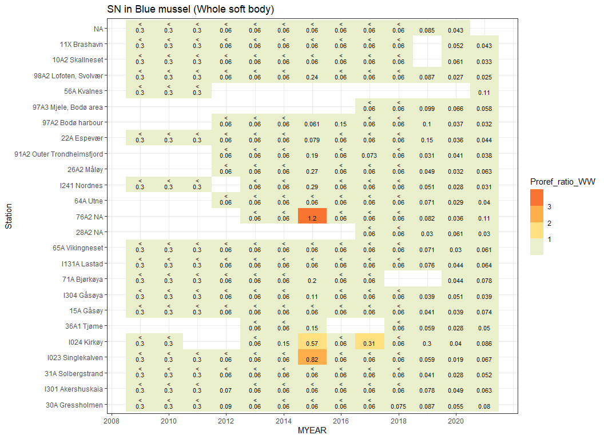<!-- -->


### Fish sample  
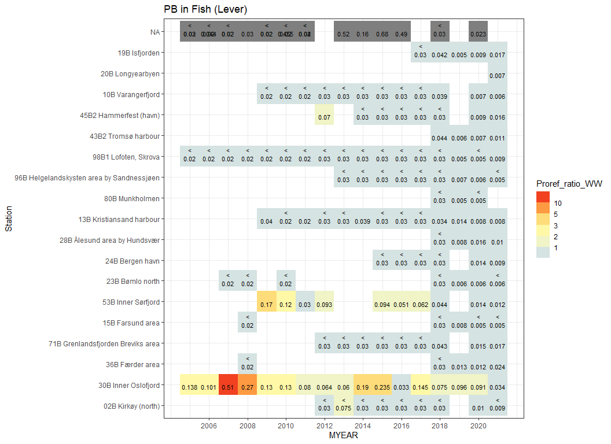<!-- -->


## 1 parameter + 1 species/tissue + all stations      

### Select parameter/species  


### Select data  


### Trends ordinary linear regression    

#### Test get_trend  

```
##       PARAM   LATIN_NAME TISSUE_NAME Station         Est         SE         t
## MYEAR    HG Gadus morhua      Muskel     30B -0.08664623 0.02578679 -3.360101
##                 P
## MYEAR 0.008387813
```


#### Function  


#### Estimation  


### Trend left-censored (linear)  

#### Checks  


#### Test   

```
## module glm loaded
```

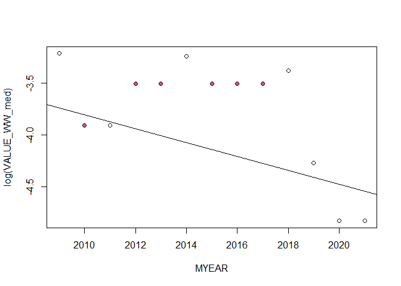<!-- -->

```
## Compiling model graph
##    Resolving undeclared variables
##    Allocating nodes
## Graph information:
##    Observed stochastic nodes: 20
##    Unobserved stochastic nodes: 59
##    Total graph size: 388
## 
## Initializing model
## 
## -------------------------------------
## Confidence interval for the slope: 
##        2.5%       97.5% 
## -0.18216545  0.09261505 
## -------------------------------------
```

#### Test time series plot  

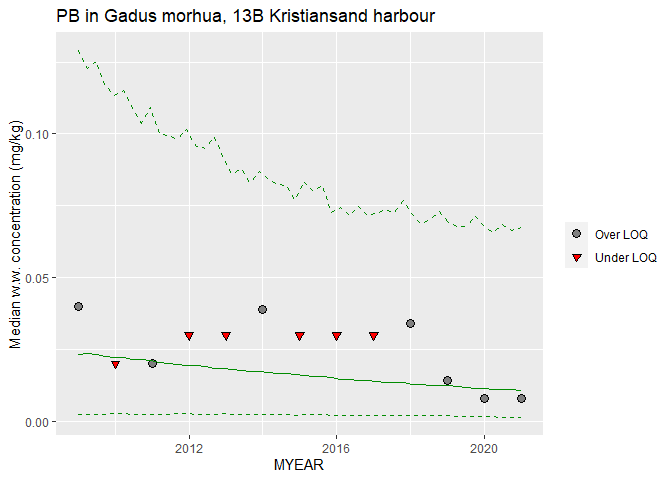<!-- -->


#### Function 'get_trendobj_station'     

* Selects only station - meant to be used for data with only one parameter (and species/tissue)  


#### Get all trends  

* For 1 parameter (still)  
* Creates df_slope which is a list of two data frames (long- and short-term trends)


#### Extract slope estimates

```
## Column names: 
## [1] "Years, Perc2.5, Perc25, Perc50, Perc75, Perc97.5, Station, Trend"
```


### Trend plot for combined plot  

* We create a list of trends instead of useing facet, otherwise it's hard to ensure that each station in the overview plot (tile plot) are in teh same position as the lines for trends    

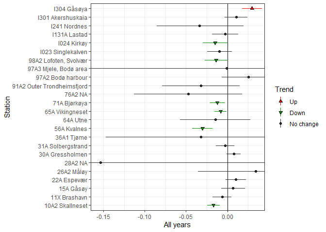<!-- -->


### Combined plot - medians + trends    

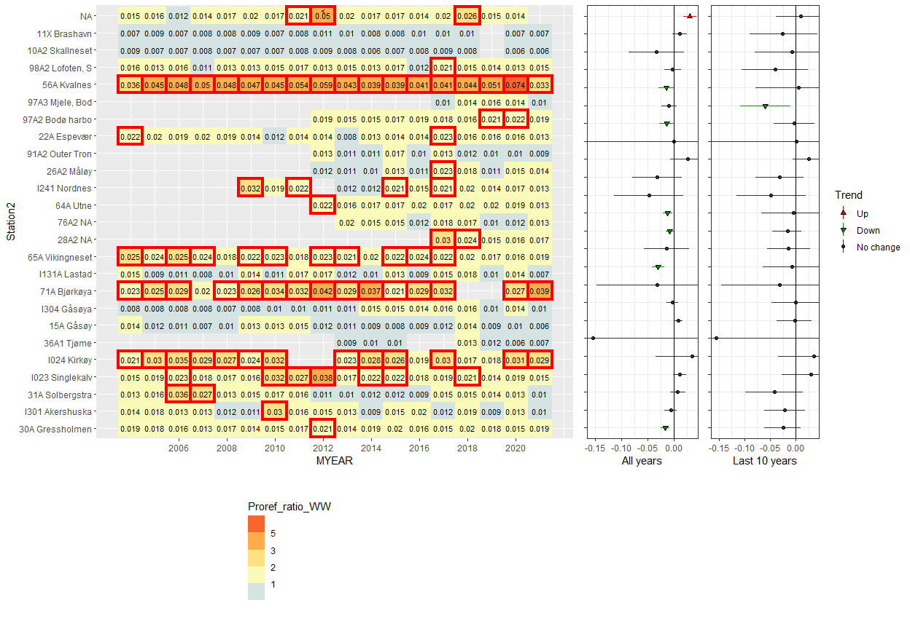<!-- -->


## Detection frequency

* Vik color scale used  

### Detection frequency 1 (by year * station, one parameter in all years)  

* This plot shows the median value for each station/year, it could instead show limit of quantification (median value of less-thans)  

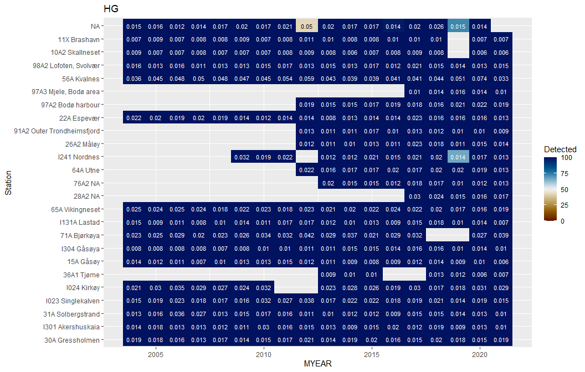<!-- -->


### Detection frequency 2 (by parameter * station, all parameters in last year) 

#### Fish  
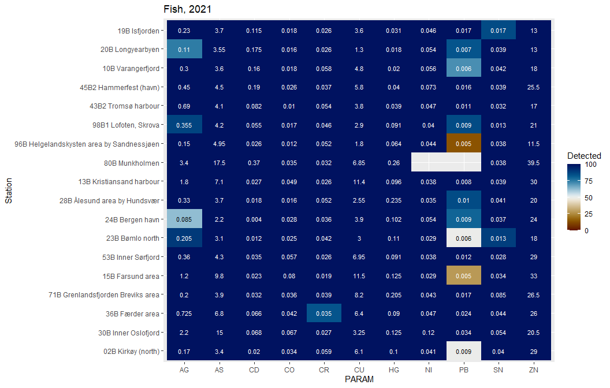<!-- -->

#### Blue mussel    
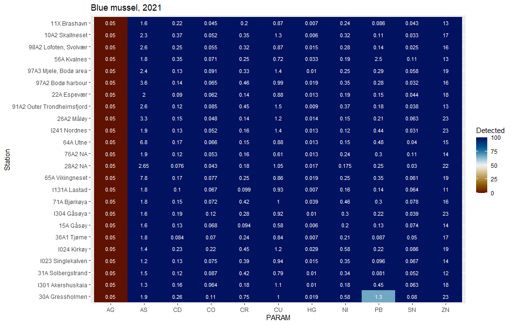<!-- -->

## EQS plot   

### Fish  
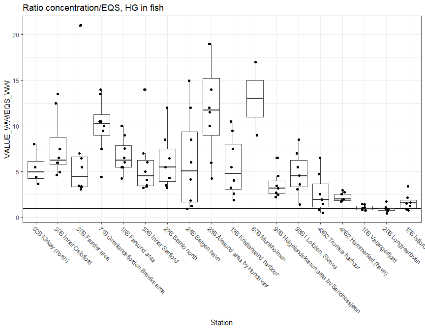<!-- -->

### Blue mussel     

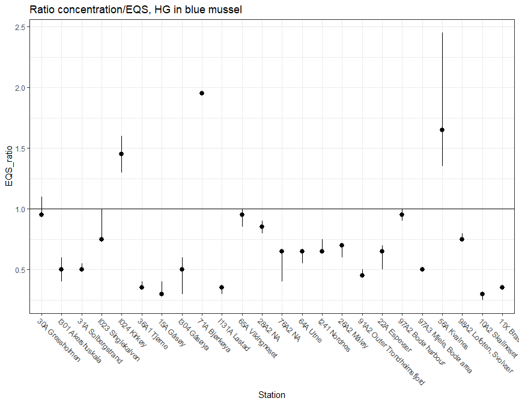<!-- -->


## Proref plot 1 (basert på enkeltprøver)      

### Fish  
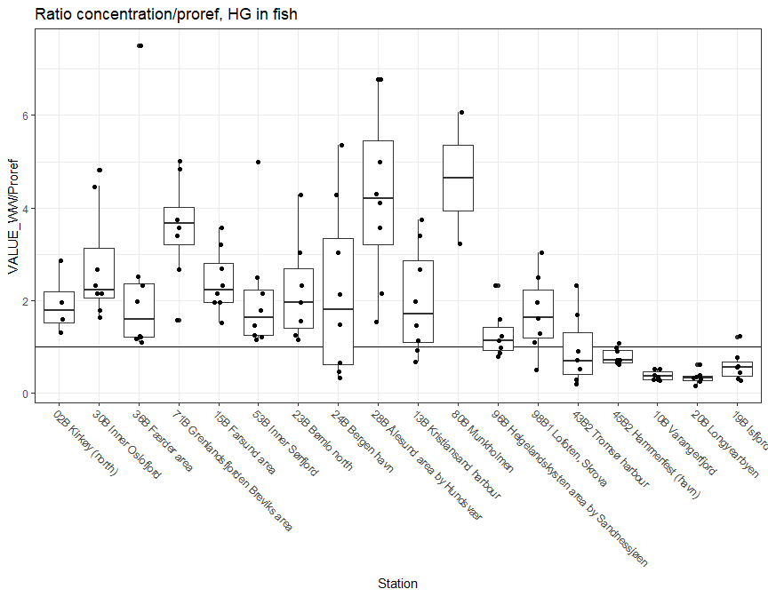<!-- -->

### Blue mussel   
<!-- -->


## Proref plot 2 (basert på medianer)      


### Fish
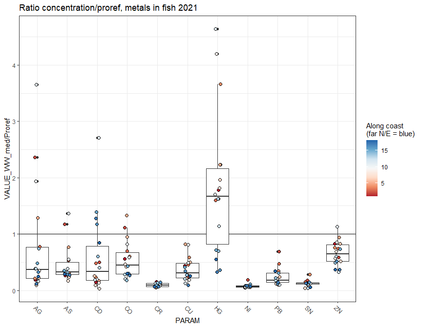<!-- -->

### Blue mussel  
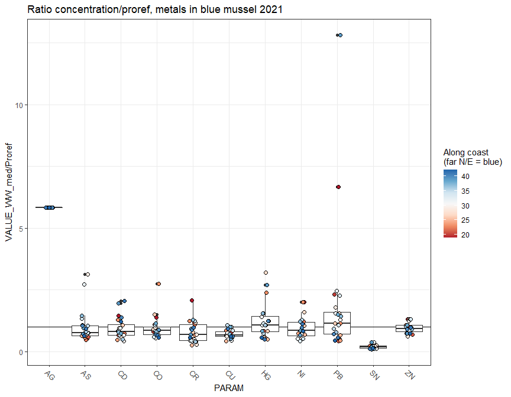<!-- -->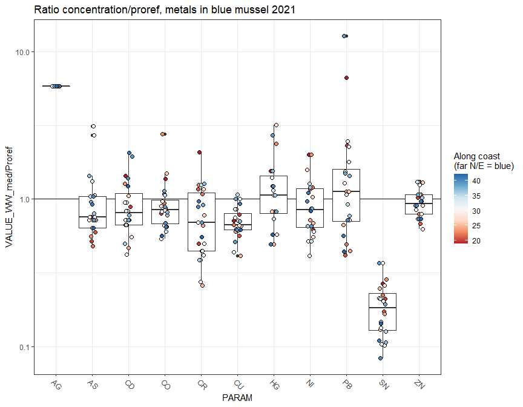<!-- -->


## All parameters + all stations - trend estimation    

### Function for getting data for one parameter and species     

* Note: data is assumed to be homogenous within station (one tissue/species per station)  
    - This assumption is tested by the 
    * Note: data is assumed to be homogenous within station (one tissue/species per station)  
* Function doesn't make new data if data file (saved on Data/824_trend_results) already exists  


```
## [1] 1
```

```
## Trends have already been calculated and are read from 'Data/824_trend_results/Trends HG Gadus morhua.rds'
```

```
## List of 2
##  $ :List of 43
##  $ :List of 43
```

```
## List of 43
##  $ 36B Færder area                          :List of 2
##  $ NA                                       :List of 2
##  $ 02B Kirkøy (north)                       :List of 2
##  $ 30B Inner Oslofjord                      :List of 2
##  $ 71B Grenlandsfjorden Breviks area        :List of 2
##  $ 15B Farsund area                         :List of 2
##  $ 53B Inner Sørfjord                       :List of 2
##  $ 23B Bømlo north                          :List of 2
##  $ 24B Bergen havn                          :List of 2
##  $ 28B Ålesund area by Hundsvær             :List of 2
##  $ 13B Kristiansand harbour                 :List of 2
##  $ 80B Munkholmen                           :List of 2
##  $ 96B Helgelandskysten area by Sandnessjøen:List of 2
##  $ 98B1 Lofoten, Skrova                     :List of 2
##  $ 43B2 Tromsø harbour                      :List of 2
##  $ 45B2 Hammerfest (havn)                   :List of 2
##  $ 10B Varangerfjord                        :List of 2
##  $ 20B Longyearbyen                         :List of 2
##  $ 19B Isfjorden                            :List of 2
##  $ 30A Gressholmen                          :List of 2
##  $ I301 Akershuskaia                        :List of 2
##  $ 31A Solbergstrand                        :List of 2
##  $ I023 Singlekalven                        :List of 2
##  $ I024 Kirkøy                              :List of 2
##  $ 36A1 Tjøme                               :List of 2
##  $ 15A Gåsøy                                :List of 2
##  $ I304 Gåsøya                              :List of 2
##  $ 71A Bjørkøya                             :List of 2
##  $ I131A Lastad                             :List of 2
##  $ 65A Vikingneset                          :List of 2
##  $ 28A2 NA                                  :List of 2
##  $ 76A2 NA                                  :List of 2
##  $ 64A Utne                                 :List of 2
##  $ I241 Nordnes                             :List of 2
##  $ 26A2 Måløy                               :List of 2
##  $ 91A2 Outer Trondheimsfjord               :List of 2
##  $ 22A Espevær                              :List of 2
##  $ 97A2 Bodø harbour                        :List of 2
##  $ 97A3 Mjele, Bodø area                    :List of 2
##  $ 56A Kvalnes                              :List of 2
##  $ 98A2 Lofoten, Svolvær                    :List of 2
##  $ 10A2 Skallneset                          :List of 2
##  $ 11X Brashavn                             :List of 2
```

```
## List of 2
##  $ result:List of 3
##  $ error : NULL
```


