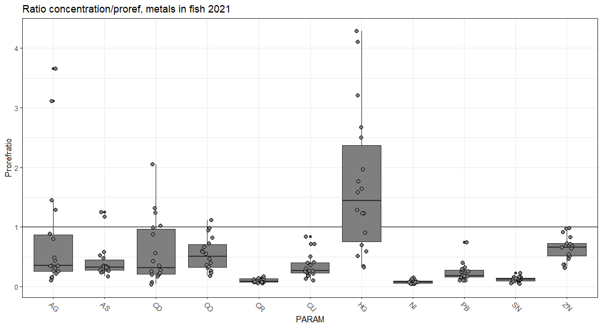
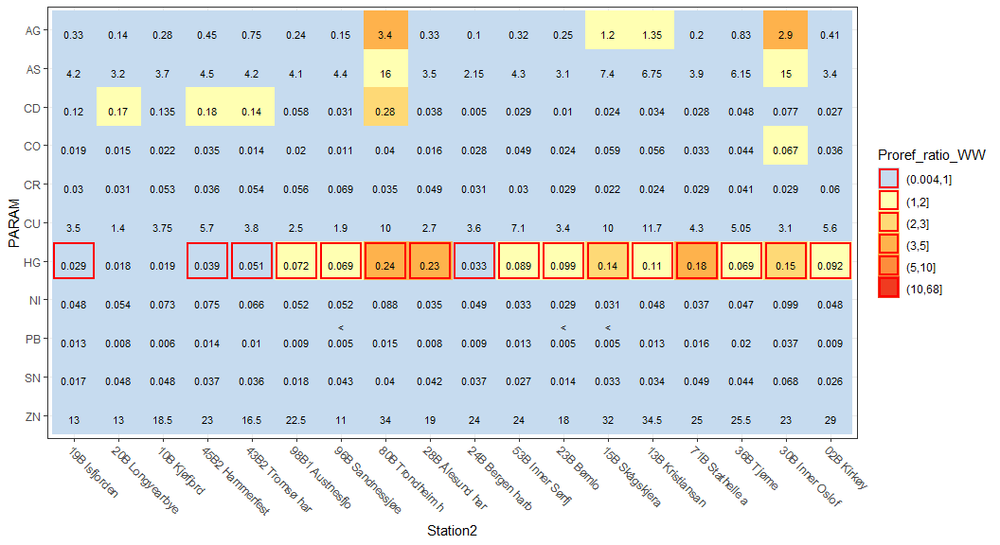

## Medians last year  

### Fish  

<!-- -->


### Blue mussel  

<!-- -->

## Ratio to proref in last year       

### Fish  
* Note: 
    - Concentrations given in tooltip (should do something for the < values for minimum values)   

```{=html}
<div id="htmlwidget-ac636cd492eec82e56e0" style="width:1056px;height:576px;" class="girafe html-widget"></div>
<script type="application/json" data-for="htmlwidget-ac636cd492eec82e56e0">{"x":{"html":"<?xml version=\"1.0\" encoding=\"UTF-8\"?>\n<svg xmlns='http://www.w3.org/2000/svg' xmlns:xlink='http://www.w3.org/1999/xlink' id='svg_f5bd0765-d1c3-440d-bc51-61982c853856' viewBox='0 0 720 288'>\n <defs>\n  <clipPath id='svg_f5bd0765-d1c3-440d-bc51-61982c853856_c1'>\n   <rect x='0' y='0' width='720' height='288'/>\n  <\/clipPath>\n  <clipPath id='svg_f5bd0765-d1c3-440d-bc51-61982c853856_c2'>\n   <rect x='0' y='0' width='306.38' height='288'/>\n  <\/clipPath>\n  <clipPath id='svg_f5bd0765-d1c3-440d-bc51-61982c853856_c3'>\n   <rect x='28.34' y='39.04' width='272.56' height='210.32'/>\n  <\/clipPath>\n  <clipPath id='svg_f5bd0765-d1c3-440d-bc51-61982c853856_c4'>\n   <rect x='306.38' y='0' width='413.62' height='288'/>\n  <\/clipPath>\n  <clipPath id='svg_f5bd0765-d1c3-440d-bc51-61982c853856_c5'>\n   <rect x='346.97' y='39.04' width='239.78' height='210.32'/>\n  <\/clipPath>\n <\/defs>\n <g>\n  <g clip-path='url(#svg_f5bd0765-d1c3-440d-bc51-61982c853856_c1)'>\n   <rect x='0' y='0' width='720' height='288' fill='#FFFFFF' stroke='#FFFFFF' stroke-width='0.75' stroke-linejoin='round' stroke-linecap='round'/>\n  <\/g>\n  <g clip-path='url(#svg_f5bd0765-d1c3-440d-bc51-61982c853856_c2)'>\n   <rect x='0' y='0' width='306.38' height='288' fill='#FFFFFF' stroke='#FFFFFF' stroke-width='1.07' stroke-linejoin='round' stroke-linecap='round'/>\n  <\/g>\n  <g clip-path='url(#svg_f5bd0765-d1c3-440d-bc51-61982c853856_c3)'>\n   <rect x='28.34' y='39.04' width='272.56' height='210.32' fill='#FFFFFF' stroke='none'/>\n   <polyline points='28.34,218.81 300.90,218.81' fill='none' stroke='#EBEBEB' stroke-width='0.53' stroke-linejoin='round' stroke-linecap='butt'/>\n   <polyline points='28.34,173.85 300.90,173.85' fill='none' stroke='#EBEBEB' stroke-width='0.53' stroke-linejoin='round' stroke-linecap='butt'/>\n   <polyline points='28.34,128.89 300.90,128.89' fill='none' stroke='#EBEBEB' stroke-width='0.53' stroke-linejoin='round' stroke-linecap='butt'/>\n   <polyline points='28.34,83.93 300.90,83.93' fill='none' stroke='#EBEBEB' stroke-width='0.53' stroke-linejoin='round' stroke-linecap='butt'/>\n   <polyline points='28.34,241.29 300.90,241.29' fill='none' stroke='#EBEBEB' stroke-width='1.07' stroke-linejoin='round' stroke-linecap='butt'/>\n   <polyline points='28.34,196.33 300.90,196.33' fill='none' stroke='#EBEBEB' stroke-width='1.07' stroke-linejoin='round' stroke-linecap='butt'/>\n   <polyline points='28.34,151.37 300.90,151.37' fill='none' stroke='#EBEBEB' stroke-width='1.07' stroke-linejoin='round' stroke-linecap='butt'/>\n   <polyline points='28.34,106.41 300.90,106.41' fill='none' stroke='#EBEBEB' stroke-width='1.07' stroke-linejoin='round' stroke-linecap='butt'/>\n   <polyline points='28.34,61.45 300.90,61.45' fill='none' stroke='#EBEBEB' stroke-width='1.07' stroke-linejoin='round' stroke-linecap='butt'/>\n   <polyline points='42.94,249.37 42.94,39.04' fill='none' stroke='#EBEBEB' stroke-width='1.07' stroke-linejoin='round' stroke-linecap='butt'/>\n   <polyline points='67.28,249.37 67.28,39.04' fill='none' stroke='#EBEBEB' stroke-width='1.07' stroke-linejoin='round' stroke-linecap='butt'/>\n   <polyline points='91.62,249.37 91.62,39.04' fill='none' stroke='#EBEBEB' stroke-width='1.07' stroke-linejoin='round' stroke-linecap='butt'/>\n   <polyline points='115.95,249.37 115.95,39.04' fill='none' stroke='#EBEBEB' stroke-width='1.07' stroke-linejoin='round' stroke-linecap='butt'/>\n   <polyline points='140.29,249.37 140.29,39.04' fill='none' stroke='#EBEBEB' stroke-width='1.07' stroke-linejoin='round' stroke-linecap='butt'/>\n   <polyline points='164.62,249.37 164.62,39.04' fill='none' stroke='#EBEBEB' stroke-width='1.07' stroke-linejoin='round' stroke-linecap='butt'/>\n   <polyline points='188.96,249.37 188.96,39.04' fill='none' stroke='#EBEBEB' stroke-width='1.07' stroke-linejoin='round' stroke-linecap='butt'/>\n   <polyline points='213.29,249.37 213.29,39.04' fill='none' stroke='#EBEBEB' stroke-width='1.07' stroke-linejoin='round' stroke-linecap='butt'/>\n   <polyline points='237.63,249.37 237.63,39.04' fill='none' stroke='#EBEBEB' stroke-width='1.07' stroke-linejoin='round' stroke-linecap='butt'/>\n   <polyline points='261.97,249.37 261.97,39.04' fill='none' stroke='#EBEBEB' stroke-width='1.07' stroke-linejoin='round' stroke-linecap='butt'/>\n   <polyline points='286.30,249.37 286.30,39.04' fill='none' stroke='#EBEBEB' stroke-width='1.07' stroke-linejoin='round' stroke-linecap='butt'/>\n   <line x1='28.34' y1='196.33' x2='300.9' y2='196.33' stroke='#000000' stroke-width='1.07' stroke-linejoin='round' stroke-linecap='butt'/>\n   <circle cx='42.94' cy='101.09' r='1.47pt' fill='#333333' stroke='#333333' stroke-width='0.71' stroke-linejoin='round' stroke-linecap='round'/>\n   <circle cx='42.94' cy='76.92' r='1.47pt' fill='#333333' stroke='#333333' stroke-width='0.71' stroke-linejoin='round' stroke-linecap='round'/>\n   <line x1='42.94' y1='202.13' x2='42.94' y2='176.02' stroke='#333333' stroke-width='1.07' stroke-linejoin='round' stroke-linecap='butt'/>\n   <line x1='42.94' y1='229.56' x2='42.94' y2='236.45' stroke='#333333' stroke-width='1.07' stroke-linejoin='round' stroke-linecap='butt'/>\n   <polygon points='33.82,202.13 33.82,229.56 52.07,229.56 52.07,202.13 33.82,202.13' fill='#FFFFFF' stroke='#333333' stroke-width='1.07' stroke-linejoin='round' stroke-linecap='round'/>\n   <line x1='33.82' y1='225.33' x2='52.07' y2='225.33' stroke='#333333' stroke-width='2.13' stroke-linejoin='round' stroke-linecap='butt'/>\n   <circle cx='67.28' cy='188.6' r='1.47pt' fill='#333333' stroke='#333333' stroke-width='0.71' stroke-linejoin='round' stroke-linecap='round'/>\n   <circle cx='67.28' cy='185.09' r='1.47pt' fill='#333333' stroke='#333333' stroke-width='0.71' stroke-linejoin='round' stroke-linecap='round'/>\n   <line x1='67.28' y1='221.13' x2='67.28' y2='215.3' stroke='#333333' stroke-width='1.07' stroke-linejoin='round' stroke-linecap='butt'/>\n   <line x1='67.28' y1='228.82' x2='67.28' y2='233.74' stroke='#333333' stroke-width='1.07' stroke-linejoin='round' stroke-linecap='butt'/>\n   <polygon points='58.15,221.13 58.15,228.82 76.41,228.82 76.41,221.13 58.15,221.13' fill='#FFFFFF' stroke='#333333' stroke-width='1.07' stroke-linejoin='round' stroke-linecap='round'/>\n   <line x1='58.15' y1='226.54' x2='76.41' y2='226.54' stroke='#333333' stroke-width='2.13' stroke-linejoin='round' stroke-linecap='butt'/>\n   <line x1='91.62' y1='198.06' x2='91.62' y2='149.06' stroke='#333333' stroke-width='1.07' stroke-linejoin='round' stroke-linecap='butt'/>\n   <line x1='91.62' y1='231.98' x2='91.62' y2='239.81' stroke='#333333' stroke-width='1.07' stroke-linejoin='round' stroke-linecap='butt'/>\n   <polygon points='82.49,198.06 82.49,231.98 100.74,231.98 100.74,198.06 82.49,198.06' fill='#FFFFFF' stroke='#333333' stroke-width='1.07' stroke-linejoin='round' stroke-linecap='round'/>\n   <line x1='82.49' y1='227.04' x2='100.74' y2='227.04' stroke='#333333' stroke-width='2.13' stroke-linejoin='round' stroke-linecap='butt'/>\n   <line x1='115.95' y1='209.35' x2='115.95' y2='191.08' stroke='#333333' stroke-width='1.07' stroke-linejoin='round' stroke-linecap='butt'/>\n   <line x1='115.95' y1='226.86' x2='115.95' y2='233.04' stroke='#333333' stroke-width='1.07' stroke-linejoin='round' stroke-linecap='butt'/>\n   <polygon points='106.83,209.35 106.83,226.86 125.08,226.86 125.08,209.35 106.83,209.35' fill='#FFFFFF' stroke='#333333' stroke-width='1.07' stroke-linejoin='round' stroke-linecap='round'/>\n   <line x1='106.83' y1='218.43' x2='125.08' y2='218.43' stroke='#333333' stroke-width='2.13' stroke-linejoin='round' stroke-linecap='butt'/>\n   <line x1='140.29' y1='235.44' x2='140.29' y2='233.53' stroke='#333333' stroke-width='1.07' stroke-linejoin='round' stroke-linecap='butt'/>\n   <line x1='140.29' y1='238' x2='140.29' y2='238.81' stroke='#333333' stroke-width='1.07' stroke-linejoin='round' stroke-linecap='butt'/>\n   <polygon points='131.16,235.44 131.16,238.00 149.41,238.00 149.41,235.44 131.16,235.44' fill='#FFFFFF' stroke='#333333' stroke-width='1.07' stroke-linejoin='round' stroke-linecap='round'/>\n   <line x1='131.16' y1='237.58' x2='149.41' y2='237.58' stroke='#333333' stroke-width='2.13' stroke-linejoin='round' stroke-linecap='butt'/>\n   <circle cx='164.62' cy='203.71' r='1.47pt' fill='#333333' stroke='#333333' stroke-width='0.71' stroke-linejoin='round' stroke-linecap='round'/>\n   <circle cx='164.62' cy='209.17' r='1.47pt' fill='#333333' stroke='#333333' stroke-width='0.71' stroke-linejoin='round' stroke-linecap='round'/>\n   <circle cx='164.62' cy='209.17' r='1.47pt' fill='#333333' stroke='#333333' stroke-width='0.71' stroke-linejoin='round' stroke-linecap='round'/>\n   <line x1='164.62' y1='223.06' x2='164.62' y2='218.49' stroke='#333333' stroke-width='1.07' stroke-linejoin='round' stroke-linecap='butt'/>\n   <line x1='164.62' y1='231.09' x2='164.62' y2='236.79' stroke='#333333' stroke-width='1.07' stroke-linejoin='round' stroke-linecap='butt'/>\n   <polygon points='155.50,223.06 155.50,231.09 173.75,231.09 173.75,223.06 155.50,223.06' fill='#FFFFFF' stroke='#333333' stroke-width='1.07' stroke-linejoin='round' stroke-linecap='round'/>\n   <line x1='155.5' y1='229.16' x2='173.75' y2='229.16' stroke='#333333' stroke-width='2.13' stroke-linejoin='round' stroke-linecap='butt'/>\n   <line x1='188.96' y1='134.91' x2='188.96' y2='48.6' stroke='#333333' stroke-width='1.07' stroke-linejoin='round' stroke-linecap='butt'/>\n   <line x1='188.96' y1='207.57' x2='188.96' y2='226.84' stroke='#333333' stroke-width='1.07' stroke-linejoin='round' stroke-linecap='butt'/>\n   <polygon points='179.83,134.91 179.83,207.57 198.09,207.57 198.09,134.91 179.83,134.91' fill='#FFFFFF' stroke='#333333' stroke-width='1.07' stroke-linejoin='round' stroke-linecap='round'/>\n   <line x1='179.83' y1='176.66' x2='198.09' y2='176.66' stroke='#333333' stroke-width='2.13' stroke-linejoin='round' stroke-linecap='butt'/>\n   <line x1='213.29' y1='236.9' x2='213.29' y2='234.44' stroke='#333333' stroke-width='1.07' stroke-linejoin='round' stroke-linecap='butt'/>\n   <line x1='213.29' y1='238.56' x2='213.29' y2='239.28' stroke='#333333' stroke-width='1.07' stroke-linejoin='round' stroke-linecap='butt'/>\n   <polygon points='204.17,236.90 204.17,238.56 222.42,238.56 222.42,236.90 204.17,236.90' fill='#FFFFFF' stroke='#333333' stroke-width='1.07' stroke-linejoin='round' stroke-linecap='round'/>\n   <line x1='204.17' y1='237.93' x2='222.42' y2='237.93' stroke='#333333' stroke-width='2.13' stroke-linejoin='round' stroke-linecap='butt'/>\n   <circle cx='237.63' cy='208.02' r='1.47pt' fill='#333333' stroke='#333333' stroke-width='0.71' stroke-linejoin='round' stroke-linecap='round'/>\n   <line x1='237.63' y1='228.92' x2='237.63' y2='223.3' stroke='#333333' stroke-width='1.07' stroke-linejoin='round' stroke-linecap='butt'/>\n   <line x1='237.63' y1='234.09' x2='237.63' y2='236.79' stroke='#333333' stroke-width='1.07' stroke-linejoin='round' stroke-linecap='butt'/>\n   <polygon points='228.50,228.92 228.50,234.09 246.76,234.09 246.76,228.92 228.50,228.92' fill='#FFFFFF' stroke='#333333' stroke-width='1.07' stroke-linejoin='round' stroke-linecap='round'/>\n   <line x1='228.5' y1='232.97' x2='246.76' y2='232.97' stroke='#333333' stroke-width='2.13' stroke-linejoin='round' stroke-linecap='butt'/>\n   <circle cx='261.97' cy='231.1' r='1.47pt' fill='#333333' stroke='#333333' stroke-width='0.71' stroke-linejoin='round' stroke-linecap='round'/>\n   <line x1='261.97' y1='234.73' x2='261.97' y2='233.94' stroke='#333333' stroke-width='1.07' stroke-linejoin='round' stroke-linecap='butt'/>\n   <line x1='261.97' y1='237.02' x2='261.97' y2='239.19' stroke='#333333' stroke-width='1.07' stroke-linejoin='round' stroke-linecap='butt'/>\n   <polygon points='252.84,234.73 252.84,237.02 271.09,237.02 271.09,234.73 252.84,234.73' fill='#FFFFFF' stroke='#333333' stroke-width='1.07' stroke-linejoin='round' stroke-linecap='round'/>\n   <line x1='252.84' y1='235.78' x2='271.09' y2='235.78' stroke='#333333' stroke-width='2.13' stroke-linejoin='round' stroke-linecap='butt'/>\n   <line x1='286.3' y1='208.69' x2='286.3' y2='196.97' stroke='#333333' stroke-width='1.07' stroke-linejoin='round' stroke-linecap='butt'/>\n   <line x1='286.3' y1='218' x2='286.3' y2='227.16' stroke='#333333' stroke-width='1.07' stroke-linejoin='round' stroke-linecap='butt'/>\n   <polygon points='277.18,208.69 277.18,218.00 295.43,218.00 295.43,208.69 277.18,208.69' fill='#FFFFFF' stroke='#333333' stroke-width='1.07' stroke-linejoin='round' stroke-linecap='round'/>\n   <line x1='277.18' y1='211.74' x2='295.43' y2='211.74' stroke='#333333' stroke-width='2.13' stroke-linejoin='round' stroke-linecap='butt'/>\n   <circle cx='44.91' cy='221.47' r='1.87pt' fill='#2166AC' stroke='#000000' stroke-width='0.71' stroke-linejoin='round' stroke-linecap='round' title='02B Kirkøy&amp;lt;br&amp;gt;Conc.: (min-median-max): 0.16-0.41-0.58 mg/kg' data-id='02B'/>\n   <circle cx='45.32' cy='227.75' r='1.87pt' fill='#D6604D' stroke='#000000' stroke-width='0.71' stroke-linejoin='round' stroke-linecap='round' title='10B Kjøfjord&amp;lt;br&amp;gt;Conc.: (min-median-max): 0.11-0.28-0.96 mg/kg' data-id='10B'/>\n   <circle cx='42.98' cy='176.02' r='1.87pt' fill='#92C5DE' stroke='#000000' stroke-width='0.71' stroke-linejoin='round' stroke-linecap='round' title='13B Kristiansand harbour&amp;lt;br&amp;gt;Conc.: (min-median-max): 0.54-1.35-2 mg/kg' data-id='13B'/>\n   <circle cx='44.72' cy='183.27' r='1.87pt' fill='#92C5DE' stroke='#000000' stroke-width='0.71' stroke-linejoin='round' stroke-linecap='round' title='15B Skågskjera&amp;lt;br&amp;gt;Conc.: (min-median-max): 0.39-1.2-2.7 mg/kg' data-id='15B'/>\n   <circle cx='43.04' cy='225.33' r='1.87pt' fill='#B2182B' stroke='#000000' stroke-width='0.71' stroke-linejoin='round' stroke-linecap='round' title='19B Isfjorden&amp;lt;br&amp;gt;Conc.: (min-median-max): 0.08-0.33-1.2 mg/kg' data-id='19B'/>\n   <circle cx='45.3' cy='234.52' r='1.87pt' fill='#B2182B' stroke='#000000' stroke-width='0.71' stroke-linejoin='round' stroke-linecap='round' title='20B Longyearbyen&amp;lt;br&amp;gt;Conc.: (min-median-max): 0.05-0.14-0.48 mg/kg' data-id='20B'/>\n   <circle cx='41.44' cy='229.2' r='1.87pt' fill='#D1E5F0' stroke='#000000' stroke-width='0.71' stroke-linejoin='round' stroke-linecap='round' title='23B Bømlo&amp;lt;br&amp;gt;Conc.: (min-median-max): 0.05-0.25-1.2 mg/kg' data-id='23B'/>\n   <circle cx='43.94' cy='236.45' r='1.87pt' fill='#D1E5F0' stroke='#000000' stroke-width='0.71' stroke-linejoin='round' stroke-linecap='round' title='24B Bergen harbour&amp;lt;br&amp;gt;Conc.: (min-median-max): 0.05-0.1-1.7 mg/kg' data-id='24B'/>\n   <circle cx='42.34' cy='225.33' r='1.87pt' fill='#F7F7F7' stroke='#000000' stroke-width='0.71' stroke-linejoin='round' stroke-linecap='round' title='28B Ålesund harbour&amp;lt;br&amp;gt;Conc.: (min-median-max): 0.05-0.33-4.1 mg/kg' data-id='28B'/>\n   <circle cx='42.7' cy='101.09' r='1.87pt' fill='#2166AC' stroke='#000000' stroke-width='0.71' stroke-linejoin='round' stroke-linecap='round' title='30B Inner Oslofjord&amp;lt;br&amp;gt;Conc.: (min-median-max): 0.33-2.9-11 mg/kg' data-id='30B'/>\n   <circle cx='42.73' cy='201.16' r='1.87pt' fill='#4393C3' stroke='#000000' stroke-width='0.71' stroke-linejoin='round' stroke-linecap='round' title='36B Tjøme&amp;lt;br&amp;gt;Conc.: (min-median-max): 0.5-0.83-2.1 mg/kg' data-id='36B'/>\n   <circle cx='44.64' cy='205.03' r='1.87pt' fill='#D6604D' stroke='#000000' stroke-width='0.71' stroke-linejoin='round' stroke-linecap='round' title='43B2 Tromsø harbour&amp;lt;br&amp;gt;Conc.: (min-median-max): 0.07-0.75-2.3 mg/kg' data-id='43B2'/>\n   <circle cx='43.76' cy='219.53' r='1.87pt' fill='#D6604D' stroke='#000000' stroke-width='0.71' stroke-linejoin='round' stroke-linecap='round' title='45B2 Hammerfest harbour&amp;lt;br&amp;gt;Conc.: (min-median-max): 0.14-0.45-2.3 mg/kg' data-id='45B2'/>\n   <circle cx='40.54' cy='225.82' r='1.87pt' fill='#D1E5F0' stroke='#000000' stroke-width='0.71' stroke-linejoin='round' stroke-linecap='round' title='53B Inner Sørfjord&amp;lt;br&amp;gt;Conc.: (min-median-max): 0.07-0.32-1.8 mg/kg' data-id='53B'/>\n   <circle cx='42.36' cy='231.62' r='1.87pt' fill='#4393C3' stroke='#000000' stroke-width='0.71' stroke-linejoin='round' stroke-linecap='round' title='71B Stathelle area&amp;lt;br&amp;gt;Conc.: (min-median-max): 0.05-0.2-0.51 mg/kg' data-id='71B'/>\n   <circle cx='41.58' cy='76.92' r='1.87pt' fill='#FDDBC7' stroke='#000000' stroke-width='0.71' stroke-linejoin='round' stroke-linecap='round' title='80B Trondheim harbour&amp;lt;br&amp;gt;Conc.: (min-median-max): 1.1-3.4-3.8 mg/kg' data-id='80B'/>\n   <circle cx='44.07' cy='234.04' r='1.87pt' fill='#F4A582' stroke='#000000' stroke-width='0.71' stroke-linejoin='round' stroke-linecap='round' title='96B Sandnessjøen&amp;lt;br&amp;gt;Conc.: (min-median-max): 0.07-0.15-4.5 mg/kg' data-id='96B'/>\n   <circle cx='44.64' cy='229.68' r='1.87pt' fill='#F4A582' stroke='#000000' stroke-width='0.71' stroke-linejoin='round' stroke-linecap='round' title='98B1 Austnesfjord&amp;lt;br&amp;gt;Conc.: (min-median-max): 0.05-0.24-1.3 mg/kg' data-id='98B1'/>\n   <circle cx='65.85' cy='229.35' r='1.87pt' fill='#2166AC' stroke='#000000' stroke-width='0.71' stroke-linejoin='round' stroke-linecap='round' title='02B Kirkøy&amp;lt;br&amp;gt;Conc.: (min-median-max): 3.2-3.4-3.9 mg/kg' data-id='02B'/>\n   <circle cx='69.05' cy='228.29' r='1.87pt' fill='#D6604D' stroke='#000000' stroke-width='0.71' stroke-linejoin='round' stroke-linecap='round' title='10B Kjøfjord&amp;lt;br&amp;gt;Conc.: (min-median-max): 1.8-3.7-6.1 mg/kg' data-id='10B'/>\n   <circle cx='69.6' cy='217.58' r='1.87pt' fill='#92C5DE' stroke='#000000' stroke-width='0.71' stroke-linejoin='round' stroke-linecap='round' title='13B Kristiansand harbour&amp;lt;br&amp;gt;Conc.: (min-median-max): 2-6.75-8.1 mg/kg' data-id='13B'/>\n   <circle cx='69.7' cy='215.3' r='1.87pt' fill='#92C5DE' stroke='#000000' stroke-width='0.71' stroke-linejoin='round' stroke-linecap='round' title='15B Skågskjera&amp;lt;br&amp;gt;Conc.: (min-median-max): 3-7.4-22 mg/kg' data-id='15B'/>\n   <circle cx='68.27' cy='226.54' r='1.87pt' fill='#B2182B' stroke='#000000' stroke-width='0.71' stroke-linejoin='round' stroke-linecap='round' title='19B Isfjorden&amp;lt;br&amp;gt;Conc.: (min-median-max): 2.7-4.2-11 mg/kg' data-id='19B'/>\n   <circle cx='69.27' cy='230.05' r='1.87pt' fill='#B2182B' stroke='#000000' stroke-width='0.71' stroke-linejoin='round' stroke-linecap='round' title='20B Longyearbyen&amp;lt;br&amp;gt;Conc.: (min-median-max): 1.7-3.2-7 mg/kg' data-id='20B'/>\n   <circle cx='65.59' cy='230.4' r='1.87pt' fill='#D1E5F0' stroke='#000000' stroke-width='0.71' stroke-linejoin='round' stroke-linecap='round' title='23B Bømlo&amp;lt;br&amp;gt;Conc.: (min-median-max): 1.4-3.1-15 mg/kg' data-id='23B'/>\n   <circle cx='68.5' cy='233.74' r='1.87pt' fill='#D1E5F0' stroke='#000000' stroke-width='0.71' stroke-linejoin='round' stroke-linecap='round' title='24B Bergen harbour&amp;lt;br&amp;gt;Conc.: (min-median-max): 0.95-2.15-3.9 mg/kg' data-id='24B'/>\n   <circle cx='67.16' cy='228.99' r='1.87pt' fill='#F7F7F7' stroke='#000000' stroke-width='0.71' stroke-linejoin='round' stroke-linecap='round' title='28B Ålesund harbour&amp;lt;br&amp;gt;Conc.: (min-median-max): 2.5-3.5-6.9 mg/kg' data-id='28B'/>\n   <circle cx='66.34' cy='188.6' r='1.87pt' fill='#2166AC' stroke='#000000' stroke-width='0.71' stroke-linejoin='round' stroke-linecap='round' title='30B Inner Oslofjord&amp;lt;br&amp;gt;Conc.: (min-median-max): 5.2-15-38 mg/kg' data-id='30B'/>\n   <circle cx='69.66' cy='219.69' r='1.87pt' fill='#4393C3' stroke='#000000' stroke-width='0.71' stroke-linejoin='round' stroke-linecap='round' title='36B Tjøme&amp;lt;br&amp;gt;Conc.: (min-median-max): 3-6.15-12 mg/kg' data-id='36B'/>\n   <circle cx='69.32' cy='226.54' r='1.87pt' fill='#D6604D' stroke='#000000' stroke-width='0.71' stroke-linejoin='round' stroke-linecap='round' title='43B2 Tromsø harbour&amp;lt;br&amp;gt;Conc.: (min-median-max): 2.2-4.2-6.4 mg/kg' data-id='43B2'/>\n   <circle cx='67.23' cy='225.48' r='1.87pt' fill='#D6604D' stroke='#000000' stroke-width='0.71' stroke-linejoin='round' stroke-linecap='round' title='45B2 Hammerfest harbour&amp;lt;br&amp;gt;Conc.: (min-median-max): 2.6-4.5-8 mg/kg' data-id='45B2'/>\n   <circle cx='67.32' cy='226.18' r='1.87pt' fill='#D1E5F0' stroke='#000000' stroke-width='0.71' stroke-linejoin='round' stroke-linecap='round' title='53B Inner Sørfjord&amp;lt;br&amp;gt;Conc.: (min-median-max): 1.5-4.3-5.6 mg/kg' data-id='53B'/>\n   <circle cx='68.79' cy='227.59' r='1.87pt' fill='#4393C3' stroke='#000000' stroke-width='0.71' stroke-linejoin='round' stroke-linecap='round' title='71B Stathelle area&amp;lt;br&amp;gt;Conc.: (min-median-max): 2.1-3.9-14 mg/kg' data-id='71B'/>\n   <circle cx='69.33' cy='185.09' r='1.87pt' fill='#FDDBC7' stroke='#000000' stroke-width='0.71' stroke-linejoin='round' stroke-linecap='round' title='80B Trondheim harbour&amp;lt;br&amp;gt;Conc.: (min-median-max): 7.2-16-19 mg/kg' data-id='80B'/>\n   <circle cx='65.16' cy='225.83' r='1.87pt' fill='#F4A582' stroke='#000000' stroke-width='0.71' stroke-linejoin='round' stroke-linecap='round' title='96B Sandnessjøen&amp;lt;br&amp;gt;Conc.: (min-median-max): 2.1-4.4-9.3 mg/kg' data-id='96B'/>\n   <circle cx='66.12' cy='226.89' r='1.87pt' fill='#F4A582' stroke='#000000' stroke-width='0.71' stroke-linejoin='round' stroke-linecap='round' title='98B1 Austnesfjord&amp;lt;br&amp;gt;Conc.: (min-median-max): 1.1-4.1-9 mg/kg' data-id='98B1'/>\n   <circle cx='90.55' cy='232.39' r='1.87pt' fill='#2166AC' stroke='#000000' stroke-width='0.71' stroke-linejoin='round' stroke-linecap='round' title='02B Kirkøy&amp;lt;br&amp;gt;Conc.: (min-median-max): 0.016-0.027-0.047 mg/kg' data-id='02B'/>\n   <circle cx='92.83' cy='196.82' r='1.87pt' fill='#D6604D' stroke='#000000' stroke-width='0.71' stroke-linejoin='round' stroke-linecap='round' title='10B Kjøfjord&amp;lt;br&amp;gt;Conc.: (min-median-max): 0.056-0.135-0.17 mg/kg' data-id='10B'/>\n   <circle cx='89.9' cy='229.92' r='1.87pt' fill='#92C5DE' stroke='#000000' stroke-width='0.71' stroke-linejoin='round' stroke-linecap='round' title='13B Kristiansand harbour&amp;lt;br&amp;gt;Conc.: (min-median-max): 0.023-0.0345-0.076 mg/kg' data-id='13B'/>\n   <circle cx='92.3' cy='233.38' r='1.87pt' fill='#92C5DE' stroke='#000000' stroke-width='0.71' stroke-linejoin='round' stroke-linecap='round' title='15B Skågskjera&amp;lt;br&amp;gt;Conc.: (min-median-max): 0.009-0.024-0.051 mg/kg' data-id='15B'/>\n   <circle cx='89.53' cy='201.76' r='1.87pt' fill='#B2182B' stroke='#000000' stroke-width='0.71' stroke-linejoin='round' stroke-linecap='round' title='19B Isfjorden&amp;lt;br&amp;gt;Conc.: (min-median-max): 0.062-0.12-0.32 mg/kg' data-id='19B'/>\n   <circle cx='91.44' cy='185.29' r='1.87pt' fill='#B2182B' stroke='#000000' stroke-width='0.71' stroke-linejoin='round' stroke-linecap='round' title='20B Longyearbyen&amp;lt;br&amp;gt;Conc.: (min-median-max): 0.078-0.17-0.38 mg/kg' data-id='20B'/>\n   <circle cx='89.44' cy='237.99' r='1.87pt' fill='#D1E5F0' stroke='#000000' stroke-width='0.71' stroke-linejoin='round' stroke-linecap='round' title='23B Bømlo&amp;lt;br&amp;gt;Conc.: (min-median-max): 0.007-0.01-0.042 mg/kg' data-id='23B'/>\n   <circle cx='90.46' cy='239.81' r='1.87pt' fill='#D1E5F0' stroke='#000000' stroke-width='0.71' stroke-linejoin='round' stroke-linecap='round' title='24B Bergen harbour&amp;lt;br&amp;gt;Conc.: (min-median-max): 0.003-0.0045-0.048 mg/kg' data-id='24B'/>\n   <circle cx='91.7' cy='228.77' r='1.87pt' fill='#F7F7F7' stroke='#000000' stroke-width='0.71' stroke-linejoin='round' stroke-linecap='round' title='28B Ålesund harbour&amp;lt;br&amp;gt;Conc.: (min-median-max): 0.003-0.038-0.61 mg/kg' data-id='28B'/>\n   <circle cx='93.87' cy='215.93' r='1.87pt' fill='#2166AC' stroke='#000000' stroke-width='0.71' stroke-linejoin='round' stroke-linecap='round' title='30B Inner Oslofjord&amp;lt;br&amp;gt;Conc.: (min-median-max): 0.018-0.077-0.17 mg/kg' data-id='30B'/>\n   <circle cx='91.03' cy='225.31' r='1.87pt' fill='#4393C3' stroke='#000000' stroke-width='0.71' stroke-linejoin='round' stroke-linecap='round' title='36B Tjøme&amp;lt;br&amp;gt;Conc.: (min-median-max): 0.02-0.0485-0.11 mg/kg' data-id='36B'/>\n   <circle cx='91.7' cy='195.17' r='1.87pt' fill='#D6604D' stroke='#000000' stroke-width='0.71' stroke-linejoin='round' stroke-linecap='round' title='43B2 Tromsø harbour&amp;lt;br&amp;gt;Conc.: (min-median-max): 0.017-0.14-0.96 mg/kg' data-id='43B2'/>\n   <circle cx='91.67' cy='182' r='1.87pt' fill='#D6604D' stroke='#000000' stroke-width='0.71' stroke-linejoin='round' stroke-linecap='round' title='45B2 Hammerfest harbour&amp;lt;br&amp;gt;Conc.: (min-median-max): 0.11-0.18-0.51 mg/kg' data-id='45B2'/>\n   <circle cx='89.74' cy='231.74' r='1.87pt' fill='#D1E5F0' stroke='#000000' stroke-width='0.71' stroke-linejoin='round' stroke-linecap='round' title='53B Inner Sørfjord&amp;lt;br&amp;gt;Conc.: (min-median-max): 0.012-0.029-0.058 mg/kg' data-id='53B'/>\n   <circle cx='92.58' cy='232.07' r='1.87pt' fill='#4393C3' stroke='#000000' stroke-width='0.71' stroke-linejoin='round' stroke-linecap='round' title='71B Stathelle area&amp;lt;br&amp;gt;Conc.: (min-median-max): 0.011-0.028-0.062 mg/kg' data-id='71B'/>\n   <circle cx='89.66' cy='149.06' r='1.87pt' fill='#FDDBC7' stroke='#000000' stroke-width='0.71' stroke-linejoin='round' stroke-linecap='round' title='80B Trondheim harbour&amp;lt;br&amp;gt;Conc.: (min-median-max): 0.074-0.28-0.37 mg/kg' data-id='80B'/>\n   <circle cx='93.65' cy='231.08' r='1.87pt' fill='#F4A582' stroke='#000000' stroke-width='0.71' stroke-linejoin='round' stroke-linecap='round' title='96B Sandnessjøen&amp;lt;br&amp;gt;Conc.: (min-median-max): 0.012-0.031-0.29 mg/kg' data-id='96B'/>\n   <circle cx='93.07' cy='222.18' r='1.87pt' fill='#F4A582' stroke='#000000' stroke-width='0.71' stroke-linejoin='round' stroke-linecap='round' title='98B1 Austnesfjord&amp;lt;br&amp;gt;Conc.: (min-median-max): 0.009-0.058-0.69 mg/kg' data-id='98B1'/>\n   <circle cx='116.54' cy='214.31' r='1.87pt' fill='#2166AC' stroke='#000000' stroke-width='0.71' stroke-linejoin='round' stroke-linecap='round' title='02B Kirkøy&amp;lt;br&amp;gt;Conc.: (min-median-max): 0.028-0.036-0.058 mg/kg' data-id='02B'/>\n   <circle cx='113.95' cy='224.8' r='1.87pt' fill='#D6604D' stroke='#000000' stroke-width='0.71' stroke-linejoin='round' stroke-linecap='round' title='10B Kjøfjord&amp;lt;br&amp;gt;Conc.: (min-median-max): 0.01-0.022-0.027 mg/kg' data-id='10B'/>\n   <circle cx='114.84' cy='198.95' r='1.87pt' fill='#92C5DE' stroke='#000000' stroke-width='0.71' stroke-linejoin='round' stroke-linecap='round' title='13B Kristiansand harbour&amp;lt;br&amp;gt;Conc.: (min-median-max): 0.047-0.0565-0.13 mg/kg' data-id='13B'/>\n   <circle cx='116.66' cy='197.08' r='1.87pt' fill='#92C5DE' stroke='#000000' stroke-width='0.71' stroke-linejoin='round' stroke-linecap='round' title='15B Skågskjera&amp;lt;br&amp;gt;Conc.: (min-median-max): 0.03-0.059-0.12 mg/kg' data-id='15B'/>\n   <circle cx='114.73' cy='227.05' r='1.87pt' fill='#B2182B' stroke='#000000' stroke-width='0.71' stroke-linejoin='round' stroke-linecap='round' title='19B Isfjorden&amp;lt;br&amp;gt;Conc.: (min-median-max): 0.009-0.019-0.034 mg/kg' data-id='19B'/>\n   <circle cx='117.74' cy='230.05' r='1.87pt' fill='#B2182B' stroke='#000000' stroke-width='0.71' stroke-linejoin='round' stroke-linecap='round' title='20B Longyearbyen&amp;lt;br&amp;gt;Conc.: (min-median-max): 0.01-0.015-0.034 mg/kg' data-id='20B'/>\n   <circle cx='114.84' cy='223.3' r='1.87pt' fill='#D1E5F0' stroke='#000000' stroke-width='0.71' stroke-linejoin='round' stroke-linecap='round' title='23B Bømlo&amp;lt;br&amp;gt;Conc.: (min-median-max): 0.016-0.024-0.062 mg/kg' data-id='23B'/>\n   <circle cx='115.68' cy='220.31' r='1.87pt' fill='#D1E5F0' stroke='#000000' stroke-width='0.71' stroke-linejoin='round' stroke-linecap='round' title='24B Bergen harbour&amp;lt;br&amp;gt;Conc.: (min-median-max): 0.009-0.028-0.071 mg/kg' data-id='24B'/>\n   <circle cx='113.96' cy='229.3' r='1.87pt' fill='#F7F7F7' stroke='#000000' stroke-width='0.71' stroke-linejoin='round' stroke-linecap='round' title='28B Ålesund harbour&amp;lt;br&amp;gt;Conc.: (min-median-max): 0.004-0.016-0.074 mg/kg' data-id='28B'/>\n   <circle cx='116.93' cy='191.08' r='1.87pt' fill='#2166AC' stroke='#000000' stroke-width='0.71' stroke-linejoin='round' stroke-linecap='round' title='30B Inner Oslofjord&amp;lt;br&amp;gt;Conc.: (min-median-max): 0.013-0.067-0.14 mg/kg' data-id='30B'/>\n   <circle cx='113.8' cy='208.69' r='1.87pt' fill='#4393C3' stroke='#000000' stroke-width='0.71' stroke-linejoin='round' stroke-linecap='round' title='36B Tjøme&amp;lt;br&amp;gt;Conc.: (min-median-max): 0.019-0.0435-0.064 mg/kg' data-id='36B'/>\n   <circle cx='113.65' cy='231.17' r='1.87pt' fill='#D6604D' stroke='#000000' stroke-width='0.71' stroke-linejoin='round' stroke-linecap='round' title='43B2 Tromsø harbour&amp;lt;br&amp;gt;Conc.: (min-median-max): 0.008-0.0135-0.061 mg/kg' data-id='43B2'/>\n   <circle cx='116.99' cy='215.06' r='1.87pt' fill='#D6604D' stroke='#000000' stroke-width='0.71' stroke-linejoin='round' stroke-linecap='round' title='45B2 Hammerfest harbour&amp;lt;br&amp;gt;Conc.: (min-median-max): 0.012-0.035-0.038 mg/kg' data-id='45B2'/>\n   <circle cx='113.86' cy='204.57' r='1.87pt' fill='#D1E5F0' stroke='#000000' stroke-width='0.71' stroke-linejoin='round' stroke-linecap='round' title='53B Inner Sørfjord&amp;lt;br&amp;gt;Conc.: (min-median-max): 0.02-0.049-0.088 mg/kg' data-id='53B'/>\n   <circle cx='116.98' cy='216.56' r='1.87pt' fill='#4393C3' stroke='#000000' stroke-width='0.71' stroke-linejoin='round' stroke-linecap='round' title='71B Stathelle area&amp;lt;br&amp;gt;Conc.: (min-median-max): 0.017-0.033-0.07 mg/kg' data-id='71B'/>\n   <circle cx='115.56' cy='211.31' r='1.87pt' fill='#FDDBC7' stroke='#000000' stroke-width='0.71' stroke-linejoin='round' stroke-linecap='round' title='80B Trondheim harbour&amp;lt;br&amp;gt;Conc.: (min-median-max): 0.035-0.04-0.067 mg/kg' data-id='80B'/>\n   <circle cx='115.84' cy='233.04' r='1.87pt' fill='#F4A582' stroke='#000000' stroke-width='0.71' stroke-linejoin='round' stroke-linecap='round' title='96B Sandnessjøen&amp;lt;br&amp;gt;Conc.: (min-median-max): 0.003-0.011-0.031 mg/kg' data-id='96B'/>\n   <circle cx='116.53' cy='226.3' r='1.87pt' fill='#F4A582' stroke='#000000' stroke-width='0.71' stroke-linejoin='round' stroke-linecap='round' title='98B1 Austnesfjord&amp;lt;br&amp;gt;Conc.: (min-median-max): 0.004-0.02-0.24 mg/kg' data-id='98B1'/>\n   <circle cx='139.95' cy='234.54' r='1.87pt' fill='#2166AC' stroke='#000000' stroke-width='0.71' stroke-linejoin='round' stroke-linecap='round' title='02B Kirkøy&amp;lt;br&amp;gt;Conc.: (min-median-max): 0.02-0.06-0.067 mg/kg' data-id='02B'/>\n   <circle cx='140.04' cy='235.33' r='1.87pt' fill='#D6604D' stroke='#000000' stroke-width='0.71' stroke-linejoin='round' stroke-linecap='round' title='10B Kjøfjord&amp;lt;br&amp;gt;Conc.: (min-median-max): 0.037-0.053-0.12 mg/kg' data-id='10B'/>\n   <circle cx='140.61' cy='238.53' r='1.87pt' fill='#92C5DE' stroke='#000000' stroke-width='0.71' stroke-linejoin='round' stroke-linecap='round' title='13B Kristiansand harbour&amp;lt;br&amp;gt;Conc.: (min-median-max): 0.017-0.0245-0.065 mg/kg' data-id='13B'/>\n   <circle cx='140.22' cy='238.81' r='1.87pt' fill='#92C5DE' stroke='#000000' stroke-width='0.71' stroke-linejoin='round' stroke-linecap='round' title='15B Skågskjera&amp;lt;br&amp;gt;Conc.: (min-median-max): 0.016-0.022-0.048 mg/kg' data-id='15B'/>\n   <circle cx='139.74' cy='237.92' r='1.87pt' fill='#B2182B' stroke='#000000' stroke-width='0.71' stroke-linejoin='round' stroke-linecap='round' title='19B Isfjorden&amp;lt;br&amp;gt;Conc.: (min-median-max): 0.011-0.03-0.067 mg/kg' data-id='19B'/>\n   <circle cx='138.51' cy='237.8' r='1.87pt' fill='#B2182B' stroke='#000000' stroke-width='0.71' stroke-linejoin='round' stroke-linecap='round' title='20B Longyearbyen&amp;lt;br&amp;gt;Conc.: (min-median-max): 0.022-0.031-0.083 mg/kg' data-id='20B'/>\n   <circle cx='138.8' cy='238.03' r='1.87pt' fill='#D1E5F0' stroke='#000000' stroke-width='0.71' stroke-linejoin='round' stroke-linecap='round' title='23B Bømlo&amp;lt;br&amp;gt;Conc.: (min-median-max): 0.012-0.029-0.076 mg/kg' data-id='23B'/>\n   <circle cx='138.01' cy='237.8' r='1.87pt' fill='#D1E5F0' stroke='#000000' stroke-width='0.71' stroke-linejoin='round' stroke-linecap='round' title='24B Bergen harbour&amp;lt;br&amp;gt;Conc.: (min-median-max): 0.015-0.031-0.13 mg/kg' data-id='24B'/>\n   <circle cx='141.28' cy='235.78' r='1.87pt' fill='#F7F7F7' stroke='#000000' stroke-width='0.71' stroke-linejoin='round' stroke-linecap='round' title='28B Ålesund harbour&amp;lt;br&amp;gt;Conc.: (min-median-max): 0.02-0.049-0.073 mg/kg' data-id='28B'/>\n   <circle cx='138.9' cy='238.03' r='1.87pt' fill='#2166AC' stroke='#000000' stroke-width='0.71' stroke-linejoin='round' stroke-linecap='round' title='30B Inner Oslofjord&amp;lt;br&amp;gt;Conc.: (min-median-max): 0.019-0.029-0.15 mg/kg' data-id='30B'/>\n   <circle cx='141.08' cy='236.68' r='1.87pt' fill='#4393C3' stroke='#000000' stroke-width='0.71' stroke-linejoin='round' stroke-linecap='round' title='36B Tjøme&amp;lt;br&amp;gt;Conc.: (min-median-max): 0.01-0.041-0.17 mg/kg' data-id='36B'/>\n   <circle cx='142.01' cy='235.22' r='1.87pt' fill='#D6604D' stroke='#000000' stroke-width='0.71' stroke-linejoin='round' stroke-linecap='round' title='43B2 Tromsø harbour&amp;lt;br&amp;gt;Conc.: (min-median-max): 0.023-0.054-0.099 mg/kg' data-id='43B2'/>\n   <circle cx='139.9' cy='237.24' r='1.87pt' fill='#D6604D' stroke='#000000' stroke-width='0.71' stroke-linejoin='round' stroke-linecap='round' title='45B2 Hammerfest harbour&amp;lt;br&amp;gt;Conc.: (min-median-max): 0.02-0.036-0.097 mg/kg' data-id='45B2'/>\n   <circle cx='137.88' cy='237.92' r='1.87pt' fill='#D1E5F0' stroke='#000000' stroke-width='0.71' stroke-linejoin='round' stroke-linecap='round' title='53B Inner Sørfjord&amp;lt;br&amp;gt;Conc.: (min-median-max): 0.012-0.03-0.078 mg/kg' data-id='53B'/>\n   <circle cx='140.73' cy='238.03' r='1.87pt' fill='#4393C3' stroke='#000000' stroke-width='0.71' stroke-linejoin='round' stroke-linecap='round' title='71B Stathelle area&amp;lt;br&amp;gt;Conc.: (min-median-max): 0.018-0.029-0.07 mg/kg' data-id='71B'/>\n   <circle cx='140.37' cy='237.35' r='1.87pt' fill='#FDDBC7' stroke='#000000' stroke-width='0.71' stroke-linejoin='round' stroke-linecap='round' title='80B Trondheim harbour&amp;lt;br&amp;gt;Conc.: (min-median-max): 0.029-0.035-0.052 mg/kg' data-id='80B'/>\n   <circle cx='140.99' cy='233.53' r='1.87pt' fill='#F4A582' stroke='#000000' stroke-width='0.71' stroke-linejoin='round' stroke-linecap='round' title='96B Sandnessjøen&amp;lt;br&amp;gt;Conc.: (min-median-max): 0.018-0.069-1.2 mg/kg' data-id='96B'/>\n   <circle cx='141.34' cy='234.94' r='1.87pt' fill='#F4A582' stroke='#000000' stroke-width='0.71' stroke-linejoin='round' stroke-linecap='round' title='98B1 Austnesfjord&amp;lt;br&amp;gt;Conc.: (min-median-max): 0.019-0.0565-0.13 mg/kg' data-id='98B1'/>\n   <circle cx='164.7' cy='223.3' r='1.87pt' fill='#2166AC' stroke='#000000' stroke-width='0.71' stroke-linejoin='round' stroke-linecap='round' title='02B Kirkøy&amp;lt;br&amp;gt;Conc.: (min-median-max): 4.1-5.6-9.8 mg/kg' data-id='02B'/>\n   <circle cx='166.72' cy='229.24' r='1.87pt' fill='#D6604D' stroke='#000000' stroke-width='0.71' stroke-linejoin='round' stroke-linecap='round' title='10B Kjøfjord&amp;lt;br&amp;gt;Conc.: (min-median-max): 2.5-3.75-7.7 mg/kg' data-id='10B'/>\n   <circle cx='166.35' cy='203.71' r='1.87pt' fill='#92C5DE' stroke='#000000' stroke-width='0.71' stroke-linejoin='round' stroke-linecap='round' title='13B Kristiansand harbour&amp;lt;br&amp;gt;Conc.: (min-median-max): 8.7-11.7-26 mg/kg' data-id='13B'/>\n   <circle cx='163.75' cy='209.17' r='1.87pt' fill='#92C5DE' stroke='#000000' stroke-width='0.71' stroke-linejoin='round' stroke-linecap='round' title='15B Skågskjera&amp;lt;br&amp;gt;Conc.: (min-median-max): 5.8-10-22 mg/kg' data-id='15B'/>\n   <circle cx='164.74' cy='230.05' r='1.87pt' fill='#B2182B' stroke='#000000' stroke-width='0.71' stroke-linejoin='round' stroke-linecap='round' title='19B Isfjorden&amp;lt;br&amp;gt;Conc.: (min-median-max): 1-3.5-8.5 mg/kg' data-id='19B'/>\n   <circle cx='163.17' cy='236.79' r='1.87pt' fill='#B2182B' stroke='#000000' stroke-width='0.71' stroke-linejoin='round' stroke-linecap='round' title='20B Longyearbyen&amp;lt;br&amp;gt;Conc.: (min-median-max): 0.73-1.4-2.7 mg/kg' data-id='20B'/>\n   <circle cx='163.28' cy='230.37' r='1.87pt' fill='#D1E5F0' stroke='#000000' stroke-width='0.71' stroke-linejoin='round' stroke-linecap='round' title='23B Bømlo&amp;lt;br&amp;gt;Conc.: (min-median-max): 1.2-3.4-18 mg/kg' data-id='23B'/>\n   <circle cx='163.02' cy='229.73' r='1.87pt' fill='#D1E5F0' stroke='#000000' stroke-width='0.71' stroke-linejoin='round' stroke-linecap='round' title='24B Bergen harbour&amp;lt;br&amp;gt;Conc.: (min-median-max): 0.94-3.6-17 mg/kg' data-id='24B'/>\n   <circle cx='166.77' cy='232.62' r='1.87pt' fill='#F7F7F7' stroke='#000000' stroke-width='0.71' stroke-linejoin='round' stroke-linecap='round' title='28B Ålesund harbour&amp;lt;br&amp;gt;Conc.: (min-median-max): 1.3-2.7-14 mg/kg' data-id='28B'/>\n   <circle cx='162.69' cy='231.33' r='1.87pt' fill='#2166AC' stroke='#000000' stroke-width='0.71' stroke-linejoin='round' stroke-linecap='round' title='30B Inner Oslofjord&amp;lt;br&amp;gt;Conc.: (min-median-max): 0.71-3.1-5.6 mg/kg' data-id='30B'/>\n   <circle cx='163.67' cy='225.07' r='1.87pt' fill='#4393C3' stroke='#000000' stroke-width='0.71' stroke-linejoin='round' stroke-linecap='round' title='36B Tjøme&amp;lt;br&amp;gt;Conc.: (min-median-max): 3.3-5.05-8.2 mg/kg' data-id='36B'/>\n   <circle cx='163.95' cy='229.08' r='1.87pt' fill='#D6604D' stroke='#000000' stroke-width='0.71' stroke-linejoin='round' stroke-linecap='round' title='43B2 Tromsø harbour&amp;lt;br&amp;gt;Conc.: (min-median-max): 1.4-3.8-14 mg/kg' data-id='43B2'/>\n   <circle cx='166.65' cy='222.98' r='1.87pt' fill='#D6604D' stroke='#000000' stroke-width='0.71' stroke-linejoin='round' stroke-linecap='round' title='45B2 Hammerfest harbour&amp;lt;br&amp;gt;Conc.: (min-median-max): 3.7-5.7-8.3 mg/kg' data-id='45B2'/>\n   <circle cx='166.23' cy='218.49' r='1.87pt' fill='#D1E5F0' stroke='#000000' stroke-width='0.71' stroke-linejoin='round' stroke-linecap='round' title='53B Inner Sørfjord&amp;lt;br&amp;gt;Conc.: (min-median-max): 1.8-7.1-22 mg/kg' data-id='53B'/>\n   <circle cx='166.24' cy='227.48' r='1.87pt' fill='#4393C3' stroke='#000000' stroke-width='0.71' stroke-linejoin='round' stroke-linecap='round' title='71B Stathelle area&amp;lt;br&amp;gt;Conc.: (min-median-max): 1.9-4.3-13 mg/kg' data-id='71B'/>\n   <circle cx='162.65' cy='209.17' r='1.87pt' fill='#FDDBC7' stroke='#000000' stroke-width='0.71' stroke-linejoin='round' stroke-linecap='round' title='80B Trondheim harbour&amp;lt;br&amp;gt;Conc.: (min-median-max): 3.7-10-15 mg/kg' data-id='80B'/>\n   <circle cx='165.79' cy='235.19' r='1.87pt' fill='#F4A582' stroke='#000000' stroke-width='0.71' stroke-linejoin='round' stroke-linecap='round' title='96B Sandnessjøen&amp;lt;br&amp;gt;Conc.: (min-median-max): 0.93-1.9-4.3 mg/kg' data-id='96B'/>\n   <circle cx='165.3' cy='233.26' r='1.87pt' fill='#F4A582' stroke='#000000' stroke-width='0.71' stroke-linejoin='round' stroke-linecap='round' title='98B1 Austnesfjord&amp;lt;br&amp;gt;Conc.: (min-median-max): 0.33-2.5-4 mg/kg' data-id='98B1'/>\n   <circle cx='189.59' cy='167.42' r='1.87pt' fill='#2166AC' stroke='#000000' stroke-width='0.71' stroke-linejoin='round' stroke-linecap='round' title='02B Kirkøy&amp;lt;br&amp;gt;Conc.: (min-median-max): 0.072-0.092-0.16 mg/kg' data-id='02B'/>\n   <circle cx='187.41' cy='226.03' r='1.87pt' fill='#D6604D' stroke='#000000' stroke-width='0.71' stroke-linejoin='round' stroke-linecap='round' title='10B Kjøfjord&amp;lt;br&amp;gt;Conc.: (min-median-max): 0.011-0.019-0.062 mg/kg' data-id='10B'/>\n   <circle cx='189.81' cy='152.97' r='1.87pt' fill='#92C5DE' stroke='#000000' stroke-width='0.71' stroke-linejoin='round' stroke-linecap='round' title='13B Kristiansand harbour&amp;lt;br&amp;gt;Conc.: (min-median-max): 0.038-0.11-0.22 mg/kg' data-id='13B'/>\n   <circle cx='189.52' cy='128.89' r='1.87pt' fill='#92C5DE' stroke='#000000' stroke-width='0.71' stroke-linejoin='round' stroke-linecap='round' title='15B Skågskjera&amp;lt;br&amp;gt;Conc.: (min-median-max): 0.085-0.14-0.2 mg/kg' data-id='15B'/>\n   <circle cx='190.14' cy='218' r='1.87pt' fill='#B2182B' stroke='#000000' stroke-width='0.71' stroke-linejoin='round' stroke-linecap='round' title='19B Isfjorden&amp;lt;br&amp;gt;Conc.: (min-median-max): 0.014-0.029-0.068 mg/kg' data-id='19B'/>\n   <circle cx='189.33' cy='226.84' r='1.87pt' fill='#B2182B' stroke='#000000' stroke-width='0.71' stroke-linejoin='round' stroke-linecap='round' title='20B Longyearbyen&amp;lt;br&amp;gt;Conc.: (min-median-max): 0.009-0.018-0.076 mg/kg' data-id='20B'/>\n   <circle cx='187.13' cy='161.8' r='1.87pt' fill='#D1E5F0' stroke='#000000' stroke-width='0.71' stroke-linejoin='round' stroke-linecap='round' title='23B Bømlo&amp;lt;br&amp;gt;Conc.: (min-median-max): 0.065-0.099-0.24 mg/kg' data-id='23B'/>\n   <circle cx='190.56' cy='214.79' r='1.87pt' fill='#D1E5F0' stroke='#000000' stroke-width='0.71' stroke-linejoin='round' stroke-linecap='round' title='24B Bergen harbour&amp;lt;br&amp;gt;Conc.: (min-median-max): 0.018-0.033-0.3 mg/kg' data-id='24B'/>\n   <circle cx='190.12' cy='56.63' r='1.87pt' fill='#F7F7F7' stroke='#000000' stroke-width='0.71' stroke-linejoin='round' stroke-linecap='round' title='28B Ålesund harbour&amp;lt;br&amp;gt;Conc.: (min-median-max): 0.086-0.23-0.53 mg/kg' data-id='28B'/>\n   <circle cx='186.75' cy='120.86' r='1.87pt' fill='#2166AC' stroke='#000000' stroke-width='0.71' stroke-linejoin='round' stroke-linecap='round' title='30B Inner Oslofjord&amp;lt;br&amp;gt;Conc.: (min-median-max): 0.092-0.15-0.38 mg/kg' data-id='30B'/>\n   <circle cx='191.18' cy='185.89' r='1.87pt' fill='#4393C3' stroke='#000000' stroke-width='0.71' stroke-linejoin='round' stroke-linecap='round' title='36B Tjøme&amp;lt;br&amp;gt;Conc.: (min-median-max): 0.043-0.069-0.42 mg/kg' data-id='36B'/>\n   <circle cx='189.01' cy='200.34' r='1.87pt' fill='#D6604D' stroke='#000000' stroke-width='0.71' stroke-linejoin='round' stroke-linecap='round' title='43B2 Tromsø harbour&amp;lt;br&amp;gt;Conc.: (min-median-max): 0.01-0.051-0.13 mg/kg' data-id='43B2'/>\n   <circle cx='188.91' cy='209.98' r='1.87pt' fill='#D6604D' stroke='#000000' stroke-width='0.71' stroke-linejoin='round' stroke-linecap='round' title='45B2 Hammerfest harbour&amp;lt;br&amp;gt;Conc.: (min-median-max): 0.026-0.039-0.075 mg/kg' data-id='45B2'/>\n   <circle cx='189.06' cy='169.83' r='1.87pt' fill='#D1E5F0' stroke='#000000' stroke-width='0.71' stroke-linejoin='round' stroke-linecap='round' title='53B Inner Sørfjord&amp;lt;br&amp;gt;Conc.: (min-median-max): 0.05-0.089-0.28 mg/kg' data-id='53B'/>\n   <circle cx='187.04' cy='96.77' r='1.87pt' fill='#4393C3' stroke='#000000' stroke-width='0.71' stroke-linejoin='round' stroke-linecap='round' title='71B Stathelle area&amp;lt;br&amp;gt;Conc.: (min-median-max): 0.088-0.18-0.28 mg/kg' data-id='71B'/>\n   <circle cx='187.37' cy='48.6' r='1.87pt' fill='#FDDBC7' stroke='#000000' stroke-width='0.71' stroke-linejoin='round' stroke-linecap='round' title='80B Trondheim harbour&amp;lt;br&amp;gt;Conc.: (min-median-max): 0.18-0.24-0.34 mg/kg' data-id='80B'/>\n   <circle cx='190.81' cy='185.89' r='1.87pt' fill='#F4A582' stroke='#000000' stroke-width='0.71' stroke-linejoin='round' stroke-linecap='round' title='96B Sandnessjøen&amp;lt;br&amp;gt;Conc.: (min-median-max): 0.044-0.069-0.18 mg/kg' data-id='96B'/>\n   <circle cx='190.44' cy='183.48' r='1.87pt' fill='#F4A582' stroke='#000000' stroke-width='0.71' stroke-linejoin='round' stroke-linecap='round' title='98B1 Austnesfjord&amp;lt;br&amp;gt;Conc.: (min-median-max): 0.028-0.072-0.17 mg/kg' data-id='98B1'/>\n   <circle cx='215.65' cy='237.97' r='1.87pt' fill='#2166AC' stroke='#000000' stroke-width='0.71' stroke-linejoin='round' stroke-linecap='round' title='02B Kirkøy&amp;lt;br&amp;gt;Conc.: (min-median-max): 0.038-0.048-0.059 mg/kg' data-id='02B'/>\n   <circle cx='211.9' cy='236.24' r='1.87pt' fill='#D6604D' stroke='#000000' stroke-width='0.71' stroke-linejoin='round' stroke-linecap='round' title='10B Kjøfjord&amp;lt;br&amp;gt;Conc.: (min-median-max): 0.048-0.073-0.19 mg/kg' data-id='10B'/>\n   <circle cx='212.99' cy='238' r='1.87pt' fill='#92C5DE' stroke='#000000' stroke-width='0.71' stroke-linejoin='round' stroke-linecap='round' title='13B Kristiansand harbour&amp;lt;br&amp;gt;Conc.: (min-median-max): 0.03-0.0475-0.094 mg/kg' data-id='13B'/>\n   <circle cx='215.44' cy='239.14' r='1.87pt' fill='#92C5DE' stroke='#000000' stroke-width='0.71' stroke-linejoin='round' stroke-linecap='round' title='15B Skågskjera&amp;lt;br&amp;gt;Conc.: (min-median-max): 0.021-0.031-0.047 mg/kg' data-id='15B'/>\n   <circle cx='212.7' cy='237.97' r='1.87pt' fill='#B2182B' stroke='#000000' stroke-width='0.71' stroke-linejoin='round' stroke-linecap='round' title='19B Isfjorden&amp;lt;br&amp;gt;Conc.: (min-median-max): 0.027-0.048-0.11 mg/kg' data-id='19B'/>\n   <circle cx='214.5' cy='237.55' r='1.87pt' fill='#B2182B' stroke='#000000' stroke-width='0.71' stroke-linejoin='round' stroke-linecap='round' title='20B Longyearbyen&amp;lt;br&amp;gt;Conc.: (min-median-max): 0.031-0.054-0.096 mg/kg' data-id='20B'/>\n   <circle cx='211.43' cy='239.28' r='1.87pt' fill='#D1E5F0' stroke='#000000' stroke-width='0.71' stroke-linejoin='round' stroke-linecap='round' title='23B Bømlo&amp;lt;br&amp;gt;Conc.: (min-median-max): 0.01-0.029-0.061 mg/kg' data-id='23B'/>\n   <circle cx='213.23' cy='237.9' r='1.87pt' fill='#D1E5F0' stroke='#000000' stroke-width='0.71' stroke-linejoin='round' stroke-linecap='round' title='24B Bergen harbour&amp;lt;br&amp;gt;Conc.: (min-median-max): 0.01-0.049-0.18 mg/kg' data-id='24B'/>\n   <circle cx='214.85' cy='238.87' r='1.87pt' fill='#F7F7F7' stroke='#000000' stroke-width='0.71' stroke-linejoin='round' stroke-linecap='round' title='28B Ålesund harbour&amp;lt;br&amp;gt;Conc.: (min-median-max): 0.016-0.035-0.12 mg/kg' data-id='28B'/>\n   <circle cx='213.96' cy='234.44' r='1.87pt' fill='#2166AC' stroke='#000000' stroke-width='0.71' stroke-linejoin='round' stroke-linecap='round' title='30B Inner Oslofjord&amp;lt;br&amp;gt;Conc.: (min-median-max): 0.047-0.099-0.42 mg/kg' data-id='30B'/>\n   <circle cx='215.17' cy='238.04' r='1.87pt' fill='#4393C3' stroke='#000000' stroke-width='0.71' stroke-linejoin='round' stroke-linecap='round' title='36B Tjøme&amp;lt;br&amp;gt;Conc.: (min-median-max): 0.022-0.047-0.11 mg/kg' data-id='36B'/>\n   <circle cx='213.09' cy='236.69' r='1.87pt' fill='#D6604D' stroke='#000000' stroke-width='0.71' stroke-linejoin='round' stroke-linecap='round' title='43B2 Tromsø harbour&amp;lt;br&amp;gt;Conc.: (min-median-max): 0.028-0.0665-0.16 mg/kg' data-id='43B2'/>\n   <circle cx='212.36' cy='236.1' r='1.87pt' fill='#D6604D' stroke='#000000' stroke-width='0.71' stroke-linejoin='round' stroke-linecap='round' title='45B2 Hammerfest harbour&amp;lt;br&amp;gt;Conc.: (min-median-max): 0.053-0.075-0.15 mg/kg' data-id='45B2'/>\n   <circle cx='215.26' cy='239' r='1.87pt' fill='#D1E5F0' stroke='#000000' stroke-width='0.71' stroke-linejoin='round' stroke-linecap='round' title='53B Inner Sørfjord&amp;lt;br&amp;gt;Conc.: (min-median-max): 0.021-0.033-0.058 mg/kg' data-id='53B'/>\n   <circle cx='213.61' cy='238.73' r='1.87pt' fill='#4393C3' stroke='#000000' stroke-width='0.71' stroke-linejoin='round' stroke-linecap='round' title='71B Stathelle area&amp;lt;br&amp;gt;Conc.: (min-median-max): 0.018-0.037-0.052 mg/kg' data-id='71B'/>\n   <circle cx='211.46' cy='235.2' r='1.87pt' fill='#FDDBC7' stroke='#000000' stroke-width='0.71' stroke-linejoin='round' stroke-linecap='round' title='80B Trondheim harbour&amp;lt;br&amp;gt;Conc.: (min-median-max): 0.073-0.088-0.095 mg/kg' data-id='80B'/>\n   <circle cx='212.86' cy='237.69' r='1.87pt' fill='#F4A582' stroke='#000000' stroke-width='0.71' stroke-linejoin='round' stroke-linecap='round' title='96B Sandnessjøen&amp;lt;br&amp;gt;Conc.: (min-median-max): 0.012-0.052-0.11 mg/kg' data-id='96B'/>\n   <circle cx='213.79' cy='237.73' r='1.87pt' fill='#F4A582' stroke='#000000' stroke-width='0.71' stroke-linejoin='round' stroke-linecap='round' title='98B1 Austnesfjord&amp;lt;br&amp;gt;Conc.: (min-median-max): 0.016-0.0515-0.28 mg/kg' data-id='98B1'/>\n   <circle cx='239.11' cy='233.19' r='1.87pt' fill='#2166AC' stroke='#000000' stroke-width='0.71' stroke-linejoin='round' stroke-linecap='round' title='02B Kirkøy&amp;lt;br&amp;gt;Conc.: (min-median-max): 0.005-0.009-0.013 mg/kg' data-id='02B'/>\n   <circle cx='238.7' cy='235.89' r='1.87pt' fill='#D6604D' stroke='#000000' stroke-width='0.71' stroke-linejoin='round' stroke-linecap='round' title='10B Kjøfjord&amp;lt;br&amp;gt;Conc.: (min-median-max): 0.005-0.006-0.009 mg/kg' data-id='10B'/>\n   <circle cx='236.37' cy='230.05' r='1.87pt' fill='#92C5DE' stroke='#000000' stroke-width='0.71' stroke-linejoin='round' stroke-linecap='round' title='13B Kristiansand harbour&amp;lt;br&amp;gt;Conc.: (min-median-max): 0.007-0.0125-0.026 mg/kg' data-id='13B'/>\n   <circle cx='239.5' cy='236.79' r='1.87pt' fill='#92C5DE' stroke='#000000' stroke-width='0.71' stroke-linejoin='round' stroke-linecap='round' title='15B Skågskjera&amp;lt;br&amp;gt;Conc.: (min-median-max): 0.005-0.005-0.009 mg/kg' data-id='15B'/>\n   <circle cx='235.86' cy='229.6' r='1.87pt' fill='#B2182B' stroke='#000000' stroke-width='0.71' stroke-linejoin='round' stroke-linecap='round' title='19B Isfjorden&amp;lt;br&amp;gt;Conc.: (min-median-max): 0.006-0.013-0.045 mg/kg' data-id='19B'/>\n   <circle cx='239.55' cy='234.09' r='1.87pt' fill='#B2182B' stroke='#000000' stroke-width='0.71' stroke-linejoin='round' stroke-linecap='round' title='20B Longyearbyen&amp;lt;br&amp;gt;Conc.: (min-median-max): 0.005-0.008-0.017 mg/kg' data-id='20B'/>\n   <circle cx='238.2' cy='236.79' r='1.87pt' fill='#D1E5F0' stroke='#000000' stroke-width='0.71' stroke-linejoin='round' stroke-linecap='round' title='23B Bømlo&amp;lt;br&amp;gt;Conc.: (min-median-max): 0.005-0.005-0.076 mg/kg' data-id='23B'/>\n   <circle cx='239.35' cy='233.64' r='1.87pt' fill='#D1E5F0' stroke='#000000' stroke-width='0.71' stroke-linejoin='round' stroke-linecap='round' title='24B Bergen harbour&amp;lt;br&amp;gt;Conc.: (min-median-max): 0.005-0.0085-0.021 mg/kg' data-id='24B'/>\n   <circle cx='236.74' cy='234.09' r='1.87pt' fill='#F7F7F7' stroke='#000000' stroke-width='0.71' stroke-linejoin='round' stroke-linecap='round' title='28B Ålesund harbour&amp;lt;br&amp;gt;Conc.: (min-median-max): 0.005-0.008-0.037 mg/kg' data-id='28B'/>\n   <circle cx='239.3' cy='208.02' r='1.87pt' fill='#2166AC' stroke='#000000' stroke-width='0.71' stroke-linejoin='round' stroke-linecap='round' title='30B Inner Oslofjord&amp;lt;br&amp;gt;Conc.: (min-median-max): 0.009-0.037-0.56 mg/kg' data-id='30B'/>\n   <circle cx='235.5' cy='223.3' r='1.87pt' fill='#4393C3' stroke='#000000' stroke-width='0.71' stroke-linejoin='round' stroke-linecap='round' title='36B Tjøme&amp;lt;br&amp;gt;Conc.: (min-median-max): 0.009-0.02-0.028 mg/kg' data-id='36B'/>\n   <circle cx='236.4' cy='232.75' r='1.87pt' fill='#D6604D' stroke='#000000' stroke-width='0.71' stroke-linejoin='round' stroke-linecap='round' title='43B2 Tromsø harbour&amp;lt;br&amp;gt;Conc.: (min-median-max): 0.005-0.0095-0.054 mg/kg' data-id='43B2'/>\n   <circle cx='238.58' cy='228.7' r='1.87pt' fill='#D6604D' stroke='#000000' stroke-width='0.71' stroke-linejoin='round' stroke-linecap='round' title='45B2 Hammerfest harbour&amp;lt;br&amp;gt;Conc.: (min-median-max): 0.007-0.014-0.025 mg/kg' data-id='45B2'/>\n   <circle cx='239.31' cy='229.6' r='1.87pt' fill='#D1E5F0' stroke='#000000' stroke-width='0.71' stroke-linejoin='round' stroke-linecap='round' title='53B Inner Sørfjord&amp;lt;br&amp;gt;Conc.: (min-median-max): 0.007-0.013-0.031 mg/kg' data-id='53B'/>\n   <circle cx='235.76' cy='226.9' r='1.87pt' fill='#4393C3' stroke='#000000' stroke-width='0.71' stroke-linejoin='round' stroke-linecap='round' title='71B Stathelle area&amp;lt;br&amp;gt;Conc.: (min-median-max): 0.008-0.016-0.031 mg/kg' data-id='71B'/>\n   <circle cx='240' cy='227.8' r='1.87pt' fill='#FDDBC7' stroke='#000000' stroke-width='0.71' stroke-linejoin='round' stroke-linecap='round' title='80B Trondheim harbour&amp;lt;br&amp;gt;Conc.: (min-median-max): 0.013-0.015-0.02 mg/kg' data-id='80B'/>\n   <circle cx='238.34' cy='236.79' r='1.87pt' fill='#F4A582' stroke='#000000' stroke-width='0.71' stroke-linejoin='round' stroke-linecap='round' title='96B Sandnessjøen&amp;lt;br&amp;gt;Conc.: (min-median-max): 0.005-0.005-0.015 mg/kg' data-id='96B'/>\n   <circle cx='235.7' cy='233.19' r='1.87pt' fill='#F4A582' stroke='#000000' stroke-width='0.71' stroke-linejoin='round' stroke-linecap='round' title='98B1 Austnesfjord&amp;lt;br&amp;gt;Conc.: (min-median-max): 0.005-0.009-0.021 mg/kg' data-id='98B1'/>\n   <circle cx='262.28' cy='237.39' r='1.87pt' fill='#2166AC' stroke='#000000' stroke-width='0.71' stroke-linejoin='round' stroke-linecap='round' title='02B Kirkøy&amp;lt;br&amp;gt;Conc.: (min-median-max): 0.016-0.026-0.13 mg/kg' data-id='02B'/>\n   <circle cx='263.65' cy='234.09' r='1.87pt' fill='#D6604D' stroke='#000000' stroke-width='0.71' stroke-linejoin='round' stroke-linecap='round' title='10B Kjøfjord&amp;lt;br&amp;gt;Conc.: (min-median-max): 0.035-0.048-0.12 mg/kg' data-id='10B'/>\n   <circle cx='263.6' cy='236.12' r='1.87pt' fill='#92C5DE' stroke='#000000' stroke-width='0.71' stroke-linejoin='round' stroke-linecap='round' title='13B Kristiansand harbour&amp;lt;br&amp;gt;Conc.: (min-median-max): 0.02-0.0345-0.09 mg/kg' data-id='13B'/>\n   <circle cx='261.15' cy='236.34' r='1.87pt' fill='#92C5DE' stroke='#000000' stroke-width='0.71' stroke-linejoin='round' stroke-linecap='round' title='15B Skågskjera&amp;lt;br&amp;gt;Conc.: (min-median-max): 0.01-0.033-0.07 mg/kg' data-id='15B'/>\n   <circle cx='259.73' cy='238.74' r='1.87pt' fill='#B2182B' stroke='#000000' stroke-width='0.71' stroke-linejoin='round' stroke-linecap='round' title='19B Isfjorden&amp;lt;br&amp;gt;Conc.: (min-median-max): 0.01-0.017-0.031 mg/kg' data-id='19B'/>\n   <circle cx='261.54' cy='234.09' r='1.87pt' fill='#B2182B' stroke='#000000' stroke-width='0.71' stroke-linejoin='round' stroke-linecap='round' title='20B Longyearbyen&amp;lt;br&amp;gt;Conc.: (min-median-max): 0.012-0.048-0.11 mg/kg' data-id='20B'/>\n   <circle cx='260.62' cy='239.19' r='1.87pt' fill='#D1E5F0' stroke='#000000' stroke-width='0.71' stroke-linejoin='round' stroke-linecap='round' title='23B Bømlo&amp;lt;br&amp;gt;Conc.: (min-median-max): 0.01-0.014-0.023 mg/kg' data-id='23B'/>\n   <circle cx='260.01' cy='235.82' r='1.87pt' fill='#D1E5F0' stroke='#000000' stroke-width='0.71' stroke-linejoin='round' stroke-linecap='round' title='24B Bergen harbour&amp;lt;br&amp;gt;Conc.: (min-median-max): 0.018-0.0365-0.075 mg/kg' data-id='24B'/>\n   <circle cx='259.99' cy='234.99' r='1.87pt' fill='#F7F7F7' stroke='#000000' stroke-width='0.71' stroke-linejoin='round' stroke-linecap='round' title='28B Ålesund harbour&amp;lt;br&amp;gt;Conc.: (min-median-max): 0.019-0.042-0.16 mg/kg' data-id='28B'/>\n   <circle cx='260.89' cy='231.1' r='1.87pt' fill='#2166AC' stroke='#000000' stroke-width='0.71' stroke-linejoin='round' stroke-linecap='round' title='30B Inner Oslofjord&amp;lt;br&amp;gt;Conc.: (min-median-max): 0.037-0.068-0.097 mg/kg' data-id='30B'/>\n   <circle cx='263.38' cy='234.69' r='1.87pt' fill='#4393C3' stroke='#000000' stroke-width='0.71' stroke-linejoin='round' stroke-linecap='round' title='36B Tjøme&amp;lt;br&amp;gt;Conc.: (min-median-max): 0.013-0.044-0.065 mg/kg' data-id='36B'/>\n   <circle cx='262.34' cy='235.89' r='1.87pt' fill='#D6604D' stroke='#000000' stroke-width='0.71' stroke-linejoin='round' stroke-linecap='round' title='43B2 Tromsø harbour&amp;lt;br&amp;gt;Conc.: (min-median-max): 0.021-0.036-0.091 mg/kg' data-id='43B2'/>\n   <circle cx='261.06' cy='235.74' r='1.87pt' fill='#D6604D' stroke='#000000' stroke-width='0.71' stroke-linejoin='round' stroke-linecap='round' title='45B2 Hammerfest harbour&amp;lt;br&amp;gt;Conc.: (min-median-max): 0.022-0.037-0.056 mg/kg' data-id='45B2'/>\n   <circle cx='261.86' cy='237.24' r='1.87pt' fill='#D1E5F0' stroke='#000000' stroke-width='0.71' stroke-linejoin='round' stroke-linecap='round' title='53B Inner Sørfjord&amp;lt;br&amp;gt;Conc.: (min-median-max): 0.015-0.027-0.077 mg/kg' data-id='53B'/>\n   <circle cx='260.67' cy='233.94' r='1.87pt' fill='#4393C3' stroke='#000000' stroke-width='0.71' stroke-linejoin='round' stroke-linecap='round' title='71B Stathelle area&amp;lt;br&amp;gt;Conc.: (min-median-max): 0.019-0.049-0.13 mg/kg' data-id='71B'/>\n   <circle cx='264.19' cy='235.29' r='1.87pt' fill='#FDDBC7' stroke='#000000' stroke-width='0.71' stroke-linejoin='round' stroke-linecap='round' title='80B Trondheim harbour&amp;lt;br&amp;gt;Conc.: (min-median-max): 0.031-0.04-0.045 mg/kg' data-id='80B'/>\n   <circle cx='263.3' cy='234.84' r='1.87pt' fill='#F4A582' stroke='#000000' stroke-width='0.71' stroke-linejoin='round' stroke-linecap='round' title='96B Sandnessjøen&amp;lt;br&amp;gt;Conc.: (min-median-max): 0.024-0.043-0.065 mg/kg' data-id='96B'/>\n   <circle cx='263.05' cy='238.66' r='1.87pt' fill='#F4A582' stroke='#000000' stroke-width='0.71' stroke-linejoin='round' stroke-linecap='round' title='98B1 Austnesfjord&amp;lt;br&amp;gt;Conc.: (min-median-max): 0.01-0.0175-0.056 mg/kg' data-id='98B1'/>\n   <circle cx='288.21' cy='204.03' r='1.87pt' fill='#2166AC' stroke='#000000' stroke-width='0.71' stroke-linejoin='round' stroke-linecap='round' title='02B Kirkøy&amp;lt;br&amp;gt;Conc.: (min-median-max): 18-29-33 mg/kg' data-id='02B'/>\n   <circle cx='287.71' cy='217.52' r='1.87pt' fill='#D6604D' stroke='#000000' stroke-width='0.71' stroke-linejoin='round' stroke-linecap='round' title='10B Kjøfjord&amp;lt;br&amp;gt;Conc.: (min-median-max): 12-18.5-22 mg/kg' data-id='10B'/>\n   <circle cx='284.55' cy='196.97' r='1.87pt' fill='#92C5DE' stroke='#000000' stroke-width='0.71' stroke-linejoin='round' stroke-linecap='round' title='13B Kristiansand harbour&amp;lt;br&amp;gt;Conc.: (min-median-max): 29-34.5-47 mg/kg' data-id='13B'/>\n   <circle cx='285.3' cy='200.18' r='1.87pt' fill='#92C5DE' stroke='#000000' stroke-width='0.71' stroke-linejoin='round' stroke-linecap='round' title='15B Skågskjera&amp;lt;br&amp;gt;Conc.: (min-median-max): 22-32-56 mg/kg' data-id='15B'/>\n   <circle cx='288.27' cy='224.59' r='1.87pt' fill='#B2182B' stroke='#000000' stroke-width='0.71' stroke-linejoin='round' stroke-linecap='round' title='19B Isfjorden&amp;lt;br&amp;gt;Conc.: (min-median-max): 11-13-22 mg/kg' data-id='19B'/>\n   <circle cx='288.21' cy='224.59' r='1.87pt' fill='#B2182B' stroke='#000000' stroke-width='0.71' stroke-linejoin='round' stroke-linecap='round' title='20B Longyearbyen&amp;lt;br&amp;gt;Conc.: (min-median-max): 9.1-13-16 mg/kg' data-id='20B'/>\n   <circle cx='285.39' cy='218.17' r='1.87pt' fill='#D1E5F0' stroke='#000000' stroke-width='0.71' stroke-linejoin='round' stroke-linecap='round' title='23B Bømlo&amp;lt;br&amp;gt;Conc.: (min-median-max): 11-18-34 mg/kg' data-id='23B'/>\n   <circle cx='284.09' cy='210.46' r='1.87pt' fill='#D1E5F0' stroke='#000000' stroke-width='0.71' stroke-linejoin='round' stroke-linecap='round' title='24B Bergen harbour&amp;lt;br&amp;gt;Conc.: (min-median-max): 8.3-24-47 mg/kg' data-id='24B'/>\n   <circle cx='284.41' cy='216.88' r='1.87pt' fill='#F7F7F7' stroke='#000000' stroke-width='0.71' stroke-linejoin='round' stroke-linecap='round' title='28B Ålesund harbour&amp;lt;br&amp;gt;Conc.: (min-median-max): 11-19-43 mg/kg' data-id='28B'/>\n   <circle cx='286.39' cy='211.74' r='1.87pt' fill='#2166AC' stroke='#000000' stroke-width='0.71' stroke-linejoin='round' stroke-linecap='round' title='30B Inner Oslofjord&amp;lt;br&amp;gt;Conc.: (min-median-max): 6.2-23-31 mg/kg' data-id='30B'/>\n   <circle cx='285.24' cy='208.53' r='1.87pt' fill='#4393C3' stroke='#000000' stroke-width='0.71' stroke-linejoin='round' stroke-linecap='round' title='36B Tjøme&amp;lt;br&amp;gt;Conc.: (min-median-max): 16-25.5-29 mg/kg' data-id='36B'/>\n   <circle cx='288.08' cy='220.09' r='1.87pt' fill='#D6604D' stroke='#000000' stroke-width='0.71' stroke-linejoin='round' stroke-linecap='round' title='43B2 Tromsø harbour&amp;lt;br&amp;gt;Conc.: (min-median-max): 9.4-16.5-35 mg/kg' data-id='43B2'/>\n   <circle cx='284.02' cy='211.74' r='1.87pt' fill='#D6604D' stroke='#000000' stroke-width='0.71' stroke-linejoin='round' stroke-linecap='round' title='45B2 Hammerfest harbour&amp;lt;br&amp;gt;Conc.: (min-median-max): 15-23-34 mg/kg' data-id='45B2'/>\n   <circle cx='285.27' cy='210.46' r='1.87pt' fill='#D1E5F0' stroke='#000000' stroke-width='0.71' stroke-linejoin='round' stroke-linecap='round' title='53B Inner Sørfjord&amp;lt;br&amp;gt;Conc.: (min-median-max): 16-24-44 mg/kg' data-id='53B'/>\n   <circle cx='284.86' cy='209.17' r='1.87pt' fill='#4393C3' stroke='#000000' stroke-width='0.71' stroke-linejoin='round' stroke-linecap='round' title='71B Stathelle area&amp;lt;br&amp;gt;Conc.: (min-median-max): 19-25-36 mg/kg' data-id='71B'/>\n   <circle cx='287.21' cy='197.61' r='1.87pt' fill='#FDDBC7' stroke='#000000' stroke-width='0.71' stroke-linejoin='round' stroke-linecap='round' title='80B Trondheim harbour&amp;lt;br&amp;gt;Conc.: (min-median-max): 24-34-45 mg/kg' data-id='80B'/>\n   <circle cx='284.83' cy='227.16' r='1.87pt' fill='#F4A582' stroke='#000000' stroke-width='0.71' stroke-linejoin='round' stroke-linecap='round' title='96B Sandnessjøen&amp;lt;br&amp;gt;Conc.: (min-median-max): 6.2-11-25 mg/kg' data-id='96B'/>\n   <circle cx='284.94' cy='212.38' r='1.87pt' fill='#F4A582' stroke='#000000' stroke-width='0.71' stroke-linejoin='round' stroke-linecap='round' title='98B1 Austnesfjord&amp;lt;br&amp;gt;Conc.: (min-median-max): 4.8-22.5-40 mg/kg' data-id='98B1'/>\n   <rect x='28.34' y='39.04' width='272.56' height='210.32' fill='none' stroke='#333333' stroke-width='1.07' stroke-linejoin='round' stroke-linecap='round'/>\n  <\/g>\n  <g clip-path='url(#svg_f5bd0765-d1c3-440d-bc51-61982c853856_c1)'>\n   <text x='18.52' y='244.44' font-size='6.6pt' font-family='Arial' fill='#4D4D4D'>0<\/text>\n   <text x='18.52' y='199.48' font-size='6.6pt' font-family='Arial' fill='#4D4D4D'>1<\/text>\n   <text x='18.52' y='154.52' font-size='6.6pt' font-family='Arial' fill='#4D4D4D'>2<\/text>\n   <text x='18.52' y='109.56' font-size='6.6pt' font-family='Arial' fill='#4D4D4D'>3<\/text>\n   <text x='18.52' y='64.6' font-size='6.6pt' font-family='Arial' fill='#4D4D4D'>4<\/text>\n   <polyline points='25.60,241.29 28.34,241.29' fill='none' stroke='#333333' stroke-width='1.07' stroke-linejoin='round' stroke-linecap='butt'/>\n   <polyline points='25.60,196.33 28.34,196.33' fill='none' stroke='#333333' stroke-width='1.07' stroke-linejoin='round' stroke-linecap='butt'/>\n   <polyline points='25.60,151.37 28.34,151.37' fill='none' stroke='#333333' stroke-width='1.07' stroke-linejoin='round' stroke-linecap='butt'/>\n   <polyline points='25.60,106.41 28.34,106.41' fill='none' stroke='#333333' stroke-width='1.07' stroke-linejoin='round' stroke-linecap='butt'/>\n   <polyline points='25.60,61.45 28.34,61.45' fill='none' stroke='#333333' stroke-width='1.07' stroke-linejoin='round' stroke-linecap='butt'/>\n   <polyline points='42.94,252.11 42.94,249.37' fill='none' stroke='#333333' stroke-width='1.07' stroke-linejoin='round' stroke-linecap='butt'/>\n   <polyline points='67.28,252.11 67.28,249.37' fill='none' stroke='#333333' stroke-width='1.07' stroke-linejoin='round' stroke-linecap='butt'/>\n   <polyline points='91.62,252.11 91.62,249.37' fill='none' stroke='#333333' stroke-width='1.07' stroke-linejoin='round' stroke-linecap='butt'/>\n   <polyline points='115.95,252.11 115.95,249.37' fill='none' stroke='#333333' stroke-width='1.07' stroke-linejoin='round' stroke-linecap='butt'/>\n   <polyline points='140.29,252.11 140.29,249.37' fill='none' stroke='#333333' stroke-width='1.07' stroke-linejoin='round' stroke-linecap='butt'/>\n   <polyline points='164.62,252.11 164.62,249.37' fill='none' stroke='#333333' stroke-width='1.07' stroke-linejoin='round' stroke-linecap='butt'/>\n   <polyline points='188.96,252.11 188.96,249.37' fill='none' stroke='#333333' stroke-width='1.07' stroke-linejoin='round' stroke-linecap='butt'/>\n   <polyline points='213.29,252.11 213.29,249.37' fill='none' stroke='#333333' stroke-width='1.07' stroke-linejoin='round' stroke-linecap='butt'/>\n   <polyline points='237.63,252.11 237.63,249.37' fill='none' stroke='#333333' stroke-width='1.07' stroke-linejoin='round' stroke-linecap='butt'/>\n   <polyline points='261.97,252.11 261.97,249.37' fill='none' stroke='#333333' stroke-width='1.07' stroke-linejoin='round' stroke-linecap='butt'/>\n   <polyline points='286.30,252.11 286.30,249.37' fill='none' stroke='#333333' stroke-width='1.07' stroke-linejoin='round' stroke-linecap='butt'/>\n   <text transform='translate(38.49,258.75) rotate(45.00)' font-size='6.6pt' font-family='Arial' fill='#4D4D4D'>AG<\/text>\n   <text transform='translate(62.83,258.75) rotate(45.00)' font-size='6.6pt' font-family='Arial' fill='#4D4D4D'>AS<\/text>\n   <text transform='translate(87.16,258.75) rotate(45.00)' font-size='6.6pt' font-family='Arial' fill='#4D4D4D'>CD<\/text>\n   <text transform='translate(111.50,258.75) rotate(45.00)' font-size='6.6pt' font-family='Arial' fill='#4D4D4D'>CO<\/text>\n   <text transform='translate(135.83,258.75) rotate(45.00)' font-size='6.6pt' font-family='Arial' fill='#4D4D4D'>CR<\/text>\n   <text transform='translate(160.17,258.75) rotate(45.00)' font-size='6.6pt' font-family='Arial' fill='#4D4D4D'>CU<\/text>\n   <text transform='translate(184.50,258.75) rotate(45.00)' font-size='6.6pt' font-family='Arial' fill='#4D4D4D'>HG<\/text>\n   <text transform='translate(208.84,258.75) rotate(45.00)' font-size='6.6pt' font-family='Arial' fill='#4D4D4D'>NI<\/text>\n   <text transform='translate(233.18,258.75) rotate(45.00)' font-size='6.6pt' font-family='Arial' fill='#4D4D4D'>PB<\/text>\n   <text transform='translate(257.51,258.75) rotate(45.00)' font-size='6.6pt' font-family='Arial' fill='#4D4D4D'>SN<\/text>\n   <text transform='translate(281.85,258.75) rotate(45.00)' font-size='6.6pt' font-family='Arial' fill='#4D4D4D'>ZN<\/text>\n   <text x='145.47' y='280.1' font-size='8.25pt' font-family='Arial'>PARAM<\/text>\n   <text transform='translate(13.36,202.62) rotate(-90.00)' font-size='8.25pt' font-family='Arial'>Ratio conc. w.w. / proref<\/text>\n   <text x='28.34' y='31.14' font-size='8.25pt' font-family='Arial'>Medians, ordinary scale<\/text>\n   <text x='28.34' y='14.93' font-size='9.9pt' font-family='Arial'>Ratio concentration/proref, metals in fish 2021<\/text>\n  <\/g>\n  <g clip-path='url(#svg_f5bd0765-d1c3-440d-bc51-61982c853856_c4)'>\n   <rect x='306.38' y='0' width='413.62' height='288' fill='#FFFFFF' stroke='#FFFFFF' stroke-width='1.07' stroke-linejoin='round' stroke-linecap='round'/>\n  <\/g>\n  <g clip-path='url(#svg_f5bd0765-d1c3-440d-bc51-61982c853856_c5)'>\n   <rect x='346.97' y='39.04' width='239.78' height='210.32' fill='#FFFFFF' stroke='none'/>\n   <polyline points='346.97,219.86 586.75,219.86' fill='none' stroke='#EBEBEB' stroke-width='0.53' stroke-linejoin='round' stroke-linecap='butt'/>\n   <polyline points='346.97,174.64 586.75,174.64' fill='none' stroke='#EBEBEB' stroke-width='0.53' stroke-linejoin='round' stroke-linecap='butt'/>\n   <polyline points='346.97,129.41 586.75,129.41' fill='none' stroke='#EBEBEB' stroke-width='0.53' stroke-linejoin='round' stroke-linecap='butt'/>\n   <polyline points='346.97,84.19 586.75,84.19' fill='none' stroke='#EBEBEB' stroke-width='0.53' stroke-linejoin='round' stroke-linecap='butt'/>\n   <polyline points='346.97,243.51 586.75,243.51' fill='none' stroke='#EBEBEB' stroke-width='1.07' stroke-linejoin='round' stroke-linecap='butt'/>\n   <polyline points='346.97,196.22 586.75,196.22' fill='none' stroke='#EBEBEB' stroke-width='1.07' stroke-linejoin='round' stroke-linecap='butt'/>\n   <polyline points='346.97,153.06 586.75,153.06' fill='none' stroke='#EBEBEB' stroke-width='1.07' stroke-linejoin='round' stroke-linecap='butt'/>\n   <polyline points='346.97,105.77 586.75,105.77' fill='none' stroke='#EBEBEB' stroke-width='1.07' stroke-linejoin='round' stroke-linecap='butt'/>\n   <polyline points='346.97,62.61 586.75,62.61' fill='none' stroke='#EBEBEB' stroke-width='1.07' stroke-linejoin='round' stroke-linecap='butt'/>\n   <polyline points='359.81,249.37 359.81,39.04' fill='none' stroke='#EBEBEB' stroke-width='1.07' stroke-linejoin='round' stroke-linecap='butt'/>\n   <polyline points='381.22,249.37 381.22,39.04' fill='none' stroke='#EBEBEB' stroke-width='1.07' stroke-linejoin='round' stroke-linecap='butt'/>\n   <polyline points='402.63,249.37 402.63,39.04' fill='none' stroke='#EBEBEB' stroke-width='1.07' stroke-linejoin='round' stroke-linecap='butt'/>\n   <polyline points='424.04,249.37 424.04,39.04' fill='none' stroke='#EBEBEB' stroke-width='1.07' stroke-linejoin='round' stroke-linecap='butt'/>\n   <polyline points='445.45,249.37 445.45,39.04' fill='none' stroke='#EBEBEB' stroke-width='1.07' stroke-linejoin='round' stroke-linecap='butt'/>\n   <polyline points='466.86,249.37 466.86,39.04' fill='none' stroke='#EBEBEB' stroke-width='1.07' stroke-linejoin='round' stroke-linecap='butt'/>\n   <polyline points='488.27,249.37 488.27,39.04' fill='none' stroke='#EBEBEB' stroke-width='1.07' stroke-linejoin='round' stroke-linecap='butt'/>\n   <polyline points='509.67,249.37 509.67,39.04' fill='none' stroke='#EBEBEB' stroke-width='1.07' stroke-linejoin='round' stroke-linecap='butt'/>\n   <polyline points='531.08,249.37 531.08,39.04' fill='none' stroke='#EBEBEB' stroke-width='1.07' stroke-linejoin='round' stroke-linecap='butt'/>\n   <polyline points='552.49,249.37 552.49,39.04' fill='none' stroke='#EBEBEB' stroke-width='1.07' stroke-linejoin='round' stroke-linecap='butt'/>\n   <polyline points='573.90,249.37 573.90,39.04' fill='none' stroke='#EBEBEB' stroke-width='1.07' stroke-linejoin='round' stroke-linecap='butt'/>\n   <line x1='346.97' y1='105.77' x2='586.75' y2='105.77' stroke='#000000' stroke-width='1.07' stroke-linejoin='round' stroke-linecap='butt'/>\n   <line x1='359.81' y1='111.23' x2='359.81' y2='54.85' stroke='#333333' stroke-width='1.07' stroke-linejoin='round' stroke-linecap='butt'/>\n   <line x1='359.81' y1='158.58' x2='359.81' y2='193.37' stroke='#333333' stroke-width='1.07' stroke-linejoin='round' stroke-linecap='butt'/>\n   <polygon points='351.78,111.23 351.78,158.58 367.84,158.58 367.84,111.23 351.78,111.23' fill='#FFFFFF' stroke='#333333' stroke-width='1.07' stroke-linejoin='round' stroke-linecap='round'/>\n   <line x1='351.78' y1='146.47' x2='367.84' y2='146.47' stroke='#333333' stroke-width='2.13' stroke-linejoin='round' stroke-linecap='butt'/>\n   <circle cx='381.22' cy='99.54' r='1.47pt' fill='#333333' stroke='#333333' stroke-width='0.71' stroke-linejoin='round' stroke-linecap='round'/>\n   <circle cx='381.22' cy='97' r='1.47pt' fill='#333333' stroke='#333333' stroke-width='0.71' stroke-linejoin='round' stroke-linecap='round'/>\n   <line x1='381.22' y1='137.63' x2='381.22' y2='127.29' stroke='#333333' stroke-width='1.07' stroke-linejoin='round' stroke-linecap='butt'/>\n   <line x1='381.22' y1='156.16' x2='381.22' y2='175.84' stroke='#333333' stroke-width='1.07' stroke-linejoin='round' stroke-linecap='butt'/>\n   <polygon points='373.19,137.63 373.19,156.16 389.25,156.16 389.25,137.63 373.19,137.63' fill='#FFFFFF' stroke='#333333' stroke-width='1.07' stroke-linejoin='round' stroke-linecap='round'/>\n   <line x1='373.19' y1='149.54' x2='389.25' y2='149.54' stroke='#333333' stroke-width='2.13' stroke-linejoin='round' stroke-linecap='butt'/>\n   <line x1='402.63' y1='107.36' x2='402.63' y2='77.55' stroke='#333333' stroke-width='1.07' stroke-linejoin='round' stroke-linecap='butt'/>\n   <line x1='402.63' y1='167.65' x2='402.63' y2='239.81' stroke='#333333' stroke-width='1.07' stroke-linejoin='round' stroke-linecap='butt'/>\n   <polygon points='394.60,107.36 394.60,167.65 410.66,167.65 410.66,107.36 394.60,107.36' fill='#FFFFFF' stroke='#333333' stroke-width='1.07' stroke-linejoin='round' stroke-linecap='round'/>\n   <line x1='394.6' y1='151.21' x2='410.66' y2='151.21' stroke='#333333' stroke-width='2.13' stroke-linejoin='round' stroke-linecap='butt'/>\n   <line x1='424.04' y1='119.22' x2='424.04' y2='101.43' stroke='#333333' stroke-width='1.07' stroke-linejoin='round' stroke-linecap='butt'/>\n   <line x1='424.04' y1='150.43' x2='424.04' y2='172.41' stroke='#333333' stroke-width='1.07' stroke-linejoin='round' stroke-linecap='butt'/>\n   <polygon points='416.01,119.22 416.01,150.43 432.07,150.43 432.07,119.22 416.01,119.22' fill='#FFFFFF' stroke='#333333' stroke-width='1.07' stroke-linejoin='round' stroke-linecap='round'/>\n   <line x1='416.01' y1='132.48' x2='432.07' y2='132.48' stroke='#333333' stroke-width='2.13' stroke-linejoin='round' stroke-linecap='butt'/>\n   <line x1='445.45' y1='185.93' x2='445.45' y2='174.8' stroke='#333333' stroke-width='1.07' stroke-linejoin='round' stroke-linecap='butt'/>\n   <line x1='445.45' y1='208.52' x2='445.45' y2='219.7' stroke='#333333' stroke-width='1.07' stroke-linejoin='round' stroke-linecap='butt'/>\n   <polygon points='437.42,185.93 437.42,208.52 453.48,208.52 453.48,185.93 437.42,185.93' fill='#FFFFFF' stroke='#333333' stroke-width='1.07' stroke-linejoin='round' stroke-linecap='round'/>\n   <line x1='437.42' y1='203.85' x2='453.48' y2='203.85' stroke='#333333' stroke-width='2.13' stroke-linejoin='round' stroke-linecap='butt'/>\n   <line x1='466.86' y1='141.24' x2='466.86' y2='112.82' stroke='#333333' stroke-width='1.07' stroke-linejoin='round' stroke-linecap='butt'/>\n   <line x1='466.86' y1='164.08' x2='466.86' y2='196.22' stroke='#333333' stroke-width='1.07' stroke-linejoin='round' stroke-linecap='butt'/>\n   <polygon points='458.83,141.24 458.83,164.08 474.88,164.08 474.88,141.24 458.83,141.24' fill='#FFFFFF' stroke='#333333' stroke-width='1.07' stroke-linejoin='round' stroke-linecap='round'/>\n   <line x1='458.83' y1='157.25' x2='474.88' y2='157.25' stroke='#333333' stroke-width='2.13' stroke-linejoin='round' stroke-linecap='butt'/>\n   <line x1='488.27' y1='72.14' x2='488.27' y2='48.6' stroke='#333333' stroke-width='1.07' stroke-linejoin='round' stroke-linecap='butt'/>\n   <line x1='488.27' y1='117.34' x2='488.27' y2='150.35' stroke='#333333' stroke-width='1.07' stroke-linejoin='round' stroke-linecap='butt'/>\n   <polygon points='480.24,72.14 480.24,117.34 496.29,117.34 496.29,72.14 480.24,72.14' fill='#FFFFFF' stroke='#333333' stroke-width='1.07' stroke-linejoin='round' stroke-linecap='round'/>\n   <line x1='480.24' y1='91.73' x2='496.29' y2='91.73' stroke='#333333' stroke-width='2.13' stroke-linejoin='round' stroke-linecap='butt'/>\n   <line x1='509.67' y1='197.36' x2='509.67' y2='179.69' stroke='#333333' stroke-width='1.07' stroke-linejoin='round' stroke-linecap='butt'/>\n   <line x1='509.67' y1='216' x2='509.67' y2='227.92' stroke='#333333' stroke-width='1.07' stroke-linejoin='round' stroke-linecap='butt'/>\n   <polygon points='501.65,197.36 501.65,216.00 517.70,216.00 517.70,197.36 501.65,197.36' fill='#FFFFFF' stroke='#333333' stroke-width='1.07' stroke-linejoin='round' stroke-linecap='round'/>\n   <line x1='501.65' y1='207.72' x2='517.7' y2='207.72' stroke='#333333' stroke-width='2.13' stroke-linejoin='round' stroke-linecap='butt'/>\n   <circle cx='531.08' cy='117.6' r='1.47pt' fill='#333333' stroke='#333333' stroke-width='0.71' stroke-linejoin='round' stroke-linecap='round'/>\n   <line x1='531.08' y1='156.5' x2='531.08' y2='141.76' stroke='#333333' stroke-width='1.07' stroke-linejoin='round' stroke-linecap='butt'/>\n   <line x1='531.08' y1='177.75' x2='531.08' y2='196.22' stroke='#333333' stroke-width='1.07' stroke-linejoin='round' stroke-linecap='butt'/>\n   <polygon points='523.05,156.50 523.05,177.75 539.11,177.75 539.11,156.50 523.05,156.50' fill='#FFFFFF' stroke='#333333' stroke-width='1.07' stroke-linejoin='round' stroke-linecap='round'/>\n   <line x1='523.05' y1='172.07' x2='539.11' y2='172.07' stroke='#333333' stroke-width='2.13' stroke-linejoin='round' stroke-linecap='butt'/>\n   <circle cx='552.49' cy='226.15' r='1.47pt' fill='#333333' stroke='#333333' stroke-width='0.71' stroke-linejoin='round' stroke-linecap='round'/>\n   <line x1='552.49' y1='181.4' x2='552.49' y2='164.07' stroke='#333333' stroke-width='1.07' stroke-linejoin='round' stroke-linecap='butt'/>\n   <line x1='552.49' y1='198.38' x2='552.49' y2='218.53' stroke='#333333' stroke-width='1.07' stroke-linejoin='round' stroke-linecap='butt'/>\n   <polygon points='544.46,181.40 544.46,198.38 560.52,198.38 560.52,181.40 544.46,181.40' fill='#FFFFFF' stroke='#333333' stroke-width='1.07' stroke-linejoin='round' stroke-linecap='round'/>\n   <line x1='544.46' y1='188.25' x2='560.52' y2='188.25' stroke='#333333' stroke-width='2.13' stroke-linejoin='round' stroke-linecap='butt'/>\n   <line x1='573.9' y1='118.4' x2='573.9' y2='106.33' stroke='#333333' stroke-width='1.07' stroke-linejoin='round' stroke-linecap='butt'/>\n   <line x1='573.9' y1='131.62' x2='573.9' y2='151.23' stroke='#333333' stroke-width='1.07' stroke-linejoin='round' stroke-linecap='butt'/>\n   <polygon points='565.87,118.40 565.87,131.62 581.93,131.62 581.93,118.40 565.87,118.40' fill='#FFFFFF' stroke='#333333' stroke-width='1.07' stroke-linejoin='round' stroke-linecap='round'/>\n   <line x1='565.87' y1='122.26' x2='581.93' y2='122.26' stroke='#333333' stroke-width='2.13' stroke-linejoin='round' stroke-linecap='butt'/>\n   <circle cx='359.45' cy='137.94' r='1.87pt' fill='#2166AC' stroke='#000000' stroke-width='0.71' stroke-linejoin='round' stroke-linecap='round' title='02B Kirkøy&amp;lt;br&amp;gt;Conc.: (min-median-max): 0.16-0.41-0.58 mg/kg' data-id='02B'/>\n   <circle cx='357.83' cy='152.92' r='1.87pt' fill='#D6604D' stroke='#000000' stroke-width='0.71' stroke-linejoin='round' stroke-linecap='round' title='10B Kjøfjord&amp;lt;br&amp;gt;Conc.: (min-median-max): 0.11-0.28-0.96 mg/kg' data-id='10B'/>\n   <circle cx='360.78' cy='91.13' r='1.87pt' fill='#92C5DE' stroke='#000000' stroke-width='0.71' stroke-linejoin='round' stroke-linecap='round' title='13B Kristiansand harbour&amp;lt;br&amp;gt;Conc.: (min-median-max): 0.54-1.35-2 mg/kg' data-id='13B'/>\n   <circle cx='358.7' cy='95.75' r='1.87pt' fill='#92C5DE' stroke='#000000' stroke-width='0.71' stroke-linejoin='round' stroke-linecap='round' title='15B Skågskjera&amp;lt;br&amp;gt;Conc.: (min-median-max): 0.39-1.2-2.7 mg/kg' data-id='15B'/>\n   <circle cx='361.01' cy='146.47' r='1.87pt' fill='#B2182B' stroke='#000000' stroke-width='0.71' stroke-linejoin='round' stroke-linecap='round' title='19B Isfjorden&amp;lt;br&amp;gt;Conc.: (min-median-max): 0.08-0.33-1.2 mg/kg' data-id='19B'/>\n   <circle cx='358.21' cy='180.15' r='1.87pt' fill='#B2182B' stroke='#000000' stroke-width='0.71' stroke-linejoin='round' stroke-linecap='round' title='20B Longyearbyen&amp;lt;br&amp;gt;Conc.: (min-median-max): 0.05-0.14-0.48 mg/kg' data-id='20B'/>\n   <circle cx='358.12' cy='157.37' r='1.87pt' fill='#D1E5F0' stroke='#000000' stroke-width='0.71' stroke-linejoin='round' stroke-linecap='round' title='23B Bømlo&amp;lt;br&amp;gt;Conc.: (min-median-max): 0.05-0.25-1.2 mg/kg' data-id='23B'/>\n   <circle cx='358.41' cy='193.37' r='1.87pt' fill='#D1E5F0' stroke='#000000' stroke-width='0.71' stroke-linejoin='round' stroke-linecap='round' title='24B Bergen harbour&amp;lt;br&amp;gt;Conc.: (min-median-max): 0.05-0.1-1.7 mg/kg' data-id='24B'/>\n   <circle cx='361.81' cy='146.47' r='1.87pt' fill='#F7F7F7' stroke='#000000' stroke-width='0.71' stroke-linejoin='round' stroke-linecap='round' title='28B Ålesund harbour&amp;lt;br&amp;gt;Conc.: (min-median-max): 0.05-0.33-4.1 mg/kg' data-id='28B'/>\n   <circle cx='358.83' cy='61.09' r='1.87pt' fill='#2166AC' stroke='#000000' stroke-width='0.71' stroke-linejoin='round' stroke-linecap='round' title='30B Inner Oslofjord&amp;lt;br&amp;gt;Conc.: (min-median-max): 0.33-2.9-11 mg/kg' data-id='30B'/>\n   <circle cx='359.21' cy='110.24' r='1.87pt' fill='#4393C3' stroke='#000000' stroke-width='0.71' stroke-linejoin='round' stroke-linecap='round' title='36B Tjøme&amp;lt;br&amp;gt;Conc.: (min-median-max): 0.5-0.83-2.1 mg/kg' data-id='36B'/>\n   <circle cx='361.01' cy='114.22' r='1.87pt' fill='#D6604D' stroke='#000000' stroke-width='0.71' stroke-linejoin='round' stroke-linecap='round' title='43B2 Tromsø harbour&amp;lt;br&amp;gt;Conc.: (min-median-max): 0.07-0.75-2.3 mg/kg' data-id='43B2'/>\n   <circle cx='360.1' cy='134.28' r='1.87pt' fill='#D6604D' stroke='#000000' stroke-width='0.71' stroke-linejoin='round' stroke-linecap='round' title='45B2 Hammerfest harbour&amp;lt;br&amp;gt;Conc.: (min-median-max): 0.14-0.45-2.3 mg/kg' data-id='45B2'/>\n   <circle cx='359.39' cy='147.68' r='1.87pt' fill='#D1E5F0' stroke='#000000' stroke-width='0.71' stroke-linejoin='round' stroke-linecap='round' title='53B Inner Sørfjord&amp;lt;br&amp;gt;Conc.: (min-median-max): 0.07-0.32-1.8 mg/kg' data-id='53B'/>\n   <circle cx='361.77' cy='166.14' r='1.87pt' fill='#4393C3' stroke='#000000' stroke-width='0.71' stroke-linejoin='round' stroke-linecap='round' title='71B Stathelle area&amp;lt;br&amp;gt;Conc.: (min-median-max): 0.05-0.2-0.51 mg/kg' data-id='71B'/>\n   <circle cx='358.33' cy='54.85' r='1.87pt' fill='#FDDBC7' stroke='#000000' stroke-width='0.71' stroke-linejoin='round' stroke-linecap='round' title='80B Trondheim harbour&amp;lt;br&amp;gt;Conc.: (min-median-max): 1.1-3.4-3.8 mg/kg' data-id='80B'/>\n   <circle cx='360.29' cy='177.44' r='1.87pt' fill='#F4A582' stroke='#000000' stroke-width='0.71' stroke-linejoin='round' stroke-linecap='round' title='96B Sandnessjøen&amp;lt;br&amp;gt;Conc.: (min-median-max): 0.07-0.15-4.5 mg/kg' data-id='96B'/>\n   <circle cx='361.06' cy='158.98' r='1.87pt' fill='#F4A582' stroke='#000000' stroke-width='0.71' stroke-linejoin='round' stroke-linecap='round' title='98B1 Austnesfjord&amp;lt;br&amp;gt;Conc.: (min-median-max): 0.05-0.24-1.3 mg/kg' data-id='98B1'/>\n   <circle cx='379.52' cy='157.84' r='1.87pt' fill='#2166AC' stroke='#000000' stroke-width='0.71' stroke-linejoin='round' stroke-linecap='round' title='02B Kirkøy&amp;lt;br&amp;gt;Conc.: (min-median-max): 3.2-3.4-3.9 mg/kg' data-id='02B'/>\n   <circle cx='382.07' cy='154.52' r='1.87pt' fill='#D6604D' stroke='#000000' stroke-width='0.71' stroke-linejoin='round' stroke-linecap='round' title='10B Kjøfjord&amp;lt;br&amp;gt;Conc.: (min-median-max): 1.8-3.7-6.1 mg/kg' data-id='10B'/>\n   <circle cx='379.13' cy='130.9' r='1.87pt' fill='#92C5DE' stroke='#000000' stroke-width='0.71' stroke-linejoin='round' stroke-linecap='round' title='13B Kristiansand harbour&amp;lt;br&amp;gt;Conc.: (min-median-max): 2-6.75-8.1 mg/kg' data-id='13B'/>\n   <circle cx='381.74' cy='127.29' r='1.87pt' fill='#92C5DE' stroke='#000000' stroke-width='0.71' stroke-linejoin='round' stroke-linecap='round' title='15B Skågskjera&amp;lt;br&amp;gt;Conc.: (min-median-max): 3-7.4-22 mg/kg' data-id='15B'/>\n   <circle cx='380.43' cy='149.54' r='1.87pt' fill='#B2182B' stroke='#000000' stroke-width='0.71' stroke-linejoin='round' stroke-linecap='round' title='19B Isfjorden&amp;lt;br&amp;gt;Conc.: (min-median-max): 2.7-4.2-11 mg/kg' data-id='19B'/>\n   <circle cx='382.06' cy='160.22' r='1.87pt' fill='#B2182B' stroke='#000000' stroke-width='0.71' stroke-linejoin='round' stroke-linecap='round' title='20B Longyearbyen&amp;lt;br&amp;gt;Conc.: (min-median-max): 1.7-3.2-7 mg/kg' data-id='20B'/>\n   <circle cx='380.69' cy='161.47' r='1.87pt' fill='#D1E5F0' stroke='#000000' stroke-width='0.71' stroke-linejoin='round' stroke-linecap='round' title='23B Bømlo&amp;lt;br&amp;gt;Conc.: (min-median-max): 1.4-3.1-15 mg/kg' data-id='23B'/>\n   <circle cx='379.63' cy='175.84' r='1.87pt' fill='#D1E5F0' stroke='#000000' stroke-width='0.71' stroke-linejoin='round' stroke-linecap='round' title='24B Bergen harbour&amp;lt;br&amp;gt;Conc.: (min-median-max): 0.95-2.15-3.9 mg/kg' data-id='24B'/>\n   <circle cx='382.95' cy='156.7' r='1.87pt' fill='#F7F7F7' stroke='#000000' stroke-width='0.71' stroke-linejoin='round' stroke-linecap='round' title='28B Ålesund harbour&amp;lt;br&amp;gt;Conc.: (min-median-max): 2.5-3.5-6.9 mg/kg' data-id='28B'/>\n   <circle cx='379.33' cy='99.54' r='1.87pt' fill='#2166AC' stroke='#000000' stroke-width='0.71' stroke-linejoin='round' stroke-linecap='round' title='30B Inner Oslofjord&amp;lt;br&amp;gt;Conc.: (min-median-max): 5.2-15-38 mg/kg' data-id='30B'/>\n   <circle cx='379.94' cy='134.56' r='1.87pt' fill='#4393C3' stroke='#000000' stroke-width='0.71' stroke-linejoin='round' stroke-linecap='round' title='36B Tjøme&amp;lt;br&amp;gt;Conc.: (min-median-max): 3-6.15-12 mg/kg' data-id='36B'/>\n   <circle cx='379.79' cy='149.54' r='1.87pt' fill='#D6604D' stroke='#000000' stroke-width='0.71' stroke-linejoin='round' stroke-linecap='round' title='43B2 Tromsø harbour&amp;lt;br&amp;gt;Conc.: (min-median-max): 2.2-4.2-6.4 mg/kg' data-id='43B2'/>\n   <circle cx='382' cy='146.83' r='1.87pt' fill='#D6604D' stroke='#000000' stroke-width='0.71' stroke-linejoin='round' stroke-linecap='round' title='45B2 Hammerfest harbour&amp;lt;br&amp;gt;Conc.: (min-median-max): 2.6-4.5-8 mg/kg' data-id='45B2'/>\n   <circle cx='379.4' cy='148.62' r='1.87pt' fill='#D1E5F0' stroke='#000000' stroke-width='0.71' stroke-linejoin='round' stroke-linecap='round' title='53B Inner Sørfjord&amp;lt;br&amp;gt;Conc.: (min-median-max): 1.5-4.3-5.6 mg/kg' data-id='53B'/>\n   <circle cx='383.1' cy='152.45' r='1.87pt' fill='#4393C3' stroke='#000000' stroke-width='0.71' stroke-linejoin='round' stroke-linecap='round' title='71B Stathelle area&amp;lt;br&amp;gt;Conc.: (min-median-max): 2.1-3.9-14 mg/kg' data-id='71B'/>\n   <circle cx='379.77' cy='97' r='1.87pt' fill='#FDDBC7' stroke='#000000' stroke-width='0.71' stroke-linejoin='round' stroke-linecap='round' title='80B Trondheim harbour&amp;lt;br&amp;gt;Conc.: (min-median-max): 7.2-16-19 mg/kg' data-id='80B'/>\n   <circle cx='379.32' cy='147.71' r='1.87pt' fill='#F4A582' stroke='#000000' stroke-width='0.71' stroke-linejoin='round' stroke-linecap='round' title='96B Sandnessjøen&amp;lt;br&amp;gt;Conc.: (min-median-max): 2.1-4.4-9.3 mg/kg' data-id='96B'/>\n   <circle cx='379.26' cy='150.49' r='1.87pt' fill='#F4A582' stroke='#000000' stroke-width='0.71' stroke-linejoin='round' stroke-linecap='round' title='98B1 Austnesfjord&amp;lt;br&amp;gt;Conc.: (min-median-max): 1.1-4.1-9 mg/kg' data-id='98B1'/>\n   <circle cx='402.53' cy='169.42' r='1.87pt' fill='#2166AC' stroke='#000000' stroke-width='0.71' stroke-linejoin='round' stroke-linecap='round' title='02B Kirkøy&amp;lt;br&amp;gt;Conc.: (min-median-max): 0.016-0.027-0.047 mg/kg' data-id='02B'/>\n   <circle cx='404.55' cy='106.2' r='1.87pt' fill='#D6604D' stroke='#000000' stroke-width='0.71' stroke-linejoin='round' stroke-linecap='round' title='10B Kjøfjord&amp;lt;br&amp;gt;Conc.: (min-median-max): 0.056-0.135-0.17 mg/kg' data-id='10B'/>\n   <circle cx='404.14' cy='159.79' r='1.87pt' fill='#92C5DE' stroke='#000000' stroke-width='0.71' stroke-linejoin='round' stroke-linecap='round' title='13B Kristiansand harbour&amp;lt;br&amp;gt;Conc.: (min-median-max): 0.023-0.0345-0.076 mg/kg' data-id='13B'/>\n   <circle cx='402.7' cy='174.05' r='1.87pt' fill='#92C5DE' stroke='#000000' stroke-width='0.71' stroke-linejoin='round' stroke-linecap='round' title='15B Skågskjera&amp;lt;br&amp;gt;Conc.: (min-median-max): 0.009-0.024-0.051 mg/kg' data-id='15B'/>\n   <circle cx='401.91' cy='110.83' r='1.87pt' fill='#B2182B' stroke='#000000' stroke-width='0.71' stroke-linejoin='round' stroke-linecap='round' title='19B Isfjorden&amp;lt;br&amp;gt;Conc.: (min-median-max): 0.062-0.12-0.32 mg/kg' data-id='19B'/>\n   <circle cx='403.35' cy='97.15' r='1.87pt' fill='#B2182B' stroke='#000000' stroke-width='0.71' stroke-linejoin='round' stroke-linecap='round' title='20B Longyearbyen&amp;lt;br&amp;gt;Conc.: (min-median-max): 0.078-0.17-0.38 mg/kg' data-id='20B'/>\n   <circle cx='402.01' cy='208.44' r='1.87pt' fill='#D1E5F0' stroke='#000000' stroke-width='0.71' stroke-linejoin='round' stroke-linecap='round' title='23B Bømlo&amp;lt;br&amp;gt;Conc.: (min-median-max): 0.007-0.01-0.042 mg/kg' data-id='23B'/>\n   <circle cx='401.35' cy='239.81' r='1.87pt' fill='#D1E5F0' stroke='#000000' stroke-width='0.71' stroke-linejoin='round' stroke-linecap='round' title='24B Bergen harbour&amp;lt;br&amp;gt;Conc.: (min-median-max): 0.003-0.0045-0.048 mg/kg' data-id='24B'/>\n   <circle cx='402.96' cy='156' r='1.87pt' fill='#F7F7F7' stroke='#000000' stroke-width='0.71' stroke-linejoin='round' stroke-linecap='round' title='28B Ålesund harbour&amp;lt;br&amp;gt;Conc.: (min-median-max): 0.003-0.038-0.61 mg/kg' data-id='28B'/>\n   <circle cx='401.64' cy='128.26' r='1.87pt' fill='#2166AC' stroke='#000000' stroke-width='0.71' stroke-linejoin='round' stroke-linecap='round' title='30B Inner Oslofjord&amp;lt;br&amp;gt;Conc.: (min-median-max): 0.018-0.077-0.17 mg/kg' data-id='30B'/>\n   <circle cx='402.05' cy='146.41' r='1.87pt' fill='#4393C3' stroke='#000000' stroke-width='0.71' stroke-linejoin='round' stroke-linecap='round' title='36B Tjøme&amp;lt;br&amp;gt;Conc.: (min-median-max): 0.02-0.0485-0.11 mg/kg' data-id='36B'/>\n   <circle cx='401.1' cy='104.77' r='1.87pt' fill='#D6604D' stroke='#000000' stroke-width='0.71' stroke-linejoin='round' stroke-linecap='round' title='43B2 Tromsø harbour&amp;lt;br&amp;gt;Conc.: (min-median-max): 0.017-0.14-0.96 mg/kg' data-id='43B2'/>\n   <circle cx='402.03' cy='94.9' r='1.87pt' fill='#D6604D' stroke='#000000' stroke-width='0.71' stroke-linejoin='round' stroke-linecap='round' title='45B2 Hammerfest harbour&amp;lt;br&amp;gt;Conc.: (min-median-max): 0.11-0.18-0.51 mg/kg' data-id='45B2'/>\n   <circle cx='402.36' cy='166.62' r='1.87pt' fill='#D1E5F0' stroke='#000000' stroke-width='0.71' stroke-linejoin='round' stroke-linecap='round' title='53B Inner Sørfjord&amp;lt;br&amp;gt;Conc.: (min-median-max): 0.012-0.029-0.058 mg/kg' data-id='53B'/>\n   <circle cx='402.57' cy='167.99' r='1.87pt' fill='#4393C3' stroke='#000000' stroke-width='0.71' stroke-linejoin='round' stroke-linecap='round' title='71B Stathelle area&amp;lt;br&amp;gt;Conc.: (min-median-max): 0.011-0.028-0.062 mg/kg' data-id='71B'/>\n   <circle cx='403.77' cy='77.55' r='1.87pt' fill='#FDDBC7' stroke='#000000' stroke-width='0.71' stroke-linejoin='round' stroke-linecap='round' title='80B Trondheim harbour&amp;lt;br&amp;gt;Conc.: (min-median-max): 0.074-0.28-0.37 mg/kg' data-id='80B'/>\n   <circle cx='403.89' cy='164' r='1.87pt' fill='#F4A582' stroke='#000000' stroke-width='0.71' stroke-linejoin='round' stroke-linecap='round' title='96B Sandnessjøen&amp;lt;br&amp;gt;Conc.: (min-median-max): 0.012-0.031-0.29 mg/kg' data-id='96B'/>\n   <circle cx='402.21' cy='139.39' r='1.87pt' fill='#F4A582' stroke='#000000' stroke-width='0.71' stroke-linejoin='round' stroke-linecap='round' title='98B1 Austnesfjord&amp;lt;br&amp;gt;Conc.: (min-median-max): 0.009-0.058-0.69 mg/kg' data-id='98B1'/>\n   <circle cx='422.96' cy='125.83' r='1.87pt' fill='#2166AC' stroke='#000000' stroke-width='0.71' stroke-linejoin='round' stroke-linecap='round' title='02B Kirkøy&amp;lt;br&amp;gt;Conc.: (min-median-max): 0.028-0.036-0.058 mg/kg' data-id='02B'/>\n   <circle cx='422.53' cy='145.18' r='1.87pt' fill='#D6604D' stroke='#000000' stroke-width='0.71' stroke-linejoin='round' stroke-linecap='round' title='10B Kjøfjord&amp;lt;br&amp;gt;Conc.: (min-median-max): 0.01-0.022-0.027 mg/kg' data-id='10B'/>\n   <circle cx='424.22' cy='108.13' r='1.87pt' fill='#92C5DE' stroke='#000000' stroke-width='0.71' stroke-linejoin='round' stroke-linecap='round' title='13B Kristiansand harbour&amp;lt;br&amp;gt;Conc.: (min-median-max): 0.047-0.0565-0.13 mg/kg' data-id='13B'/>\n   <circle cx='425.04' cy='106.43' r='1.87pt' fill='#92C5DE' stroke='#000000' stroke-width='0.71' stroke-linejoin='round' stroke-linecap='round' title='15B Skågskjera&amp;lt;br&amp;gt;Conc.: (min-median-max): 0.03-0.059-0.12 mg/kg' data-id='15B'/>\n   <circle cx='423.71' cy='150.94' r='1.87pt' fill='#B2182B' stroke='#000000' stroke-width='0.71' stroke-linejoin='round' stroke-linecap='round' title='19B Isfjorden&amp;lt;br&amp;gt;Conc.: (min-median-max): 0.009-0.019-0.034 mg/kg' data-id='19B'/>\n   <circle cx='421.93' cy='160.22' r='1.87pt' fill='#B2182B' stroke='#000000' stroke-width='0.71' stroke-linejoin='round' stroke-linecap='round' title='20B Longyearbyen&amp;lt;br&amp;gt;Conc.: (min-median-max): 0.01-0.015-0.034 mg/kg' data-id='20B'/>\n   <circle cx='424.08' cy='141.76' r='1.87pt' fill='#D1E5F0' stroke='#000000' stroke-width='0.71' stroke-linejoin='round' stroke-linecap='round' title='23B Bømlo&amp;lt;br&amp;gt;Conc.: (min-median-max): 0.016-0.024-0.062 mg/kg' data-id='23B'/>\n   <circle cx='423.71' cy='135.71' r='1.87pt' fill='#D1E5F0' stroke='#000000' stroke-width='0.71' stroke-linejoin='round' stroke-linecap='round' title='24B Bergen harbour&amp;lt;br&amp;gt;Conc.: (min-median-max): 0.009-0.028-0.071 mg/kg' data-id='24B'/>\n   <circle cx='423.8' cy='157.69' r='1.87pt' fill='#F7F7F7' stroke='#000000' stroke-width='0.71' stroke-linejoin='round' stroke-linecap='round' title='28B Ålesund harbour&amp;lt;br&amp;gt;Conc.: (min-median-max): 0.004-0.016-0.074 mg/kg' data-id='28B'/>\n   <circle cx='423.63' cy='101.43' r='1.87pt' fill='#2166AC' stroke='#000000' stroke-width='0.71' stroke-linejoin='round' stroke-linecap='round' title='30B Inner Oslofjord&amp;lt;br&amp;gt;Conc.: (min-median-max): 0.013-0.067-0.14 mg/kg' data-id='30B'/>\n   <circle cx='424.42' cy='118.4' r='1.87pt' fill='#4393C3' stroke='#000000' stroke-width='0.71' stroke-linejoin='round' stroke-linecap='round' title='36B Tjøme&amp;lt;br&amp;gt;Conc.: (min-median-max): 0.019-0.0435-0.064 mg/kg' data-id='36B'/>\n   <circle cx='423.67' cy='164.36' r='1.87pt' fill='#D6604D' stroke='#000000' stroke-width='0.71' stroke-linejoin='round' stroke-linecap='round' title='43B2 Tromsø harbour&amp;lt;br&amp;gt;Conc.: (min-median-max): 0.008-0.0135-0.061 mg/kg' data-id='43B2'/>\n   <circle cx='422.23' cy='126.94' r='1.87pt' fill='#D6604D' stroke='#000000' stroke-width='0.71' stroke-linejoin='round' stroke-linecap='round' title='45B2 Hammerfest harbour&amp;lt;br&amp;gt;Conc.: (min-median-max): 0.012-0.035-0.038 mg/kg' data-id='45B2'/>\n   <circle cx='424.13' cy='113.72' r='1.87pt' fill='#D1E5F0' stroke='#000000' stroke-width='0.71' stroke-linejoin='round' stroke-linecap='round' title='53B Inner Sørfjord&amp;lt;br&amp;gt;Conc.: (min-median-max): 0.02-0.049-0.088 mg/kg' data-id='53B'/>\n   <circle cx='426.01' cy='129.25' r='1.87pt' fill='#4393C3' stroke='#000000' stroke-width='0.71' stroke-linejoin='round' stroke-linecap='round' title='71B Stathelle area&amp;lt;br&amp;gt;Conc.: (min-median-max): 0.017-0.033-0.07 mg/kg' data-id='71B'/>\n   <circle cx='425.58' cy='121.69' r='1.87pt' fill='#FDDBC7' stroke='#000000' stroke-width='0.71' stroke-linejoin='round' stroke-linecap='round' title='80B Trondheim harbour&amp;lt;br&amp;gt;Conc.: (min-median-max): 0.035-0.04-0.067 mg/kg' data-id='80B'/>\n   <circle cx='425.09' cy='172.41' r='1.87pt' fill='#F4A582' stroke='#000000' stroke-width='0.71' stroke-linejoin='round' stroke-linecap='round' title='96B Sandnessjøen&amp;lt;br&amp;gt;Conc.: (min-median-max): 0.003-0.011-0.031 mg/kg' data-id='96B'/>\n   <circle cx='423.86' cy='148.92' r='1.87pt' fill='#F4A582' stroke='#000000' stroke-width='0.71' stroke-linejoin='round' stroke-linecap='round' title='98B1 Austnesfjord&amp;lt;br&amp;gt;Conc.: (min-median-max): 0.004-0.02-0.24 mg/kg' data-id='98B1'/>\n   <circle cx='447.17' cy='180.29' r='1.87pt' fill='#2166AC' stroke='#000000' stroke-width='0.71' stroke-linejoin='round' stroke-linecap='round' title='02B Kirkøy&amp;lt;br&amp;gt;Conc.: (min-median-max): 0.02-0.06-0.067 mg/kg' data-id='02B'/>\n   <circle cx='446.92' cy='185.16' r='1.87pt' fill='#D6604D' stroke='#000000' stroke-width='0.71' stroke-linejoin='round' stroke-linecap='round' title='10B Kjøfjord&amp;lt;br&amp;gt;Conc.: (min-median-max): 0.037-0.053-0.12 mg/kg' data-id='10B'/>\n   <circle cx='445.78' cy='215.47' r='1.87pt' fill='#92C5DE' stroke='#000000' stroke-width='0.71' stroke-linejoin='round' stroke-linecap='round' title='13B Kristiansand harbour&amp;lt;br&amp;gt;Conc.: (min-median-max): 0.017-0.0245-0.065 mg/kg' data-id='13B'/>\n   <circle cx='443.59' cy='219.7' r='1.87pt' fill='#92C5DE' stroke='#000000' stroke-width='0.71' stroke-linejoin='round' stroke-linecap='round' title='15B Skågskjera&amp;lt;br&amp;gt;Conc.: (min-median-max): 0.016-0.022-0.048 mg/kg' data-id='15B'/>\n   <circle cx='445.09' cy='207.52' r='1.87pt' fill='#B2182B' stroke='#000000' stroke-width='0.71' stroke-linejoin='round' stroke-linecap='round' title='19B Isfjorden&amp;lt;br&amp;gt;Conc.: (min-median-max): 0.011-0.03-0.067 mg/kg' data-id='19B'/>\n   <circle cx='446.52' cy='206.23' r='1.87pt' fill='#B2182B' stroke='#000000' stroke-width='0.71' stroke-linejoin='round' stroke-linecap='round' title='20B Longyearbyen&amp;lt;br&amp;gt;Conc.: (min-median-max): 0.022-0.031-0.083 mg/kg' data-id='20B'/>\n   <circle cx='443.85' cy='208.85' r='1.87pt' fill='#D1E5F0' stroke='#000000' stroke-width='0.71' stroke-linejoin='round' stroke-linecap='round' title='23B Bømlo&amp;lt;br&amp;gt;Conc.: (min-median-max): 0.012-0.029-0.076 mg/kg' data-id='23B'/>\n   <circle cx='447.11' cy='206.23' r='1.87pt' fill='#D1E5F0' stroke='#000000' stroke-width='0.71' stroke-linejoin='round' stroke-linecap='round' title='24B Bergen harbour&amp;lt;br&amp;gt;Conc.: (min-median-max): 0.015-0.031-0.13 mg/kg' data-id='24B'/>\n   <circle cx='445.17' cy='188.24' r='1.87pt' fill='#F7F7F7' stroke='#000000' stroke-width='0.71' stroke-linejoin='round' stroke-linecap='round' title='28B Ålesund harbour&amp;lt;br&amp;gt;Conc.: (min-median-max): 0.02-0.049-0.073 mg/kg' data-id='28B'/>\n   <circle cx='447.23' cy='208.85' r='1.87pt' fill='#2166AC' stroke='#000000' stroke-width='0.71' stroke-linejoin='round' stroke-linecap='round' title='30B Inner Oslofjord&amp;lt;br&amp;gt;Conc.: (min-median-max): 0.019-0.029-0.15 mg/kg' data-id='30B'/>\n   <circle cx='445.87' cy='195.25' r='1.87pt' fill='#4393C3' stroke='#000000' stroke-width='0.71' stroke-linejoin='round' stroke-linecap='round' title='36B Tjøme&amp;lt;br&amp;gt;Conc.: (min-median-max): 0.01-0.041-0.17 mg/kg' data-id='36B'/>\n   <circle cx='443.96' cy='184.43' r='1.87pt' fill='#D6604D' stroke='#000000' stroke-width='0.71' stroke-linejoin='round' stroke-linecap='round' title='43B2 Tromsø harbour&amp;lt;br&amp;gt;Conc.: (min-median-max): 0.023-0.054-0.099 mg/kg' data-id='43B2'/>\n   <circle cx='443.45' cy='200.35' r='1.87pt' fill='#D6604D' stroke='#000000' stroke-width='0.71' stroke-linejoin='round' stroke-linecap='round' title='45B2 Hammerfest harbour&amp;lt;br&amp;gt;Conc.: (min-median-max): 0.02-0.036-0.097 mg/kg' data-id='45B2'/>\n   <circle cx='445.26' cy='207.52' r='1.87pt' fill='#D1E5F0' stroke='#000000' stroke-width='0.71' stroke-linejoin='round' stroke-linecap='round' title='53B Inner Sørfjord&amp;lt;br&amp;gt;Conc.: (min-median-max): 0.012-0.03-0.078 mg/kg' data-id='53B'/>\n   <circle cx='446.55' cy='208.85' r='1.87pt' fill='#4393C3' stroke='#000000' stroke-width='0.71' stroke-linejoin='round' stroke-linecap='round' title='71B Stathelle area&amp;lt;br&amp;gt;Conc.: (min-median-max): 0.018-0.029-0.07 mg/kg' data-id='71B'/>\n   <circle cx='444.2' cy='201.46' r='1.87pt' fill='#FDDBC7' stroke='#000000' stroke-width='0.71' stroke-linejoin='round' stroke-linecap='round' title='80B Trondheim harbour&amp;lt;br&amp;gt;Conc.: (min-median-max): 0.029-0.035-0.052 mg/kg' data-id='80B'/>\n   <circle cx='444.76' cy='174.8' r='1.87pt' fill='#F4A582' stroke='#000000' stroke-width='0.71' stroke-linejoin='round' stroke-linecap='round' title='96B Sandnessjøen&amp;lt;br&amp;gt;Conc.: (min-median-max): 0.018-0.069-1.2 mg/kg' data-id='96B'/>\n   <circle cx='444.65' cy='182.65' r='1.87pt' fill='#F4A582' stroke='#000000' stroke-width='0.71' stroke-linejoin='round' stroke-linecap='round' title='98B1 Austnesfjord&amp;lt;br&amp;gt;Conc.: (min-median-max): 0.019-0.0565-0.13 mg/kg' data-id='98B1'/>\n   <circle cx='468.33' cy='141.76' r='1.87pt' fill='#2166AC' stroke='#000000' stroke-width='0.71' stroke-linejoin='round' stroke-linecap='round' title='02B Kirkøy&amp;lt;br&amp;gt;Conc.: (min-median-max): 4.1-5.6-9.8 mg/kg' data-id='02B'/>\n   <circle cx='468.51' cy='157.51' r='1.87pt' fill='#D6604D' stroke='#000000' stroke-width='0.71' stroke-linejoin='round' stroke-linecap='round' title='10B Kjøfjord&amp;lt;br&amp;gt;Conc.: (min-median-max): 2.5-3.75-7.7 mg/kg' data-id='10B'/>\n   <circle cx='465.38' cy='112.82' r='1.87pt' fill='#92C5DE' stroke='#000000' stroke-width='0.71' stroke-linejoin='round' stroke-linecap='round' title='13B Kristiansand harbour&amp;lt;br&amp;gt;Conc.: (min-median-max): 8.7-11.7-26 mg/kg' data-id='13B'/>\n   <circle cx='467.29' cy='118.98' r='1.87pt' fill='#92C5DE' stroke='#000000' stroke-width='0.71' stroke-linejoin='round' stroke-linecap='round' title='15B Skågskjera&amp;lt;br&amp;gt;Conc.: (min-median-max): 5.8-10-22 mg/kg' data-id='15B'/>\n   <circle cx='465.42' cy='160.22' r='1.87pt' fill='#B2182B' stroke='#000000' stroke-width='0.71' stroke-linejoin='round' stroke-linecap='round' title='19B Isfjorden&amp;lt;br&amp;gt;Conc.: (min-median-max): 1-3.5-8.5 mg/kg' data-id='19B'/>\n   <circle cx='467.38' cy='196.22' r='1.87pt' fill='#B2182B' stroke='#000000' stroke-width='0.71' stroke-linejoin='round' stroke-linecap='round' title='20B Longyearbyen&amp;lt;br&amp;gt;Conc.: (min-median-max): 0.73-1.4-2.7 mg/kg' data-id='20B'/>\n   <circle cx='466.03' cy='161.36' r='1.87pt' fill='#D1E5F0' stroke='#000000' stroke-width='0.71' stroke-linejoin='round' stroke-linecap='round' title='23B Bømlo&amp;lt;br&amp;gt;Conc.: (min-median-max): 1.2-3.4-18 mg/kg' data-id='23B'/>\n   <circle cx='466.56' cy='159.12' r='1.87pt' fill='#D1E5F0' stroke='#000000' stroke-width='0.71' stroke-linejoin='round' stroke-linecap='round' title='24B Bergen harbour&amp;lt;br&amp;gt;Conc.: (min-median-max): 0.94-3.6-17 mg/kg' data-id='24B'/>\n   <circle cx='465.82' cy='170.42' r='1.87pt' fill='#F7F7F7' stroke='#000000' stroke-width='0.71' stroke-linejoin='round' stroke-linecap='round' title='28B Ålesund harbour&amp;lt;br&amp;gt;Conc.: (min-median-max): 1.3-2.7-14 mg/kg' data-id='28B'/>\n   <circle cx='468.57' cy='164.99' r='1.87pt' fill='#2166AC' stroke='#000000' stroke-width='0.71' stroke-linejoin='round' stroke-linecap='round' title='30B Inner Oslofjord&amp;lt;br&amp;gt;Conc.: (min-median-max): 0.71-3.1-5.6 mg/kg' data-id='30B'/>\n   <circle cx='468.24' cy='145.82' r='1.87pt' fill='#4393C3' stroke='#000000' stroke-width='0.71' stroke-linejoin='round' stroke-linecap='round' title='36B Tjøme&amp;lt;br&amp;gt;Conc.: (min-median-max): 3.3-5.05-8.2 mg/kg' data-id='36B'/>\n   <circle cx='465.42' cy='156.99' r='1.87pt' fill='#D6604D' stroke='#000000' stroke-width='0.71' stroke-linejoin='round' stroke-linecap='round' title='43B2 Tromsø harbour&amp;lt;br&amp;gt;Conc.: (min-median-max): 1.4-3.8-14 mg/kg' data-id='43B2'/>\n   <circle cx='464.93' cy='141.07' r='1.87pt' fill='#D6604D' stroke='#000000' stroke-width='0.71' stroke-linejoin='round' stroke-linecap='round' title='45B2 Hammerfest harbour&amp;lt;br&amp;gt;Conc.: (min-median-max): 3.7-5.7-8.3 mg/kg' data-id='45B2'/>\n   <circle cx='466.44' cy='132.44' r='1.87pt' fill='#D1E5F0' stroke='#000000' stroke-width='0.71' stroke-linejoin='round' stroke-linecap='round' title='53B Inner Sørfjord&amp;lt;br&amp;gt;Conc.: (min-median-max): 1.8-7.1-22 mg/kg' data-id='53B'/>\n   <circle cx='466.42' cy='152.14' r='1.87pt' fill='#4393C3' stroke='#000000' stroke-width='0.71' stroke-linejoin='round' stroke-linecap='round' title='71B Stathelle area&amp;lt;br&amp;gt;Conc.: (min-median-max): 1.9-4.3-13 mg/kg' data-id='71B'/>\n   <circle cx='464.73' cy='118.98' r='1.87pt' fill='#FDDBC7' stroke='#000000' stroke-width='0.71' stroke-linejoin='round' stroke-linecap='round' title='80B Trondheim harbour&amp;lt;br&amp;gt;Conc.: (min-median-max): 3.7-10-15 mg/kg' data-id='80B'/>\n   <circle cx='466.49' cy='184.22' r='1.87pt' fill='#F4A582' stroke='#000000' stroke-width='0.71' stroke-linejoin='round' stroke-linecap='round' title='96B Sandnessjøen&amp;lt;br&amp;gt;Conc.: (min-median-max): 0.93-1.9-4.3 mg/kg' data-id='96B'/>\n   <circle cx='468.77' cy='173.44' r='1.87pt' fill='#F4A582' stroke='#000000' stroke-width='0.71' stroke-linejoin='round' stroke-linecap='round' title='98B1 Austnesfjord&amp;lt;br&amp;gt;Conc.: (min-median-max): 0.33-2.5-4 mg/kg' data-id='98B1'/>\n   <circle cx='489.24' cy='86.27' r='1.87pt' fill='#2166AC' stroke='#000000' stroke-width='0.71' stroke-linejoin='round' stroke-linecap='round' title='02B Kirkøy&amp;lt;br&amp;gt;Conc.: (min-median-max): 0.072-0.092-0.16 mg/kg' data-id='02B'/>\n   <circle cx='490.39' cy='148.23' r='1.87pt' fill='#D6604D' stroke='#000000' stroke-width='0.71' stroke-linejoin='round' stroke-linecap='round' title='10B Kjøfjord&amp;lt;br&amp;gt;Conc.: (min-median-max): 0.011-0.019-0.062 mg/kg' data-id='10B'/>\n   <circle cx='489.48' cy='79.25' r='1.87pt' fill='#92C5DE' stroke='#000000' stroke-width='0.71' stroke-linejoin='round' stroke-linecap='round' title='13B Kristiansand harbour&amp;lt;br&amp;gt;Conc.: (min-median-max): 0.038-0.11-0.22 mg/kg' data-id='13B'/>\n   <circle cx='489.44' cy='69.77' r='1.87pt' fill='#92C5DE' stroke='#000000' stroke-width='0.71' stroke-linejoin='round' stroke-linecap='round' title='15B Skågskjera&amp;lt;br&amp;gt;Conc.: (min-median-max): 0.085-0.14-0.2 mg/kg' data-id='15B'/>\n   <circle cx='487.46' cy='131.62' r='1.87pt' fill='#B2182B' stroke='#000000' stroke-width='0.71' stroke-linejoin='round' stroke-linecap='round' title='19B Isfjorden&amp;lt;br&amp;gt;Conc.: (min-median-max): 0.014-0.029-0.068 mg/kg' data-id='19B'/>\n   <circle cx='489.57' cy='150.35' r='1.87pt' fill='#B2182B' stroke='#000000' stroke-width='0.71' stroke-linejoin='round' stroke-linecap='round' title='20B Longyearbyen&amp;lt;br&amp;gt;Conc.: (min-median-max): 0.009-0.018-0.076 mg/kg' data-id='20B'/>\n   <circle cx='486.72' cy='83.39' r='1.87pt' fill='#D1E5F0' stroke='#000000' stroke-width='0.71' stroke-linejoin='round' stroke-linecap='round' title='23B Bømlo&amp;lt;br&amp;gt;Conc.: (min-median-max): 0.065-0.099-0.24 mg/kg' data-id='23B'/>\n   <circle cx='487.53' cy='126.54' r='1.87pt' fill='#D1E5F0' stroke='#000000' stroke-width='0.71' stroke-linejoin='round' stroke-linecap='round' title='24B Bergen harbour&amp;lt;br&amp;gt;Conc.: (min-median-max): 0.018-0.033-0.3 mg/kg' data-id='24B'/>\n   <circle cx='487.74' cy='50.27' r='1.87pt' fill='#F7F7F7' stroke='#000000' stroke-width='0.71' stroke-linejoin='round' stroke-linecap='round' title='28B Ålesund harbour&amp;lt;br&amp;gt;Conc.: (min-median-max): 0.086-0.23-0.53 mg/kg' data-id='28B'/>\n   <circle cx='489.13' cy='67.06' r='1.87pt' fill='#2166AC' stroke='#000000' stroke-width='0.71' stroke-linejoin='round' stroke-linecap='round' title='30B Inner Oslofjord&amp;lt;br&amp;gt;Conc.: (min-median-max): 0.092-0.15-0.38 mg/kg' data-id='30B'/>\n   <circle cx='489.14' cy='97.57' r='1.87pt' fill='#4393C3' stroke='#000000' stroke-width='0.71' stroke-linejoin='round' stroke-linecap='round' title='36B Tjøme&amp;lt;br&amp;gt;Conc.: (min-median-max): 0.043-0.069-0.42 mg/kg' data-id='36B'/>\n   <circle cx='486.25' cy='109.44' r='1.87pt' fill='#D6604D' stroke='#000000' stroke-width='0.71' stroke-linejoin='round' stroke-linecap='round' title='43B2 Tromsø harbour&amp;lt;br&amp;gt;Conc.: (min-median-max): 0.01-0.051-0.13 mg/kg' data-id='43B2'/>\n   <circle cx='487.5' cy='119.98' r='1.87pt' fill='#D6604D' stroke='#000000' stroke-width='0.71' stroke-linejoin='round' stroke-linecap='round' title='45B2 Hammerfest harbour&amp;lt;br&amp;gt;Conc.: (min-median-max): 0.026-0.039-0.075 mg/kg' data-id='45B2'/>\n   <circle cx='488.5' cy='87.57' r='1.87pt' fill='#D1E5F0' stroke='#000000' stroke-width='0.71' stroke-linejoin='round' stroke-linecap='round' title='53B Inner Sørfjord&amp;lt;br&amp;gt;Conc.: (min-median-max): 0.05-0.089-0.28 mg/kg' data-id='53B'/>\n   <circle cx='487.71' cy='59.9' r='1.87pt' fill='#4393C3' stroke='#000000' stroke-width='0.71' stroke-linejoin='round' stroke-linecap='round' title='71B Stathelle area&amp;lt;br&amp;gt;Conc.: (min-median-max): 0.088-0.18-0.28 mg/kg' data-id='71B'/>\n   <circle cx='490.38' cy='48.6' r='1.87pt' fill='#FDDBC7' stroke='#000000' stroke-width='0.71' stroke-linejoin='round' stroke-linecap='round' title='80B Trondheim harbour&amp;lt;br&amp;gt;Conc.: (min-median-max): 0.18-0.24-0.34 mg/kg' data-id='80B'/>\n   <circle cx='486.24' cy='97.57' r='1.87pt' fill='#F4A582' stroke='#000000' stroke-width='0.71' stroke-linejoin='round' stroke-linecap='round' title='96B Sandnessjøen&amp;lt;br&amp;gt;Conc.: (min-median-max): 0.044-0.069-0.18 mg/kg' data-id='96B'/>\n   <circle cx='487.74' cy='95.9' r='1.87pt' fill='#F4A582' stroke='#000000' stroke-width='0.71' stroke-linejoin='round' stroke-linecap='round' title='98B1 Austnesfjord&amp;lt;br&amp;gt;Conc.: (min-median-max): 0.028-0.072-0.17 mg/kg' data-id='98B1'/>\n   <circle cx='509.1' cy='208.13' r='1.87pt' fill='#2166AC' stroke='#000000' stroke-width='0.71' stroke-linejoin='round' stroke-linecap='round' title='02B Kirkøy&amp;lt;br&amp;gt;Conc.: (min-median-max): 0.038-0.048-0.059 mg/kg' data-id='02B'/>\n   <circle cx='507.69' cy='191.66' r='1.87pt' fill='#D6604D' stroke='#000000' stroke-width='0.71' stroke-linejoin='round' stroke-linecap='round' title='10B Kjøfjord&amp;lt;br&amp;gt;Conc.: (min-median-max): 0.048-0.073-0.19 mg/kg' data-id='10B'/>\n   <circle cx='508.34' cy='208.54' r='1.87pt' fill='#92C5DE' stroke='#000000' stroke-width='0.71' stroke-linejoin='round' stroke-linecap='round' title='13B Kristiansand harbour&amp;lt;br&amp;gt;Conc.: (min-median-max): 0.03-0.0475-0.094 mg/kg' data-id='13B'/>\n   <circle cx='509.72' cy='225.3' r='1.87pt' fill='#92C5DE' stroke='#000000' stroke-width='0.71' stroke-linejoin='round' stroke-linecap='round' title='15B Skågskjera&amp;lt;br&amp;gt;Conc.: (min-median-max): 0.021-0.031-0.047 mg/kg' data-id='15B'/>\n   <circle cx='509.8' cy='208.13' r='1.87pt' fill='#B2182B' stroke='#000000' stroke-width='0.71' stroke-linejoin='round' stroke-linecap='round' title='19B Isfjorden&amp;lt;br&amp;gt;Conc.: (min-median-max): 0.027-0.048-0.11 mg/kg' data-id='19B'/>\n   <circle cx='508.12' cy='203.5' r='1.87pt' fill='#B2182B' stroke='#000000' stroke-width='0.71' stroke-linejoin='round' stroke-linecap='round' title='20B Longyearbyen&amp;lt;br&amp;gt;Conc.: (min-median-max): 0.031-0.054-0.096 mg/kg' data-id='20B'/>\n   <circle cx='509.72' cy='227.92' r='1.87pt' fill='#D1E5F0' stroke='#000000' stroke-width='0.71' stroke-linejoin='round' stroke-linecap='round' title='23B Bømlo&amp;lt;br&amp;gt;Conc.: (min-median-max): 0.01-0.029-0.061 mg/kg' data-id='23B'/>\n   <circle cx='509.14' cy='207.32' r='1.87pt' fill='#D1E5F0' stroke='#000000' stroke-width='0.71' stroke-linejoin='round' stroke-linecap='round' title='24B Bergen harbour&amp;lt;br&amp;gt;Conc.: (min-median-max): 0.01-0.049-0.18 mg/kg' data-id='24B'/>\n   <circle cx='508.38' cy='220.53' r='1.87pt' fill='#F7F7F7' stroke='#000000' stroke-width='0.71' stroke-linejoin='round' stroke-linecap='round' title='28B Ålesund harbour&amp;lt;br&amp;gt;Conc.: (min-median-max): 0.016-0.035-0.12 mg/kg' data-id='28B'/>\n   <circle cx='508.45' cy='179.69' r='1.87pt' fill='#2166AC' stroke='#000000' stroke-width='0.71' stroke-linejoin='round' stroke-linecap='round' title='30B Inner Oslofjord&amp;lt;br&amp;gt;Conc.: (min-median-max): 0.047-0.099-0.42 mg/kg' data-id='30B'/>\n   <circle cx='509.57' cy='208.95' r='1.87pt' fill='#4393C3' stroke='#000000' stroke-width='0.71' stroke-linejoin='round' stroke-linecap='round' title='36B Tjøme&amp;lt;br&amp;gt;Conc.: (min-median-max): 0.022-0.047-0.11 mg/kg' data-id='36B'/>\n   <circle cx='507.97' cy='195.32' r='1.87pt' fill='#D6604D' stroke='#000000' stroke-width='0.71' stroke-linejoin='round' stroke-linecap='round' title='43B2 Tromsø harbour&amp;lt;br&amp;gt;Conc.: (min-median-max): 0.028-0.0665-0.16 mg/kg' data-id='43B2'/>\n   <circle cx='508.24' cy='190.6' r='1.87pt' fill='#D6604D' stroke='#000000' stroke-width='0.71' stroke-linejoin='round' stroke-linecap='round' title='45B2 Hammerfest harbour&amp;lt;br&amp;gt;Conc.: (min-median-max): 0.053-0.075-0.15 mg/kg' data-id='45B2'/>\n   <circle cx='510.54' cy='222.84' r='1.87pt' fill='#D1E5F0' stroke='#000000' stroke-width='0.71' stroke-linejoin='round' stroke-linecap='round' title='53B Inner Sørfjord&amp;lt;br&amp;gt;Conc.: (min-median-max): 0.021-0.033-0.058 mg/kg' data-id='53B'/>\n   <circle cx='509.86' cy='218.35' r='1.87pt' fill='#4393C3' stroke='#000000' stroke-width='0.71' stroke-linejoin='round' stroke-linecap='round' title='71B Stathelle area&amp;lt;br&amp;gt;Conc.: (min-median-max): 0.018-0.037-0.052 mg/kg' data-id='71B'/>\n   <circle cx='509.06' cy='184.32' r='1.87pt' fill='#FDDBC7' stroke='#000000' stroke-width='0.71' stroke-linejoin='round' stroke-linecap='round' title='80B Trondheim harbour&amp;lt;br&amp;gt;Conc.: (min-median-max): 0.073-0.088-0.095 mg/kg' data-id='80B'/>\n   <circle cx='510.94' cy='204.98' r='1.87pt' fill='#F4A582' stroke='#000000' stroke-width='0.71' stroke-linejoin='round' stroke-linecap='round' title='96B Sandnessjøen&amp;lt;br&amp;gt;Conc.: (min-median-max): 0.012-0.052-0.11 mg/kg' data-id='96B'/>\n   <circle cx='511.39' cy='205.36' r='1.87pt' fill='#F4A582' stroke='#000000' stroke-width='0.71' stroke-linejoin='round' stroke-linecap='round' title='98B1 Austnesfjord&amp;lt;br&amp;gt;Conc.: (min-median-max): 0.016-0.0515-0.28 mg/kg' data-id='98B1'/>\n   <circle cx='529.59' cy='173.13' r='1.87pt' fill='#2166AC' stroke='#000000' stroke-width='0.71' stroke-linejoin='round' stroke-linecap='round' title='02B Kirkøy&amp;lt;br&amp;gt;Conc.: (min-median-max): 0.005-0.009-0.013 mg/kg' data-id='02B'/>\n   <circle cx='530.93' cy='189.05' r='1.87pt' fill='#D6604D' stroke='#000000' stroke-width='0.71' stroke-linejoin='round' stroke-linecap='round' title='10B Kjøfjord&amp;lt;br&amp;gt;Conc.: (min-median-max): 0.005-0.006-0.009 mg/kg' data-id='10B'/>\n   <circle cx='528.97' cy='160.22' r='1.87pt' fill='#92C5DE' stroke='#000000' stroke-width='0.71' stroke-linejoin='round' stroke-linecap='round' title='13B Kristiansand harbour&amp;lt;br&amp;gt;Conc.: (min-median-max): 0.007-0.0125-0.026 mg/kg' data-id='13B'/>\n   <circle cx='529.38' cy='196.22' r='1.87pt' fill='#92C5DE' stroke='#000000' stroke-width='0.71' stroke-linejoin='round' stroke-linecap='round' title='15B Skågskjera&amp;lt;br&amp;gt;Conc.: (min-median-max): 0.005-0.005-0.009 mg/kg' data-id='15B'/>\n   <circle cx='532' cy='158.68' r='1.87pt' fill='#B2182B' stroke='#000000' stroke-width='0.71' stroke-linejoin='round' stroke-linecap='round' title='19B Isfjorden&amp;lt;br&amp;gt;Conc.: (min-median-max): 0.006-0.013-0.045 mg/kg' data-id='19B'/>\n   <circle cx='531.79' cy='177.75' r='1.87pt' fill='#B2182B' stroke='#000000' stroke-width='0.71' stroke-linejoin='round' stroke-linecap='round' title='20B Longyearbyen&amp;lt;br&amp;gt;Conc.: (min-median-max): 0.005-0.008-0.017 mg/kg' data-id='20B'/>\n   <circle cx='532.45' cy='196.22' r='1.87pt' fill='#D1E5F0' stroke='#000000' stroke-width='0.71' stroke-linejoin='round' stroke-linecap='round' title='23B Bømlo&amp;lt;br&amp;gt;Conc.: (min-median-max): 0.005-0.005-0.076 mg/kg' data-id='23B'/>\n   <circle cx='529.78' cy='175.37' r='1.87pt' fill='#D1E5F0' stroke='#000000' stroke-width='0.71' stroke-linejoin='round' stroke-linecap='round' title='24B Bergen harbour&amp;lt;br&amp;gt;Conc.: (min-median-max): 0.005-0.0085-0.021 mg/kg' data-id='24B'/>\n   <circle cx='530.33' cy='177.75' r='1.87pt' fill='#F7F7F7' stroke='#000000' stroke-width='0.71' stroke-linejoin='round' stroke-linecap='round' title='28B Ålesund harbour&amp;lt;br&amp;gt;Conc.: (min-median-max): 0.005-0.008-0.037 mg/kg' data-id='28B'/>\n   <circle cx='532.13' cy='117.6' r='1.87pt' fill='#2166AC' stroke='#000000' stroke-width='0.71' stroke-linejoin='round' stroke-linecap='round' title='30B Inner Oslofjord&amp;lt;br&amp;gt;Conc.: (min-median-max): 0.009-0.037-0.56 mg/kg' data-id='30B'/>\n   <circle cx='532.08' cy='141.76' r='1.87pt' fill='#4393C3' stroke='#000000' stroke-width='0.71' stroke-linejoin='round' stroke-linecap='round' title='36B Tjøme&amp;lt;br&amp;gt;Conc.: (min-median-max): 0.009-0.02-0.028 mg/kg' data-id='36B'/>\n   <circle cx='530.9' cy='171' r='1.87pt' fill='#D6604D' stroke='#000000' stroke-width='0.71' stroke-linejoin='round' stroke-linecap='round' title='43B2 Tromsø harbour&amp;lt;br&amp;gt;Conc.: (min-median-max): 0.005-0.0095-0.054 mg/kg' data-id='43B2'/>\n   <circle cx='529.11' cy='155.77' r='1.87pt' fill='#D6604D' stroke='#000000' stroke-width='0.71' stroke-linejoin='round' stroke-linecap='round' title='45B2 Hammerfest harbour&amp;lt;br&amp;gt;Conc.: (min-median-max): 0.007-0.014-0.025 mg/kg' data-id='45B2'/>\n   <circle cx='530.37' cy='158.68' r='1.87pt' fill='#D1E5F0' stroke='#000000' stroke-width='0.71' stroke-linejoin='round' stroke-linecap='round' title='53B Inner Sørfjord&amp;lt;br&amp;gt;Conc.: (min-median-max): 0.007-0.013-0.031 mg/kg' data-id='53B'/>\n   <circle cx='532.85' cy='150.53' r='1.87pt' fill='#4393C3' stroke='#000000' stroke-width='0.71' stroke-linejoin='round' stroke-linecap='round' title='71B Stathelle area&amp;lt;br&amp;gt;Conc.: (min-median-max): 0.008-0.016-0.031 mg/kg' data-id='71B'/>\n   <circle cx='531.58' cy='153.06' r='1.87pt' fill='#FDDBC7' stroke='#000000' stroke-width='0.71' stroke-linejoin='round' stroke-linecap='round' title='80B Trondheim harbour&amp;lt;br&amp;gt;Conc.: (min-median-max): 0.013-0.015-0.02 mg/kg' data-id='80B'/>\n   <circle cx='533.13' cy='196.22' r='1.87pt' fill='#F4A582' stroke='#000000' stroke-width='0.71' stroke-linejoin='round' stroke-linecap='round' title='96B Sandnessjøen&amp;lt;br&amp;gt;Conc.: (min-median-max): 0.005-0.005-0.015 mg/kg' data-id='96B'/>\n   <circle cx='532.06' cy='173.13' r='1.87pt' fill='#F4A582' stroke='#000000' stroke-width='0.71' stroke-linejoin='round' stroke-linecap='round' title='98B1 Austnesfjord&amp;lt;br&amp;gt;Conc.: (min-median-max): 0.005-0.009-0.021 mg/kg' data-id='98B1'/>\n   <circle cx='553.41' cy='201.84' r='1.87pt' fill='#2166AC' stroke='#000000' stroke-width='0.71' stroke-linejoin='round' stroke-linecap='round' title='02B Kirkøy&amp;lt;br&amp;gt;Conc.: (min-median-max): 0.016-0.026-0.13 mg/kg' data-id='02B'/>\n   <circle cx='553.16' cy='177.75' r='1.87pt' fill='#D6604D' stroke='#000000' stroke-width='0.71' stroke-linejoin='round' stroke-linecap='round' title='10B Kjøfjord&amp;lt;br&amp;gt;Conc.: (min-median-max): 0.035-0.048-0.12 mg/kg' data-id='10B'/>\n   <circle cx='550.89' cy='190.73' r='1.87pt' fill='#92C5DE' stroke='#000000' stroke-width='0.71' stroke-linejoin='round' stroke-linecap='round' title='13B Kristiansand harbour&amp;lt;br&amp;gt;Conc.: (min-median-max): 0.02-0.0345-0.09 mg/kg' data-id='13B'/>\n   <circle cx='553.99' cy='192.47' r='1.87pt' fill='#92C5DE' stroke='#000000' stroke-width='0.71' stroke-linejoin='round' stroke-linecap='round' title='15B Skågskjera&amp;lt;br&amp;gt;Conc.: (min-median-max): 0.01-0.033-0.07 mg/kg' data-id='15B'/>\n   <circle cx='551.26' cy='218.53' r='1.87pt' fill='#B2182B' stroke='#000000' stroke-width='0.71' stroke-linejoin='round' stroke-linecap='round' title='19B Isfjorden&amp;lt;br&amp;gt;Conc.: (min-median-max): 0.01-0.017-0.031 mg/kg' data-id='19B'/>\n   <circle cx='551.36' cy='177.75' r='1.87pt' fill='#B2182B' stroke='#000000' stroke-width='0.71' stroke-linejoin='round' stroke-linecap='round' title='20B Longyearbyen&amp;lt;br&amp;gt;Conc.: (min-median-max): 0.012-0.048-0.11 mg/kg' data-id='20B'/>\n   <circle cx='552.59' cy='226.15' r='1.87pt' fill='#D1E5F0' stroke='#000000' stroke-width='0.71' stroke-linejoin='round' stroke-linecap='round' title='23B Bømlo&amp;lt;br&amp;gt;Conc.: (min-median-max): 0.01-0.014-0.023 mg/kg' data-id='23B'/>\n   <circle cx='551.33' cy='188.51' r='1.87pt' fill='#D1E5F0' stroke='#000000' stroke-width='0.71' stroke-linejoin='round' stroke-linecap='round' title='24B Bergen harbour&amp;lt;br&amp;gt;Conc.: (min-median-max): 0.018-0.0365-0.075 mg/kg' data-id='24B'/>\n   <circle cx='552.25' cy='183' r='1.87pt' fill='#F7F7F7' stroke='#000000' stroke-width='0.71' stroke-linejoin='round' stroke-linecap='round' title='28B Ålesund harbour&amp;lt;br&amp;gt;Conc.: (min-median-max): 0.019-0.042-0.16 mg/kg' data-id='28B'/>\n   <circle cx='553.41' cy='164.07' r='1.87pt' fill='#2166AC' stroke='#000000' stroke-width='0.71' stroke-linejoin='round' stroke-linecap='round' title='30B Inner Oslofjord&amp;lt;br&amp;gt;Conc.: (min-median-max): 0.037-0.068-0.097 mg/kg' data-id='30B'/>\n   <circle cx='551.7' cy='181.17' r='1.87pt' fill='#4393C3' stroke='#000000' stroke-width='0.71' stroke-linejoin='round' stroke-linecap='round' title='36B Tjøme&amp;lt;br&amp;gt;Conc.: (min-median-max): 0.013-0.044-0.065 mg/kg' data-id='36B'/>\n   <circle cx='553.76' cy='189.05' r='1.87pt' fill='#D6604D' stroke='#000000' stroke-width='0.71' stroke-linejoin='round' stroke-linecap='round' title='43B2 Tromsø harbour&amp;lt;br&amp;gt;Conc.: (min-median-max): 0.021-0.036-0.091 mg/kg' data-id='43B2'/>\n   <circle cx='550.46' cy='187.98' r='1.87pt' fill='#D6604D' stroke='#000000' stroke-width='0.71' stroke-linejoin='round' stroke-linecap='round' title='45B2 Hammerfest harbour&amp;lt;br&amp;gt;Conc.: (min-median-max): 0.022-0.037-0.056 mg/kg' data-id='45B2'/>\n   <circle cx='552.56' cy='200.35' r='1.87pt' fill='#D1E5F0' stroke='#000000' stroke-width='0.71' stroke-linejoin='round' stroke-linecap='round' title='53B Inner Sørfjord&amp;lt;br&amp;gt;Conc.: (min-median-max): 0.015-0.027-0.077 mg/kg' data-id='53B'/>\n   <circle cx='552.85' cy='176.94' r='1.87pt' fill='#4393C3' stroke='#000000' stroke-width='0.71' stroke-linejoin='round' stroke-linecap='round' title='71B Stathelle area&amp;lt;br&amp;gt;Conc.: (min-median-max): 0.019-0.049-0.13 mg/kg' data-id='71B'/>\n   <circle cx='553.56' cy='184.92' r='1.87pt' fill='#FDDBC7' stroke='#000000' stroke-width='0.71' stroke-linejoin='round' stroke-linecap='round' title='80B Trondheim harbour&amp;lt;br&amp;gt;Conc.: (min-median-max): 0.031-0.04-0.045 mg/kg' data-id='80B'/>\n   <circle cx='553.95' cy='182.07' r='1.87pt' fill='#F4A582' stroke='#000000' stroke-width='0.71' stroke-linejoin='round' stroke-linecap='round' title='96B Sandnessjøen&amp;lt;br&amp;gt;Conc.: (min-median-max): 0.024-0.043-0.065 mg/kg' data-id='96B'/>\n   <circle cx='550.92' cy='217.39' r='1.87pt' fill='#F4A582' stroke='#000000' stroke-width='0.71' stroke-linejoin='round' stroke-linecap='round' title='98B1 Austnesfjord&amp;lt;br&amp;gt;Conc.: (min-median-max): 0.01-0.0175-0.056 mg/kg' data-id='98B1'/>\n   <circle cx='573.6' cy='113.15' r='1.87pt' fill='#2166AC' stroke='#000000' stroke-width='0.71' stroke-linejoin='round' stroke-linecap='round' title='02B Kirkøy&amp;lt;br&amp;gt;Conc.: (min-median-max): 18-29-33 mg/kg' data-id='02B'/>\n   <circle cx='576.03' cy='130.81' r='1.87pt' fill='#D6604D' stroke='#000000' stroke-width='0.71' stroke-linejoin='round' stroke-linecap='round' title='10B Kjøfjord&amp;lt;br&amp;gt;Conc.: (min-median-max): 12-18.5-22 mg/kg' data-id='10B'/>\n   <circle cx='572.42' cy='106.33' r='1.87pt' fill='#92C5DE' stroke='#000000' stroke-width='0.71' stroke-linejoin='round' stroke-linecap='round' title='13B Kristiansand harbour&amp;lt;br&amp;gt;Conc.: (min-median-max): 29-34.5-47 mg/kg' data-id='13B'/>\n   <circle cx='575.81' cy='109.29' r='1.87pt' fill='#92C5DE' stroke='#000000' stroke-width='0.71' stroke-linejoin='round' stroke-linecap='round' title='15B Skågskjera&amp;lt;br&amp;gt;Conc.: (min-median-max): 22-32-56 mg/kg' data-id='15B'/>\n   <circle cx='573.31' cy='144.67' r='1.87pt' fill='#B2182B' stroke='#000000' stroke-width='0.71' stroke-linejoin='round' stroke-linecap='round' title='19B Isfjorden&amp;lt;br&amp;gt;Conc.: (min-median-max): 11-13-22 mg/kg' data-id='19B'/>\n   <circle cx='572.69' cy='144.67' r='1.87pt' fill='#B2182B' stroke='#000000' stroke-width='0.71' stroke-linejoin='round' stroke-linecap='round' title='20B Longyearbyen&amp;lt;br&amp;gt;Conc.: (min-median-max): 9.1-13-16 mg/kg' data-id='20B'/>\n   <circle cx='575.5' cy='131.89' r='1.87pt' fill='#D1E5F0' stroke='#000000' stroke-width='0.71' stroke-linejoin='round' stroke-linecap='round' title='23B Bømlo&amp;lt;br&amp;gt;Conc.: (min-median-max): 11-18-34 mg/kg' data-id='23B'/>\n   <circle cx='574.98' cy='120.59' r='1.87pt' fill='#D1E5F0' stroke='#000000' stroke-width='0.71' stroke-linejoin='round' stroke-linecap='round' title='24B Bergen harbour&amp;lt;br&amp;gt;Conc.: (min-median-max): 8.3-24-47 mg/kg' data-id='24B'/>\n   <circle cx='572.55' cy='129.76' r='1.87pt' fill='#F7F7F7' stroke='#000000' stroke-width='0.71' stroke-linejoin='round' stroke-linecap='round' title='28B Ålesund harbour&amp;lt;br&amp;gt;Conc.: (min-median-max): 11-19-43 mg/kg' data-id='28B'/>\n   <circle cx='574.58' cy='122.26' r='1.87pt' fill='#2166AC' stroke='#000000' stroke-width='0.71' stroke-linejoin='round' stroke-linecap='round' title='30B Inner Oslofjord&amp;lt;br&amp;gt;Conc.: (min-median-max): 6.2-23-31 mg/kg' data-id='30B'/>\n   <circle cx='573.74' cy='118.21' r='1.87pt' fill='#4393C3' stroke='#000000' stroke-width='0.71' stroke-linejoin='round' stroke-linecap='round' title='36B Tjøme&amp;lt;br&amp;gt;Conc.: (min-median-max): 16-25.5-29 mg/kg' data-id='36B'/>\n   <circle cx='573.21' cy='135.31' r='1.87pt' fill='#D6604D' stroke='#000000' stroke-width='0.71' stroke-linejoin='round' stroke-linecap='round' title='43B2 Tromsø harbour&amp;lt;br&amp;gt;Conc.: (min-median-max): 9.4-16.5-35 mg/kg' data-id='43B2'/>\n   <circle cx='575.92' cy='122.26' r='1.87pt' fill='#D6604D' stroke='#000000' stroke-width='0.71' stroke-linejoin='round' stroke-linecap='round' title='45B2 Hammerfest harbour&amp;lt;br&amp;gt;Conc.: (min-median-max): 15-23-34 mg/kg' data-id='45B2'/>\n   <circle cx='573.6' cy='120.59' r='1.87pt' fill='#D1E5F0' stroke='#000000' stroke-width='0.71' stroke-linejoin='round' stroke-linecap='round' title='53B Inner Sørfjord&amp;lt;br&amp;gt;Conc.: (min-median-max): 16-24-44 mg/kg' data-id='53B'/>\n   <circle cx='575.66' cy='118.98' r='1.87pt' fill='#4393C3' stroke='#000000' stroke-width='0.71' stroke-linejoin='round' stroke-linecap='round' title='71B Stathelle area&amp;lt;br&amp;gt;Conc.: (min-median-max): 19-25-36 mg/kg' data-id='71B'/>\n   <circle cx='574.79' cy='106.91' r='1.87pt' fill='#FDDBC7' stroke='#000000' stroke-width='0.71' stroke-linejoin='round' stroke-linecap='round' title='80B Trondheim harbour&amp;lt;br&amp;gt;Conc.: (min-median-max): 24-34-45 mg/kg' data-id='80B'/>\n   <circle cx='572.35' cy='151.23' r='1.87pt' fill='#F4A582' stroke='#000000' stroke-width='0.71' stroke-linejoin='round' stroke-linecap='round' title='96B Sandnessjøen&amp;lt;br&amp;gt;Conc.: (min-median-max): 6.2-11-25 mg/kg' data-id='96B'/>\n   <circle cx='573.17' cy='123.12' r='1.87pt' fill='#F4A582' stroke='#000000' stroke-width='0.71' stroke-linejoin='round' stroke-linecap='round' title='98B1 Austnesfjord&amp;lt;br&amp;gt;Conc.: (min-median-max): 4.8-22.5-40 mg/kg' data-id='98B1'/>\n   <rect x='346.97' y='39.04' width='239.78' height='210.32' fill='none' stroke='#333333' stroke-width='1.07' stroke-linejoin='round' stroke-linecap='round'/>\n  <\/g>\n  <g clip-path='url(#svg_f5bd0765-d1c3-440d-bc51-61982c853856_c1)'>\n   <text x='324.9' y='246.66' font-size='6.6pt' font-family='Arial' fill='#4D4D4D'>0.03<\/text>\n   <text x='324.9' y='199.37' font-size='6.6pt' font-family='Arial' fill='#4D4D4D'>0.10<\/text>\n   <text x='324.9' y='156.21' font-size='6.6pt' font-family='Arial' fill='#4D4D4D'>0.30<\/text>\n   <text x='324.9' y='108.92' font-size='6.6pt' font-family='Arial' fill='#4D4D4D'>1.00<\/text>\n   <text x='324.9' y='65.76' font-size='6.6pt' font-family='Arial' fill='#4D4D4D'>3.00<\/text>\n   <polyline points='344.23,243.51 346.97,243.51' fill='none' stroke='#333333' stroke-width='1.07' stroke-linejoin='round' stroke-linecap='butt'/>\n   <polyline points='344.23,196.22 346.97,196.22' fill='none' stroke='#333333' stroke-width='1.07' stroke-linejoin='round' stroke-linecap='butt'/>\n   <polyline points='344.23,153.06 346.97,153.06' fill='none' stroke='#333333' stroke-width='1.07' stroke-linejoin='round' stroke-linecap='butt'/>\n   <polyline points='344.23,105.77 346.97,105.77' fill='none' stroke='#333333' stroke-width='1.07' stroke-linejoin='round' stroke-linecap='butt'/>\n   <polyline points='344.23,62.61 346.97,62.61' fill='none' stroke='#333333' stroke-width='1.07' stroke-linejoin='round' stroke-linecap='butt'/>\n   <polyline points='359.81,252.11 359.81,249.37' fill='none' stroke='#333333' stroke-width='1.07' stroke-linejoin='round' stroke-linecap='butt'/>\n   <polyline points='381.22,252.11 381.22,249.37' fill='none' stroke='#333333' stroke-width='1.07' stroke-linejoin='round' stroke-linecap='butt'/>\n   <polyline points='402.63,252.11 402.63,249.37' fill='none' stroke='#333333' stroke-width='1.07' stroke-linejoin='round' stroke-linecap='butt'/>\n   <polyline points='424.04,252.11 424.04,249.37' fill='none' stroke='#333333' stroke-width='1.07' stroke-linejoin='round' stroke-linecap='butt'/>\n   <polyline points='445.45,252.11 445.45,249.37' fill='none' stroke='#333333' stroke-width='1.07' stroke-linejoin='round' stroke-linecap='butt'/>\n   <polyline points='466.86,252.11 466.86,249.37' fill='none' stroke='#333333' stroke-width='1.07' stroke-linejoin='round' stroke-linecap='butt'/>\n   <polyline points='488.27,252.11 488.27,249.37' fill='none' stroke='#333333' stroke-width='1.07' stroke-linejoin='round' stroke-linecap='butt'/>\n   <polyline points='509.67,252.11 509.67,249.37' fill='none' stroke='#333333' stroke-width='1.07' stroke-linejoin='round' stroke-linecap='butt'/>\n   <polyline points='531.08,252.11 531.08,249.37' fill='none' stroke='#333333' stroke-width='1.07' stroke-linejoin='round' stroke-linecap='butt'/>\n   <polyline points='552.49,252.11 552.49,249.37' fill='none' stroke='#333333' stroke-width='1.07' stroke-linejoin='round' stroke-linecap='butt'/>\n   <polyline points='573.90,252.11 573.90,249.37' fill='none' stroke='#333333' stroke-width='1.07' stroke-linejoin='round' stroke-linecap='butt'/>\n   <text transform='translate(355.36,258.75) rotate(45.00)' font-size='6.6pt' font-family='Arial' fill='#4D4D4D'>AG<\/text>\n   <text transform='translate(376.77,258.75) rotate(45.00)' font-size='6.6pt' font-family='Arial' fill='#4D4D4D'>AS<\/text>\n   <text transform='translate(398.17,258.75) rotate(45.00)' font-size='6.6pt' font-family='Arial' fill='#4D4D4D'>CD<\/text>\n   <text transform='translate(419.58,258.75) rotate(45.00)' font-size='6.6pt' font-family='Arial' fill='#4D4D4D'>CO<\/text>\n   <text transform='translate(440.99,258.75) rotate(45.00)' font-size='6.6pt' font-family='Arial' fill='#4D4D4D'>CR<\/text>\n   <text transform='translate(462.40,258.75) rotate(45.00)' font-size='6.6pt' font-family='Arial' fill='#4D4D4D'>CU<\/text>\n   <text transform='translate(483.81,258.75) rotate(45.00)' font-size='6.6pt' font-family='Arial' fill='#4D4D4D'>HG<\/text>\n   <text transform='translate(505.22,258.75) rotate(45.00)' font-size='6.6pt' font-family='Arial' fill='#4D4D4D'>NI<\/text>\n   <text transform='translate(526.63,258.75) rotate(45.00)' font-size='6.6pt' font-family='Arial' fill='#4D4D4D'>PB<\/text>\n   <text transform='translate(548.04,258.75) rotate(45.00)' font-size='6.6pt' font-family='Arial' fill='#4D4D4D'>SN<\/text>\n   <text transform='translate(569.45,258.75) rotate(45.00)' font-size='6.6pt' font-family='Arial' fill='#4D4D4D'>ZN<\/text>\n   <text x='447.7' y='280.1' font-size='8.25pt' font-family='Arial'>PARAM<\/text>\n   <text transform='translate(319.74,202.62) rotate(-90.00)' font-size='8.25pt' font-family='Arial'>Ratio conc. w.w. / proref<\/text>\n   <rect x='597.71' y='53.07' width='116.82' height='182.28' fill='#FFFFFF' stroke='none'/>\n   <text x='603.18' y='67.64' font-size='8.25pt' font-family='Arial'>Water region<\/text>\n   <rect x='603.18' y='74.34' width='17.28' height='17.28' fill='#FFFFFF' stroke='none'/>\n   <circle cx='611.82' cy='82.98' r='1.87pt' fill='#B2182B' stroke='#000000' stroke-width='0.71' stroke-linejoin='round' stroke-linecap='round'/>\n   <rect x='603.18' y='91.62' width='17.28' height='17.28' fill='#FFFFFF' stroke='none'/>\n   <circle cx='611.82' cy='100.26' r='1.87pt' fill='#D6604D' stroke='#000000' stroke-width='0.71' stroke-linejoin='round' stroke-linecap='round'/>\n   <rect x='603.18' y='108.9' width='17.28' height='17.28' fill='#FFFFFF' stroke='none'/>\n   <circle cx='611.82' cy='117.54' r='1.87pt' fill='#F4A582' stroke='#000000' stroke-width='0.71' stroke-linejoin='round' stroke-linecap='round'/>\n   <rect x='603.18' y='126.18' width='17.28' height='17.28' fill='#FFFFFF' stroke='none'/>\n   <circle cx='611.82' cy='134.82' r='1.87pt' fill='#FDDBC7' stroke='#000000' stroke-width='0.71' stroke-linejoin='round' stroke-linecap='round'/>\n   <rect x='603.18' y='143.46' width='17.28' height='17.28' fill='#FFFFFF' stroke='none'/>\n   <circle cx='611.82' cy='152.1' r='1.87pt' fill='#F7F7F7' stroke='#000000' stroke-width='0.71' stroke-linejoin='round' stroke-linecap='round'/>\n   <rect x='603.18' y='160.74' width='17.28' height='17.28' fill='#FFFFFF' stroke='none'/>\n   <circle cx='611.82' cy='169.38' r='1.87pt' fill='#D1E5F0' stroke='#000000' stroke-width='0.71' stroke-linejoin='round' stroke-linecap='round'/>\n   <rect x='603.18' y='178.02' width='17.28' height='17.28' fill='#FFFFFF' stroke='none'/>\n   <circle cx='611.82' cy='186.66' r='1.87pt' fill='#92C5DE' stroke='#000000' stroke-width='0.71' stroke-linejoin='round' stroke-linecap='round'/>\n   <rect x='603.18' y='195.3' width='17.28' height='17.28' fill='#FFFFFF' stroke='none'/>\n   <circle cx='611.82' cy='203.94' r='1.87pt' fill='#4393C3' stroke='#000000' stroke-width='0.71' stroke-linejoin='round' stroke-linecap='round'/>\n   <rect x='603.18' y='212.58' width='17.28' height='17.28' fill='#FFFFFF' stroke='none'/>\n   <circle cx='611.82' cy='221.22' r='1.87pt' fill='#2166AC' stroke='#000000' stroke-width='0.71' stroke-linejoin='round' stroke-linecap='round'/>\n   <text x='625.94' y='86.13' font-size='6.6pt' font-family='Arial'>Svalbard<\/text>\n   <text x='625.94' y='103.41' font-size='6.6pt' font-family='Arial'>Troms og Finnmark<\/text>\n   <text x='625.94' y='120.69' font-size='6.6pt' font-family='Arial'>Nordland<\/text>\n   <text x='625.94' y='137.97' font-size='6.6pt' font-family='Arial'>Trøndelag<\/text>\n   <text x='625.94' y='155.25' font-size='6.6pt' font-family='Arial'>Møre og Romsdal<\/text>\n   <text x='625.94' y='172.53' font-size='6.6pt' font-family='Arial'>Vestland<\/text>\n   <text x='625.94' y='189.81' font-size='6.6pt' font-family='Arial'>Agder<\/text>\n   <text x='625.94' y='207.09' font-size='6.6pt' font-family='Arial'>Vestfold og Telemark<\/text>\n   <text x='625.94' y='224.37' font-size='6.6pt' font-family='Arial'>Innlandet og Viken<\/text>\n   <text x='346.97' y='31.14' font-size='8.25pt' font-family='Arial'>Medians, log scale<\/text>\n   <text x='346.97' y='14.93' font-size='9.9pt' font-family='Arial'>Ratio concentration/proref, metals in fish 2021<\/text>\n  <\/g>\n <\/g>\n<\/svg>","js":null,"uid":"svg_f5bd0765-d1c3-440d-bc51-61982c853856","ratio":2.5,"settings":{"tooltip":{"css":".tooltip_SVGID_ { padding:5px;background:black;color:white;border-radius:2px 2px 2px 2px;text-align:left; ; position:absolute;pointer-events:none;z-index:999;}","placement":"doc","offx":10,"offy":0,"use_cursor_pos":true,"opacity":0.9,"usefill":false,"usestroke":false,"delay":{"over":200,"out":500}},"hover":{"css":".hover_SVGID_ { fill:wheat;stroke:orange;r:5pt; }","reactive":false},"hoverkey":{"css":".hover_key_SVGID_ { stroke:red; }","reactive":false},"hovertheme":{"css":".hover_theme_SVGID_ { fill:green; }","reactive":false},"hoverinv":{"css":""},"zoom":{"min":1,"max":1},"capture":{"css":".selected_SVGID_ { fill:red;stroke:gray; }","type":"multiple","only_shiny":true,"selected":[]},"capturekey":{"css":".selected_key_SVGID_ { stroke:gray; }","type":"single","only_shiny":true,"selected":[]},"capturetheme":{"css":".selected_theme_SVGID_ { stroke:gray; }","type":"single","only_shiny":true,"selected":[]},"toolbar":{"position":"topright","saveaspng":true,"pngname":"diagram"},"sizing":{"rescale":true,"width":1}}},"evals":[],"jsHooks":[]}</script>
```


### Mussel    

```{=html}
<div id="htmlwidget-cc13861f463ae5eba478" style="width:1056px;height:576px;" class="girafe html-widget"></div>
<script type="application/json" data-for="htmlwidget-cc13861f463ae5eba478">{"x":{"html":"<?xml version=\"1.0\" encoding=\"UTF-8\"?>\n<svg xmlns='http://www.w3.org/2000/svg' xmlns:xlink='http://www.w3.org/1999/xlink' id='svg_ee360873-3597-4078-85f4-2a032de86871' viewBox='0 0 720 288'>\n <defs>\n  <clipPath id='svg_ee360873-3597-4078-85f4-2a032de86871_c1'>\n   <rect x='0' y='0' width='720' height='288'/>\n  <\/clipPath>\n  <clipPath id='svg_ee360873-3597-4078-85f4-2a032de86871_c2'>\n   <rect x='0' y='0' width='306.38' height='288'/>\n  <\/clipPath>\n  <clipPath id='svg_ee360873-3597-4078-85f4-2a032de86871_c3'>\n   <rect x='33.24' y='39.04' width='267.66' height='210.32'/>\n  <\/clipPath>\n  <clipPath id='svg_ee360873-3597-4078-85f4-2a032de86871_c4'>\n   <rect x='306.38' y='0' width='413.62' height='288'/>\n  <\/clipPath>\n  <clipPath id='svg_ee360873-3597-4078-85f4-2a032de86871_c5'>\n   <rect x='346.97' y='39.04' width='239.78' height='210.32'/>\n  <\/clipPath>\n <\/defs>\n <g>\n  <g clip-path='url(#svg_ee360873-3597-4078-85f4-2a032de86871_c1)'>\n   <rect x='0' y='0' width='720' height='288' fill='#FFFFFF' stroke='#FFFFFF' stroke-width='0.75' stroke-linejoin='round' stroke-linecap='round'/>\n  <\/g>\n  <g clip-path='url(#svg_ee360873-3597-4078-85f4-2a032de86871_c2)'>\n   <rect x='0' y='0' width='306.38' height='288' fill='#FFFFFF' stroke='#FFFFFF' stroke-width='1.07' stroke-linejoin='round' stroke-linecap='round'/>\n  <\/g>\n  <g clip-path='url(#svg_ee360873-3597-4078-85f4-2a032de86871_c3)'>\n   <rect x='33.24' y='39.04' width='267.66' height='210.32' fill='#FFFFFF' stroke='none'/>\n   <polyline points='33.24,203.53 300.90,203.53' fill='none' stroke='#EBEBEB' stroke-width='0.53' stroke-linejoin='round' stroke-linecap='butt'/>\n   <polyline points='33.24,128.47 300.90,128.47' fill='none' stroke='#EBEBEB' stroke-width='0.53' stroke-linejoin='round' stroke-linecap='butt'/>\n   <polyline points='33.24,53.41 300.90,53.41' fill='none' stroke='#EBEBEB' stroke-width='0.53' stroke-linejoin='round' stroke-linecap='butt'/>\n   <polyline points='33.24,241.06 300.90,241.06' fill='none' stroke='#EBEBEB' stroke-width='1.07' stroke-linejoin='round' stroke-linecap='butt'/>\n   <polyline points='33.24,166.00 300.90,166.00' fill='none' stroke='#EBEBEB' stroke-width='1.07' stroke-linejoin='round' stroke-linecap='butt'/>\n   <polyline points='33.24,90.94 300.90,90.94' fill='none' stroke='#EBEBEB' stroke-width='1.07' stroke-linejoin='round' stroke-linecap='butt'/>\n   <polyline points='47.58,249.37 47.58,39.04' fill='none' stroke='#EBEBEB' stroke-width='1.07' stroke-linejoin='round' stroke-linecap='butt'/>\n   <polyline points='71.48,249.37 71.48,39.04' fill='none' stroke='#EBEBEB' stroke-width='1.07' stroke-linejoin='round' stroke-linecap='butt'/>\n   <polyline points='95.38,249.37 95.38,39.04' fill='none' stroke='#EBEBEB' stroke-width='1.07' stroke-linejoin='round' stroke-linecap='butt'/>\n   <polyline points='119.27,249.37 119.27,39.04' fill='none' stroke='#EBEBEB' stroke-width='1.07' stroke-linejoin='round' stroke-linecap='butt'/>\n   <polyline points='143.17,249.37 143.17,39.04' fill='none' stroke='#EBEBEB' stroke-width='1.07' stroke-linejoin='round' stroke-linecap='butt'/>\n   <polyline points='167.07,249.37 167.07,39.04' fill='none' stroke='#EBEBEB' stroke-width='1.07' stroke-linejoin='round' stroke-linecap='butt'/>\n   <polyline points='190.97,249.37 190.97,39.04' fill='none' stroke='#EBEBEB' stroke-width='1.07' stroke-linejoin='round' stroke-linecap='butt'/>\n   <polyline points='214.87,249.37 214.87,39.04' fill='none' stroke='#EBEBEB' stroke-width='1.07' stroke-linejoin='round' stroke-linecap='butt'/>\n   <polyline points='238.77,249.37 238.77,39.04' fill='none' stroke='#EBEBEB' stroke-width='1.07' stroke-linejoin='round' stroke-linecap='butt'/>\n   <polyline points='262.67,249.37 262.67,39.04' fill='none' stroke='#EBEBEB' stroke-width='1.07' stroke-linejoin='round' stroke-linecap='butt'/>\n   <polyline points='286.56,249.37 286.56,39.04' fill='none' stroke='#EBEBEB' stroke-width='1.07' stroke-linejoin='round' stroke-linecap='butt'/>\n   <line x1='33.24' y1='226.04' x2='300.9' y2='226.04' stroke='#000000' stroke-width='1.07' stroke-linejoin='round' stroke-linecap='butt'/>\n   <line x1='47.58' y1='153.42' x2='47.58' y2='153.42' stroke='#333333' stroke-width='1.07' stroke-linejoin='round' stroke-linecap='butt'/>\n   <line x1='47.58' y1='153.42' x2='47.58' y2='153.42' stroke='#333333' stroke-width='1.07' stroke-linejoin='round' stroke-linecap='butt'/>\n   <polygon points='38.62,153.42 38.62,153.42 56.54,153.42 56.54,153.42 38.62,153.42' fill='#FFFFFF' stroke='#333333' stroke-width='1.07' stroke-linejoin='round' stroke-linecap='round'/>\n   <line x1='38.62' y1='153.42' x2='56.54' y2='153.42' stroke='#333333' stroke-width='2.13' stroke-linejoin='round' stroke-linecap='butt'/>\n   <circle cx='71.48' cy='200.27' r='1.47pt' fill='#333333' stroke='#333333' stroke-width='0.71' stroke-linejoin='round' stroke-linecap='round'/>\n   <circle cx='71.48' cy='194.27' r='1.47pt' fill='#333333' stroke='#333333' stroke-width='0.71' stroke-linejoin='round' stroke-linecap='round'/>\n   <line x1='71.48' y1='225.46' x2='71.48' y2='219.46' stroke='#333333' stroke-width='1.07' stroke-linejoin='round' stroke-linecap='butt'/>\n   <line x1='71.48' y1='231.46' x2='71.48' y2='233.86' stroke='#333333' stroke-width='1.07' stroke-linejoin='round' stroke-linecap='butt'/>\n   <polygon points='62.52,225.46 62.52,231.46 80.44,231.46 80.44,225.46 62.52,225.46' fill='#FFFFFF' stroke='#333333' stroke-width='1.07' stroke-linejoin='round' stroke-linecap='round'/>\n   <line x1='62.52' y1='229.66' x2='80.44' y2='229.66' stroke='#333333' stroke-width='2.13' stroke-linejoin='round' stroke-linecap='butt'/>\n   <circle cx='95.38' cy='210.2' r='1.47pt' fill='#333333' stroke='#333333' stroke-width='0.71' stroke-linejoin='round' stroke-linecap='round'/>\n   <circle cx='95.38' cy='211.87' r='1.47pt' fill='#333333' stroke='#333333' stroke-width='0.71' stroke-linejoin='round' stroke-linecap='round'/>\n   <line x1='95.38' y1='224.59' x2='95.38' y2='219.37' stroke='#333333' stroke-width='1.07' stroke-linejoin='round' stroke-linecap='butt'/>\n   <line x1='95.38' y1='231.05' x2='95.38' y2='234.76' stroke='#333333' stroke-width='1.07' stroke-linejoin='round' stroke-linecap='butt'/>\n   <polygon points='86.41,224.59 86.41,231.05 104.34,231.05 104.34,224.59 86.41,224.59' fill='#FFFFFF' stroke='#333333' stroke-width='1.07' stroke-linejoin='round' stroke-linecap='round'/>\n   <line x1='86.41' y1='228.96' x2='104.34' y2='228.96' stroke='#333333' stroke-width='2.13' stroke-linejoin='round' stroke-linecap='butt'/>\n   <circle cx='119.27' cy='199.77' r='1.47pt' fill='#333333' stroke='#333333' stroke-width='0.71' stroke-linejoin='round' stroke-linecap='round'/>\n   <circle cx='119.27' cy='218.54' r='1.47pt' fill='#333333' stroke='#333333' stroke-width='0.71' stroke-linejoin='round' stroke-linecap='round'/>\n   <line x1='119.27' y1='226.23' x2='119.27' y2='220.42' stroke='#333333' stroke-width='1.07' stroke-linejoin='round' stroke-linecap='butt'/>\n   <line x1='119.27' y1='230.83' x2='119.27' y2='232.99' stroke='#333333' stroke-width='1.07' stroke-linejoin='round' stroke-linecap='butt'/>\n   <polygon points='110.31,226.23 110.31,230.83 128.24,230.83 128.24,226.23 110.31,226.23' fill='#FFFFFF' stroke='#333333' stroke-width='1.07' stroke-linejoin='round' stroke-linecap='round'/>\n   <line x1='110.31' y1='228.39' x2='128.24' y2='228.39' stroke='#333333' stroke-width='2.13' stroke-linejoin='round' stroke-linecap='butt'/>\n   <line x1='143.17' y1='224.53' x2='143.17' y2='209.87' stroke='#333333' stroke-width='1.07' stroke-linejoin='round' stroke-linecap='butt'/>\n   <line x1='143.17' y1='234.4' x2='143.17' y2='237.15' stroke='#333333' stroke-width='1.07' stroke-linejoin='round' stroke-linecap='butt'/>\n   <polygon points='134.21,224.53 134.21,234.40 152.13,234.40 152.13,224.53 134.21,224.53' fill='#FFFFFF' stroke='#333333' stroke-width='1.07' stroke-linejoin='round' stroke-linecap='round'/>\n   <line x1='134.21' y1='230.66' x2='152.13' y2='230.66' stroke='#333333' stroke-width='2.13' stroke-linejoin='round' stroke-linecap='butt'/>\n   <line x1='167.07' y1='228.99' x2='167.07' y2='224.97' stroke='#333333' stroke-width='1.07' stroke-linejoin='round' stroke-linecap='butt'/>\n   <line x1='167.07' y1='231.75' x2='167.07' y2='234.84' stroke='#333333' stroke-width='1.07' stroke-linejoin='round' stroke-linecap='butt'/>\n   <polygon points='158.11,228.99 158.11,231.75 176.03,231.75 176.03,228.99 158.11,228.99' fill='#FFFFFF' stroke='#333333' stroke-width='1.07' stroke-linejoin='round' stroke-linecap='round'/>\n   <line x1='158.11' y1='231.03' x2='176.03' y2='231.03' stroke='#333333' stroke-width='2.13' stroke-linejoin='round' stroke-linecap='butt'/>\n   <circle cx='190.97' cy='200.45' r='1.47pt' fill='#333333' stroke='#333333' stroke-width='0.71' stroke-linejoin='round' stroke-linecap='round'/>\n   <circle cx='190.97' cy='193.07' r='1.47pt' fill='#333333' stroke='#333333' stroke-width='0.71' stroke-linejoin='round' stroke-linecap='round'/>\n   <line x1='190.97' y1='219.52' x2='190.97' y2='205.37' stroke='#333333' stroke-width='1.07' stroke-linejoin='round' stroke-linecap='butt'/>\n   <line x1='190.97' y1='229.06' x2='190.97' y2='233.67' stroke='#333333' stroke-width='1.07' stroke-linejoin='round' stroke-linecap='butt'/>\n   <polygon points='182.01,219.52 182.01,229.06 199.93,229.06 199.93,219.52 182.01,219.52' fill='#FFFFFF' stroke='#333333' stroke-width='1.07' stroke-linejoin='round' stroke-linecap='round'/>\n   <line x1='182.01' y1='225.06' x2='199.93' y2='225.06' stroke='#333333' stroke-width='2.13' stroke-linejoin='round' stroke-linecap='butt'/>\n   <circle cx='214.87' cy='211.03' r='1.47pt' fill='#333333' stroke='#333333' stroke-width='0.71' stroke-linejoin='round' stroke-linecap='round'/>\n   <circle cx='214.87' cy='211.03' r='1.47pt' fill='#333333' stroke='#333333' stroke-width='0.71' stroke-linejoin='round' stroke-linecap='round'/>\n   <line x1='214.87' y1='223.33' x2='214.87' y2='217.24' stroke='#333333' stroke-width='1.07' stroke-linejoin='round' stroke-linecap='butt'/>\n   <line x1='214.87' y1='231.35' x2='214.87' y2='234.84' stroke='#333333' stroke-width='1.07' stroke-linejoin='round' stroke-linecap='butt'/>\n   <polygon points='205.91,223.33 205.91,231.35 223.83,231.35 223.83,223.33 205.91,223.33' fill='#FFFFFF' stroke='#333333' stroke-width='1.07' stroke-linejoin='round' stroke-linecap='round'/>\n   <line x1='205.91' y1='228.37' x2='223.83' y2='228.37' stroke='#333333' stroke-width='2.13' stroke-linejoin='round' stroke-linecap='butt'/>\n   <circle cx='238.77' cy='140.98' r='1.47pt' fill='#333333' stroke='#333333' stroke-width='0.71' stroke-linejoin='round' stroke-linecap='round'/>\n   <circle cx='238.77' cy='48.6' r='1.47pt' fill='#333333' stroke='#333333' stroke-width='0.71' stroke-linejoin='round' stroke-linecap='round'/>\n   <line x1='238.77' y1='217' x2='238.77' y2='204.1' stroke='#333333' stroke-width='1.07' stroke-linejoin='round' stroke-linecap='butt'/>\n   <line x1='238.77' y1='230.47' x2='238.77' y2='234.82' stroke='#333333' stroke-width='1.07' stroke-linejoin='round' stroke-linecap='butt'/>\n   <polygon points='229.81,217.00 229.81,230.47 247.73,230.47 247.73,217.00 229.81,217.00' fill='#FFFFFF' stroke='#333333' stroke-width='1.07' stroke-linejoin='round' stroke-linecap='round'/>\n   <line x1='229.81' y1='224.12' x2='247.73' y2='224.12' stroke='#333333' stroke-width='2.13' stroke-linejoin='round' stroke-linecap='butt'/>\n   <line x1='262.67' y1='237.62' x2='262.67' y2='235.55' stroke='#333333' stroke-width='1.07' stroke-linejoin='round' stroke-linecap='butt'/>\n   <line x1='262.67' y1='239.12' x2='262.67' y2='239.8' stroke='#333333' stroke-width='1.07' stroke-linejoin='round' stroke-linecap='butt'/>\n   <polygon points='253.70,237.62 253.70,239.12 271.63,239.12 271.63,237.62 253.70,237.62' fill='#FFFFFF' stroke='#333333' stroke-width='1.07' stroke-linejoin='round' stroke-linecap='round'/>\n   <line x1='253.7' y1='238.3' x2='271.63' y2='238.3' stroke='#333333' stroke-width='2.13' stroke-linejoin='round' stroke-linecap='butt'/>\n   <line x1='286.56' y1='224.91' x2='286.56' y2='221.51' stroke='#333333' stroke-width='1.07' stroke-linejoin='round' stroke-linecap='butt'/>\n   <line x1='286.56' y1='229.16' x2='286.56' y2='231.71' stroke='#333333' stroke-width='1.07' stroke-linejoin='round' stroke-linecap='butt'/>\n   <polygon points='277.60,224.91 277.60,229.16 295.53,229.16 295.53,224.91 277.60,224.91' fill='#FFFFFF' stroke='#333333' stroke-width='1.07' stroke-linejoin='round' stroke-linecap='round'/>\n   <line x1='277.6' y1='227.03' x2='295.53' y2='227.03' stroke='#333333' stroke-width='2.13' stroke-linejoin='round' stroke-linecap='butt'/>\n   <circle cx='45.7' cy='153.42' r='1.87pt' fill='#B2182B' stroke='#000000' stroke-width='0.71' stroke-linejoin='round' stroke-linecap='round' title='10A2 Skallnes&amp;lt;br&amp;gt;Conc.: (min-median-max): 0.05-0.05-0.05 mg/kg' data-id='10A2'/>\n   <circle cx='46.23' cy='153.42' r='1.87pt' fill='#B2182B' stroke='#000000' stroke-width='0.71' stroke-linejoin='round' stroke-linecap='round' title='11X Brashavn&amp;lt;br&amp;gt;Conc.: (min-median-max): 0.05-0.05-0.05 mg/kg' data-id='11X'/>\n   <circle cx='46.49' cy='153.42' r='1.87pt' fill='#92C5DE' stroke='#000000' stroke-width='0.71' stroke-linejoin='round' stroke-linecap='round' title='15A Gåsøya&amp;lt;br&amp;gt;Conc.: (min-median-max): 0.05-0.05-0.05 mg/kg' data-id='15A'/>\n   <circle cx='46.33' cy='153.42' r='1.87pt' fill='#D1E5F0' stroke='#000000' stroke-width='0.71' stroke-linejoin='round' stroke-linecap='round' title='22A Espevær&amp;lt;br&amp;gt;Conc.: (min-median-max): 0.05-0.05-0.05 mg/kg' data-id='22A'/>\n   <circle cx='45.23' cy='153.42' r='1.87pt' fill='#D1E5F0' stroke='#000000' stroke-width='0.71' stroke-linejoin='round' stroke-linecap='round' title='26A2 Vågsvåg&amp;lt;br&amp;gt;Conc.: (min-median-max): 0.05-0.05-0.05 mg/kg' data-id='26A2'/>\n   <circle cx='45.2' cy='153.42' r='1.87pt' fill='#FDDBC7' stroke='#000000' stroke-width='0.71' stroke-linejoin='round' stroke-linecap='round' title='28A2 Ålesund harbour&amp;lt;br&amp;gt;Conc.: (min-median-max): 0.05-0.05-0.05 mg/kg' data-id='28A2'/>\n   <circle cx='47.1' cy='153.42' r='1.87pt' fill='#2166AC' stroke='#000000' stroke-width='0.71' stroke-linejoin='round' stroke-linecap='round' title='30A Gressholmen&amp;lt;br&amp;gt;Conc.: (min-median-max): 0.05-0.05-0.05 mg/kg' data-id='30A'/>\n   <circle cx='48.71' cy='153.42' r='1.87pt' fill='#2166AC' stroke='#000000' stroke-width='0.71' stroke-linejoin='round' stroke-linecap='round' title='31A Solbergstrand&amp;lt;br&amp;gt;Conc.: (min-median-max): 0.05-0.05-0.05 mg/kg' data-id='31A'/>\n   <circle cx='45.96' cy='153.42' r='1.87pt' fill='#4393C3' stroke='#000000' stroke-width='0.71' stroke-linejoin='round' stroke-linecap='round' title='36A1 Tjøme&amp;lt;br&amp;gt;Conc.: (min-median-max): 0.05-0.05-0.05 mg/kg' data-id='36A1'/>\n   <circle cx='46.95' cy='153.42' r='1.87pt' fill='#D1E5F0' stroke='#000000' stroke-width='0.71' stroke-linejoin='round' stroke-linecap='round' title='56A Kvalnes&amp;lt;br&amp;gt;Conc.: (min-median-max): 0.05-0.05-0.05 mg/kg' data-id='56A'/>\n   <circle cx='48.94' cy='153.42' r='1.87pt' fill='#D1E5F0' stroke='#000000' stroke-width='0.71' stroke-linejoin='round' stroke-linecap='round' title='64A Utne&amp;lt;br&amp;gt;Conc.: (min-median-max): 0.05-0.05-0.05 mg/kg' data-id='64A'/>\n   <circle cx='48.28' cy='153.42' r='1.87pt' fill='#D1E5F0' stroke='#000000' stroke-width='0.71' stroke-linejoin='round' stroke-linecap='round' title='65A Vikingneset&amp;lt;br&amp;gt;Conc.: (min-median-max): 0.05-0.05-0.05 mg/kg' data-id='65A'/>\n   <circle cx='47.07' cy='153.42' r='1.87pt' fill='#4393C3' stroke='#000000' stroke-width='0.71' stroke-linejoin='round' stroke-linecap='round' title='71A Bjørkøya&amp;lt;br&amp;gt;Conc.: (min-median-max): 0.05-0.05-0.05 mg/kg' data-id='71A'/>\n   <circle cx='47.93' cy='153.42' r='1.87pt' fill='#4393C3' stroke='#000000' stroke-width='0.71' stroke-linejoin='round' stroke-linecap='round' title='76A2 Risøya&amp;lt;br&amp;gt;Conc.: (min-median-max): 0.05-0.05-0.05 mg/kg' data-id='76A2'/>\n   <circle cx='45.35' cy='153.42' r='1.87pt' fill='#F4A582' stroke='#000000' stroke-width='0.71' stroke-linejoin='round' stroke-linecap='round' title='91A2 Ørland area&amp;lt;br&amp;gt;Conc.: (min-median-max): 0.05-0.05-0.05 mg/kg' data-id='91A2'/>\n   <circle cx='49.2' cy='153.42' r='1.87pt' fill='#D6604D' stroke='#000000' stroke-width='0.71' stroke-linejoin='round' stroke-linecap='round' title='97A2 Mjelle&amp;lt;br&amp;gt;Conc.: (min-median-max): 0.05-0.05-0.05 mg/kg' data-id='97A2'/>\n   <circle cx='46.19' cy='153.42' r='1.87pt' fill='#D6604D' stroke='#000000' stroke-width='0.71' stroke-linejoin='round' stroke-linecap='round' title='97A3 Bodø harbour&amp;lt;br&amp;gt;Conc.: (min-median-max): 0.05-0.05-0.05 mg/kg' data-id='97A3'/>\n   <circle cx='48.93' cy='153.42' r='1.87pt' fill='#D6604D' stroke='#000000' stroke-width='0.71' stroke-linejoin='round' stroke-linecap='round' title='98A2 Svolvær airport&amp;lt;br&amp;gt;Conc.: (min-median-max): 0.05-0.05-0.05 mg/kg' data-id='98A2'/>\n   <circle cx='46.34' cy='153.42' r='1.87pt' fill='#2166AC' stroke='#000000' stroke-width='0.71' stroke-linejoin='round' stroke-linecap='round' title='I023 Singlekalven&amp;lt;br&amp;gt;Conc.: (min-median-max): 0.05-0.05-0.05 mg/kg' data-id='I023'/>\n   <circle cx='49.76' cy='153.42' r='1.87pt' fill='#2166AC' stroke='#000000' stroke-width='0.71' stroke-linejoin='round' stroke-linecap='round' title='I024 Kirkøy&amp;lt;br&amp;gt;Conc.: (min-median-max): 0.05-0.05-0.05 mg/kg' data-id='I024'/>\n   <circle cx='46.56' cy='153.42' r='1.87pt' fill='#92C5DE' stroke='#000000' stroke-width='0.71' stroke-linejoin='round' stroke-linecap='round' title='I131A Lastad&amp;lt;br&amp;gt;Conc.: (min-median-max): 0.05-0.05-0.05 mg/kg' data-id='I131A'/>\n   <circle cx='47.1' cy='153.42' r='1.87pt' fill='#D1E5F0' stroke='#000000' stroke-width='0.71' stroke-linejoin='round' stroke-linecap='round' title='I241 Nordnes&amp;lt;br&amp;gt;Conc.: (min-median-max): 0.05-0.05-0.05 mg/kg' data-id='I241'/>\n   <circle cx='48.91' cy='153.42' r='1.87pt' fill='#2166AC' stroke='#000000' stroke-width='0.71' stroke-linejoin='round' stroke-linecap='round' title='I301 Akershuskaia&amp;lt;br&amp;gt;Conc.: (min-median-max): 0.05-0.05-0.05 mg/kg' data-id='I301'/>\n   <circle cx='48.54' cy='153.42' r='1.87pt' fill='#2166AC' stroke='#000000' stroke-width='0.71' stroke-linejoin='round' stroke-linecap='round' title='I304 Gåsøya&amp;lt;br&amp;gt;Conc.: (min-median-max): 0.05-0.05-0.05 mg/kg' data-id='I304'/>\n   <circle cx='70.53' cy='227.26' r='1.87pt' fill='#B2182B' stroke='#000000' stroke-width='0.71' stroke-linejoin='round' stroke-linecap='round' title='10A2 Skallnes&amp;lt;br&amp;gt;Conc.: (min-median-max): 2.1-2.3-2.3 mg/kg' data-id='10A2'/>\n   <circle cx='73.18' cy='231.46' r='1.87pt' fill='#B2182B' stroke='#000000' stroke-width='0.71' stroke-linejoin='round' stroke-linecap='round' title='11X Brashavn&amp;lt;br&amp;gt;Conc.: (min-median-max): 1.6-1.6-1.7 mg/kg' data-id='11X'/>\n   <circle cx='73.11' cy='231.46' r='1.87pt' fill='#92C5DE' stroke='#000000' stroke-width='0.71' stroke-linejoin='round' stroke-linecap='round' title='15A Gåsøya&amp;lt;br&amp;gt;Conc.: (min-median-max): 1.6-1.6-1.9 mg/kg' data-id='15A'/>\n   <circle cx='70.35' cy='229.06' r='1.87pt' fill='#D1E5F0' stroke='#000000' stroke-width='0.71' stroke-linejoin='round' stroke-linecap='round' title='22A Espevær&amp;lt;br&amp;gt;Conc.: (min-median-max): 1.5-2-2 mg/kg' data-id='22A'/>\n   <circle cx='70.43' cy='221.26' r='1.87pt' fill='#D1E5F0' stroke='#000000' stroke-width='0.71' stroke-linejoin='round' stroke-linecap='round' title='26A2 Vågsvåg&amp;lt;br&amp;gt;Conc.: (min-median-max): 3.2-3.3-3.6 mg/kg' data-id='26A2'/>\n   <circle cx='73.44' cy='225.16' r='1.87pt' fill='#FDDBC7' stroke='#000000' stroke-width='0.71' stroke-linejoin='round' stroke-linecap='round' title='28A2 Ålesund harbour&amp;lt;br&amp;gt;Conc.: (min-median-max): 2.6-2.65-2.7 mg/kg' data-id='28A2'/>\n   <circle cx='70.07' cy='229.66' r='1.87pt' fill='#2166AC' stroke='#000000' stroke-width='0.71' stroke-linejoin='round' stroke-linecap='round' title='30A Gressholmen&amp;lt;br&amp;gt;Conc.: (min-median-max): 1.9-1.9-2.3 mg/kg' data-id='30A'/>\n   <circle cx='73.45' cy='232.06' r='1.87pt' fill='#2166AC' stroke='#000000' stroke-width='0.71' stroke-linejoin='round' stroke-linecap='round' title='31A Solbergstrand&amp;lt;br&amp;gt;Conc.: (min-median-max): 1.4-1.5-1.5 mg/kg' data-id='31A'/>\n   <circle cx='70.81' cy='230.26' r='1.87pt' fill='#4393C3' stroke='#000000' stroke-width='0.71' stroke-linejoin='round' stroke-linecap='round' title='36A1 Tjøme&amp;lt;br&amp;gt;Conc.: (min-median-max): 1.7-1.8-1.8 mg/kg' data-id='36A1'/>\n   <circle cx='73.4' cy='230.26' r='1.87pt' fill='#D1E5F0' stroke='#000000' stroke-width='0.71' stroke-linejoin='round' stroke-linecap='round' title='56A Kvalnes&amp;lt;br&amp;gt;Conc.: (min-median-max): 1.8-1.8-2 mg/kg' data-id='56A'/>\n   <circle cx='71.25' cy='200.27' r='1.87pt' fill='#D1E5F0' stroke='#000000' stroke-width='0.71' stroke-linejoin='round' stroke-linecap='round' title='64A Utne&amp;lt;br&amp;gt;Conc.: (min-median-max): 6.6-6.8-8.8 mg/kg' data-id='64A'/>\n   <circle cx='70.4' cy='194.27' r='1.87pt' fill='#D1E5F0' stroke='#000000' stroke-width='0.71' stroke-linejoin='round' stroke-linecap='round' title='65A Vikingneset&amp;lt;br&amp;gt;Conc.: (min-median-max): 7.7-7.8-10 mg/kg' data-id='65A'/>\n   <circle cx='69.36' cy='230.26' r='1.87pt' fill='#4393C3' stroke='#000000' stroke-width='0.71' stroke-linejoin='round' stroke-linecap='round' title='71A Bjørkøya&amp;lt;br&amp;gt;Conc.: (min-median-max): 1.8-1.8-1.8 mg/kg' data-id='71A'/>\n   <circle cx='73.2' cy='229.66' r='1.87pt' fill='#4393C3' stroke='#000000' stroke-width='0.71' stroke-linejoin='round' stroke-linecap='round' title='76A2 Risøya&amp;lt;br&amp;gt;Conc.: (min-median-max): 1.6-1.9-2.2 mg/kg' data-id='76A2'/>\n   <circle cx='73.74' cy='225.46' r='1.87pt' fill='#F4A582' stroke='#000000' stroke-width='0.71' stroke-linejoin='round' stroke-linecap='round' title='91A2 Ørland area&amp;lt;br&amp;gt;Conc.: (min-median-max): 2.5-2.6-2.7 mg/kg' data-id='91A2'/>\n   <circle cx='72.75' cy='219.46' r='1.87pt' fill='#D6604D' stroke='#000000' stroke-width='0.71' stroke-linejoin='round' stroke-linecap='round' title='97A2 Mjelle&amp;lt;br&amp;gt;Conc.: (min-median-max): 3.5-3.6-3.7 mg/kg' data-id='97A2'/>\n   <circle cx='70.64' cy='226.66' r='1.87pt' fill='#D6604D' stroke='#000000' stroke-width='0.71' stroke-linejoin='round' stroke-linecap='round' title='97A3 Bodø harbour&amp;lt;br&amp;gt;Conc.: (min-median-max): 2.3-2.4-3 mg/kg' data-id='97A3'/>\n   <circle cx='70.86' cy='225.46' r='1.87pt' fill='#D6604D' stroke='#000000' stroke-width='0.71' stroke-linejoin='round' stroke-linecap='round' title='98A2 Svolvær airport&amp;lt;br&amp;gt;Conc.: (min-median-max): 2.1-2.6-2.7 mg/kg' data-id='98A2'/>\n   <circle cx='70.96' cy='233.86' r='1.87pt' fill='#2166AC' stroke='#000000' stroke-width='0.71' stroke-linejoin='round' stroke-linecap='round' title='I023 Singlekalven&amp;lt;br&amp;gt;Conc.: (min-median-max): 1.1-1.2-1.3 mg/kg' data-id='I023'/>\n   <circle cx='70.68' cy='232.66' r='1.87pt' fill='#2166AC' stroke='#000000' stroke-width='0.71' stroke-linejoin='round' stroke-linecap='round' title='I024 Kirkøy&amp;lt;br&amp;gt;Conc.: (min-median-max): 1.3-1.4-1.4 mg/kg' data-id='I024'/>\n   <circle cx='73.8' cy='230.26' r='1.87pt' fill='#92C5DE' stroke='#000000' stroke-width='0.71' stroke-linejoin='round' stroke-linecap='round' title='I131A Lastad&amp;lt;br&amp;gt;Conc.: (min-median-max): 1.8-1.8-1.9 mg/kg' data-id='I131A'/>\n   <circle cx='69.22' cy='229.66' r='1.87pt' fill='#D1E5F0' stroke='#000000' stroke-width='0.71' stroke-linejoin='round' stroke-linecap='round' title='I241 Nordnes&amp;lt;br&amp;gt;Conc.: (min-median-max): 1.8-1.9-2 mg/kg' data-id='I241'/>\n   <circle cx='70.8' cy='233.26' r='1.87pt' fill='#2166AC' stroke='#000000' stroke-width='0.71' stroke-linejoin='round' stroke-linecap='round' title='I301 Akershuskaia&amp;lt;br&amp;gt;Conc.: (min-median-max): 1.1-1.3-1.5 mg/kg' data-id='I301'/>\n   <circle cx='69.26' cy='231.46' r='1.87pt' fill='#2166AC' stroke='#000000' stroke-width='0.71' stroke-linejoin='round' stroke-linecap='round' title='I304 Gåsøya&amp;lt;br&amp;gt;Conc.: (min-median-max): 1.5-1.6-2.3 mg/kg' data-id='I304'/>\n   <circle cx='95' cy='210.2' r='1.87pt' fill='#B2182B' stroke='#000000' stroke-width='0.71' stroke-linejoin='round' stroke-linecap='round' title='10A2 Skallnes&amp;lt;br&amp;gt;Conc.: (min-median-max): 0.36-0.37-0.4 mg/kg' data-id='10A2'/>\n   <circle cx='93' cy='222.71' r='1.87pt' fill='#B2182B' stroke='#000000' stroke-width='0.71' stroke-linejoin='round' stroke-linecap='round' title='11X Brashavn&amp;lt;br&amp;gt;Conc.: (min-median-max): 0.21-0.22-0.23 mg/kg' data-id='11X'/>\n   <circle cx='95.07' cy='230.21' r='1.87pt' fill='#92C5DE' stroke='#000000' stroke-width='0.71' stroke-linejoin='round' stroke-linecap='round' title='15A Gåsøya&amp;lt;br&amp;gt;Conc.: (min-median-max): 0.13-0.13-0.15 mg/kg' data-id='15A'/>\n   <circle cx='93.64' cy='233.55' r='1.87pt' fill='#D1E5F0' stroke='#000000' stroke-width='0.71' stroke-linejoin='round' stroke-linecap='round' title='22A Espevær&amp;lt;br&amp;gt;Conc.: (min-median-max): 0.08-0.09-0.1 mg/kg' data-id='22A'/>\n   <circle cx='96.85' cy='228.55' r='1.87pt' fill='#D1E5F0' stroke='#000000' stroke-width='0.71' stroke-linejoin='round' stroke-linecap='round' title='26A2 Vågsvåg&amp;lt;br&amp;gt;Conc.: (min-median-max): 0.13-0.15-0.15 mg/kg' data-id='26A2'/>\n   <circle cx='97.04' cy='234.76' r='1.87pt' fill='#FDDBC7' stroke='#000000' stroke-width='0.71' stroke-linejoin='round' stroke-linecap='round' title='28A2 Ålesund harbour&amp;lt;br&amp;gt;Conc.: (min-median-max): 0.073-0.0755-0.078 mg/kg' data-id='28A2'/>\n   <circle cx='95.1' cy='219.37' r='1.87pt' fill='#2166AC' stroke='#000000' stroke-width='0.71' stroke-linejoin='round' stroke-linecap='round' title='30A Gressholmen&amp;lt;br&amp;gt;Conc.: (min-median-max): 0.26-0.26-0.34 mg/kg' data-id='30A'/>\n   <circle cx='97.21' cy='231.05' r='1.87pt' fill='#2166AC' stroke='#000000' stroke-width='0.71' stroke-linejoin='round' stroke-linecap='round' title='31A Solbergstrand&amp;lt;br&amp;gt;Conc.: (min-median-max): 0.11-0.12-0.12 mg/kg' data-id='31A'/>\n   <circle cx='93.58' cy='234.05' r='1.87pt' fill='#4393C3' stroke='#000000' stroke-width='0.71' stroke-linejoin='round' stroke-linecap='round' title='36A1 Tjøme&amp;lt;br&amp;gt;Conc.: (min-median-max): 0.082-0.084-0.096 mg/kg' data-id='36A1'/>\n   <circle cx='97.7' cy='211.87' r='1.87pt' fill='#D1E5F0' stroke='#000000' stroke-width='0.71' stroke-linejoin='round' stroke-linecap='round' title='56A Kvalnes&amp;lt;br&amp;gt;Conc.: (min-median-max): 0.31-0.35-0.38 mg/kg' data-id='56A'/>\n   <circle cx='95.67' cy='226.88' r='1.87pt' fill='#D1E5F0' stroke='#000000' stroke-width='0.71' stroke-linejoin='round' stroke-linecap='round' title='64A Utne&amp;lt;br&amp;gt;Conc.: (min-median-max): 0.16-0.17-0.17 mg/kg' data-id='64A'/>\n   <circle cx='95.4' cy='226.88' r='1.87pt' fill='#D1E5F0' stroke='#000000' stroke-width='0.71' stroke-linejoin='round' stroke-linecap='round' title='65A Vikingneset&amp;lt;br&amp;gt;Conc.: (min-median-max): 0.17-0.17-0.2 mg/kg' data-id='65A'/>\n   <circle cx='93.27' cy='228.55' r='1.87pt' fill='#4393C3' stroke='#000000' stroke-width='0.71' stroke-linejoin='round' stroke-linecap='round' title='71A Bjørkøya&amp;lt;br&amp;gt;Conc.: (min-median-max): 0.15-0.15-0.15 mg/kg' data-id='71A'/>\n   <circle cx='97.6' cy='231.05' r='1.87pt' fill='#4393C3' stroke='#000000' stroke-width='0.71' stroke-linejoin='round' stroke-linecap='round' title='76A2 Risøya&amp;lt;br&amp;gt;Conc.: (min-median-max): 0.1-0.12-0.13 mg/kg' data-id='76A2'/>\n   <circle cx='97.15' cy='231.05' r='1.87pt' fill='#F4A582' stroke='#000000' stroke-width='0.71' stroke-linejoin='round' stroke-linecap='round' title='91A2 Ørland area&amp;lt;br&amp;gt;Conc.: (min-median-max): 0.12-0.12-0.12 mg/kg' data-id='91A2'/>\n   <circle cx='94.1' cy='229.38' r='1.87pt' fill='#D6604D' stroke='#000000' stroke-width='0.71' stroke-linejoin='round' stroke-linecap='round' title='97A2 Mjelle&amp;lt;br&amp;gt;Conc.: (min-median-max): 0.13-0.14-0.15 mg/kg' data-id='97A2'/>\n   <circle cx='95.48' cy='230.21' r='1.87pt' fill='#D6604D' stroke='#000000' stroke-width='0.71' stroke-linejoin='round' stroke-linecap='round' title='97A3 Bodø harbour&amp;lt;br&amp;gt;Conc.: (min-median-max): 0.11-0.13-0.14 mg/kg' data-id='97A3'/>\n   <circle cx='95.68' cy='220.21' r='1.87pt' fill='#D6604D' stroke='#000000' stroke-width='0.71' stroke-linejoin='round' stroke-linecap='round' title='98A2 Svolvær airport&amp;lt;br&amp;gt;Conc.: (min-median-max): 0.23-0.25-0.27 mg/kg' data-id='98A2'/>\n   <circle cx='97.51' cy='230.21' r='1.87pt' fill='#2166AC' stroke='#000000' stroke-width='0.71' stroke-linejoin='round' stroke-linecap='round' title='I023 Singlekalven&amp;lt;br&amp;gt;Conc.: (min-median-max): 0.11-0.13-0.16 mg/kg' data-id='I023'/>\n   <circle cx='93.82' cy='221.87' r='1.87pt' fill='#2166AC' stroke='#000000' stroke-width='0.71' stroke-linejoin='round' stroke-linecap='round' title='I024 Kirkøy&amp;lt;br&amp;gt;Conc.: (min-median-max): 0.22-0.23-0.25 mg/kg' data-id='I024'/>\n   <circle cx='93.38' cy='232.72' r='1.87pt' fill='#92C5DE' stroke='#000000' stroke-width='0.71' stroke-linejoin='round' stroke-linecap='round' title='I131A Lastad&amp;lt;br&amp;gt;Conc.: (min-median-max): 0.1-0.1-0.11 mg/kg' data-id='I131A'/>\n   <circle cx='94.59' cy='230.21' r='1.87pt' fill='#D1E5F0' stroke='#000000' stroke-width='0.71' stroke-linejoin='round' stroke-linecap='round' title='I241 Nordnes&amp;lt;br&amp;gt;Conc.: (min-median-max): 0.12-0.13-0.13 mg/kg' data-id='I241'/>\n   <circle cx='95.65' cy='227.71' r='1.87pt' fill='#2166AC' stroke='#000000' stroke-width='0.71' stroke-linejoin='round' stroke-linecap='round' title='I301 Akershuskaia&amp;lt;br&amp;gt;Conc.: (min-median-max): 0.15-0.16-0.17 mg/kg' data-id='I301'/>\n   <circle cx='94.18' cy='225.21' r='1.87pt' fill='#2166AC' stroke='#000000' stroke-width='0.71' stroke-linejoin='round' stroke-linecap='round' title='I304 Gåsøya&amp;lt;br&amp;gt;Conc.: (min-median-max): 0.14-0.19-0.22 mg/kg' data-id='I304'/>\n   <circle cx='117.21' cy='231.3' r='1.87pt' fill='#B2182B' stroke='#000000' stroke-width='0.71' stroke-linejoin='round' stroke-linecap='round' title='10A2 Skallnes&amp;lt;br&amp;gt;Conc.: (min-median-max): 0.051-0.052-0.054 mg/kg' data-id='10A2'/>\n   <circle cx='121.45' cy='232.61' r='1.87pt' fill='#B2182B' stroke='#000000' stroke-width='0.71' stroke-linejoin='round' stroke-linecap='round' title='11X Brashavn&amp;lt;br&amp;gt;Conc.: (min-median-max): 0.045-0.045-0.049 mg/kg' data-id='11X'/>\n   <circle cx='119.14' cy='228.3' r='1.87pt' fill='#92C5DE' stroke='#000000' stroke-width='0.71' stroke-linejoin='round' stroke-linecap='round' title='15A Gåsøya&amp;lt;br&amp;gt;Conc.: (min-median-max): 0.059-0.068-0.074 mg/kg' data-id='15A'/>\n   <circle cx='117.1' cy='229.42' r='1.87pt' fill='#D1E5F0' stroke='#000000' stroke-width='0.71' stroke-linejoin='round' stroke-linecap='round' title='22A Espevær&amp;lt;br&amp;gt;Conc.: (min-median-max): 0.058-0.062-0.071 mg/kg' data-id='22A'/>\n   <circle cx='118.92' cy='232.05' r='1.87pt' fill='#D1E5F0' stroke='#000000' stroke-width='0.71' stroke-linejoin='round' stroke-linecap='round' title='26A2 Vågsvåg&amp;lt;br&amp;gt;Conc.: (min-median-max): 0.042-0.048-0.048 mg/kg' data-id='26A2'/>\n   <circle cx='119.32' cy='232.99' r='1.87pt' fill='#FDDBC7' stroke='#000000' stroke-width='0.71' stroke-linejoin='round' stroke-linecap='round' title='28A2 Ålesund harbour&amp;lt;br&amp;gt;Conc.: (min-median-max): 0.038-0.043-0.048 mg/kg' data-id='28A2'/>\n   <circle cx='119.19' cy='220.42' r='1.87pt' fill='#2166AC' stroke='#000000' stroke-width='0.71' stroke-linejoin='round' stroke-linecap='round' title='30A Gressholmen&amp;lt;br&amp;gt;Conc.: (min-median-max): 0.11-0.11-0.11 mg/kg' data-id='30A'/>\n   <circle cx='120.51' cy='224.73' r='1.87pt' fill='#2166AC' stroke='#000000' stroke-width='0.71' stroke-linejoin='round' stroke-linecap='round' title='31A Solbergstrand&amp;lt;br&amp;gt;Conc.: (min-median-max): 0.078-0.087-0.1 mg/kg' data-id='31A'/>\n   <circle cx='117.18' cy='227.92' r='1.87pt' fill='#4393C3' stroke='#000000' stroke-width='0.71' stroke-linejoin='round' stroke-linecap='round' title='36A1 Tjøme&amp;lt;br&amp;gt;Conc.: (min-median-max): 0.06-0.07-0.084 mg/kg' data-id='36A1'/>\n   <circle cx='121.06' cy='227.73' r='1.87pt' fill='#D1E5F0' stroke='#000000' stroke-width='0.71' stroke-linejoin='round' stroke-linecap='round' title='56A Kvalnes&amp;lt;br&amp;gt;Conc.: (min-median-max): 0.069-0.071-0.072 mg/kg' data-id='56A'/>\n   <circle cx='119.1' cy='228.67' r='1.87pt' fill='#D1E5F0' stroke='#000000' stroke-width='0.71' stroke-linejoin='round' stroke-linecap='round' title='64A Utne&amp;lt;br&amp;gt;Conc.: (min-median-max): 0.06-0.066-0.067 mg/kg' data-id='64A'/>\n   <circle cx='119.34' cy='226.61' r='1.87pt' fill='#D1E5F0' stroke='#000000' stroke-width='0.71' stroke-linejoin='round' stroke-linecap='round' title='65A Vikingneset&amp;lt;br&amp;gt;Conc.: (min-median-max): 0.069-0.077-0.077 mg/kg' data-id='65A'/>\n   <circle cx='121.16' cy='227.55' r='1.87pt' fill='#4393C3' stroke='#000000' stroke-width='0.71' stroke-linejoin='round' stroke-linecap='round' title='71A Bjørkøya&amp;lt;br&amp;gt;Conc.: (min-median-max): 0.072-0.072-0.072 mg/kg' data-id='71A'/>\n   <circle cx='119.58' cy='231.11' r='1.87pt' fill='#4393C3' stroke='#000000' stroke-width='0.71' stroke-linejoin='round' stroke-linecap='round' title='76A2 Risøya&amp;lt;br&amp;gt;Conc.: (min-median-max): 0.042-0.053-0.055 mg/kg' data-id='76A2'/>\n   <circle cx='118.66' cy='225.11' r='1.87pt' fill='#F4A582' stroke='#000000' stroke-width='0.71' stroke-linejoin='round' stroke-linecap='round' title='91A2 Ørland area&amp;lt;br&amp;gt;Conc.: (min-median-max): 0.085-0.085-0.085 mg/kg' data-id='91A2'/>\n   <circle cx='117.6' cy='228.86' r='1.87pt' fill='#D6604D' stroke='#000000' stroke-width='0.71' stroke-linejoin='round' stroke-linecap='round' title='97A2 Mjelle&amp;lt;br&amp;gt;Conc.: (min-median-max): 0.06-0.065-0.068 mg/kg' data-id='97A2'/>\n   <circle cx='118.23' cy='223.98' r='1.87pt' fill='#D6604D' stroke='#000000' stroke-width='0.71' stroke-linejoin='round' stroke-linecap='round' title='97A3 Bodø harbour&amp;lt;br&amp;gt;Conc.: (min-median-max): 0.084-0.091-0.093 mg/kg' data-id='97A3'/>\n   <circle cx='121.39' cy='230.74' r='1.87pt' fill='#D6604D' stroke='#000000' stroke-width='0.71' stroke-linejoin='round' stroke-linecap='round' title='98A2 Svolvær airport&amp;lt;br&amp;gt;Conc.: (min-median-max): 0.05-0.055-0.055 mg/kg' data-id='98A2'/>\n   <circle cx='117.46' cy='226.98' r='1.87pt' fill='#2166AC' stroke='#000000' stroke-width='0.71' stroke-linejoin='round' stroke-linecap='round' title='I023 Singlekalven&amp;lt;br&amp;gt;Conc.: (min-median-max): 0.066-0.075-0.097 mg/kg' data-id='I023'/>\n   <circle cx='121.28' cy='199.77' r='1.87pt' fill='#2166AC' stroke='#000000' stroke-width='0.71' stroke-linejoin='round' stroke-linecap='round' title='I024 Kirkøy&amp;lt;br&amp;gt;Conc.: (min-median-max): 0.16-0.22-0.29 mg/kg' data-id='I024'/>\n   <circle cx='119.06' cy='228.48' r='1.87pt' fill='#92C5DE' stroke='#000000' stroke-width='0.71' stroke-linejoin='round' stroke-linecap='round' title='I131A Lastad&amp;lt;br&amp;gt;Conc.: (min-median-max): 0.06-0.067-0.068 mg/kg' data-id='I131A'/>\n   <circle cx='118.99' cy='231.3' r='1.87pt' fill='#D1E5F0' stroke='#000000' stroke-width='0.71' stroke-linejoin='round' stroke-linecap='round' title='I241 Nordnes&amp;lt;br&amp;gt;Conc.: (min-median-max): 0.05-0.052-0.052 mg/kg' data-id='I241'/>\n   <circle cx='121.66' cy='229.05' r='1.87pt' fill='#2166AC' stroke='#000000' stroke-width='0.71' stroke-linejoin='round' stroke-linecap='round' title='I301 Akershuskaia&amp;lt;br&amp;gt;Conc.: (min-median-max): 0.063-0.064-0.07 mg/kg' data-id='I301'/>\n   <circle cx='117.39' cy='218.54' r='1.87pt' fill='#2166AC' stroke='#000000' stroke-width='0.71' stroke-linejoin='round' stroke-linecap='round' title='I304 Gåsøya&amp;lt;br&amp;gt;Conc.: (min-median-max): 0.095-0.12-0.13 mg/kg' data-id='I304'/>\n   <circle cx='141.58' cy='226.5' r='1.87pt' fill='#B2182B' stroke='#000000' stroke-width='0.71' stroke-linejoin='round' stroke-linecap='round' title='10A2 Skallnes&amp;lt;br&amp;gt;Conc.: (min-median-max): 0.19-0.35-0.36 mg/kg' data-id='10A2'/>\n   <circle cx='140.99' cy='232.74' r='1.87pt' fill='#B2182B' stroke='#000000' stroke-width='0.71' stroke-linejoin='round' stroke-linecap='round' title='11X Brashavn&amp;lt;br&amp;gt;Conc.: (min-median-max): 0.16-0.2-0.35 mg/kg' data-id='11X'/>\n   <circle cx='142.2' cy='237.15' r='1.87pt' fill='#92C5DE' stroke='#000000' stroke-width='0.71' stroke-linejoin='round' stroke-linecap='round' title='15A Gåsøya&amp;lt;br&amp;gt;Conc.: (min-median-max): 0.093-0.094-0.13 mg/kg' data-id='15A'/>\n   <circle cx='142.64' cy='235.23' r='1.87pt' fill='#D1E5F0' stroke='#000000' stroke-width='0.71' stroke-linejoin='round' stroke-linecap='round' title='22A Espevær&amp;lt;br&amp;gt;Conc.: (min-median-max): 0.13-0.14-0.2 mg/kg' data-id='22A'/>\n   <circle cx='142.2' cy='235.23' r='1.87pt' fill='#D1E5F0' stroke='#000000' stroke-width='0.71' stroke-linejoin='round' stroke-linecap='round' title='26A2 Vågsvåg&amp;lt;br&amp;gt;Conc.: (min-median-max): 0.086-0.14-0.15 mg/kg' data-id='26A2'/>\n   <circle cx='141.59' cy='233.57' r='1.87pt' fill='#FDDBC7' stroke='#000000' stroke-width='0.71' stroke-linejoin='round' stroke-linecap='round' title='28A2 Ålesund harbour&amp;lt;br&amp;gt;Conc.: (min-median-max): 0.18-0.18-0.18 mg/kg' data-id='28A2'/>\n   <circle cx='144.29' cy='209.87' r='1.87pt' fill='#2166AC' stroke='#000000' stroke-width='0.71' stroke-linejoin='round' stroke-linecap='round' title='30A Gressholmen&amp;lt;br&amp;gt;Conc.: (min-median-max): 0.72-0.75-1.5 mg/kg' data-id='30A'/>\n   <circle cx='143.23' cy='223.59' r='1.87pt' fill='#2166AC' stroke='#000000' stroke-width='0.71' stroke-linejoin='round' stroke-linecap='round' title='31A Solbergstrand&amp;lt;br&amp;gt;Conc.: (min-median-max): 0.18-0.42-0.56 mg/kg' data-id='31A'/>\n   <circle cx='145.3' cy='231.08' r='1.87pt' fill='#4393C3' stroke='#000000' stroke-width='0.71' stroke-linejoin='round' stroke-linecap='round' title='36A1 Tjøme&amp;lt;br&amp;gt;Conc.: (min-median-max): 0.21-0.24-0.25 mg/kg' data-id='36A1'/>\n   <circle cx='141.2' cy='230.66' r='1.87pt' fill='#D1E5F0' stroke='#000000' stroke-width='0.71' stroke-linejoin='round' stroke-linecap='round' title='56A Kvalnes&amp;lt;br&amp;gt;Conc.: (min-median-max): 0.23-0.25-0.31 mg/kg' data-id='56A'/>\n   <circle cx='143.57' cy='234.82' r='1.87pt' fill='#D1E5F0' stroke='#000000' stroke-width='0.71' stroke-linejoin='round' stroke-linecap='round' title='64A Utne&amp;lt;br&amp;gt;Conc.: (min-median-max): 0.12-0.15-0.15 mg/kg' data-id='64A'/>\n   <circle cx='140.79' cy='230.66' r='1.87pt' fill='#D1E5F0' stroke='#000000' stroke-width='0.71' stroke-linejoin='round' stroke-linecap='round' title='65A Vikingneset&amp;lt;br&amp;gt;Conc.: (min-median-max): 0.24-0.25-0.26 mg/kg' data-id='65A'/>\n   <circle cx='144.16' cy='223.59' r='1.87pt' fill='#4393C3' stroke='#000000' stroke-width='0.71' stroke-linejoin='round' stroke-linecap='round' title='71A Bjørkøya&amp;lt;br&amp;gt;Conc.: (min-median-max): 0.42-0.42-0.42 mg/kg' data-id='71A'/>\n   <circle cx='143.73' cy='234.4' r='1.87pt' fill='#4393C3' stroke='#000000' stroke-width='0.71' stroke-linejoin='round' stroke-linecap='round' title='76A2 Risøya&amp;lt;br&amp;gt;Conc.: (min-median-max): 0.12-0.16-0.21 mg/kg' data-id='76A2'/>\n   <circle cx='141.84' cy='222.34' r='1.87pt' fill='#F4A582' stroke='#000000' stroke-width='0.71' stroke-linejoin='round' stroke-linecap='round' title='91A2 Ørland area&amp;lt;br&amp;gt;Conc.: (min-median-max): 0.45-0.45-0.55 mg/kg' data-id='91A2'/>\n   <circle cx='144.84' cy='221.93' r='1.87pt' fill='#D6604D' stroke='#000000' stroke-width='0.71' stroke-linejoin='round' stroke-linecap='round' title='97A2 Mjelle&amp;lt;br&amp;gt;Conc.: (min-median-max): 0.37-0.46-0.67 mg/kg' data-id='97A2'/>\n   <circle cx='143.51' cy='227.33' r='1.87pt' fill='#D6604D' stroke='#000000' stroke-width='0.71' stroke-linejoin='round' stroke-linecap='round' title='97A3 Bodø harbour&amp;lt;br&amp;gt;Conc.: (min-median-max): 0.29-0.33-0.42 mg/kg' data-id='97A3'/>\n   <circle cx='141.96' cy='227.75' r='1.87pt' fill='#D6604D' stroke='#000000' stroke-width='0.71' stroke-linejoin='round' stroke-linecap='round' title='98A2 Svolvær airport&amp;lt;br&amp;gt;Conc.: (min-median-max): 0.28-0.32-0.45 mg/kg' data-id='98A2'/>\n   <circle cx='143.34' cy='224.84' r='1.87pt' fill='#2166AC' stroke='#000000' stroke-width='0.71' stroke-linejoin='round' stroke-linecap='round' title='I023 Singlekalven&amp;lt;br&amp;gt;Conc.: (min-median-max): 0.29-0.39-0.92 mg/kg' data-id='I023'/>\n   <circle cx='145.54' cy='222.34' r='1.87pt' fill='#2166AC' stroke='#000000' stroke-width='0.71' stroke-linejoin='round' stroke-linecap='round' title='I024 Kirkøy&amp;lt;br&amp;gt;Conc.: (min-median-max): 0.45-0.45-0.49 mg/kg' data-id='I024'/>\n   <circle cx='142.07' cy='236.94' r='1.87pt' fill='#92C5DE' stroke='#000000' stroke-width='0.71' stroke-linejoin='round' stroke-linecap='round' title='I131A Lastad&amp;lt;br&amp;gt;Conc.: (min-median-max): 0.078-0.099-0.16 mg/kg' data-id='I131A'/>\n   <circle cx='140.84' cy='234.4' r='1.87pt' fill='#D1E5F0' stroke='#000000' stroke-width='0.71' stroke-linejoin='round' stroke-linecap='round' title='I241 Nordnes&amp;lt;br&amp;gt;Conc.: (min-median-max): 0.13-0.16-0.19 mg/kg' data-id='I241'/>\n   <circle cx='143.31' cy='233.57' r='1.87pt' fill='#2166AC' stroke='#000000' stroke-width='0.71' stroke-linejoin='round' stroke-linecap='round' title='I301 Akershuskaia&amp;lt;br&amp;gt;Conc.: (min-median-max): 0.18-0.18-0.19 mg/kg' data-id='I301'/>\n   <circle cx='141.83' cy='229.41' r='1.87pt' fill='#2166AC' stroke='#000000' stroke-width='0.71' stroke-linejoin='round' stroke-linecap='round' title='I304 Gåsøya&amp;lt;br&amp;gt;Conc.: (min-median-max): 0.24-0.28-0.36 mg/kg' data-id='I304'/>\n   <circle cx='169.21' cy='227.12' r='1.87pt' fill='#B2182B' stroke='#000000' stroke-width='0.71' stroke-linejoin='round' stroke-linecap='round' title='10A2 Skallnes&amp;lt;br&amp;gt;Conc.: (min-median-max): 1.3-1.3-1.4 mg/kg' data-id='10A2'/>\n   <circle cx='167.14' cy='231.73' r='1.87pt' fill='#B2182B' stroke='#000000' stroke-width='0.71' stroke-linejoin='round' stroke-linecap='round' title='11X Brashavn&amp;lt;br&amp;gt;Conc.: (min-median-max): 0.79-0.87-0.89 mg/kg' data-id='11X'/>\n   <circle cx='167.58' cy='234.84' r='1.87pt' fill='#92C5DE' stroke='#000000' stroke-width='0.71' stroke-linejoin='round' stroke-linecap='round' title='15A Gåsøya&amp;lt;br&amp;gt;Conc.: (min-median-max): 0.48-0.58-0.59 mg/kg' data-id='15A'/>\n   <circle cx='166.72' cy='231.62' r='1.87pt' fill='#D1E5F0' stroke='#000000' stroke-width='0.71' stroke-linejoin='round' stroke-linecap='round' title='22A Espevær&amp;lt;br&amp;gt;Conc.: (min-median-max): 0.72-0.88-1 mg/kg' data-id='22A'/>\n   <circle cx='167.29' cy='228.19' r='1.87pt' fill='#D1E5F0' stroke='#000000' stroke-width='0.71' stroke-linejoin='round' stroke-linecap='round' title='26A2 Vågsvåg&amp;lt;br&amp;gt;Conc.: (min-median-max): 1-1.2-1.2 mg/kg' data-id='26A2'/>\n   <circle cx='169' cy='229.8' r='1.87pt' fill='#FDDBC7' stroke='#000000' stroke-width='0.71' stroke-linejoin='round' stroke-linecap='round' title='28A2 Ålesund harbour&amp;lt;br&amp;gt;Conc.: (min-median-max): 1-1.05-1.1 mg/kg' data-id='28A2'/>\n   <circle cx='167.84' cy='230.33' r='1.87pt' fill='#2166AC' stroke='#000000' stroke-width='0.71' stroke-linejoin='round' stroke-linecap='round' title='30A Gressholmen&amp;lt;br&amp;gt;Conc.: (min-median-max): 0.92-1-1.2 mg/kg' data-id='30A'/>\n   <circle cx='165.37' cy='232.59' r='1.87pt' fill='#2166AC' stroke='#000000' stroke-width='0.71' stroke-linejoin='round' stroke-linecap='round' title='31A Solbergstrand&amp;lt;br&amp;gt;Conc.: (min-median-max): 0.69-0.79-0.91 mg/kg' data-id='31A'/>\n   <circle cx='167.39' cy='232.05' r='1.87pt' fill='#4393C3' stroke='#000000' stroke-width='0.71' stroke-linejoin='round' stroke-linecap='round' title='36A1 Tjøme&amp;lt;br&amp;gt;Conc.: (min-median-max): 0.79-0.84-1.2 mg/kg' data-id='36A1'/>\n   <circle cx='166.94' cy='233.34' r='1.87pt' fill='#D1E5F0' stroke='#000000' stroke-width='0.71' stroke-linejoin='round' stroke-linecap='round' title='56A Kvalnes&amp;lt;br&amp;gt;Conc.: (min-median-max): 0.61-0.72-0.78 mg/kg' data-id='56A'/>\n   <circle cx='168.87' cy='231.62' r='1.87pt' fill='#D1E5F0' stroke='#000000' stroke-width='0.71' stroke-linejoin='round' stroke-linecap='round' title='64A Utne&amp;lt;br&amp;gt;Conc.: (min-median-max): 0.73-0.88-0.96 mg/kg' data-id='64A'/>\n   <circle cx='166.34' cy='231.84' r='1.87pt' fill='#D1E5F0' stroke='#000000' stroke-width='0.71' stroke-linejoin='round' stroke-linecap='round' title='65A Vikingneset&amp;lt;br&amp;gt;Conc.: (min-median-max): 0.73-0.86-0.87 mg/kg' data-id='65A'/>\n   <circle cx='167.13' cy='230.33' r='1.87pt' fill='#4393C3' stroke='#000000' stroke-width='0.71' stroke-linejoin='round' stroke-linecap='round' title='71A Bjørkøya&amp;lt;br&amp;gt;Conc.: (min-median-max): 1-1-1 mg/kg' data-id='71A'/>\n   <circle cx='168' cy='234.51' r='1.87pt' fill='#4393C3' stroke='#000000' stroke-width='0.71' stroke-linejoin='round' stroke-linecap='round' title='76A2 Risøya&amp;lt;br&amp;gt;Conc.: (min-median-max): 0.52-0.61-0.66 mg/kg' data-id='76A2'/>\n   <circle cx='165.3' cy='224.97' r='1.87pt' fill='#F4A582' stroke='#000000' stroke-width='0.71' stroke-linejoin='round' stroke-linecap='round' title='91A2 Ørland area&amp;lt;br&amp;gt;Conc.: (min-median-max): 1.3-1.5-1.5 mg/kg' data-id='91A2'/>\n   <circle cx='167.27' cy='230.44' r='1.87pt' fill='#D6604D' stroke='#000000' stroke-width='0.71' stroke-linejoin='round' stroke-linecap='round' title='97A2 Mjelle&amp;lt;br&amp;gt;Conc.: (min-median-max): 0.88-0.99-1 mg/kg' data-id='97A2'/>\n   <circle cx='165.27' cy='226.04' r='1.87pt' fill='#D6604D' stroke='#000000' stroke-width='0.71' stroke-linejoin='round' stroke-linecap='round' title='97A3 Bodø harbour&amp;lt;br&amp;gt;Conc.: (min-median-max): 1.1-1.4-1.5 mg/kg' data-id='97A3'/>\n   <circle cx='166.69' cy='231.73' r='1.87pt' fill='#D6604D' stroke='#000000' stroke-width='0.71' stroke-linejoin='round' stroke-linecap='round' title='98A2 Svolvær airport&amp;lt;br&amp;gt;Conc.: (min-median-max): 0.86-0.87-0.94 mg/kg' data-id='98A2'/>\n   <circle cx='166.68' cy='230.98' r='1.87pt' fill='#2166AC' stroke='#000000' stroke-width='0.71' stroke-linejoin='round' stroke-linecap='round' title='I023 Singlekalven&amp;lt;br&amp;gt;Conc.: (min-median-max): 0.82-0.94-0.97 mg/kg' data-id='I023'/>\n   <circle cx='165.97' cy='228.19' r='1.87pt' fill='#2166AC' stroke='#000000' stroke-width='0.71' stroke-linejoin='round' stroke-linecap='round' title='I024 Kirkøy&amp;lt;br&amp;gt;Conc.: (min-median-max): 0.99-1.2-1.3 mg/kg' data-id='I024'/>\n   <circle cx='164.83' cy='231.08' r='1.87pt' fill='#92C5DE' stroke='#000000' stroke-width='0.71' stroke-linejoin='round' stroke-linecap='round' title='I131A Lastad&amp;lt;br&amp;gt;Conc.: (min-median-max): 0.91-0.93-0.94 mg/kg' data-id='I131A'/>\n   <circle cx='169.39' cy='226.04' r='1.87pt' fill='#D1E5F0' stroke='#000000' stroke-width='0.71' stroke-linejoin='round' stroke-linecap='round' title='I241 Nordnes&amp;lt;br&amp;gt;Conc.: (min-median-max): 1.4-1.4-1.7 mg/kg' data-id='I241'/>\n   <circle cx='168.72' cy='229.26' r='1.87pt' fill='#2166AC' stroke='#000000' stroke-width='0.71' stroke-linejoin='round' stroke-linecap='round' title='I301 Akershuskaia&amp;lt;br&amp;gt;Conc.: (min-median-max): 0.91-1.1-1.6 mg/kg' data-id='I301'/>\n   <circle cx='165.67' cy='231.19' r='1.87pt' fill='#2166AC' stroke='#000000' stroke-width='0.71' stroke-linejoin='round' stroke-linecap='round' title='I304 Gåsøya&amp;lt;br&amp;gt;Conc.: (min-median-max): 0.86-0.92-0.96 mg/kg' data-id='I304'/>\n   <circle cx='193.21' cy='233.67' r='1.87pt' fill='#B2182B' stroke='#000000' stroke-width='0.71' stroke-linejoin='round' stroke-linecap='round' title='10A2 Skallnes&amp;lt;br&amp;gt;Conc.: (min-median-max): 0.005-0.006-0.006 mg/kg' data-id='10A2'/>\n   <circle cx='190.22' cy='232.44' r='1.87pt' fill='#B2182B' stroke='#000000' stroke-width='0.71' stroke-linejoin='round' stroke-linecap='round' title='11X Brashavn&amp;lt;br&amp;gt;Conc.: (min-median-max): 0.007-0.007-0.007 mg/kg' data-id='11X'/>\n   <circle cx='191.13' cy='233.67' r='1.87pt' fill='#92C5DE' stroke='#000000' stroke-width='0.71' stroke-linejoin='round' stroke-linecap='round' title='15A Gåsøya&amp;lt;br&amp;gt;Conc.: (min-median-max): 0.006-0.006-0.008 mg/kg' data-id='15A'/>\n   <circle cx='190.06' cy='225.06' r='1.87pt' fill='#D1E5F0' stroke='#000000' stroke-width='0.71' stroke-linejoin='round' stroke-linecap='round' title='22A Espevær&amp;lt;br&amp;gt;Conc.: (min-median-max): 0.01-0.013-0.014 mg/kg' data-id='22A'/>\n   <circle cx='192.63' cy='223.83' r='1.87pt' fill='#D1E5F0' stroke='#000000' stroke-width='0.71' stroke-linejoin='round' stroke-linecap='round' title='26A2 Vågsvåg&amp;lt;br&amp;gt;Conc.: (min-median-max): 0.012-0.014-0.014 mg/kg' data-id='26A2'/>\n   <circle cx='189.36' cy='220.14' r='1.87pt' fill='#FDDBC7' stroke='#000000' stroke-width='0.71' stroke-linejoin='round' stroke-linecap='round' title='28A2 Ålesund harbour&amp;lt;br&amp;gt;Conc.: (min-median-max): 0.016-0.017-0.018 mg/kg' data-id='28A2'/>\n   <circle cx='188.96' cy='217.68' r='1.87pt' fill='#2166AC' stroke='#000000' stroke-width='0.71' stroke-linejoin='round' stroke-linecap='round' title='30A Gressholmen&amp;lt;br&amp;gt;Conc.: (min-median-max): 0.019-0.019-0.022 mg/kg' data-id='30A'/>\n   <circle cx='192.11' cy='228.75' r='1.87pt' fill='#2166AC' stroke='#000000' stroke-width='0.71' stroke-linejoin='round' stroke-linecap='round' title='31A Solbergstrand&amp;lt;br&amp;gt;Conc.: (min-median-max): 0.01-0.01-0.011 mg/kg' data-id='31A'/>\n   <circle cx='188.74' cy='232.44' r='1.87pt' fill='#4393C3' stroke='#000000' stroke-width='0.71' stroke-linejoin='round' stroke-linecap='round' title='36A1 Tjøme&amp;lt;br&amp;gt;Conc.: (min-median-max): 0.007-0.007-0.008 mg/kg' data-id='36A1'/>\n   <circle cx='191.14' cy='200.45' r='1.87pt' fill='#D1E5F0' stroke='#000000' stroke-width='0.71' stroke-linejoin='round' stroke-linecap='round' title='56A Kvalnes&amp;lt;br&amp;gt;Conc.: (min-median-max): 0.027-0.033-0.049 mg/kg' data-id='56A'/>\n   <circle cx='191.66' cy='225.06' r='1.87pt' fill='#D1E5F0' stroke='#000000' stroke-width='0.71' stroke-linejoin='round' stroke-linecap='round' title='64A Utne&amp;lt;br&amp;gt;Conc.: (min-median-max): 0.011-0.013-0.013 mg/kg' data-id='64A'/>\n   <circle cx='190.99' cy='217.68' r='1.87pt' fill='#D1E5F0' stroke='#000000' stroke-width='0.71' stroke-linejoin='round' stroke-linecap='round' title='65A Vikingneset&amp;lt;br&amp;gt;Conc.: (min-median-max): 0.017-0.019-0.02 mg/kg' data-id='65A'/>\n   <circle cx='189.69' cy='193.07' r='1.87pt' fill='#4393C3' stroke='#000000' stroke-width='0.71' stroke-linejoin='round' stroke-linecap='round' title='71A Bjørkøya&amp;lt;br&amp;gt;Conc.: (min-median-max): 0.039-0.039-0.039 mg/kg' data-id='71A'/>\n   <circle cx='190.75' cy='225.06' r='1.87pt' fill='#4393C3' stroke='#000000' stroke-width='0.71' stroke-linejoin='round' stroke-linecap='round' title='76A2 Risøya&amp;lt;br&amp;gt;Conc.: (min-median-max): 0.008-0.013-0.013 mg/kg' data-id='76A2'/>\n   <circle cx='190.11' cy='229.98' r='1.87pt' fill='#F4A582' stroke='#000000' stroke-width='0.71' stroke-linejoin='round' stroke-linecap='round' title='91A2 Ørland area&amp;lt;br&amp;gt;Conc.: (min-median-max): 0.009-0.009-0.01 mg/kg' data-id='91A2'/>\n   <circle cx='192.2' cy='217.68' r='1.87pt' fill='#D6604D' stroke='#000000' stroke-width='0.71' stroke-linejoin='round' stroke-linecap='round' title='97A2 Mjelle&amp;lt;br&amp;gt;Conc.: (min-median-max): 0.018-0.019-0.02 mg/kg' data-id='97A2'/>\n   <circle cx='189.14' cy='228.75' r='1.87pt' fill='#D6604D' stroke='#000000' stroke-width='0.71' stroke-linejoin='round' stroke-linecap='round' title='97A3 Bodø harbour&amp;lt;br&amp;gt;Conc.: (min-median-max): 0.01-0.01-0.01 mg/kg' data-id='97A3'/>\n   <circle cx='190.87' cy='222.6' r='1.87pt' fill='#D6604D' stroke='#000000' stroke-width='0.71' stroke-linejoin='round' stroke-linecap='round' title='98A2 Svolvær airport&amp;lt;br&amp;gt;Conc.: (min-median-max): 0.015-0.015-0.016 mg/kg' data-id='98A2'/>\n   <circle cx='189.3' cy='222.6' r='1.87pt' fill='#2166AC' stroke='#000000' stroke-width='0.71' stroke-linejoin='round' stroke-linecap='round' title='I023 Singlekalven&amp;lt;br&amp;gt;Conc.: (min-median-max): 0.015-0.015-0.02 mg/kg' data-id='I023'/>\n   <circle cx='191.37' cy='205.37' r='1.87pt' fill='#2166AC' stroke='#000000' stroke-width='0.71' stroke-linejoin='round' stroke-linecap='round' title='I024 Kirkøy&amp;lt;br&amp;gt;Conc.: (min-median-max): 0.026-0.029-0.032 mg/kg' data-id='I024'/>\n   <circle cx='190.06' cy='232.44' r='1.87pt' fill='#92C5DE' stroke='#000000' stroke-width='0.71' stroke-linejoin='round' stroke-linecap='round' title='I131A Lastad&amp;lt;br&amp;gt;Conc.: (min-median-max): 0.006-0.007-0.007 mg/kg' data-id='I131A'/>\n   <circle cx='189.15' cy='225.06' r='1.87pt' fill='#D1E5F0' stroke='#000000' stroke-width='0.71' stroke-linejoin='round' stroke-linecap='round' title='I241 Nordnes&amp;lt;br&amp;gt;Conc.: (min-median-max): 0.013-0.013-0.015 mg/kg' data-id='I241'/>\n   <circle cx='191.45' cy='228.75' r='1.87pt' fill='#2166AC' stroke='#000000' stroke-width='0.71' stroke-linejoin='round' stroke-linecap='round' title='I301 Akershuskaia&amp;lt;br&amp;gt;Conc.: (min-median-max): 0.008-0.01-0.012 mg/kg' data-id='I301'/>\n   <circle cx='189.5' cy='228.75' r='1.87pt' fill='#2166AC' stroke='#000000' stroke-width='0.71' stroke-linejoin='round' stroke-linecap='round' title='I304 Gåsøya&amp;lt;br&amp;gt;Conc.: (min-median-max): 0.006-0.01-0.012 mg/kg' data-id='I304'/>\n   <circle cx='214.58' cy='224.49' r='1.87pt' fill='#B2182B' stroke='#000000' stroke-width='0.71' stroke-linejoin='round' stroke-linecap='round' title='10A2 Skallnes&amp;lt;br&amp;gt;Conc.: (min-median-max): 0.26-0.32-0.35 mg/kg' data-id='10A2'/>\n   <circle cx='215.54' cy='228.63' r='1.87pt' fill='#B2182B' stroke='#000000' stroke-width='0.71' stroke-linejoin='round' stroke-linecap='round' title='11X Brashavn&amp;lt;br&amp;gt;Conc.: (min-median-max): 0.22-0.24-0.37 mg/kg' data-id='11X'/>\n   <circle cx='213.48' cy='230.7' r='1.87pt' fill='#92C5DE' stroke='#000000' stroke-width='0.71' stroke-linejoin='round' stroke-linecap='round' title='15A Gåsøya&amp;lt;br&amp;gt;Conc.: (min-median-max): 0.19-0.2-0.21 mg/kg' data-id='15A'/>\n   <circle cx='215.61' cy='231.22' r='1.87pt' fill='#D1E5F0' stroke='#000000' stroke-width='0.71' stroke-linejoin='round' stroke-linecap='round' title='22A Espevær&amp;lt;br&amp;gt;Conc.: (min-median-max): 0.15-0.19-0.2 mg/kg' data-id='22A'/>\n   <circle cx='213.84' cy='233.29' r='1.87pt' fill='#D1E5F0' stroke='#000000' stroke-width='0.71' stroke-linejoin='round' stroke-linecap='round' title='26A2 Vågsvåg&amp;lt;br&amp;gt;Conc.: (min-median-max): 0.11-0.15-0.16 mg/kg' data-id='26A2'/>\n   <circle cx='212.9' cy='232' r='1.87pt' fill='#FDDBC7' stroke='#000000' stroke-width='0.71' stroke-linejoin='round' stroke-linecap='round' title='28A2 Ålesund harbour&amp;lt;br&amp;gt;Conc.: (min-median-max): 0.15-0.175-0.2 mg/kg' data-id='28A2'/>\n   <circle cx='213.65' cy='211.03' r='1.87pt' fill='#2166AC' stroke='#000000' stroke-width='0.71' stroke-linejoin='round' stroke-linecap='round' title='30A Gressholmen&amp;lt;br&amp;gt;Conc.: (min-median-max): 0.49-0.58-0.85 mg/kg' data-id='30A'/>\n   <circle cx='213.11' cy='223.46' r='1.87pt' fill='#2166AC' stroke='#000000' stroke-width='0.71' stroke-linejoin='round' stroke-linecap='round' title='31A Solbergstrand&amp;lt;br&amp;gt;Conc.: (min-median-max): 0.18-0.34-0.44 mg/kg' data-id='31A'/>\n   <circle cx='214.76' cy='230.19' r='1.87pt' fill='#4393C3' stroke='#000000' stroke-width='0.71' stroke-linejoin='round' stroke-linecap='round' title='36A1 Tjøme&amp;lt;br&amp;gt;Conc.: (min-median-max): 0.2-0.21-0.24 mg/kg' data-id='36A1'/>\n   <circle cx='215.95' cy='231.22' r='1.87pt' fill='#D1E5F0' stroke='#000000' stroke-width='0.71' stroke-linejoin='round' stroke-linecap='round' title='56A Kvalnes&amp;lt;br&amp;gt;Conc.: (min-median-max): 0.17-0.19-0.23 mg/kg' data-id='56A'/>\n   <circle cx='212.78' cy='233.29' r='1.87pt' fill='#D1E5F0' stroke='#000000' stroke-width='0.71' stroke-linejoin='round' stroke-linecap='round' title='64A Utne&amp;lt;br&amp;gt;Conc.: (min-median-max): 0.14-0.15-0.18 mg/kg' data-id='64A'/>\n   <circle cx='213.33' cy='228.11' r='1.87pt' fill='#D1E5F0' stroke='#000000' stroke-width='0.71' stroke-linejoin='round' stroke-linecap='round' title='65A Vikingneset&amp;lt;br&amp;gt;Conc.: (min-median-max): 0.24-0.25-0.26 mg/kg' data-id='65A'/>\n   <circle cx='213.4' cy='217.24' r='1.87pt' fill='#4393C3' stroke='#000000' stroke-width='0.71' stroke-linejoin='round' stroke-linecap='round' title='71A Bjørkøya&amp;lt;br&amp;gt;Conc.: (min-median-max): 0.46-0.46-0.46 mg/kg' data-id='71A'/>\n   <circle cx='214.08' cy='228.63' r='1.87pt' fill='#4393C3' stroke='#000000' stroke-width='0.71' stroke-linejoin='round' stroke-linecap='round' title='76A2 Risøya&amp;lt;br&amp;gt;Conc.: (min-median-max): 0.18-0.24-0.3 mg/kg' data-id='76A2'/>\n   <circle cx='216.24' cy='221.9' r='1.87pt' fill='#F4A582' stroke='#000000' stroke-width='0.71' stroke-linejoin='round' stroke-linecap='round' title='91A2 Ørland area&amp;lt;br&amp;gt;Conc.: (min-median-max): 0.36-0.37-0.44 mg/kg' data-id='91A2'/>\n   <circle cx='213.44' cy='222.94' r='1.87pt' fill='#D6604D' stroke='#000000' stroke-width='0.71' stroke-linejoin='round' stroke-linecap='round' title='97A2 Mjelle&amp;lt;br&amp;gt;Conc.: (min-median-max): 0.34-0.35-0.48 mg/kg' data-id='97A2'/>\n   <circle cx='214.96' cy='228.11' r='1.87pt' fill='#D6604D' stroke='#000000' stroke-width='0.71' stroke-linejoin='round' stroke-linecap='round' title='97A3 Bodø harbour&amp;lt;br&amp;gt;Conc.: (min-median-max): 0.24-0.25-0.33 mg/kg' data-id='97A3'/>\n   <circle cx='217.17' cy='226.56' r='1.87pt' fill='#D6604D' stroke='#000000' stroke-width='0.71' stroke-linejoin='round' stroke-linecap='round' title='98A2 Svolvær airport&amp;lt;br&amp;gt;Conc.: (min-median-max): 0.26-0.28-0.35 mg/kg' data-id='98A2'/>\n   <circle cx='213.67' cy='222.94' r='1.87pt' fill='#2166AC' stroke='#000000' stroke-width='0.71' stroke-linejoin='round' stroke-linecap='round' title='I023 Singlekalven&amp;lt;br&amp;gt;Conc.: (min-median-max): 0.28-0.35-0.69 mg/kg' data-id='I023'/>\n   <circle cx='215.77' cy='211.03' r='1.87pt' fill='#2166AC' stroke='#000000' stroke-width='0.71' stroke-linejoin='round' stroke-linecap='round' title='I024 Kirkøy&amp;lt;br&amp;gt;Conc.: (min-median-max): 0.46-0.58-0.75 mg/kg' data-id='I024'/>\n   <circle cx='215.85' cy='232.77' r='1.87pt' fill='#92C5DE' stroke='#000000' stroke-width='0.71' stroke-linejoin='round' stroke-linecap='round' title='I131A Lastad&amp;lt;br&amp;gt;Conc.: (min-median-max): 0.15-0.16-0.19 mg/kg' data-id='I131A'/>\n   <circle cx='213.07' cy='234.84' r='1.87pt' fill='#D1E5F0' stroke='#000000' stroke-width='0.71' stroke-linejoin='round' stroke-linecap='round' title='I241 Nordnes&amp;lt;br&amp;gt;Conc.: (min-median-max): 0.098-0.12-0.13 mg/kg' data-id='I241'/>\n   <circle cx='215.25' cy='231.74' r='1.87pt' fill='#2166AC' stroke='#000000' stroke-width='0.71' stroke-linejoin='round' stroke-linecap='round' title='I301 Akershuskaia&amp;lt;br&amp;gt;Conc.: (min-median-max): 0.18-0.18-0.18 mg/kg' data-id='I301'/>\n   <circle cx='212.89' cy='225.53' r='1.87pt' fill='#2166AC' stroke='#000000' stroke-width='0.71' stroke-linejoin='round' stroke-linecap='round' title='I304 Gåsøya&amp;lt;br&amp;gt;Conc.: (min-median-max): 0.29-0.3-0.38 mg/kg' data-id='I304'/>\n   <circle cx='237.51' cy='232.59' r='1.87pt' fill='#B2182B' stroke='#000000' stroke-width='0.71' stroke-linejoin='round' stroke-linecap='round' title='10A2 Skallnes&amp;lt;br&amp;gt;Conc.: (min-median-max): 0.098-0.11-0.11 mg/kg' data-id='10A2'/>\n   <circle cx='240.96' cy='234.43' r='1.87pt' fill='#B2182B' stroke='#000000' stroke-width='0.71' stroke-linejoin='round' stroke-linecap='round' title='11X Brashavn&amp;lt;br&amp;gt;Conc.: (min-median-max): 0.084-0.086-0.097 mg/kg' data-id='11X'/>\n   <circle cx='239.5' cy='231.05' r='1.87pt' fill='#92C5DE' stroke='#000000' stroke-width='0.71' stroke-linejoin='round' stroke-linecap='round' title='15A Gåsøya&amp;lt;br&amp;gt;Conc.: (min-median-max): 0.12-0.13-0.13 mg/kg' data-id='15A'/>\n   <circle cx='237.67' cy='229.51' r='1.87pt' fill='#D1E5F0' stroke='#000000' stroke-width='0.71' stroke-linejoin='round' stroke-linecap='round' title='22A Espevær&amp;lt;br&amp;gt;Conc.: (min-median-max): 0.13-0.15-0.17 mg/kg' data-id='22A'/>\n   <circle cx='238.66' cy='224.89' r='1.87pt' fill='#D1E5F0' stroke='#000000' stroke-width='0.71' stroke-linejoin='round' stroke-linecap='round' title='26A2 Vågsvåg&amp;lt;br&amp;gt;Conc.: (min-median-max): 0.19-0.21-0.23 mg/kg' data-id='26A2'/>\n   <circle cx='240.76' cy='221.81' r='1.87pt' fill='#FDDBC7' stroke='#000000' stroke-width='0.71' stroke-linejoin='round' stroke-linecap='round' title='28A2 Ålesund harbour&amp;lt;br&amp;gt;Conc.: (min-median-max): 0.25-0.25-0.25 mg/kg' data-id='28A2'/>\n   <circle cx='239.8' cy='140.98' r='1.87pt' fill='#2166AC' stroke='#000000' stroke-width='0.71' stroke-linejoin='round' stroke-linecap='round' title='30A Gressholmen&amp;lt;br&amp;gt;Conc.: (min-median-max): 0.005-1.3-1.6 mg/kg' data-id='30A'/>\n   <circle cx='239.31' cy='234.82' r='1.87pt' fill='#2166AC' stroke='#000000' stroke-width='0.71' stroke-linejoin='round' stroke-linecap='round' title='31A Solbergstrand&amp;lt;br&amp;gt;Conc.: (min-median-max): 0.074-0.081-0.084 mg/kg' data-id='31A'/>\n   <circle cx='240.62' cy='234.36' r='1.87pt' fill='#4393C3' stroke='#000000' stroke-width='0.71' stroke-linejoin='round' stroke-linecap='round' title='36A1 Tjøme&amp;lt;br&amp;gt;Conc.: (min-median-max): 0.086-0.087-0.1 mg/kg' data-id='36A1'/>\n   <circle cx='237.23' cy='48.6' r='1.87pt' fill='#D1E5F0' stroke='#000000' stroke-width='0.71' stroke-linejoin='round' stroke-linecap='round' title='56A Kvalnes&amp;lt;br&amp;gt;Conc.: (min-median-max): 1.8-2.5-2.5 mg/kg' data-id='56A'/>\n   <circle cx='237.54' cy='204.1' r='1.87pt' fill='#D1E5F0' stroke='#000000' stroke-width='0.71' stroke-linejoin='round' stroke-linecap='round' title='64A Utne&amp;lt;br&amp;gt;Conc.: (min-median-max): 0.46-0.48-0.51 mg/kg' data-id='64A'/>\n   <circle cx='240.55' cy='214.11' r='1.87pt' fill='#D1E5F0' stroke='#000000' stroke-width='0.71' stroke-linejoin='round' stroke-linecap='round' title='65A Vikingneset&amp;lt;br&amp;gt;Conc.: (min-median-max): 0.3-0.35-0.36 mg/kg' data-id='65A'/>\n   <circle cx='237.99' cy='217.96' r='1.87pt' fill='#4393C3' stroke='#000000' stroke-width='0.71' stroke-linejoin='round' stroke-linecap='round' title='71A Bjørkøya&amp;lt;br&amp;gt;Conc.: (min-median-max): 0.3-0.3-0.3 mg/kg' data-id='71A'/>\n   <circle cx='238.05' cy='217.96' r='1.87pt' fill='#4393C3' stroke='#000000' stroke-width='0.71' stroke-linejoin='round' stroke-linecap='round' title='76A2 Risøya&amp;lt;br&amp;gt;Conc.: (min-median-max): 0.2-0.3-0.34 mg/kg' data-id='76A2'/>\n   <circle cx='240.06' cy='227.2' r='1.87pt' fill='#F4A582' stroke='#000000' stroke-width='0.71' stroke-linejoin='round' stroke-linecap='round' title='91A2 Ørland area&amp;lt;br&amp;gt;Conc.: (min-median-max): 0.18-0.18-0.2 mg/kg' data-id='91A2'/>\n   <circle cx='238.05' cy='219.5' r='1.87pt' fill='#D6604D' stroke='#000000' stroke-width='0.71' stroke-linejoin='round' stroke-linecap='round' title='97A2 Mjelle&amp;lt;br&amp;gt;Conc.: (min-median-max): 0.26-0.28-0.32 mg/kg' data-id='97A2'/>\n   <circle cx='240.03' cy='218.73' r='1.87pt' fill='#D6604D' stroke='#000000' stroke-width='0.71' stroke-linejoin='round' stroke-linecap='round' title='97A3 Bodø harbour&amp;lt;br&amp;gt;Conc.: (min-median-max): 0.26-0.29-0.37 mg/kg' data-id='97A3'/>\n   <circle cx='238.85' cy='230.28' r='1.87pt' fill='#D6604D' stroke='#000000' stroke-width='0.71' stroke-linejoin='round' stroke-linecap='round' title='98A2 Svolvær airport&amp;lt;br&amp;gt;Conc.: (min-median-max): 0.12-0.14-0.14 mg/kg' data-id='98A2'/>\n   <circle cx='237.68' cy='233.67' r='1.87pt' fill='#2166AC' stroke='#000000' stroke-width='0.71' stroke-linejoin='round' stroke-linecap='round' title='I023 Singlekalven&amp;lt;br&amp;gt;Conc.: (min-median-max): 0.081-0.096-0.14 mg/kg' data-id='I023'/>\n   <circle cx='238.07' cy='224.12' r='1.87pt' fill='#2166AC' stroke='#000000' stroke-width='0.71' stroke-linejoin='round' stroke-linecap='round' title='I024 Kirkøy&amp;lt;br&amp;gt;Conc.: (min-median-max): 0.2-0.22-0.27 mg/kg' data-id='I024'/>\n   <circle cx='237.94' cy='230.28' r='1.87pt' fill='#92C5DE' stroke='#000000' stroke-width='0.71' stroke-linejoin='round' stroke-linecap='round' title='I131A Lastad&amp;lt;br&amp;gt;Conc.: (min-median-max): 0.13-0.14-0.18 mg/kg' data-id='I131A'/>\n   <circle cx='238.46' cy='207.18' r='1.87pt' fill='#D1E5F0' stroke='#000000' stroke-width='0.71' stroke-linejoin='round' stroke-linecap='round' title='I241 Nordnes&amp;lt;br&amp;gt;Conc.: (min-median-max): 0.43-0.44-0.58 mg/kg' data-id='I241'/>\n   <circle cx='237.64' cy='206.41' r='1.87pt' fill='#2166AC' stroke='#000000' stroke-width='0.71' stroke-linejoin='round' stroke-linecap='round' title='I301 Akershuskaia&amp;lt;br&amp;gt;Conc.: (min-median-max): 0.38-0.45-0.48 mg/kg' data-id='I301'/>\n   <circle cx='240.6' cy='224.12' r='1.87pt' fill='#2166AC' stroke='#000000' stroke-width='0.71' stroke-linejoin='round' stroke-linecap='round' title='I304 Gåsøya&amp;lt;br&amp;gt;Conc.: (min-median-max): 0.15-0.22-0.33 mg/kg' data-id='I304'/>\n   <circle cx='264.17' cy='239.41' r='1.87pt' fill='#B2182B' stroke='#000000' stroke-width='0.71' stroke-linejoin='round' stroke-linecap='round' title='10A2 Skallnes&amp;lt;br&amp;gt;Conc.: (min-median-max): 0.027-0.033-0.044 mg/kg' data-id='10A2'/>\n   <circle cx='263.67' cy='238.9' r='1.87pt' fill='#B2182B' stroke='#000000' stroke-width='0.71' stroke-linejoin='round' stroke-linecap='round' title='11X Brashavn&amp;lt;br&amp;gt;Conc.: (min-median-max): 0.04-0.043-0.053 mg/kg' data-id='11X'/>\n   <circle cx='261.27' cy='237.35' r='1.87pt' fill='#92C5DE' stroke='#000000' stroke-width='0.71' stroke-linejoin='round' stroke-linecap='round' title='15A Gåsøya&amp;lt;br&amp;gt;Conc.: (min-median-max): 0.072-0.074-0.088 mg/kg' data-id='15A'/>\n   <circle cx='264.35' cy='238.85' r='1.87pt' fill='#D1E5F0' stroke='#000000' stroke-width='0.71' stroke-linejoin='round' stroke-linecap='round' title='22A Espevær&amp;lt;br&amp;gt;Conc.: (min-median-max): 0.018-0.044-0.075 mg/kg' data-id='22A'/>\n   <circle cx='264.04' cy='237.9' r='1.87pt' fill='#D1E5F0' stroke='#000000' stroke-width='0.71' stroke-linejoin='round' stroke-linecap='round' title='26A2 Vågsvåg&amp;lt;br&amp;gt;Conc.: (min-median-max): 0.052-0.063-0.066 mg/kg' data-id='26A2'/>\n   <circle cx='260.48' cy='239.53' r='1.87pt' fill='#FDDBC7' stroke='#000000' stroke-width='0.71' stroke-linejoin='round' stroke-linecap='round' title='28A2 Ålesund harbour&amp;lt;br&amp;gt;Conc.: (min-median-max): 0.024-0.0305-0.037 mg/kg' data-id='28A2'/>\n   <circle cx='264.26' cy='237.05' r='1.87pt' fill='#2166AC' stroke='#000000' stroke-width='0.71' stroke-linejoin='round' stroke-linecap='round' title='30A Gressholmen&amp;lt;br&amp;gt;Conc.: (min-median-max): 0.076-0.08-0.094 mg/kg' data-id='30A'/>\n   <circle cx='264.15' cy='238.45' r='1.87pt' fill='#2166AC' stroke='#000000' stroke-width='0.71' stroke-linejoin='round' stroke-linecap='round' title='31A Solbergstrand&amp;lt;br&amp;gt;Conc.: (min-median-max): 0.043-0.052-0.052 mg/kg' data-id='31A'/>\n   <circle cx='262.86' cy='238.55' r='1.87pt' fill='#4393C3' stroke='#000000' stroke-width='0.71' stroke-linejoin='round' stroke-linecap='round' title='36A1 Tjøme&amp;lt;br&amp;gt;Conc.: (min-median-max): 0.049-0.05-0.05 mg/kg' data-id='36A1'/>\n   <circle cx='262.77' cy='235.55' r='1.87pt' fill='#D1E5F0' stroke='#000000' stroke-width='0.71' stroke-linejoin='round' stroke-linecap='round' title='56A Kvalnes&amp;lt;br&amp;gt;Conc.: (min-median-max): 0.044-0.11-0.26 mg/kg' data-id='56A'/>\n   <circle cx='262.13' cy='239.05' r='1.87pt' fill='#D1E5F0' stroke='#000000' stroke-width='0.71' stroke-linejoin='round' stroke-linecap='round' title='64A Utne&amp;lt;br&amp;gt;Conc.: (min-median-max): 0.025-0.04-0.12 mg/kg' data-id='64A'/>\n   <circle cx='263.63' cy='238' r='1.87pt' fill='#D1E5F0' stroke='#000000' stroke-width='0.71' stroke-linejoin='round' stroke-linecap='round' title='65A Vikingneset&amp;lt;br&amp;gt;Conc.: (min-median-max): 0.054-0.061-0.086 mg/kg' data-id='65A'/>\n   <circle cx='261.78' cy='237.15' r='1.87pt' fill='#4393C3' stroke='#000000' stroke-width='0.71' stroke-linejoin='round' stroke-linecap='round' title='71A Bjørkøya&amp;lt;br&amp;gt;Conc.: (min-median-max): 0.078-0.078-0.078 mg/kg' data-id='71A'/>\n   <circle cx='263.22' cy='235.55' r='1.87pt' fill='#4393C3' stroke='#000000' stroke-width='0.71' stroke-linejoin='round' stroke-linecap='round' title='76A2 Risøya&amp;lt;br&amp;gt;Conc.: (min-median-max): 0.085-0.11-0.11 mg/kg' data-id='76A2'/>\n   <circle cx='262.62' cy='239.15' r='1.87pt' fill='#F4A582' stroke='#000000' stroke-width='0.71' stroke-linejoin='round' stroke-linecap='round' title='91A2 Ørland area&amp;lt;br&amp;gt;Conc.: (min-median-max): 0.022-0.038-0.098 mg/kg' data-id='91A2'/>\n   <circle cx='260.79' cy='239.46' r='1.87pt' fill='#D6604D' stroke='#000000' stroke-width='0.71' stroke-linejoin='round' stroke-linecap='round' title='97A2 Mjelle&amp;lt;br&amp;gt;Conc.: (min-median-max): 0.03-0.032-0.074 mg/kg' data-id='97A2'/>\n   <circle cx='260.82' cy='238.15' r='1.87pt' fill='#D6604D' stroke='#000000' stroke-width='0.71' stroke-linejoin='round' stroke-linecap='round' title='97A3 Bodø harbour&amp;lt;br&amp;gt;Conc.: (min-median-max): 0.052-0.058-0.061 mg/kg' data-id='97A3'/>\n   <circle cx='261.21' cy='239.81' r='1.87pt' fill='#D6604D' stroke='#000000' stroke-width='0.71' stroke-linejoin='round' stroke-linecap='round' title='98A2 Svolvær airport&amp;lt;br&amp;gt;Conc.: (min-median-max): 0.02-0.025-0.028 mg/kg' data-id='98A2'/>\n   <circle cx='261.17' cy='237.7' r='1.87pt' fill='#2166AC' stroke='#000000' stroke-width='0.71' stroke-linejoin='round' stroke-linecap='round' title='I023 Singlekalven&amp;lt;br&amp;gt;Conc.: (min-median-max): 0.046-0.067-0.1 mg/kg' data-id='I023'/>\n   <circle cx='264.43' cy='236.75' r='1.87pt' fill='#2166AC' stroke='#000000' stroke-width='0.71' stroke-linejoin='round' stroke-linecap='round' title='I024 Kirkøy&amp;lt;br&amp;gt;Conc.: (min-median-max): 0.076-0.086-0.091 mg/kg' data-id='I024'/>\n   <circle cx='262.11' cy='237.85' r='1.87pt' fill='#92C5DE' stroke='#000000' stroke-width='0.71' stroke-linejoin='round' stroke-linecap='round' title='I131A Lastad&amp;lt;br&amp;gt;Conc.: (min-median-max): 0.047-0.064-0.068 mg/kg' data-id='I131A'/>\n   <circle cx='260.7' cy='239.5' r='1.87pt' fill='#D1E5F0' stroke='#000000' stroke-width='0.71' stroke-linejoin='round' stroke-linecap='round' title='I241 Nordnes&amp;lt;br&amp;gt;Conc.: (min-median-max): 0.025-0.031-0.031 mg/kg' data-id='I241'/>\n   <circle cx='264.77' cy='237.9' r='1.87pt' fill='#2166AC' stroke='#000000' stroke-width='0.71' stroke-linejoin='round' stroke-linecap='round' title='I301 Akershuskaia&amp;lt;br&amp;gt;Conc.: (min-median-max): 0.058-0.063-0.072 mg/kg' data-id='I301'/>\n   <circle cx='264.51' cy='239.1' r='1.87pt' fill='#2166AC' stroke='#000000' stroke-width='0.71' stroke-linejoin='round' stroke-linecap='round' title='I304 Gåsøya&amp;lt;br&amp;gt;Conc.: (min-median-max): 0.025-0.039-0.072 mg/kg' data-id='I304'/>\n   <circle cx='284.97' cy='226.6' r='1.87pt' fill='#B2182B' stroke='#000000' stroke-width='0.71' stroke-linejoin='round' stroke-linecap='round' title='10A2 Skallnes&amp;lt;br&amp;gt;Conc.: (min-median-max): 15-17-17 mg/kg' data-id='10A2'/>\n   <circle cx='288.76' cy='230.01' r='1.87pt' fill='#B2182B' stroke='#000000' stroke-width='0.71' stroke-linejoin='round' stroke-linecap='round' title='11X Brashavn&amp;lt;br&amp;gt;Conc.: (min-median-max): 13-13-13 mg/kg' data-id='11X'/>\n   <circle cx='285.73' cy='229.16' r='1.87pt' fill='#92C5DE' stroke='#000000' stroke-width='0.71' stroke-linejoin='round' stroke-linecap='round' title='15A Gåsøya&amp;lt;br&amp;gt;Conc.: (min-median-max): 13-14-14 mg/kg' data-id='15A'/>\n   <circle cx='285.79' cy='225.75' r='1.87pt' fill='#D1E5F0' stroke='#000000' stroke-width='0.71' stroke-linejoin='round' stroke-linecap='round' title='22A Espevær&amp;lt;br&amp;gt;Conc.: (min-median-max): 15-18-22 mg/kg' data-id='22A'/>\n   <circle cx='287.04' cy='221.51' r='1.87pt' fill='#D1E5F0' stroke='#000000' stroke-width='0.71' stroke-linejoin='round' stroke-linecap='round' title='26A2 Vågsvåg&amp;lt;br&amp;gt;Conc.: (min-median-max): 21-23-25 mg/kg' data-id='26A2'/>\n   <circle cx='286.67' cy='222.36' r='1.87pt' fill='#FDDBC7' stroke='#000000' stroke-width='0.71' stroke-linejoin='round' stroke-linecap='round' title='28A2 Ålesund harbour&amp;lt;br&amp;gt;Conc.: (min-median-max): 21-22-23 mg/kg' data-id='28A2'/>\n   <circle cx='287.91' cy='221.5' r='1.87pt' fill='#2166AC' stroke='#000000' stroke-width='0.71' stroke-linejoin='round' stroke-linecap='round' title='30A Gressholmen&amp;lt;br&amp;gt;Conc.: (min-median-max): 22-23-42 mg/kg' data-id='30A'/>\n   <circle cx='288.82' cy='230.86' r='1.87pt' fill='#2166AC' stroke='#000000' stroke-width='0.71' stroke-linejoin='round' stroke-linecap='round' title='31A Solbergstrand&amp;lt;br&amp;gt;Conc.: (min-median-max): 9.4-12-13 mg/kg' data-id='31A'/>\n   <circle cx='287.23' cy='226.6' r='1.87pt' fill='#4393C3' stroke='#000000' stroke-width='0.71' stroke-linejoin='round' stroke-linecap='round' title='36A1 Tjøme&amp;lt;br&amp;gt;Conc.: (min-median-max): 15-17-17 mg/kg' data-id='36A1'/>\n   <circle cx='287.06' cy='230.01' r='1.87pt' fill='#D1E5F0' stroke='#000000' stroke-width='0.71' stroke-linejoin='round' stroke-linecap='round' title='56A Kvalnes&amp;lt;br&amp;gt;Conc.: (min-median-max): 13-13-14 mg/kg' data-id='56A'/>\n   <circle cx='288.55' cy='228.31' r='1.87pt' fill='#D1E5F0' stroke='#000000' stroke-width='0.71' stroke-linejoin='round' stroke-linecap='round' title='64A Utne&amp;lt;br&amp;gt;Conc.: (min-median-max): 13-15-15 mg/kg' data-id='64A'/>\n   <circle cx='285.54' cy='224.91' r='1.87pt' fill='#D1E5F0' stroke='#000000' stroke-width='0.71' stroke-linejoin='round' stroke-linecap='round' title='65A Vikingneset&amp;lt;br&amp;gt;Conc.: (min-median-max): 18-19-20 mg/kg' data-id='65A'/>\n   <circle cx='287.72' cy='227.46' r='1.87pt' fill='#4393C3' stroke='#000000' stroke-width='0.71' stroke-linejoin='round' stroke-linecap='round' title='71A Bjørkøya&amp;lt;br&amp;gt;Conc.: (min-median-max): 16-16-16 mg/kg' data-id='71A'/>\n   <circle cx='285.08' cy='229.16' r='1.87pt' fill='#4393C3' stroke='#000000' stroke-width='0.71' stroke-linejoin='round' stroke-linecap='round' title='76A2 Risøya&amp;lt;br&amp;gt;Conc.: (min-median-max): 10-14-14 mg/kg' data-id='76A2'/>\n   <circle cx='287.5' cy='230.01' r='1.87pt' fill='#F4A582' stroke='#000000' stroke-width='0.71' stroke-linejoin='round' stroke-linecap='round' title='91A2 Ørland area&amp;lt;br&amp;gt;Conc.: (min-median-max): 12-13-14 mg/kg' data-id='91A2'/>\n   <circle cx='284.99' cy='227.46' r='1.87pt' fill='#D6604D' stroke='#000000' stroke-width='0.71' stroke-linejoin='round' stroke-linecap='round' title='97A2 Mjelle&amp;lt;br&amp;gt;Conc.: (min-median-max): 14-16-17 mg/kg' data-id='97A2'/>\n   <circle cx='285.14' cy='224.91' r='1.87pt' fill='#D6604D' stroke='#000000' stroke-width='0.71' stroke-linejoin='round' stroke-linecap='round' title='97A3 Bodø harbour&amp;lt;br&amp;gt;Conc.: (min-median-max): 18-19-19 mg/kg' data-id='97A3'/>\n   <circle cx='287.97' cy='227.46' r='1.87pt' fill='#D6604D' stroke='#000000' stroke-width='0.71' stroke-linejoin='round' stroke-linecap='round' title='98A2 Svolvær airport&amp;lt;br&amp;gt;Conc.: (min-median-max): 15-16-18 mg/kg' data-id='98A2'/>\n   <circle cx='288.6' cy='229.16' r='1.87pt' fill='#2166AC' stroke='#000000' stroke-width='0.71' stroke-linejoin='round' stroke-linecap='round' title='I023 Singlekalven&amp;lt;br&amp;gt;Conc.: (min-median-max): 13-14-15 mg/kg' data-id='I023'/>\n   <circle cx='286.83' cy='224.91' r='1.87pt' fill='#2166AC' stroke='#000000' stroke-width='0.71' stroke-linejoin='round' stroke-linecap='round' title='I024 Kirkøy&amp;lt;br&amp;gt;Conc.: (min-median-max): 15-19-20 mg/kg' data-id='I024'/>\n   <circle cx='285.59' cy='231.71' r='1.87pt' fill='#92C5DE' stroke='#000000' stroke-width='0.71' stroke-linejoin='round' stroke-linecap='round' title='I131A Lastad&amp;lt;br&amp;gt;Conc.: (min-median-max): 10-11-12 mg/kg' data-id='I131A'/>\n   <circle cx='285.35' cy='221.51' r='1.87pt' fill='#D1E5F0' stroke='#000000' stroke-width='0.71' stroke-linejoin='round' stroke-linecap='round' title='I241 Nordnes&amp;lt;br&amp;gt;Conc.: (min-median-max): 22-23-25 mg/kg' data-id='I241'/>\n   <circle cx='286.75' cy='225.76' r='1.87pt' fill='#2166AC' stroke='#000000' stroke-width='0.71' stroke-linejoin='round' stroke-linecap='round' title='I301 Akershuskaia&amp;lt;br&amp;gt;Conc.: (min-median-max): 17-18-19 mg/kg' data-id='I301'/>\n   <circle cx='288.3' cy='221.5' r='1.87pt' fill='#2166AC' stroke='#000000' stroke-width='0.71' stroke-linejoin='round' stroke-linecap='round' title='I304 Gåsøya&amp;lt;br&amp;gt;Conc.: (min-median-max): 19-23-26 mg/kg' data-id='I304'/>\n   <rect x='33.24' y='39.04' width='267.66' height='210.32' fill='none' stroke='#333333' stroke-width='1.07' stroke-linejoin='round' stroke-linecap='round'/>\n  <\/g>\n  <g clip-path='url(#svg_ee360873-3597-4078-85f4-2a032de86871_c1)'>\n   <text x='23.41' y='244.21' font-size='6.6pt' font-family='Arial' fill='#4D4D4D'>0<\/text>\n   <text x='23.41' y='169.15' font-size='6.6pt' font-family='Arial' fill='#4D4D4D'>5<\/text>\n   <text x='18.52' y='94.09' font-size='6.6pt' font-family='Arial' fill='#4D4D4D'>10<\/text>\n   <polyline points='30.50,241.06 33.24,241.06' fill='none' stroke='#333333' stroke-width='1.07' stroke-linejoin='round' stroke-linecap='butt'/>\n   <polyline points='30.50,166.00 33.24,166.00' fill='none' stroke='#333333' stroke-width='1.07' stroke-linejoin='round' stroke-linecap='butt'/>\n   <polyline points='30.50,90.94 33.24,90.94' fill='none' stroke='#333333' stroke-width='1.07' stroke-linejoin='round' stroke-linecap='butt'/>\n   <polyline points='47.58,252.11 47.58,249.37' fill='none' stroke='#333333' stroke-width='1.07' stroke-linejoin='round' stroke-linecap='butt'/>\n   <polyline points='71.48,252.11 71.48,249.37' fill='none' stroke='#333333' stroke-width='1.07' stroke-linejoin='round' stroke-linecap='butt'/>\n   <polyline points='95.38,252.11 95.38,249.37' fill='none' stroke='#333333' stroke-width='1.07' stroke-linejoin='round' stroke-linecap='butt'/>\n   <polyline points='119.27,252.11 119.27,249.37' fill='none' stroke='#333333' stroke-width='1.07' stroke-linejoin='round' stroke-linecap='butt'/>\n   <polyline points='143.17,252.11 143.17,249.37' fill='none' stroke='#333333' stroke-width='1.07' stroke-linejoin='round' stroke-linecap='butt'/>\n   <polyline points='167.07,252.11 167.07,249.37' fill='none' stroke='#333333' stroke-width='1.07' stroke-linejoin='round' stroke-linecap='butt'/>\n   <polyline points='190.97,252.11 190.97,249.37' fill='none' stroke='#333333' stroke-width='1.07' stroke-linejoin='round' stroke-linecap='butt'/>\n   <polyline points='214.87,252.11 214.87,249.37' fill='none' stroke='#333333' stroke-width='1.07' stroke-linejoin='round' stroke-linecap='butt'/>\n   <polyline points='238.77,252.11 238.77,249.37' fill='none' stroke='#333333' stroke-width='1.07' stroke-linejoin='round' stroke-linecap='butt'/>\n   <polyline points='262.67,252.11 262.67,249.37' fill='none' stroke='#333333' stroke-width='1.07' stroke-linejoin='round' stroke-linecap='butt'/>\n   <polyline points='286.56,252.11 286.56,249.37' fill='none' stroke='#333333' stroke-width='1.07' stroke-linejoin='round' stroke-linecap='butt'/>\n   <text transform='translate(43.12,258.75) rotate(45.00)' font-size='6.6pt' font-family='Arial' fill='#4D4D4D'>AG<\/text>\n   <text transform='translate(67.02,258.75) rotate(45.00)' font-size='6.6pt' font-family='Arial' fill='#4D4D4D'>AS<\/text>\n   <text transform='translate(90.92,258.75) rotate(45.00)' font-size='6.6pt' font-family='Arial' fill='#4D4D4D'>CD<\/text>\n   <text transform='translate(114.82,258.75) rotate(45.00)' font-size='6.6pt' font-family='Arial' fill='#4D4D4D'>CO<\/text>\n   <text transform='translate(138.72,258.75) rotate(45.00)' font-size='6.6pt' font-family='Arial' fill='#4D4D4D'>CR<\/text>\n   <text transform='translate(162.62,258.75) rotate(45.00)' font-size='6.6pt' font-family='Arial' fill='#4D4D4D'>CU<\/text>\n   <text transform='translate(186.52,258.75) rotate(45.00)' font-size='6.6pt' font-family='Arial' fill='#4D4D4D'>HG<\/text>\n   <text transform='translate(210.41,258.75) rotate(45.00)' font-size='6.6pt' font-family='Arial' fill='#4D4D4D'>NI<\/text>\n   <text transform='translate(234.31,258.75) rotate(45.00)' font-size='6.6pt' font-family='Arial' fill='#4D4D4D'>PB<\/text>\n   <text transform='translate(258.21,258.75) rotate(45.00)' font-size='6.6pt' font-family='Arial' fill='#4D4D4D'>SN<\/text>\n   <text transform='translate(282.11,258.75) rotate(45.00)' font-size='6.6pt' font-family='Arial' fill='#4D4D4D'>ZN<\/text>\n   <text x='147.92' y='280.1' font-size='8.25pt' font-family='Arial'>PARAM<\/text>\n   <text transform='translate(13.36,202.62) rotate(-90.00)' font-size='8.25pt' font-family='Arial'>Ratio conc. w.w. / proref<\/text>\n   <text x='33.24' y='31.14' font-size='8.25pt' font-family='Arial'>Medians, ordinary scale<\/text>\n   <text x='33.24' y='14.93' font-size='9.9pt' font-family='Arial'>Ratio concentration/proref, metals in mussel 2021<\/text>\n  <\/g>\n  <g clip-path='url(#svg_ee360873-3597-4078-85f4-2a032de86871_c4)'>\n   <rect x='306.38' y='0' width='413.62' height='288' fill='#FFFFFF' stroke='#FFFFFF' stroke-width='1.07' stroke-linejoin='round' stroke-linecap='round'/>\n  <\/g>\n  <g clip-path='url(#svg_ee360873-3597-4078-85f4-2a032de86871_c5)'>\n   <rect x='346.97' y='39.04' width='239.78' height='210.32' fill='#FFFFFF' stroke='none'/>\n   <polyline points='346.97,189.17 586.75,189.17' fill='none' stroke='#EBEBEB' stroke-width='0.53' stroke-linejoin='round' stroke-linecap='butt'/>\n   <polyline points='346.97,101.75 586.75,101.75' fill='none' stroke='#EBEBEB' stroke-width='0.53' stroke-linejoin='round' stroke-linecap='butt'/>\n   <polyline points='346.97,232.88 586.75,232.88' fill='none' stroke='#EBEBEB' stroke-width='1.07' stroke-linejoin='round' stroke-linecap='butt'/>\n   <polyline points='346.97,145.46 586.75,145.46' fill='none' stroke='#EBEBEB' stroke-width='1.07' stroke-linejoin='round' stroke-linecap='butt'/>\n   <polyline points='346.97,58.04 586.75,58.04' fill='none' stroke='#EBEBEB' stroke-width='1.07' stroke-linejoin='round' stroke-linecap='butt'/>\n   <polyline points='359.81,249.37 359.81,39.04' fill='none' stroke='#EBEBEB' stroke-width='1.07' stroke-linejoin='round' stroke-linecap='butt'/>\n   <polyline points='381.22,249.37 381.22,39.04' fill='none' stroke='#EBEBEB' stroke-width='1.07' stroke-linejoin='round' stroke-linecap='butt'/>\n   <polyline points='402.63,249.37 402.63,39.04' fill='none' stroke='#EBEBEB' stroke-width='1.07' stroke-linejoin='round' stroke-linecap='butt'/>\n   <polyline points='424.04,249.37 424.04,39.04' fill='none' stroke='#EBEBEB' stroke-width='1.07' stroke-linejoin='round' stroke-linecap='butt'/>\n   <polyline points='445.45,249.37 445.45,39.04' fill='none' stroke='#EBEBEB' stroke-width='1.07' stroke-linejoin='round' stroke-linecap='butt'/>\n   <polyline points='466.86,249.37 466.86,39.04' fill='none' stroke='#EBEBEB' stroke-width='1.07' stroke-linejoin='round' stroke-linecap='butt'/>\n   <polyline points='488.27,249.37 488.27,39.04' fill='none' stroke='#EBEBEB' stroke-width='1.07' stroke-linejoin='round' stroke-linecap='butt'/>\n   <polyline points='509.67,249.37 509.67,39.04' fill='none' stroke='#EBEBEB' stroke-width='1.07' stroke-linejoin='round' stroke-linecap='butt'/>\n   <polyline points='531.08,249.37 531.08,39.04' fill='none' stroke='#EBEBEB' stroke-width='1.07' stroke-linejoin='round' stroke-linecap='butt'/>\n   <polyline points='552.49,249.37 552.49,39.04' fill='none' stroke='#EBEBEB' stroke-width='1.07' stroke-linejoin='round' stroke-linecap='butt'/>\n   <polyline points='573.90,249.37 573.90,39.04' fill='none' stroke='#EBEBEB' stroke-width='1.07' stroke-linejoin='round' stroke-linecap='butt'/>\n   <line x1='346.97' y1='145.46' x2='586.75' y2='145.46' stroke='#000000' stroke-width='1.07' stroke-linejoin='round' stroke-linecap='butt'/>\n   <line x1='359.81' y1='78.47' x2='359.81' y2='78.47' stroke='#333333' stroke-width='1.07' stroke-linejoin='round' stroke-linecap='butt'/>\n   <line x1='359.81' y1='78.47' x2='359.81' y2='78.47' stroke='#333333' stroke-width='1.07' stroke-linejoin='round' stroke-linecap='butt'/>\n   <polygon points='351.78,78.47 351.78,78.47 367.84,78.47 367.84,78.47 351.78,78.47' fill='#FFFFFF' stroke='#333333' stroke-width='1.07' stroke-linejoin='round' stroke-linecap='round'/>\n   <line x1='351.78' y1='78.47' x2='367.84' y2='78.47' stroke='#333333' stroke-width='2.13' stroke-linejoin='round' stroke-linecap='butt'/>\n   <circle cx='381.22' cy='107.51' r='1.47pt' fill='#333333' stroke='#333333' stroke-width='0.71' stroke-linejoin='round' stroke-linecap='round'/>\n   <circle cx='381.22' cy='102.3' r='1.47pt' fill='#333333' stroke='#333333' stroke-width='0.71' stroke-linejoin='round' stroke-linecap='round'/>\n   <line x1='381.22' y1='144.01' x2='381.22' y2='131.65' stroke='#333333' stroke-width='1.07' stroke-linejoin='round' stroke-linecap='butt'/>\n   <line x1='381.22' y1='162.44' x2='381.22' y2='173.36' stroke='#333333' stroke-width='1.07' stroke-linejoin='round' stroke-linecap='butt'/>\n   <polygon points='373.19,144.01 373.19,162.44 389.25,162.44 389.25,144.01 373.19,144.01' fill='#FFFFFF' stroke='#333333' stroke-width='1.07' stroke-linejoin='round' stroke-linecap='round'/>\n   <line x1='373.19' y1='155.92' x2='389.25' y2='155.92' stroke='#333333' stroke-width='2.13' stroke-linejoin='round' stroke-linecap='butt'/>\n   <line x1='402.63' y1='142.01' x2='402.63' y2='118.1' stroke='#333333' stroke-width='1.07' stroke-linejoin='round' stroke-linecap='butt'/>\n   <line x1='402.63' y1='160.85' x2='402.63' y2='178.45' stroke='#333333' stroke-width='1.07' stroke-linejoin='round' stroke-linecap='butt'/>\n   <polygon points='394.60,142.01 394.60,160.85 410.66,160.85 410.66,142.01 394.60,142.01' fill='#FFFFFF' stroke='#333333' stroke-width='1.07' stroke-linejoin='round' stroke-linecap='round'/>\n   <line x1='394.6' y1='153.69' x2='410.66' y2='153.69' stroke='#333333' stroke-width='2.13' stroke-linejoin='round' stroke-linecap='butt'/>\n   <circle cx='424.04' cy='107.05' r='1.47pt' fill='#333333' stroke='#333333' stroke-width='0.71' stroke-linejoin='round' stroke-linecap='round'/>\n   <line x1='424.04' y1='145.97' x2='424.04' y2='130.06' stroke='#333333' stroke-width='1.07' stroke-linejoin='round' stroke-linecap='butt'/>\n   <line x1='424.04' y1='160.04' x2='424.04' y2='169.03' stroke='#333333' stroke-width='1.07' stroke-linejoin='round' stroke-linecap='butt'/>\n   <polygon points='416.01,145.97 416.01,160.04 432.07,160.04 432.07,145.97 416.01,145.97' fill='#FFFFFF' stroke='#333333' stroke-width='1.07' stroke-linejoin='round' stroke-linecap='round'/>\n   <line x1='416.01' y1='151.91' x2='432.07' y2='151.91' stroke='#333333' stroke-width='2.13' stroke-linejoin='round' stroke-linecap='butt'/>\n   <line x1='445.45' y1='141.82' x2='445.45' y2='117.7' stroke='#333333' stroke-width='1.07' stroke-linejoin='round' stroke-linecap='butt'/>\n   <line x1='445.45' y1='176.35' x2='445.45' y2='196.55' stroke='#333333' stroke-width='1.07' stroke-linejoin='round' stroke-linecap='butt'/>\n   <polygon points='437.42,141.82 437.42,176.35 453.48,176.35 453.48,141.82 437.42,141.82' fill='#FFFFFF' stroke='#333333' stroke-width='1.07' stroke-linejoin='round' stroke-linecap='round'/>\n   <line x1='437.42' y1='159.41' x2='453.48' y2='159.41' stroke='#333333' stroke-width='2.13' stroke-linejoin='round' stroke-linecap='butt'/>\n   <circle cx='466.86' cy='178.92' r='1.47pt' fill='#333333' stroke='#333333' stroke-width='0.71' stroke-linejoin='round' stroke-linecap='round'/>\n   <line x1='466.86' y1='153.79' x2='466.86' y2='142.84' stroke='#333333' stroke-width='1.07' stroke-linejoin='round' stroke-linecap='butt'/>\n   <line x1='466.86' y1='163.63' x2='466.86' y2='177' stroke='#333333' stroke-width='1.07' stroke-linejoin='round' stroke-linecap='butt'/>\n   <polygon points='458.83,153.79 458.83,163.63 474.88,163.63 474.88,153.79 458.83,153.79' fill='#FFFFFF' stroke='#333333' stroke-width='1.07' stroke-linejoin='round' stroke-linecap='round'/>\n   <line x1='458.83' y1='160.79' x2='474.88' y2='160.79' stroke='#333333' stroke-width='2.13' stroke-linejoin='round' stroke-linecap='butt'/>\n   <line x1='488.27' y1='131.81' x2='488.27' y2='101.34' stroke='#333333' stroke-width='1.07' stroke-linejoin='round' stroke-linecap='butt'/>\n   <line x1='488.27' y1='154.01' x2='488.27' y2='172.4' stroke='#333333' stroke-width='1.07' stroke-linejoin='round' stroke-linecap='butt'/>\n   <polygon points='480.24,131.81 480.24,154.01 496.29,154.01 496.29,131.81 480.24,131.81' fill='#FFFFFF' stroke='#333333' stroke-width='1.07' stroke-linejoin='round' stroke-linecap='round'/>\n   <line x1='480.24' y1='143.05' x2='496.29' y2='143.05' stroke='#333333' stroke-width='2.13' stroke-linejoin='round' stroke-linecap='butt'/>\n   <line x1='509.67' y1='139.14' x2='509.67' y2='119.14' stroke='#333333' stroke-width='1.07' stroke-linejoin='round' stroke-linecap='butt'/>\n   <line x1='509.67' y1='162.03' x2='509.67' y2='178.96' stroke='#333333' stroke-width='1.07' stroke-linejoin='round' stroke-linecap='butt'/>\n   <polygon points='501.65,139.14 501.65,162.03 517.70,162.03 517.70,139.14 501.65,139.14' fill='#FFFFFF' stroke='#333333' stroke-width='1.07' stroke-linejoin='round' stroke-linecap='round'/>\n   <line x1='501.65' y1='151.87' x2='517.7' y2='151.87' stroke='#333333' stroke-width='2.13' stroke-linejoin='round' stroke-linecap='butt'/>\n   <circle cx='531.08' cy='73.43' r='1.47pt' fill='#333333' stroke='#333333' stroke-width='0.71' stroke-linejoin='round' stroke-linecap='round'/>\n   <circle cx='531.08' cy='48.6' r='1.47pt' fill='#333333' stroke='#333333' stroke-width='0.71' stroke-linejoin='round' stroke-linecap='round'/>\n   <line x1='531.08' y1='127.64' x2='531.08' y2='111.26' stroke='#333333' stroke-width='1.07' stroke-linejoin='round' stroke-linecap='butt'/>\n   <line x1='531.08' y1='158.74' x2='531.08' y2='178.82' stroke='#333333' stroke-width='1.07' stroke-linejoin='round' stroke-linecap='butt'/>\n   <polygon points='523.05,127.64 523.05,158.74 539.11,158.74 539.11,127.64 523.05,127.64' fill='#FFFFFF' stroke='#333333' stroke-width='1.07' stroke-linejoin='round' stroke-linecap='round'/>\n   <line x1='523.05' y1='140.88' x2='539.11' y2='140.88' stroke='#333333' stroke-width='2.13' stroke-linejoin='round' stroke-linecap='butt'/>\n   <line x1='552.49' y1='201.43' x2='552.49' y2='183.55' stroke='#333333' stroke-width='1.07' stroke-linejoin='round' stroke-linecap='butt'/>\n   <line x1='552.49' y1='223.17' x2='552.49' y2='239.8' stroke='#333333' stroke-width='1.07' stroke-linejoin='round' stroke-linecap='butt'/>\n   <polygon points='544.46,201.43 544.46,223.17 560.52,223.17 560.52,201.43 544.46,201.43' fill='#FFFFFF' stroke='#333333' stroke-width='1.07' stroke-linejoin='round' stroke-linecap='round'/>\n   <line x1='544.46' y1='209.93' x2='560.52' y2='209.93' stroke='#333333' stroke-width='2.13' stroke-linejoin='round' stroke-linecap='butt'/>\n   <line x1='573.9' y1='142.68' x2='573.9' y2='135.43' stroke='#333333' stroke-width='1.07' stroke-linejoin='round' stroke-linecap='butt'/>\n   <line x1='573.9' y1='154.28' x2='573.9' y2='163.43' stroke='#333333' stroke-width='1.07' stroke-linejoin='round' stroke-linecap='butt'/>\n   <polygon points='565.87,142.68 565.87,154.28 581.93,154.28 581.93,142.68 565.87,142.68' fill='#FFFFFF' stroke='#333333' stroke-width='1.07' stroke-linejoin='round' stroke-linecap='round'/>\n   <line x1='565.87' y1='148.06' x2='581.93' y2='148.06' stroke='#333333' stroke-width='2.13' stroke-linejoin='round' stroke-linecap='butt'/>\n   <circle cx='358.6' cy='78.47' r='1.87pt' fill='#B2182B' stroke='#000000' stroke-width='0.71' stroke-linejoin='round' stroke-linecap='round' title='10A2 Skallnes&amp;lt;br&amp;gt;Conc.: (min-median-max): 0.05-0.05-0.05 mg/kg' data-id='10A2'/>\n   <circle cx='359.07' cy='78.47' r='1.87pt' fill='#B2182B' stroke='#000000' stroke-width='0.71' stroke-linejoin='round' stroke-linecap='round' title='11X Brashavn&amp;lt;br&amp;gt;Conc.: (min-median-max): 0.05-0.05-0.05 mg/kg' data-id='11X'/>\n   <circle cx='360.03' cy='78.47' r='1.87pt' fill='#92C5DE' stroke='#000000' stroke-width='0.71' stroke-linejoin='round' stroke-linecap='round' title='15A Gåsøya&amp;lt;br&amp;gt;Conc.: (min-median-max): 0.05-0.05-0.05 mg/kg' data-id='15A'/>\n   <circle cx='357.92' cy='78.47' r='1.87pt' fill='#D1E5F0' stroke='#000000' stroke-width='0.71' stroke-linejoin='round' stroke-linecap='round' title='22A Espevær&amp;lt;br&amp;gt;Conc.: (min-median-max): 0.05-0.05-0.05 mg/kg' data-id='22A'/>\n   <circle cx='357.8' cy='78.47' r='1.87pt' fill='#D1E5F0' stroke='#000000' stroke-width='0.71' stroke-linejoin='round' stroke-linecap='round' title='26A2 Vågsvåg&amp;lt;br&amp;gt;Conc.: (min-median-max): 0.05-0.05-0.05 mg/kg' data-id='26A2'/>\n   <circle cx='360.87' cy='78.47' r='1.87pt' fill='#FDDBC7' stroke='#000000' stroke-width='0.71' stroke-linejoin='round' stroke-linecap='round' title='28A2 Ålesund harbour&amp;lt;br&amp;gt;Conc.: (min-median-max): 0.05-0.05-0.05 mg/kg' data-id='28A2'/>\n   <circle cx='359.92' cy='78.47' r='1.87pt' fill='#2166AC' stroke='#000000' stroke-width='0.71' stroke-linejoin='round' stroke-linecap='round' title='30A Gressholmen&amp;lt;br&amp;gt;Conc.: (min-median-max): 0.05-0.05-0.05 mg/kg' data-id='30A'/>\n   <circle cx='358.97' cy='78.47' r='1.87pt' fill='#2166AC' stroke='#000000' stroke-width='0.71' stroke-linejoin='round' stroke-linecap='round' title='31A Solbergstrand&amp;lt;br&amp;gt;Conc.: (min-median-max): 0.05-0.05-0.05 mg/kg' data-id='31A'/>\n   <circle cx='359.92' cy='78.47' r='1.87pt' fill='#4393C3' stroke='#000000' stroke-width='0.71' stroke-linejoin='round' stroke-linecap='round' title='36A1 Tjøme&amp;lt;br&amp;gt;Conc.: (min-median-max): 0.05-0.05-0.05 mg/kg' data-id='36A1'/>\n   <circle cx='359.72' cy='78.47' r='1.87pt' fill='#D1E5F0' stroke='#000000' stroke-width='0.71' stroke-linejoin='round' stroke-linecap='round' title='56A Kvalnes&amp;lt;br&amp;gt;Conc.: (min-median-max): 0.05-0.05-0.05 mg/kg' data-id='56A'/>\n   <circle cx='359.37' cy='78.47' r='1.87pt' fill='#D1E5F0' stroke='#000000' stroke-width='0.71' stroke-linejoin='round' stroke-linecap='round' title='64A Utne&amp;lt;br&amp;gt;Conc.: (min-median-max): 0.05-0.05-0.05 mg/kg' data-id='64A'/>\n   <circle cx='361.62' cy='78.47' r='1.87pt' fill='#D1E5F0' stroke='#000000' stroke-width='0.71' stroke-linejoin='round' stroke-linecap='round' title='65A Vikingneset&amp;lt;br&amp;gt;Conc.: (min-median-max): 0.05-0.05-0.05 mg/kg' data-id='65A'/>\n   <circle cx='361.49' cy='78.47' r='1.87pt' fill='#4393C3' stroke='#000000' stroke-width='0.71' stroke-linejoin='round' stroke-linecap='round' title='71A Bjørkøya&amp;lt;br&amp;gt;Conc.: (min-median-max): 0.05-0.05-0.05 mg/kg' data-id='71A'/>\n   <circle cx='358.1' cy='78.47' r='1.87pt' fill='#4393C3' stroke='#000000' stroke-width='0.71' stroke-linejoin='round' stroke-linecap='round' title='76A2 Risøya&amp;lt;br&amp;gt;Conc.: (min-median-max): 0.05-0.05-0.05 mg/kg' data-id='76A2'/>\n   <circle cx='359.43' cy='78.47' r='1.87pt' fill='#F4A582' stroke='#000000' stroke-width='0.71' stroke-linejoin='round' stroke-linecap='round' title='91A2 Ørland area&amp;lt;br&amp;gt;Conc.: (min-median-max): 0.05-0.05-0.05 mg/kg' data-id='91A2'/>\n   <circle cx='359.01' cy='78.47' r='1.87pt' fill='#D6604D' stroke='#000000' stroke-width='0.71' stroke-linejoin='round' stroke-linecap='round' title='97A2 Mjelle&amp;lt;br&amp;gt;Conc.: (min-median-max): 0.05-0.05-0.05 mg/kg' data-id='97A2'/>\n   <circle cx='361.2' cy='78.47' r='1.87pt' fill='#D6604D' stroke='#000000' stroke-width='0.71' stroke-linejoin='round' stroke-linecap='round' title='97A3 Bodø harbour&amp;lt;br&amp;gt;Conc.: (min-median-max): 0.05-0.05-0.05 mg/kg' data-id='97A3'/>\n   <circle cx='358.74' cy='78.47' r='1.87pt' fill='#D6604D' stroke='#000000' stroke-width='0.71' stroke-linejoin='round' stroke-linecap='round' title='98A2 Svolvær airport&amp;lt;br&amp;gt;Conc.: (min-median-max): 0.05-0.05-0.05 mg/kg' data-id='98A2'/>\n   <circle cx='357.98' cy='78.47' r='1.87pt' fill='#2166AC' stroke='#000000' stroke-width='0.71' stroke-linejoin='round' stroke-linecap='round' title='I023 Singlekalven&amp;lt;br&amp;gt;Conc.: (min-median-max): 0.05-0.05-0.05 mg/kg' data-id='I023'/>\n   <circle cx='358.5' cy='78.47' r='1.87pt' fill='#2166AC' stroke='#000000' stroke-width='0.71' stroke-linejoin='round' stroke-linecap='round' title='I024 Kirkøy&amp;lt;br&amp;gt;Conc.: (min-median-max): 0.05-0.05-0.05 mg/kg' data-id='I024'/>\n   <circle cx='360.74' cy='78.47' r='1.87pt' fill='#92C5DE' stroke='#000000' stroke-width='0.71' stroke-linejoin='round' stroke-linecap='round' title='I131A Lastad&amp;lt;br&amp;gt;Conc.: (min-median-max): 0.05-0.05-0.05 mg/kg' data-id='I131A'/>\n   <circle cx='357.71' cy='78.47' r='1.87pt' fill='#D1E5F0' stroke='#000000' stroke-width='0.71' stroke-linejoin='round' stroke-linecap='round' title='I241 Nordnes&amp;lt;br&amp;gt;Conc.: (min-median-max): 0.05-0.05-0.05 mg/kg' data-id='I241'/>\n   <circle cx='360.49' cy='78.47' r='1.87pt' fill='#2166AC' stroke='#000000' stroke-width='0.71' stroke-linejoin='round' stroke-linecap='round' title='I301 Akershuskaia&amp;lt;br&amp;gt;Conc.: (min-median-max): 0.05-0.05-0.05 mg/kg' data-id='I301'/>\n   <circle cx='358.82' cy='78.47' r='1.87pt' fill='#2166AC' stroke='#000000' stroke-width='0.71' stroke-linejoin='round' stroke-linecap='round' title='I304 Gåsøya&amp;lt;br&amp;gt;Conc.: (min-median-max): 0.05-0.05-0.05 mg/kg' data-id='I304'/>\n   <circle cx='383.04' cy='148.66' r='1.87pt' fill='#B2182B' stroke='#000000' stroke-width='0.71' stroke-linejoin='round' stroke-linecap='round' title='10A2 Skallnes&amp;lt;br&amp;gt;Conc.: (min-median-max): 2.1-2.3-2.3 mg/kg' data-id='10A2'/>\n   <circle cx='381.67' cy='162.44' r='1.87pt' fill='#B2182B' stroke='#000000' stroke-width='0.71' stroke-linejoin='round' stroke-linecap='round' title='11X Brashavn&amp;lt;br&amp;gt;Conc.: (min-median-max): 1.6-1.6-1.7 mg/kg' data-id='11X'/>\n   <circle cx='382.37' cy='162.44' r='1.87pt' fill='#92C5DE' stroke='#000000' stroke-width='0.71' stroke-linejoin='round' stroke-linecap='round' title='15A Gåsøya&amp;lt;br&amp;gt;Conc.: (min-median-max): 1.6-1.6-1.9 mg/kg' data-id='15A'/>\n   <circle cx='381.65' cy='153.97' r='1.87pt' fill='#D1E5F0' stroke='#000000' stroke-width='0.71' stroke-linejoin='round' stroke-linecap='round' title='22A Espevær&amp;lt;br&amp;gt;Conc.: (min-median-max): 1.5-2-2 mg/kg' data-id='22A'/>\n   <circle cx='382.76' cy='134.96' r='1.87pt' fill='#D1E5F0' stroke='#000000' stroke-width='0.71' stroke-linejoin='round' stroke-linecap='round' title='26A2 Vågsvåg&amp;lt;br&amp;gt;Conc.: (min-median-max): 3.2-3.3-3.6 mg/kg' data-id='26A2'/>\n   <circle cx='383' cy='143.28' r='1.87pt' fill='#FDDBC7' stroke='#000000' stroke-width='0.71' stroke-linejoin='round' stroke-linecap='round' title='28A2 Ålesund harbour&amp;lt;br&amp;gt;Conc.: (min-median-max): 2.6-2.65-2.7 mg/kg' data-id='28A2'/>\n   <circle cx='382.24' cy='155.91' r='1.87pt' fill='#2166AC' stroke='#000000' stroke-width='0.71' stroke-linejoin='round' stroke-linecap='round' title='30A Gressholmen&amp;lt;br&amp;gt;Conc.: (min-median-max): 1.9-1.9-2.3 mg/kg' data-id='30A'/>\n   <circle cx='380.59' cy='164.89' r='1.87pt' fill='#2166AC' stroke='#000000' stroke-width='0.71' stroke-linejoin='round' stroke-linecap='round' title='31A Solbergstrand&amp;lt;br&amp;gt;Conc.: (min-median-max): 1.4-1.5-1.5 mg/kg' data-id='31A'/>\n   <circle cx='383.15' cy='157.97' r='1.87pt' fill='#4393C3' stroke='#000000' stroke-width='0.71' stroke-linejoin='round' stroke-linecap='round' title='36A1 Tjøme&amp;lt;br&amp;gt;Conc.: (min-median-max): 1.7-1.8-1.8 mg/kg' data-id='36A1'/>\n   <circle cx='382.98' cy='157.97' r='1.87pt' fill='#D1E5F0' stroke='#000000' stroke-width='0.71' stroke-linejoin='round' stroke-linecap='round' title='56A Kvalnes&amp;lt;br&amp;gt;Conc.: (min-median-max): 1.8-1.8-2 mg/kg' data-id='56A'/>\n   <circle cx='380.75' cy='107.5' r='1.87pt' fill='#D1E5F0' stroke='#000000' stroke-width='0.71' stroke-linejoin='round' stroke-linecap='round' title='64A Utne&amp;lt;br&amp;gt;Conc.: (min-median-max): 6.6-6.8-8.8 mg/kg' data-id='64A'/>\n   <circle cx='380.42' cy='102.3' r='1.87pt' fill='#D1E5F0' stroke='#000000' stroke-width='0.71' stroke-linejoin='round' stroke-linecap='round' title='65A Vikingneset&amp;lt;br&amp;gt;Conc.: (min-median-max): 7.7-7.8-10 mg/kg' data-id='65A'/>\n   <circle cx='380.32' cy='157.97' r='1.87pt' fill='#4393C3' stroke='#000000' stroke-width='0.71' stroke-linejoin='round' stroke-linecap='round' title='71A Bjørkøya&amp;lt;br&amp;gt;Conc.: (min-median-max): 1.8-1.8-1.8 mg/kg' data-id='71A'/>\n   <circle cx='381.02' cy='155.92' r='1.87pt' fill='#4393C3' stroke='#000000' stroke-width='0.71' stroke-linejoin='round' stroke-linecap='round' title='76A2 Risøya&amp;lt;br&amp;gt;Conc.: (min-median-max): 1.6-1.9-2.2 mg/kg' data-id='76A2'/>\n   <circle cx='379.54' cy='144.01' r='1.87pt' fill='#F4A582' stroke='#000000' stroke-width='0.71' stroke-linejoin='round' stroke-linecap='round' title='91A2 Ørland area&amp;lt;br&amp;gt;Conc.: (min-median-max): 2.5-2.6-2.7 mg/kg' data-id='91A2'/>\n   <circle cx='379.63' cy='131.65' r='1.87pt' fill='#D6604D' stroke='#000000' stroke-width='0.71' stroke-linejoin='round' stroke-linecap='round' title='97A2 Mjelle&amp;lt;br&amp;gt;Conc.: (min-median-max): 3.5-3.6-3.7 mg/kg' data-id='97A2'/>\n   <circle cx='382.7' cy='147.04' r='1.87pt' fill='#D6604D' stroke='#000000' stroke-width='0.71' stroke-linejoin='round' stroke-linecap='round' title='97A3 Bodø harbour&amp;lt;br&amp;gt;Conc.: (min-median-max): 2.3-2.4-3 mg/kg' data-id='97A3'/>\n   <circle cx='379.53' cy='144.01' r='1.87pt' fill='#D6604D' stroke='#000000' stroke-width='0.71' stroke-linejoin='round' stroke-linecap='round' title='98A2 Svolvær airport&amp;lt;br&amp;gt;Conc.: (min-median-max): 2.1-2.6-2.7 mg/kg' data-id='98A2'/>\n   <circle cx='380.62' cy='173.36' r='1.87pt' fill='#2166AC' stroke='#000000' stroke-width='0.71' stroke-linejoin='round' stroke-linecap='round' title='I023 Singlekalven&amp;lt;br&amp;gt;Conc.: (min-median-max): 1.1-1.2-1.3 mg/kg' data-id='I023'/>\n   <circle cx='380.6' cy='167.51' r='1.87pt' fill='#2166AC' stroke='#000000' stroke-width='0.71' stroke-linejoin='round' stroke-linecap='round' title='I024 Kirkøy&amp;lt;br&amp;gt;Conc.: (min-median-max): 1.3-1.4-1.4 mg/kg' data-id='I024'/>\n   <circle cx='381.8' cy='157.97' r='1.87pt' fill='#92C5DE' stroke='#000000' stroke-width='0.71' stroke-linejoin='round' stroke-linecap='round' title='I131A Lastad&amp;lt;br&amp;gt;Conc.: (min-median-max): 1.8-1.8-1.9 mg/kg' data-id='I131A'/>\n   <circle cx='379.19' cy='155.92' r='1.87pt' fill='#D1E5F0' stroke='#000000' stroke-width='0.71' stroke-linejoin='round' stroke-linecap='round' title='I241 Nordnes&amp;lt;br&amp;gt;Conc.: (min-median-max): 1.8-1.9-2 mg/kg' data-id='I241'/>\n   <circle cx='380.6' cy='170.32' r='1.87pt' fill='#2166AC' stroke='#000000' stroke-width='0.71' stroke-linejoin='round' stroke-linecap='round' title='I301 Akershuskaia&amp;lt;br&amp;gt;Conc.: (min-median-max): 1.1-1.3-1.5 mg/kg' data-id='I301'/>\n   <circle cx='382.59' cy='162.44' r='1.87pt' fill='#2166AC' stroke='#000000' stroke-width='0.71' stroke-linejoin='round' stroke-linecap='round' title='I304 Gåsøya&amp;lt;br&amp;gt;Conc.: (min-median-max): 1.5-1.6-2.3 mg/kg' data-id='I304'/>\n   <circle cx='404.28' cy='118.1' r='1.87pt' fill='#B2182B' stroke='#000000' stroke-width='0.71' stroke-linejoin='round' stroke-linecap='round' title='10A2 Skallnes&amp;lt;br&amp;gt;Conc.: (min-median-max): 0.36-0.37-0.4 mg/kg' data-id='10A2'/>\n   <circle cx='402.44' cy='137.84' r='1.87pt' fill='#B2182B' stroke='#000000' stroke-width='0.71' stroke-linejoin='round' stroke-linecap='round' title='11X Brashavn&amp;lt;br&amp;gt;Conc.: (min-median-max): 0.21-0.22-0.23 mg/kg' data-id='11X'/>\n   <circle cx='402.94' cy='157.82' r='1.87pt' fill='#92C5DE' stroke='#000000' stroke-width='0.71' stroke-linejoin='round' stroke-linecap='round' title='15A Gåsøya&amp;lt;br&amp;gt;Conc.: (min-median-max): 0.13-0.13-0.15 mg/kg' data-id='15A'/>\n   <circle cx='400.85' cy='171.78' r='1.87pt' fill='#D1E5F0' stroke='#000000' stroke-width='0.71' stroke-linejoin='round' stroke-linecap='round' title='22A Espevær&amp;lt;br&amp;gt;Conc.: (min-median-max): 0.08-0.09-0.1 mg/kg' data-id='22A'/>\n   <circle cx='403.32' cy='152.38' r='1.87pt' fill='#D1E5F0' stroke='#000000' stroke-width='0.71' stroke-linejoin='round' stroke-linecap='round' title='26A2 Vågsvåg&amp;lt;br&amp;gt;Conc.: (min-median-max): 0.13-0.15-0.15 mg/kg' data-id='26A2'/>\n   <circle cx='403.32' cy='178.44' r='1.87pt' fill='#FDDBC7' stroke='#000000' stroke-width='0.71' stroke-linejoin='round' stroke-linecap='round' title='28A2 Ålesund harbour&amp;lt;br&amp;gt;Conc.: (min-median-max): 0.073-0.0755-0.078 mg/kg' data-id='28A2'/>\n   <circle cx='403.13' cy='131.5' r='1.87pt' fill='#2166AC' stroke='#000000' stroke-width='0.71' stroke-linejoin='round' stroke-linecap='round' title='30A Gressholmen&amp;lt;br&amp;gt;Conc.: (min-median-max): 0.26-0.26-0.34 mg/kg' data-id='30A'/>\n   <circle cx='403.96' cy='160.85' r='1.87pt' fill='#2166AC' stroke='#000000' stroke-width='0.71' stroke-linejoin='round' stroke-linecap='round' title='31A Solbergstrand&amp;lt;br&amp;gt;Conc.: (min-median-max): 0.11-0.12-0.12 mg/kg' data-id='31A'/>\n   <circle cx='403.23' cy='174.4' r='1.87pt' fill='#4393C3' stroke='#000000' stroke-width='0.71' stroke-linejoin='round' stroke-linecap='round' title='36A1 Tjøme&amp;lt;br&amp;gt;Conc.: (min-median-max): 0.082-0.084-0.096 mg/kg' data-id='36A1'/>\n   <circle cx='400.76' cy='120.21' r='1.87pt' fill='#D1E5F0' stroke='#000000' stroke-width='0.71' stroke-linejoin='round' stroke-linecap='round' title='56A Kvalnes&amp;lt;br&amp;gt;Conc.: (min-median-max): 0.31-0.35-0.38 mg/kg' data-id='56A'/>\n   <circle cx='404.09' cy='147.63' r='1.87pt' fill='#D1E5F0' stroke='#000000' stroke-width='0.71' stroke-linejoin='round' stroke-linecap='round' title='64A Utne&amp;lt;br&amp;gt;Conc.: (min-median-max): 0.16-0.17-0.17 mg/kg' data-id='64A'/>\n   <circle cx='404.36' cy='147.63' r='1.87pt' fill='#D1E5F0' stroke='#000000' stroke-width='0.71' stroke-linejoin='round' stroke-linecap='round' title='65A Vikingneset&amp;lt;br&amp;gt;Conc.: (min-median-max): 0.17-0.17-0.2 mg/kg' data-id='65A'/>\n   <circle cx='402.66' cy='152.38' r='1.87pt' fill='#4393C3' stroke='#000000' stroke-width='0.71' stroke-linejoin='round' stroke-linecap='round' title='71A Bjørkøya&amp;lt;br&amp;gt;Conc.: (min-median-max): 0.15-0.15-0.15 mg/kg' data-id='71A'/>\n   <circle cx='401.94' cy='160.85' r='1.87pt' fill='#4393C3' stroke='#000000' stroke-width='0.71' stroke-linejoin='round' stroke-linecap='round' title='76A2 Risøya&amp;lt;br&amp;gt;Conc.: (min-median-max): 0.1-0.12-0.13 mg/kg' data-id='76A2'/>\n   <circle cx='400.53' cy='160.85' r='1.87pt' fill='#F4A582' stroke='#000000' stroke-width='0.71' stroke-linejoin='round' stroke-linecap='round' title='91A2 Ørland area&amp;lt;br&amp;gt;Conc.: (min-median-max): 0.12-0.12-0.12 mg/kg' data-id='91A2'/>\n   <circle cx='402.97' cy='155' r='1.87pt' fill='#D6604D' stroke='#000000' stroke-width='0.71' stroke-linejoin='round' stroke-linecap='round' title='97A2 Mjelle&amp;lt;br&amp;gt;Conc.: (min-median-max): 0.13-0.14-0.15 mg/kg' data-id='97A2'/>\n   <circle cx='402.66' cy='157.82' r='1.87pt' fill='#D6604D' stroke='#000000' stroke-width='0.71' stroke-linejoin='round' stroke-linecap='round' title='97A3 Bodø harbour&amp;lt;br&amp;gt;Conc.: (min-median-max): 0.11-0.13-0.14 mg/kg' data-id='97A3'/>\n   <circle cx='404.17' cy='132.98' r='1.87pt' fill='#D6604D' stroke='#000000' stroke-width='0.71' stroke-linejoin='round' stroke-linecap='round' title='98A2 Svolvær airport&amp;lt;br&amp;gt;Conc.: (min-median-max): 0.23-0.25-0.27 mg/kg' data-id='98A2'/>\n   <circle cx='402.55' cy='157.81' r='1.87pt' fill='#2166AC' stroke='#000000' stroke-width='0.71' stroke-linejoin='round' stroke-linecap='round' title='I023 Singlekalven&amp;lt;br&amp;gt;Conc.: (min-median-max): 0.11-0.13-0.16 mg/kg' data-id='I023'/>\n   <circle cx='402.58' cy='136.15' r='1.87pt' fill='#2166AC' stroke='#000000' stroke-width='0.71' stroke-linejoin='round' stroke-linecap='round' title='I024 Kirkøy&amp;lt;br&amp;gt;Conc.: (min-median-max): 0.22-0.23-0.25 mg/kg' data-id='I024'/>\n   <circle cx='404.71' cy='167.78' r='1.87pt' fill='#92C5DE' stroke='#000000' stroke-width='0.71' stroke-linejoin='round' stroke-linecap='round' title='I131A Lastad&amp;lt;br&amp;gt;Conc.: (min-median-max): 0.1-0.1-0.11 mg/kg' data-id='I131A'/>\n   <circle cx='402.55' cy='157.81' r='1.87pt' fill='#D1E5F0' stroke='#000000' stroke-width='0.71' stroke-linejoin='round' stroke-linecap='round' title='I241 Nordnes&amp;lt;br&amp;gt;Conc.: (min-median-max): 0.12-0.13-0.13 mg/kg' data-id='I241'/>\n   <circle cx='400.8' cy='149.93' r='1.87pt' fill='#2166AC' stroke='#000000' stroke-width='0.71' stroke-linejoin='round' stroke-linecap='round' title='I301 Akershuskaia&amp;lt;br&amp;gt;Conc.: (min-median-max): 0.15-0.16-0.17 mg/kg' data-id='I301'/>\n   <circle cx='402.05' cy='143.41' r='1.87pt' fill='#2166AC' stroke='#000000' stroke-width='0.71' stroke-linejoin='round' stroke-linecap='round' title='I304 Gåsøya&amp;lt;br&amp;gt;Conc.: (min-median-max): 0.14-0.19-0.22 mg/kg' data-id='I304'/>\n   <circle cx='424' cy='161.81' r='1.87pt' fill='#B2182B' stroke='#000000' stroke-width='0.71' stroke-linejoin='round' stroke-linecap='round' title='10A2 Skallnes&amp;lt;br&amp;gt;Conc.: (min-median-max): 0.051-0.052-0.054 mg/kg' data-id='10A2'/>\n   <circle cx='424.71' cy='167.3' r='1.87pt' fill='#B2182B' stroke='#000000' stroke-width='0.71' stroke-linejoin='round' stroke-linecap='round' title='11X Brashavn&amp;lt;br&amp;gt;Conc.: (min-median-max): 0.045-0.045-0.049 mg/kg' data-id='11X'/>\n   <circle cx='425.73' cy='151.63' r='1.87pt' fill='#92C5DE' stroke='#000000' stroke-width='0.71' stroke-linejoin='round' stroke-linecap='round' title='15A Gåsøya&amp;lt;br&amp;gt;Conc.: (min-median-max): 0.059-0.068-0.074 mg/kg' data-id='15A'/>\n   <circle cx='422.71' cy='155.14' r='1.87pt' fill='#D1E5F0' stroke='#000000' stroke-width='0.71' stroke-linejoin='round' stroke-linecap='round' title='22A Espevær&amp;lt;br&amp;gt;Conc.: (min-median-max): 0.058-0.062-0.071 mg/kg' data-id='22A'/>\n   <circle cx='425.23' cy='164.85' r='1.87pt' fill='#D1E5F0' stroke='#000000' stroke-width='0.71' stroke-linejoin='round' stroke-linecap='round' title='26A2 Vågsvåg&amp;lt;br&amp;gt;Conc.: (min-median-max): 0.042-0.048-0.048 mg/kg' data-id='26A2'/>\n   <circle cx='423.72' cy='169.03' r='1.87pt' fill='#FDDBC7' stroke='#000000' stroke-width='0.71' stroke-linejoin='round' stroke-linecap='round' title='28A2 Ålesund harbour&amp;lt;br&amp;gt;Conc.: (min-median-max): 0.038-0.043-0.048 mg/kg' data-id='28A2'/>\n   <circle cx='423.08' cy='133.37' r='1.87pt' fill='#2166AC' stroke='#000000' stroke-width='0.71' stroke-linejoin='round' stroke-linecap='round' title='30A Gressholmen&amp;lt;br&amp;gt;Conc.: (min-median-max): 0.11-0.11-0.11 mg/kg' data-id='30A'/>\n   <circle cx='425.78' cy='142.27' r='1.87pt' fill='#2166AC' stroke='#000000' stroke-width='0.71' stroke-linejoin='round' stroke-linecap='round' title='31A Solbergstrand&amp;lt;br&amp;gt;Conc.: (min-median-max): 0.078-0.087-0.1 mg/kg' data-id='31A'/>\n   <circle cx='425.1' cy='150.53' r='1.87pt' fill='#4393C3' stroke='#000000' stroke-width='0.71' stroke-linejoin='round' stroke-linecap='round' title='36A1 Tjøme&amp;lt;br&amp;gt;Conc.: (min-median-max): 0.06-0.07-0.084 mg/kg' data-id='36A1'/>\n   <circle cx='425.89' cy='149.99' r='1.87pt' fill='#D1E5F0' stroke='#000000' stroke-width='0.71' stroke-linejoin='round' stroke-linecap='round' title='56A Kvalnes&amp;lt;br&amp;gt;Conc.: (min-median-max): 0.069-0.071-0.072 mg/kg' data-id='56A'/>\n   <circle cx='422.48' cy='152.76' r='1.87pt' fill='#D1E5F0' stroke='#000000' stroke-width='0.71' stroke-linejoin='round' stroke-linecap='round' title='64A Utne&amp;lt;br&amp;gt;Conc.: (min-median-max): 0.06-0.066-0.067 mg/kg' data-id='64A'/>\n   <circle cx='424.63' cy='146.91' r='1.87pt' fill='#D1E5F0' stroke='#000000' stroke-width='0.71' stroke-linejoin='round' stroke-linecap='round' title='65A Vikingneset&amp;lt;br&amp;gt;Conc.: (min-median-max): 0.069-0.077-0.077 mg/kg' data-id='65A'/>\n   <circle cx='422.09' cy='149.46' r='1.87pt' fill='#4393C3' stroke='#000000' stroke-width='0.71' stroke-linejoin='round' stroke-linecap='round' title='71A Bjørkøya&amp;lt;br&amp;gt;Conc.: (min-median-max): 0.072-0.072-0.072 mg/kg' data-id='71A'/>\n   <circle cx='424.56' cy='161.09' r='1.87pt' fill='#4393C3' stroke='#000000' stroke-width='0.71' stroke-linejoin='round' stroke-linecap='round' title='76A2 Risøya&amp;lt;br&amp;gt;Conc.: (min-median-max): 0.042-0.053-0.055 mg/kg' data-id='76A2'/>\n   <circle cx='425.31' cy='143.16' r='1.87pt' fill='#F4A582' stroke='#000000' stroke-width='0.71' stroke-linejoin='round' stroke-linecap='round' title='91A2 Ørland area&amp;lt;br&amp;gt;Conc.: (min-median-max): 0.085-0.085-0.085 mg/kg' data-id='91A2'/>\n   <circle cx='425.09' cy='153.34' r='1.87pt' fill='#D6604D' stroke='#000000' stroke-width='0.71' stroke-linejoin='round' stroke-linecap='round' title='97A2 Mjelle&amp;lt;br&amp;gt;Conc.: (min-median-max): 0.06-0.065-0.068 mg/kg' data-id='97A2'/>\n   <circle cx='422.07' cy='140.57' r='1.87pt' fill='#D6604D' stroke='#000000' stroke-width='0.71' stroke-linejoin='round' stroke-linecap='round' title='97A3 Bodø harbour&amp;lt;br&amp;gt;Conc.: (min-median-max): 0.084-0.091-0.093 mg/kg' data-id='97A3'/>\n   <circle cx='423.49' cy='159.68' r='1.87pt' fill='#D6604D' stroke='#000000' stroke-width='0.71' stroke-linejoin='round' stroke-linecap='round' title='98A2 Svolvær airport&amp;lt;br&amp;gt;Conc.: (min-median-max): 0.05-0.055-0.055 mg/kg' data-id='98A2'/>\n   <circle cx='422.04' cy='147.91' r='1.87pt' fill='#2166AC' stroke='#000000' stroke-width='0.71' stroke-linejoin='round' stroke-linecap='round' title='I023 Singlekalven&amp;lt;br&amp;gt;Conc.: (min-median-max): 0.066-0.075-0.097 mg/kg' data-id='I023'/>\n   <circle cx='425.3' cy='107.05' r='1.87pt' fill='#2166AC' stroke='#000000' stroke-width='0.71' stroke-linejoin='round' stroke-linecap='round' title='I024 Kirkøy&amp;lt;br&amp;gt;Conc.: (min-median-max): 0.16-0.22-0.29 mg/kg' data-id='I024'/>\n   <circle cx='423.63' cy='152.19' r='1.87pt' fill='#92C5DE' stroke='#000000' stroke-width='0.71' stroke-linejoin='round' stroke-linecap='round' title='I131A Lastad&amp;lt;br&amp;gt;Conc.: (min-median-max): 0.06-0.067-0.068 mg/kg' data-id='I131A'/>\n   <circle cx='423.19' cy='161.81' r='1.87pt' fill='#D1E5F0' stroke='#000000' stroke-width='0.71' stroke-linejoin='round' stroke-linecap='round' title='I241 Nordnes&amp;lt;br&amp;gt;Conc.: (min-median-max): 0.05-0.052-0.052 mg/kg' data-id='I241'/>\n   <circle cx='425.33' cy='153.93' r='1.87pt' fill='#2166AC' stroke='#000000' stroke-width='0.71' stroke-linejoin='round' stroke-linecap='round' title='I301 Akershuskaia&amp;lt;br&amp;gt;Conc.: (min-median-max): 0.063-0.064-0.07 mg/kg' data-id='I301'/>\n   <circle cx='423.77' cy='130.06' r='1.87pt' fill='#2166AC' stroke='#000000' stroke-width='0.71' stroke-linejoin='round' stroke-linecap='round' title='I304 Gåsøya&amp;lt;br&amp;gt;Conc.: (min-median-max): 0.095-0.12-0.13 mg/kg' data-id='I304'/>\n   <circle cx='444.75' cy='146.63' r='1.87pt' fill='#B2182B' stroke='#000000' stroke-width='0.71' stroke-linejoin='round' stroke-linecap='round' title='10A2 Skallnes&amp;lt;br&amp;gt;Conc.: (min-median-max): 0.19-0.35-0.36 mg/kg' data-id='10A2'/>\n   <circle cx='444.93' cy='167.88' r='1.87pt' fill='#B2182B' stroke='#000000' stroke-width='0.71' stroke-linejoin='round' stroke-linecap='round' title='11X Brashavn&amp;lt;br&amp;gt;Conc.: (min-median-max): 0.16-0.2-0.35 mg/kg' data-id='11X'/>\n   <circle cx='446.34' cy='196.55' r='1.87pt' fill='#92C5DE' stroke='#000000' stroke-width='0.71' stroke-linejoin='round' stroke-linecap='round' title='15A Gåsøya&amp;lt;br&amp;gt;Conc.: (min-median-max): 0.093-0.094-0.13 mg/kg' data-id='15A'/>\n   <circle cx='443.45' cy='181.42' r='1.87pt' fill='#D1E5F0' stroke='#000000' stroke-width='0.71' stroke-linejoin='round' stroke-linecap='round' title='22A Espevær&amp;lt;br&amp;gt;Conc.: (min-median-max): 0.13-0.14-0.2 mg/kg' data-id='22A'/>\n   <circle cx='444.1' cy='181.42' r='1.87pt' fill='#D1E5F0' stroke='#000000' stroke-width='0.71' stroke-linejoin='round' stroke-linecap='round' title='26A2 Vågsvåg&amp;lt;br&amp;gt;Conc.: (min-median-max): 0.086-0.14-0.15 mg/kg' data-id='26A2'/>\n   <circle cx='443.48' cy='171.88' r='1.87pt' fill='#FDDBC7' stroke='#000000' stroke-width='0.71' stroke-linejoin='round' stroke-linecap='round' title='28A2 Ålesund harbour&amp;lt;br&amp;gt;Conc.: (min-median-max): 0.18-0.18-0.18 mg/kg' data-id='28A2'/>\n   <circle cx='444.2' cy='117.7' r='1.87pt' fill='#2166AC' stroke='#000000' stroke-width='0.71' stroke-linejoin='round' stroke-linecap='round' title='30A Gressholmen&amp;lt;br&amp;gt;Conc.: (min-median-max): 0.72-0.75-1.5 mg/kg' data-id='30A'/>\n   <circle cx='444.96' cy='139.71' r='1.87pt' fill='#2166AC' stroke='#000000' stroke-width='0.71' stroke-linejoin='round' stroke-linecap='round' title='31A Solbergstrand&amp;lt;br&amp;gt;Conc.: (min-median-max): 0.18-0.42-0.56 mg/kg' data-id='31A'/>\n   <circle cx='445.37' cy='160.96' r='1.87pt' fill='#4393C3' stroke='#000000' stroke-width='0.71' stroke-linejoin='round' stroke-linecap='round' title='36A1 Tjøme&amp;lt;br&amp;gt;Conc.: (min-median-max): 0.21-0.24-0.25 mg/kg' data-id='36A1'/>\n   <circle cx='444.96' cy='159.41' r='1.87pt' fill='#D1E5F0' stroke='#000000' stroke-width='0.71' stroke-linejoin='round' stroke-linecap='round' title='56A Kvalnes&amp;lt;br&amp;gt;Conc.: (min-median-max): 0.23-0.25-0.31 mg/kg' data-id='56A'/>\n   <circle cx='444.61' cy='178.8' r='1.87pt' fill='#D1E5F0' stroke='#000000' stroke-width='0.71' stroke-linejoin='round' stroke-linecap='round' title='64A Utne&amp;lt;br&amp;gt;Conc.: (min-median-max): 0.12-0.15-0.15 mg/kg' data-id='64A'/>\n   <circle cx='446.84' cy='159.41' r='1.87pt' fill='#D1E5F0' stroke='#000000' stroke-width='0.71' stroke-linejoin='round' stroke-linecap='round' title='65A Vikingneset&amp;lt;br&amp;gt;Conc.: (min-median-max): 0.24-0.25-0.26 mg/kg' data-id='65A'/>\n   <circle cx='446.81' cy='139.71' r='1.87pt' fill='#4393C3' stroke='#000000' stroke-width='0.71' stroke-linejoin='round' stroke-linecap='round' title='71A Bjørkøya&amp;lt;br&amp;gt;Conc.: (min-median-max): 0.42-0.42-0.42 mg/kg' data-id='71A'/>\n   <circle cx='446.86' cy='176.35' r='1.87pt' fill='#4393C3' stroke='#000000' stroke-width='0.71' stroke-linejoin='round' stroke-linecap='round' title='76A2 Risøya&amp;lt;br&amp;gt;Conc.: (min-median-max): 0.12-0.16-0.21 mg/kg' data-id='76A2'/>\n   <circle cx='443.65' cy='137.09' r='1.87pt' fill='#F4A582' stroke='#000000' stroke-width='0.71' stroke-linejoin='round' stroke-linecap='round' title='91A2 Ørland area&amp;lt;br&amp;gt;Conc.: (min-median-max): 0.45-0.45-0.55 mg/kg' data-id='91A2'/>\n   <circle cx='443.39' cy='136.26' r='1.87pt' fill='#D6604D' stroke='#000000' stroke-width='0.71' stroke-linejoin='round' stroke-linecap='round' title='97A2 Mjelle&amp;lt;br&amp;gt;Conc.: (min-median-max): 0.37-0.46-0.67 mg/kg' data-id='97A2'/>\n   <circle cx='446.35' cy='148.87' r='1.87pt' fill='#D6604D' stroke='#000000' stroke-width='0.71' stroke-linejoin='round' stroke-linecap='round' title='97A3 Bodø harbour&amp;lt;br&amp;gt;Conc.: (min-median-max): 0.29-0.33-0.42 mg/kg' data-id='97A3'/>\n   <circle cx='445.88' cy='150.04' r='1.87pt' fill='#D6604D' stroke='#000000' stroke-width='0.71' stroke-linejoin='round' stroke-linecap='round' title='98A2 Svolvær airport&amp;lt;br&amp;gt;Conc.: (min-median-max): 0.28-0.32-0.45 mg/kg' data-id='98A2'/>\n   <circle cx='446.51' cy='142.53' r='1.87pt' fill='#2166AC' stroke='#000000' stroke-width='0.71' stroke-linejoin='round' stroke-linecap='round' title='I023 Singlekalven&amp;lt;br&amp;gt;Conc.: (min-median-max): 0.29-0.39-0.92 mg/kg' data-id='I023'/>\n   <circle cx='444.93' cy='137.09' r='1.87pt' fill='#2166AC' stroke='#000000' stroke-width='0.71' stroke-linejoin='round' stroke-linecap='round' title='I024 Kirkøy&amp;lt;br&amp;gt;Conc.: (min-median-max): 0.45-0.45-0.49 mg/kg' data-id='I024'/>\n   <circle cx='445.72' cy='194.58' r='1.87pt' fill='#92C5DE' stroke='#000000' stroke-width='0.71' stroke-linejoin='round' stroke-linecap='round' title='I131A Lastad&amp;lt;br&amp;gt;Conc.: (min-median-max): 0.078-0.099-0.16 mg/kg' data-id='I131A'/>\n   <circle cx='446.24' cy='176.35' r='1.87pt' fill='#D1E5F0' stroke='#000000' stroke-width='0.71' stroke-linejoin='round' stroke-linecap='round' title='I241 Nordnes&amp;lt;br&amp;gt;Conc.: (min-median-max): 0.13-0.16-0.19 mg/kg' data-id='I241'/>\n   <circle cx='447.54' cy='171.88' r='1.87pt' fill='#2166AC' stroke='#000000' stroke-width='0.71' stroke-linejoin='round' stroke-linecap='round' title='I301 Akershuskaia&amp;lt;br&amp;gt;Conc.: (min-median-max): 0.18-0.18-0.19 mg/kg' data-id='I301'/>\n   <circle cx='446.14' cy='155.1' r='1.87pt' fill='#2166AC' stroke='#000000' stroke-width='0.71' stroke-linejoin='round' stroke-linecap='round' title='I304 Gåsøya&amp;lt;br&amp;gt;Conc.: (min-median-max): 0.24-0.28-0.36 mg/kg' data-id='I304'/>\n   <circle cx='468.08' cy='148.27' r='1.87pt' fill='#B2182B' stroke='#000000' stroke-width='0.71' stroke-linejoin='round' stroke-linecap='round' title='10A2 Skallnes&amp;lt;br&amp;gt;Conc.: (min-median-max): 1.3-1.3-1.4 mg/kg' data-id='10A2'/>\n   <circle cx='467.25' cy='163.52' r='1.87pt' fill='#B2182B' stroke='#000000' stroke-width='0.71' stroke-linejoin='round' stroke-linecap='round' title='11X Brashavn&amp;lt;br&amp;gt;Conc.: (min-median-max): 0.79-0.87-0.89 mg/kg' data-id='11X'/>\n   <circle cx='466.07' cy='178.92' r='1.87pt' fill='#92C5DE' stroke='#000000' stroke-width='0.71' stroke-linejoin='round' stroke-linecap='round' title='15A Gåsøya&amp;lt;br&amp;gt;Conc.: (min-median-max): 0.48-0.58-0.59 mg/kg' data-id='15A'/>\n   <circle cx='466.75' cy='163.09' r='1.87pt' fill='#D1E5F0' stroke='#000000' stroke-width='0.71' stroke-linejoin='round' stroke-linecap='round' title='22A Espevær&amp;lt;br&amp;gt;Conc.: (min-median-max): 0.72-0.88-1 mg/kg' data-id='22A'/>\n   <circle cx='467.02' cy='151.31' r='1.87pt' fill='#D1E5F0' stroke='#000000' stroke-width='0.71' stroke-linejoin='round' stroke-linecap='round' title='26A2 Vågsvåg&amp;lt;br&amp;gt;Conc.: (min-median-max): 1-1.2-1.2 mg/kg' data-id='26A2'/>\n   <circle cx='465.66' cy='156.38' r='1.87pt' fill='#FDDBC7' stroke='#000000' stroke-width='0.71' stroke-linejoin='round' stroke-linecap='round' title='28A2 Ålesund harbour&amp;lt;br&amp;gt;Conc.: (min-median-max): 1-1.05-1.1 mg/kg' data-id='28A2'/>\n   <circle cx='464.74' cy='158.23' r='1.87pt' fill='#2166AC' stroke='#000000' stroke-width='0.71' stroke-linejoin='round' stroke-linecap='round' title='30A Gressholmen&amp;lt;br&amp;gt;Conc.: (min-median-max): 0.92-1-1.2 mg/kg' data-id='30A'/>\n   <circle cx='466.27' cy='167.18' r='1.87pt' fill='#2166AC' stroke='#000000' stroke-width='0.71' stroke-linejoin='round' stroke-linecap='round' title='31A Solbergstrand&amp;lt;br&amp;gt;Conc.: (min-median-max): 0.69-0.79-0.91 mg/kg' data-id='31A'/>\n   <circle cx='468.32' cy='164.85' r='1.87pt' fill='#4393C3' stroke='#000000' stroke-width='0.71' stroke-linejoin='round' stroke-linecap='round' title='36A1 Tjøme&amp;lt;br&amp;gt;Conc.: (min-median-max): 0.79-0.84-1.2 mg/kg' data-id='36A1'/>\n   <circle cx='467.29' cy='170.71' r='1.87pt' fill='#D1E5F0' stroke='#000000' stroke-width='0.71' stroke-linejoin='round' stroke-linecap='round' title='56A Kvalnes&amp;lt;br&amp;gt;Conc.: (min-median-max): 0.61-0.72-0.78 mg/kg' data-id='56A'/>\n   <circle cx='468.41' cy='163.09' r='1.87pt' fill='#D1E5F0' stroke='#000000' stroke-width='0.71' stroke-linejoin='round' stroke-linecap='round' title='64A Utne&amp;lt;br&amp;gt;Conc.: (min-median-max): 0.73-0.88-0.96 mg/kg' data-id='64A'/>\n   <circle cx='466.8' cy='163.96' r='1.87pt' fill='#D1E5F0' stroke='#000000' stroke-width='0.71' stroke-linejoin='round' stroke-linecap='round' title='65A Vikingneset&amp;lt;br&amp;gt;Conc.: (min-median-max): 0.73-0.86-0.87 mg/kg' data-id='65A'/>\n   <circle cx='467.64' cy='158.23' r='1.87pt' fill='#4393C3' stroke='#000000' stroke-width='0.71' stroke-linejoin='round' stroke-linecap='round' title='71A Bjørkøya&amp;lt;br&amp;gt;Conc.: (min-median-max): 1-1-1 mg/kg' data-id='71A'/>\n   <circle cx='467.68' cy='177' r='1.87pt' fill='#4393C3' stroke='#000000' stroke-width='0.71' stroke-linejoin='round' stroke-linecap='round' title='76A2 Risøya&amp;lt;br&amp;gt;Conc.: (min-median-max): 0.52-0.61-0.66 mg/kg' data-id='76A2'/>\n   <circle cx='465.81' cy='142.84' r='1.87pt' fill='#F4A582' stroke='#000000' stroke-width='0.71' stroke-linejoin='round' stroke-linecap='round' title='91A2 Ørland area&amp;lt;br&amp;gt;Conc.: (min-median-max): 1.3-1.5-1.5 mg/kg' data-id='91A2'/>\n   <circle cx='464.84' cy='158.62' r='1.87pt' fill='#D6604D' stroke='#000000' stroke-width='0.71' stroke-linejoin='round' stroke-linecap='round' title='97A2 Mjelle&amp;lt;br&amp;gt;Conc.: (min-median-max): 0.88-0.99-1 mg/kg' data-id='97A2'/>\n   <circle cx='467.35' cy='145.46' r='1.87pt' fill='#D6604D' stroke='#000000' stroke-width='0.71' stroke-linejoin='round' stroke-linecap='round' title='97A3 Bodø harbour&amp;lt;br&amp;gt;Conc.: (min-median-max): 1.1-1.4-1.5 mg/kg' data-id='97A3'/>\n   <circle cx='464.72' cy='163.52' r='1.87pt' fill='#D6604D' stroke='#000000' stroke-width='0.71' stroke-linejoin='round' stroke-linecap='round' title='98A2 Svolvær airport&amp;lt;br&amp;gt;Conc.: (min-median-max): 0.86-0.87-0.94 mg/kg' data-id='98A2'/>\n   <circle cx='468.15' cy='160.58' r='1.87pt' fill='#2166AC' stroke='#000000' stroke-width='0.71' stroke-linejoin='round' stroke-linecap='round' title='I023 Singlekalven&amp;lt;br&amp;gt;Conc.: (min-median-max): 0.82-0.94-0.97 mg/kg' data-id='I023'/>\n   <circle cx='466.02' cy='151.31' r='1.87pt' fill='#2166AC' stroke='#000000' stroke-width='0.71' stroke-linejoin='round' stroke-linecap='round' title='I024 Kirkøy&amp;lt;br&amp;gt;Conc.: (min-median-max): 0.99-1.2-1.3 mg/kg' data-id='I024'/>\n   <circle cx='465.99' cy='160.99' r='1.87pt' fill='#92C5DE' stroke='#000000' stroke-width='0.71' stroke-linejoin='round' stroke-linecap='round' title='I131A Lastad&amp;lt;br&amp;gt;Conc.: (min-median-max): 0.91-0.93-0.94 mg/kg' data-id='I131A'/>\n   <circle cx='468.63' cy='145.46' r='1.87pt' fill='#D1E5F0' stroke='#000000' stroke-width='0.71' stroke-linejoin='round' stroke-linecap='round' title='I241 Nordnes&amp;lt;br&amp;gt;Conc.: (min-median-max): 1.4-1.4-1.7 mg/kg' data-id='I241'/>\n   <circle cx='465.74' cy='154.62' r='1.87pt' fill='#2166AC' stroke='#000000' stroke-width='0.71' stroke-linejoin='round' stroke-linecap='round' title='I301 Akershuskaia&amp;lt;br&amp;gt;Conc.: (min-median-max): 0.91-1.1-1.6 mg/kg' data-id='I301'/>\n   <circle cx='466.88' cy='161.4' r='1.87pt' fill='#2166AC' stroke='#000000' stroke-width='0.71' stroke-linejoin='round' stroke-linecap='round' title='I304 Gåsøya&amp;lt;br&amp;gt;Conc.: (min-median-max): 0.86-0.92-0.96 mg/kg' data-id='I304'/>\n   <circle cx='488.01' cy='172.4' r='1.87pt' fill='#B2182B' stroke='#000000' stroke-width='0.71' stroke-linejoin='round' stroke-linecap='round' title='10A2 Skallnes&amp;lt;br&amp;gt;Conc.: (min-median-max): 0.005-0.006-0.006 mg/kg' data-id='10A2'/>\n   <circle cx='488.94' cy='166.55' r='1.87pt' fill='#B2182B' stroke='#000000' stroke-width='0.71' stroke-linejoin='round' stroke-linecap='round' title='11X Brashavn&amp;lt;br&amp;gt;Conc.: (min-median-max): 0.007-0.007-0.007 mg/kg' data-id='11X'/>\n   <circle cx='488.44' cy='172.4' r='1.87pt' fill='#92C5DE' stroke='#000000' stroke-width='0.71' stroke-linejoin='round' stroke-linecap='round' title='15A Gåsøya&amp;lt;br&amp;gt;Conc.: (min-median-max): 0.006-0.006-0.008 mg/kg' data-id='15A'/>\n   <circle cx='489.11' cy='143.05' r='1.87pt' fill='#D1E5F0' stroke='#000000' stroke-width='0.71' stroke-linejoin='round' stroke-linecap='round' title='22A Espevær&amp;lt;br&amp;gt;Conc.: (min-median-max): 0.01-0.013-0.014 mg/kg' data-id='22A'/>\n   <circle cx='488.01' cy='140.23' r='1.87pt' fill='#D1E5F0' stroke='#000000' stroke-width='0.71' stroke-linejoin='round' stroke-linecap='round' title='26A2 Vågsvåg&amp;lt;br&amp;gt;Conc.: (min-median-max): 0.012-0.014-0.014 mg/kg' data-id='26A2'/>\n   <circle cx='486.13' cy='132.86' r='1.87pt' fill='#FDDBC7' stroke='#000000' stroke-width='0.71' stroke-linejoin='round' stroke-linecap='round' title='28A2 Ålesund harbour&amp;lt;br&amp;gt;Conc.: (min-median-max): 0.016-0.017-0.018 mg/kg' data-id='28A2'/>\n   <circle cx='488.96' cy='128.64' r='1.87pt' fill='#2166AC' stroke='#000000' stroke-width='0.71' stroke-linejoin='round' stroke-linecap='round' title='30A Gressholmen&amp;lt;br&amp;gt;Conc.: (min-median-max): 0.019-0.019-0.022 mg/kg' data-id='30A'/>\n   <circle cx='486.77' cy='153.01' r='1.87pt' fill='#2166AC' stroke='#000000' stroke-width='0.71' stroke-linejoin='round' stroke-linecap='round' title='31A Solbergstrand&amp;lt;br&amp;gt;Conc.: (min-median-max): 0.01-0.01-0.011 mg/kg' data-id='31A'/>\n   <circle cx='489.39' cy='166.55' r='1.87pt' fill='#4393C3' stroke='#000000' stroke-width='0.71' stroke-linejoin='round' stroke-linecap='round' title='36A1 Tjøme&amp;lt;br&amp;gt;Conc.: (min-median-max): 0.007-0.007-0.008 mg/kg' data-id='36A1'/>\n   <circle cx='487.12' cy='107.68' r='1.87pt' fill='#D1E5F0' stroke='#000000' stroke-width='0.71' stroke-linejoin='round' stroke-linecap='round' title='56A Kvalnes&amp;lt;br&amp;gt;Conc.: (min-median-max): 0.027-0.033-0.049 mg/kg' data-id='56A'/>\n   <circle cx='487.43' cy='143.05' r='1.87pt' fill='#D1E5F0' stroke='#000000' stroke-width='0.71' stroke-linejoin='round' stroke-linecap='round' title='64A Utne&amp;lt;br&amp;gt;Conc.: (min-median-max): 0.011-0.013-0.013 mg/kg' data-id='64A'/>\n   <circle cx='488.84' cy='128.64' r='1.87pt' fill='#D1E5F0' stroke='#000000' stroke-width='0.71' stroke-linejoin='round' stroke-linecap='round' title='65A Vikingneset&amp;lt;br&amp;gt;Conc.: (min-median-max): 0.017-0.019-0.02 mg/kg' data-id='65A'/>\n   <circle cx='486.33' cy='101.34' r='1.87pt' fill='#4393C3' stroke='#000000' stroke-width='0.71' stroke-linejoin='round' stroke-linecap='round' title='71A Bjørkøya&amp;lt;br&amp;gt;Conc.: (min-median-max): 0.039-0.039-0.039 mg/kg' data-id='71A'/>\n   <circle cx='487.16' cy='143.05' r='1.87pt' fill='#4393C3' stroke='#000000' stroke-width='0.71' stroke-linejoin='round' stroke-linecap='round' title='76A2 Risøya&amp;lt;br&amp;gt;Conc.: (min-median-max): 0.008-0.013-0.013 mg/kg' data-id='76A2'/>\n   <circle cx='489.52' cy='157.01' r='1.87pt' fill='#F4A582' stroke='#000000' stroke-width='0.71' stroke-linejoin='round' stroke-linecap='round' title='91A2 Ørland area&amp;lt;br&amp;gt;Conc.: (min-median-max): 0.009-0.009-0.01 mg/kg' data-id='91A2'/>\n   <circle cx='489.39' cy='128.64' r='1.87pt' fill='#D6604D' stroke='#000000' stroke-width='0.71' stroke-linejoin='round' stroke-linecap='round' title='97A2 Mjelle&amp;lt;br&amp;gt;Conc.: (min-median-max): 0.018-0.019-0.02 mg/kg' data-id='97A2'/>\n   <circle cx='486.94' cy='153.01' r='1.87pt' fill='#D6604D' stroke='#000000' stroke-width='0.71' stroke-linejoin='round' stroke-linecap='round' title='97A3 Bodø harbour&amp;lt;br&amp;gt;Conc.: (min-median-max): 0.01-0.01-0.01 mg/kg' data-id='97A3'/>\n   <circle cx='486.57' cy='137.61' r='1.87pt' fill='#D6604D' stroke='#000000' stroke-width='0.71' stroke-linejoin='round' stroke-linecap='round' title='98A2 Svolvær airport&amp;lt;br&amp;gt;Conc.: (min-median-max): 0.015-0.015-0.016 mg/kg' data-id='98A2'/>\n   <circle cx='489.41' cy='137.61' r='1.87pt' fill='#2166AC' stroke='#000000' stroke-width='0.71' stroke-linejoin='round' stroke-linecap='round' title='I023 Singlekalven&amp;lt;br&amp;gt;Conc.: (min-median-max): 0.015-0.015-0.02 mg/kg' data-id='I023'/>\n   <circle cx='488.54' cy='112.59' r='1.87pt' fill='#2166AC' stroke='#000000' stroke-width='0.71' stroke-linejoin='round' stroke-linecap='round' title='I024 Kirkøy&amp;lt;br&amp;gt;Conc.: (min-median-max): 0.026-0.029-0.032 mg/kg' data-id='I024'/>\n   <circle cx='488.36' cy='166.55' r='1.87pt' fill='#92C5DE' stroke='#000000' stroke-width='0.71' stroke-linejoin='round' stroke-linecap='round' title='I131A Lastad&amp;lt;br&amp;gt;Conc.: (min-median-max): 0.006-0.007-0.007 mg/kg' data-id='I131A'/>\n   <circle cx='486.14' cy='143.05' r='1.87pt' fill='#D1E5F0' stroke='#000000' stroke-width='0.71' stroke-linejoin='round' stroke-linecap='round' title='I241 Nordnes&amp;lt;br&amp;gt;Conc.: (min-median-max): 0.013-0.013-0.015 mg/kg' data-id='I241'/>\n   <circle cx='486.42' cy='153.01' r='1.87pt' fill='#2166AC' stroke='#000000' stroke-width='0.71' stroke-linejoin='round' stroke-linecap='round' title='I301 Akershuskaia&amp;lt;br&amp;gt;Conc.: (min-median-max): 0.008-0.01-0.012 mg/kg' data-id='I301'/>\n   <circle cx='489.65' cy='153.01' r='1.87pt' fill='#2166AC' stroke='#000000' stroke-width='0.71' stroke-linejoin='round' stroke-linecap='round' title='I304 Gåsøya&amp;lt;br&amp;gt;Conc.: (min-median-max): 0.006-0.01-0.012 mg/kg' data-id='I304'/>\n   <circle cx='508.47' cy='141.72' r='1.87pt' fill='#B2182B' stroke='#000000' stroke-width='0.71' stroke-linejoin='round' stroke-linecap='round' title='10A2 Skallnes&amp;lt;br&amp;gt;Conc.: (min-median-max): 0.26-0.32-0.35 mg/kg' data-id='10A2'/>\n   <circle cx='507.65' cy='152.65' r='1.87pt' fill='#B2182B' stroke='#000000' stroke-width='0.71' stroke-linejoin='round' stroke-linecap='round' title='11X Brashavn&amp;lt;br&amp;gt;Conc.: (min-median-max): 0.22-0.24-0.37 mg/kg' data-id='11X'/>\n   <circle cx='509.42' cy='159.57' r='1.87pt' fill='#92C5DE' stroke='#000000' stroke-width='0.71' stroke-linejoin='round' stroke-linecap='round' title='15A Gåsøya&amp;lt;br&amp;gt;Conc.: (min-median-max): 0.19-0.2-0.21 mg/kg' data-id='15A'/>\n   <circle cx='510.77' cy='161.51' r='1.87pt' fill='#D1E5F0' stroke='#000000' stroke-width='0.71' stroke-linejoin='round' stroke-linecap='round' title='22A Espevær&amp;lt;br&amp;gt;Conc.: (min-median-max): 0.15-0.19-0.2 mg/kg' data-id='22A'/>\n   <circle cx='508.86' cy='170.49' r='1.87pt' fill='#D1E5F0' stroke='#000000' stroke-width='0.71' stroke-linejoin='round' stroke-linecap='round' title='26A2 Vågsvåg&amp;lt;br&amp;gt;Conc.: (min-median-max): 0.11-0.15-0.16 mg/kg' data-id='26A2'/>\n   <circle cx='508.48' cy='164.64' r='1.87pt' fill='#FDDBC7' stroke='#000000' stroke-width='0.71' stroke-linejoin='round' stroke-linecap='round' title='28A2 Ålesund harbour&amp;lt;br&amp;gt;Conc.: (min-median-max): 0.15-0.175-0.2 mg/kg' data-id='28A2'/>\n   <circle cx='507.88' cy='119.14' r='1.87pt' fill='#2166AC' stroke='#000000' stroke-width='0.71' stroke-linejoin='round' stroke-linecap='round' title='30A Gressholmen&amp;lt;br&amp;gt;Conc.: (min-median-max): 0.49-0.58-0.85 mg/kg' data-id='30A'/>\n   <circle cx='509.93' cy='139.42' r='1.87pt' fill='#2166AC' stroke='#000000' stroke-width='0.71' stroke-linejoin='round' stroke-linecap='round' title='31A Solbergstrand&amp;lt;br&amp;gt;Conc.: (min-median-max): 0.18-0.34-0.44 mg/kg' data-id='31A'/>\n   <circle cx='511.57' cy='157.71' r='1.87pt' fill='#4393C3' stroke='#000000' stroke-width='0.71' stroke-linejoin='round' stroke-linecap='round' title='36A1 Tjøme&amp;lt;br&amp;gt;Conc.: (min-median-max): 0.2-0.21-0.24 mg/kg' data-id='36A1'/>\n   <circle cx='508.57' cy='161.51' r='1.87pt' fill='#D1E5F0' stroke='#000000' stroke-width='0.71' stroke-linejoin='round' stroke-linecap='round' title='56A Kvalnes&amp;lt;br&amp;gt;Conc.: (min-median-max): 0.17-0.19-0.23 mg/kg' data-id='56A'/>\n   <circle cx='511.11' cy='170.49' r='1.87pt' fill='#D1E5F0' stroke='#000000' stroke-width='0.71' stroke-linejoin='round' stroke-linecap='round' title='64A Utne&amp;lt;br&amp;gt;Conc.: (min-median-max): 0.14-0.15-0.18 mg/kg' data-id='64A'/>\n   <circle cx='509.92' cy='151.09' r='1.87pt' fill='#D1E5F0' stroke='#000000' stroke-width='0.71' stroke-linejoin='round' stroke-linecap='round' title='65A Vikingneset&amp;lt;br&amp;gt;Conc.: (min-median-max): 0.24-0.25-0.26 mg/kg' data-id='65A'/>\n   <circle cx='511.57' cy='127.94' r='1.87pt' fill='#4393C3' stroke='#000000' stroke-width='0.71' stroke-linejoin='round' stroke-linecap='round' title='71A Bjørkøya&amp;lt;br&amp;gt;Conc.: (min-median-max): 0.46-0.46-0.46 mg/kg' data-id='71A'/>\n   <circle cx='510.24' cy='152.64' r='1.87pt' fill='#4393C3' stroke='#000000' stroke-width='0.71' stroke-linejoin='round' stroke-linecap='round' title='76A2 Risøya&amp;lt;br&amp;gt;Conc.: (min-median-max): 0.18-0.24-0.3 mg/kg' data-id='76A2'/>\n   <circle cx='507.65' cy='136.21' r='1.87pt' fill='#F4A582' stroke='#000000' stroke-width='0.71' stroke-linejoin='round' stroke-linecap='round' title='91A2 Ørland area&amp;lt;br&amp;gt;Conc.: (min-median-max): 0.36-0.37-0.44 mg/kg' data-id='91A2'/>\n   <circle cx='510.97' cy='138.32' r='1.87pt' fill='#D6604D' stroke='#000000' stroke-width='0.71' stroke-linejoin='round' stroke-linecap='round' title='97A2 Mjelle&amp;lt;br&amp;gt;Conc.: (min-median-max): 0.34-0.35-0.48 mg/kg' data-id='97A2'/>\n   <circle cx='508.65' cy='151.09' r='1.87pt' fill='#D6604D' stroke='#000000' stroke-width='0.71' stroke-linejoin='round' stroke-linecap='round' title='97A3 Bodø harbour&amp;lt;br&amp;gt;Conc.: (min-median-max): 0.24-0.25-0.33 mg/kg' data-id='97A3'/>\n   <circle cx='510.28' cy='146.79' r='1.87pt' fill='#D6604D' stroke='#000000' stroke-width='0.71' stroke-linejoin='round' stroke-linecap='round' title='98A2 Svolvær airport&amp;lt;br&amp;gt;Conc.: (min-median-max): 0.26-0.28-0.35 mg/kg' data-id='98A2'/>\n   <circle cx='509.16' cy='138.32' r='1.87pt' fill='#2166AC' stroke='#000000' stroke-width='0.71' stroke-linejoin='round' stroke-linecap='round' title='I023 Singlekalven&amp;lt;br&amp;gt;Conc.: (min-median-max): 0.28-0.35-0.69 mg/kg' data-id='I023'/>\n   <circle cx='508.73' cy='119.14' r='1.87pt' fill='#2166AC' stroke='#000000' stroke-width='0.71' stroke-linejoin='round' stroke-linecap='round' title='I024 Kirkøy&amp;lt;br&amp;gt;Conc.: (min-median-max): 0.46-0.58-0.75 mg/kg' data-id='I024'/>\n   <circle cx='509.08' cy='168.04' r='1.87pt' fill='#92C5DE' stroke='#000000' stroke-width='0.71' stroke-linejoin='round' stroke-linecap='round' title='I131A Lastad&amp;lt;br&amp;gt;Conc.: (min-median-max): 0.15-0.16-0.19 mg/kg' data-id='I131A'/>\n   <circle cx='509.83' cy='178.96' r='1.87pt' fill='#D1E5F0' stroke='#000000' stroke-width='0.71' stroke-linejoin='round' stroke-linecap='round' title='I241 Nordnes&amp;lt;br&amp;gt;Conc.: (min-median-max): 0.098-0.12-0.13 mg/kg' data-id='I241'/>\n   <circle cx='508.83' cy='163.57' r='1.87pt' fill='#2166AC' stroke='#000000' stroke-width='0.71' stroke-linejoin='round' stroke-linecap='round' title='I301 Akershuskaia&amp;lt;br&amp;gt;Conc.: (min-median-max): 0.18-0.18-0.18 mg/kg' data-id='I301'/>\n   <circle cx='509.47' cy='144.17' r='1.87pt' fill='#2166AC' stroke='#000000' stroke-width='0.71' stroke-linejoin='round' stroke-linecap='round' title='I304 Gåsøya&amp;lt;br&amp;gt;Conc.: (min-median-max): 0.29-0.3-0.38 mg/kg' data-id='I304'/>\n   <circle cx='531.35' cy='167.2' r='1.87pt' fill='#B2182B' stroke='#000000' stroke-width='0.71' stroke-linejoin='round' stroke-linecap='round' title='10A2 Skallnes&amp;lt;br&amp;gt;Conc.: (min-median-max): 0.098-0.11-0.11 mg/kg' data-id='10A2'/>\n   <circle cx='532.58' cy='176.54' r='1.87pt' fill='#B2182B' stroke='#000000' stroke-width='0.71' stroke-linejoin='round' stroke-linecap='round' title='11X Brashavn&amp;lt;br&amp;gt;Conc.: (min-median-max): 0.084-0.086-0.097 mg/kg' data-id='11X'/>\n   <circle cx='531.55' cy='160.85' r='1.87pt' fill='#92C5DE' stroke='#000000' stroke-width='0.71' stroke-linejoin='round' stroke-linecap='round' title='15A Gåsøya&amp;lt;br&amp;gt;Conc.: (min-median-max): 0.12-0.13-0.13 mg/kg' data-id='15A'/>\n   <circle cx='531.97' cy='155.42' r='1.87pt' fill='#D1E5F0' stroke='#000000' stroke-width='0.71' stroke-linejoin='round' stroke-linecap='round' title='22A Espevær&amp;lt;br&amp;gt;Conc.: (min-median-max): 0.13-0.15-0.17 mg/kg' data-id='22A'/>\n   <circle cx='529.83' cy='142.65' r='1.87pt' fill='#D1E5F0' stroke='#000000' stroke-width='0.71' stroke-linejoin='round' stroke-linecap='round' title='26A2 Vågsvåg&amp;lt;br&amp;gt;Conc.: (min-median-max): 0.19-0.21-0.23 mg/kg' data-id='26A2'/>\n   <circle cx='529.51' cy='136.03' r='1.87pt' fill='#FDDBC7' stroke='#000000' stroke-width='0.71' stroke-linejoin='round' stroke-linecap='round' title='28A2 Ålesund harbour&amp;lt;br&amp;gt;Conc.: (min-median-max): 0.25-0.25-0.25 mg/kg' data-id='28A2'/>\n   <circle cx='531.34' cy='73.43' r='1.87pt' fill='#2166AC' stroke='#000000' stroke-width='0.71' stroke-linejoin='round' stroke-linecap='round' title='30A Gressholmen&amp;lt;br&amp;gt;Conc.: (min-median-max): 0.005-1.3-1.6 mg/kg' data-id='30A'/>\n   <circle cx='530.92' cy='178.82' r='1.87pt' fill='#2166AC' stroke='#000000' stroke-width='0.71' stroke-linejoin='round' stroke-linecap='round' title='31A Solbergstrand&amp;lt;br&amp;gt;Conc.: (min-median-max): 0.074-0.081-0.084 mg/kg' data-id='31A'/>\n   <circle cx='532.76' cy='176.1' r='1.87pt' fill='#4393C3' stroke='#000000' stroke-width='0.71' stroke-linejoin='round' stroke-linecap='round' title='36A1 Tjøme&amp;lt;br&amp;gt;Conc.: (min-median-max): 0.086-0.087-0.1 mg/kg' data-id='36A1'/>\n   <circle cx='530.21' cy='48.6' r='1.87pt' fill='#D1E5F0' stroke='#000000' stroke-width='0.71' stroke-linejoin='round' stroke-linecap='round' title='56A Kvalnes&amp;lt;br&amp;gt;Conc.: (min-median-max): 1.8-2.5-2.5 mg/kg' data-id='56A'/>\n   <circle cx='529.71' cy='111.26' r='1.87pt' fill='#D1E5F0' stroke='#000000' stroke-width='0.71' stroke-linejoin='round' stroke-linecap='round' title='64A Utne&amp;lt;br&amp;gt;Conc.: (min-median-max): 0.46-0.48-0.51 mg/kg' data-id='64A'/>\n   <circle cx='529.01' cy='123.25' r='1.87pt' fill='#D1E5F0' stroke='#000000' stroke-width='0.71' stroke-linejoin='round' stroke-linecap='round' title='65A Vikingneset&amp;lt;br&amp;gt;Conc.: (min-median-max): 0.3-0.35-0.36 mg/kg' data-id='65A'/>\n   <circle cx='533.16' cy='129.1' r='1.87pt' fill='#4393C3' stroke='#000000' stroke-width='0.71' stroke-linejoin='round' stroke-linecap='round' title='71A Bjørkøya&amp;lt;br&amp;gt;Conc.: (min-median-max): 0.3-0.3-0.3 mg/kg' data-id='71A'/>\n   <circle cx='529.39' cy='129.1' r='1.87pt' fill='#4393C3' stroke='#000000' stroke-width='0.71' stroke-linejoin='round' stroke-linecap='round' title='76A2 Risøya&amp;lt;br&amp;gt;Conc.: (min-median-max): 0.2-0.3-0.34 mg/kg' data-id='76A2'/>\n   <circle cx='531.69' cy='148.5' r='1.87pt' fill='#F4A582' stroke='#000000' stroke-width='0.71' stroke-linejoin='round' stroke-linecap='round' title='91A2 Ørland area&amp;lt;br&amp;gt;Conc.: (min-median-max): 0.18-0.18-0.2 mg/kg' data-id='91A2'/>\n   <circle cx='530.69' cy='131.72' r='1.87pt' fill='#D6604D' stroke='#000000' stroke-width='0.71' stroke-linejoin='round' stroke-linecap='round' title='97A2 Mjelle&amp;lt;br&amp;gt;Conc.: (min-median-max): 0.26-0.28-0.32 mg/kg' data-id='97A2'/>\n   <circle cx='531.39' cy='130.39' r='1.87pt' fill='#D6604D' stroke='#000000' stroke-width='0.71' stroke-linejoin='round' stroke-linecap='round' title='97A3 Bodø harbour&amp;lt;br&amp;gt;Conc.: (min-median-max): 0.26-0.29-0.37 mg/kg' data-id='97A3'/>\n   <circle cx='532.24' cy='158.04' r='1.87pt' fill='#D6604D' stroke='#000000' stroke-width='0.71' stroke-linejoin='round' stroke-linecap='round' title='98A2 Svolvær airport&amp;lt;br&amp;gt;Conc.: (min-median-max): 0.12-0.14-0.14 mg/kg' data-id='98A2'/>\n   <circle cx='529.51' cy='172.37' r='1.87pt' fill='#2166AC' stroke='#000000' stroke-width='0.71' stroke-linejoin='round' stroke-linecap='round' title='I023 Singlekalven&amp;lt;br&amp;gt;Conc.: (min-median-max): 0.081-0.096-0.14 mg/kg' data-id='I023'/>\n   <circle cx='532.09' cy='140.88' r='1.87pt' fill='#2166AC' stroke='#000000' stroke-width='0.71' stroke-linejoin='round' stroke-linecap='round' title='I024 Kirkøy&amp;lt;br&amp;gt;Conc.: (min-median-max): 0.2-0.22-0.27 mg/kg' data-id='I024'/>\n   <circle cx='530.52' cy='158.04' r='1.87pt' fill='#92C5DE' stroke='#000000' stroke-width='0.71' stroke-linejoin='round' stroke-linecap='round' title='I131A Lastad&amp;lt;br&amp;gt;Conc.: (min-median-max): 0.13-0.14-0.18 mg/kg' data-id='I131A'/>\n   <circle cx='530.03' cy='114.56' r='1.87pt' fill='#D1E5F0' stroke='#000000' stroke-width='0.71' stroke-linejoin='round' stroke-linecap='round' title='I241 Nordnes&amp;lt;br&amp;gt;Conc.: (min-median-max): 0.43-0.44-0.58 mg/kg' data-id='I241'/>\n   <circle cx='529.28' cy='113.71' r='1.87pt' fill='#2166AC' stroke='#000000' stroke-width='0.71' stroke-linejoin='round' stroke-linecap='round' title='I301 Akershuskaia&amp;lt;br&amp;gt;Conc.: (min-median-max): 0.38-0.45-0.48 mg/kg' data-id='I301'/>\n   <circle cx='530.77' cy='140.88' r='1.87pt' fill='#2166AC' stroke='#000000' stroke-width='0.71' stroke-linejoin='round' stroke-linecap='round' title='I304 Gåsøya&amp;lt;br&amp;gt;Conc.: (min-median-max): 0.15-0.22-0.33 mg/kg' data-id='I304'/>\n   <circle cx='553.56' cy='229.26' r='1.87pt' fill='#B2182B' stroke='#000000' stroke-width='0.71' stroke-linejoin='round' stroke-linecap='round' title='10A2 Skallnes&amp;lt;br&amp;gt;Conc.: (min-median-max): 0.027-0.033-0.044 mg/kg' data-id='10A2'/>\n   <circle cx='551.01' cy='219.21' r='1.87pt' fill='#B2182B' stroke='#000000' stroke-width='0.71' stroke-linejoin='round' stroke-linecap='round' title='11X Brashavn&amp;lt;br&amp;gt;Conc.: (min-median-max): 0.04-0.043-0.053 mg/kg' data-id='11X'/>\n   <circle cx='554.02' cy='198.6' r='1.87pt' fill='#92C5DE' stroke='#000000' stroke-width='0.71' stroke-linejoin='round' stroke-linecap='round' title='15A Gåsøya&amp;lt;br&amp;gt;Conc.: (min-median-max): 0.072-0.074-0.088 mg/kg' data-id='15A'/>\n   <circle cx='553.93' cy='218.34' r='1.87pt' fill='#D1E5F0' stroke='#000000' stroke-width='0.71' stroke-linejoin='round' stroke-linecap='round' title='22A Espevær&amp;lt;br&amp;gt;Conc.: (min-median-max): 0.018-0.044-0.075 mg/kg' data-id='22A'/>\n   <circle cx='551.91' cy='204.71' r='1.87pt' fill='#D1E5F0' stroke='#000000' stroke-width='0.71' stroke-linejoin='round' stroke-linecap='round' title='26A2 Vågsvåg&amp;lt;br&amp;gt;Conc.: (min-median-max): 0.052-0.063-0.066 mg/kg' data-id='26A2'/>\n   <circle cx='551.78' cy='232.25' r='1.87pt' fill='#FDDBC7' stroke='#000000' stroke-width='0.71' stroke-linejoin='round' stroke-linecap='round' title='28A2 Ålesund harbour&amp;lt;br&amp;gt;Conc.: (min-median-max): 0.024-0.0305-0.037 mg/kg' data-id='28A2'/>\n   <circle cx='552.4' cy='195.64' r='1.87pt' fill='#2166AC' stroke='#000000' stroke-width='0.71' stroke-linejoin='round' stroke-linecap='round' title='30A Gressholmen&amp;lt;br&amp;gt;Conc.: (min-median-max): 0.076-0.08-0.094 mg/kg' data-id='30A'/>\n   <circle cx='552.89' cy='212' r='1.87pt' fill='#2166AC' stroke='#000000' stroke-width='0.71' stroke-linejoin='round' stroke-linecap='round' title='31A Solbergstrand&amp;lt;br&amp;gt;Conc.: (min-median-max): 0.043-0.052-0.052 mg/kg' data-id='31A'/>\n   <circle cx='554.26' cy='213.49' r='1.87pt' fill='#4393C3' stroke='#000000' stroke-width='0.71' stroke-linejoin='round' stroke-linecap='round' title='36A1 Tjøme&amp;lt;br&amp;gt;Conc.: (min-median-max): 0.049-0.05-0.05 mg/kg' data-id='36A1'/>\n   <circle cx='552.55' cy='183.55' r='1.87pt' fill='#D1E5F0' stroke='#000000' stroke-width='0.71' stroke-linejoin='round' stroke-linecap='round' title='56A Kvalnes&amp;lt;br&amp;gt;Conc.: (min-median-max): 0.044-0.11-0.26 mg/kg' data-id='56A'/>\n   <circle cx='550.46' cy='221.96' r='1.87pt' fill='#D1E5F0' stroke='#000000' stroke-width='0.71' stroke-linejoin='round' stroke-linecap='round' title='64A Utne&amp;lt;br&amp;gt;Conc.: (min-median-max): 0.025-0.04-0.12 mg/kg' data-id='64A'/>\n   <circle cx='551.85' cy='205.94' r='1.87pt' fill='#D1E5F0' stroke='#000000' stroke-width='0.71' stroke-linejoin='round' stroke-linecap='round' title='65A Vikingneset&amp;lt;br&amp;gt;Conc.: (min-median-max): 0.054-0.061-0.086 mg/kg' data-id='65A'/>\n   <circle cx='551.58' cy='196.61' r='1.87pt' fill='#4393C3' stroke='#000000' stroke-width='0.71' stroke-linejoin='round' stroke-linecap='round' title='71A Bjørkøya&amp;lt;br&amp;gt;Conc.: (min-median-max): 0.078-0.078-0.078 mg/kg' data-id='71A'/>\n   <circle cx='553.07' cy='183.55' r='1.87pt' fill='#4393C3' stroke='#000000' stroke-width='0.71' stroke-linejoin='round' stroke-linecap='round' title='76A2 Risøya&amp;lt;br&amp;gt;Conc.: (min-median-max): 0.085-0.11-0.11 mg/kg' data-id='76A2'/>\n   <circle cx='550.84' cy='223.91' r='1.87pt' fill='#F4A582' stroke='#000000' stroke-width='0.71' stroke-linejoin='round' stroke-linecap='round' title='91A2 Ørland area&amp;lt;br&amp;gt;Conc.: (min-median-max): 0.022-0.038-0.098 mg/kg' data-id='91A2'/>\n   <circle cx='553.2' cy='230.43' r='1.87pt' fill='#D6604D' stroke='#000000' stroke-width='0.71' stroke-linejoin='round' stroke-linecap='round' title='97A2 Mjelle&amp;lt;br&amp;gt;Conc.: (min-median-max): 0.03-0.032-0.074 mg/kg' data-id='97A2'/>\n   <circle cx='552.56' cy='207.85' r='1.87pt' fill='#D6604D' stroke='#000000' stroke-width='0.71' stroke-linejoin='round' stroke-linecap='round' title='97A3 Bodø harbour&amp;lt;br&amp;gt;Conc.: (min-median-max): 0.052-0.058-0.061 mg/kg' data-id='97A3'/>\n   <circle cx='551.17' cy='239.81' r='1.87pt' fill='#D6604D' stroke='#000000' stroke-width='0.71' stroke-linejoin='round' stroke-linecap='round' title='98A2 Svolvær airport&amp;lt;br&amp;gt;Conc.: (min-median-max): 0.02-0.025-0.028 mg/kg' data-id='98A2'/>\n   <circle cx='551.86' cy='202.37' r='1.87pt' fill='#2166AC' stroke='#000000' stroke-width='0.71' stroke-linejoin='round' stroke-linecap='round' title='I023 Singlekalven&amp;lt;br&amp;gt;Conc.: (min-median-max): 0.046-0.067-0.1 mg/kg' data-id='I023'/>\n   <circle cx='554.35' cy='192.89' r='1.87pt' fill='#2166AC' stroke='#000000' stroke-width='0.71' stroke-linejoin='round' stroke-linecap='round' title='I024 Kirkøy&amp;lt;br&amp;gt;Conc.: (min-median-max): 0.076-0.086-0.091 mg/kg' data-id='I024'/>\n   <circle cx='551.96' cy='204.12' r='1.87pt' fill='#92C5DE' stroke='#000000' stroke-width='0.71' stroke-linejoin='round' stroke-linecap='round' title='I131A Lastad&amp;lt;br&amp;gt;Conc.: (min-median-max): 0.047-0.064-0.068 mg/kg' data-id='I131A'/>\n   <circle cx='551.72' cy='231.64' r='1.87pt' fill='#D1E5F0' stroke='#000000' stroke-width='0.71' stroke-linejoin='round' stroke-linecap='round' title='I241 Nordnes&amp;lt;br&amp;gt;Conc.: (min-median-max): 0.025-0.031-0.031 mg/kg' data-id='I241'/>\n   <circle cx='552.22' cy='204.71' r='1.87pt' fill='#2166AC' stroke='#000000' stroke-width='0.71' stroke-linejoin='round' stroke-linecap='round' title='I301 Akershuskaia&amp;lt;br&amp;gt;Conc.: (min-median-max): 0.058-0.063-0.072 mg/kg' data-id='I301'/>\n   <circle cx='550.98' cy='222.92' r='1.87pt' fill='#2166AC' stroke='#000000' stroke-width='0.71' stroke-linejoin='round' stroke-linecap='round' title='I304 Gåsøya&amp;lt;br&amp;gt;Conc.: (min-median-max): 0.025-0.039-0.072 mg/kg' data-id='I304'/>\n   <circle cx='574.65' cy='146.91' r='1.87pt' fill='#B2182B' stroke='#000000' stroke-width='0.71' stroke-linejoin='round' stroke-linecap='round' title='10A2 Skallnes&amp;lt;br&amp;gt;Conc.: (min-median-max): 15-17-17 mg/kg' data-id='10A2'/>\n   <circle cx='574.9' cy='157.09' r='1.87pt' fill='#B2182B' stroke='#000000' stroke-width='0.71' stroke-linejoin='round' stroke-linecap='round' title='11X Brashavn&amp;lt;br&amp;gt;Conc.: (min-median-max): 13-13-13 mg/kg' data-id='11X'/>\n   <circle cx='574.36' cy='154.28' r='1.87pt' fill='#92C5DE' stroke='#000000' stroke-width='0.71' stroke-linejoin='round' stroke-linecap='round' title='15A Gåsøya&amp;lt;br&amp;gt;Conc.: (min-median-max): 13-14-14 mg/kg' data-id='15A'/>\n   <circle cx='573.7' cy='144.73' r='1.87pt' fill='#D1E5F0' stroke='#000000' stroke-width='0.71' stroke-linejoin='round' stroke-linecap='round' title='22A Espevær&amp;lt;br&amp;gt;Conc.: (min-median-max): 15-18-22 mg/kg' data-id='22A'/>\n   <circle cx='571.87' cy='135.43' r='1.87pt' fill='#D1E5F0' stroke='#000000' stroke-width='0.71' stroke-linejoin='round' stroke-linecap='round' title='26A2 Vågsvåg&amp;lt;br&amp;gt;Conc.: (min-median-max): 21-23-25 mg/kg' data-id='26A2'/>\n   <circle cx='572.38' cy='137.11' r='1.87pt' fill='#FDDBC7' stroke='#000000' stroke-width='0.71' stroke-linejoin='round' stroke-linecap='round' title='28A2 Ålesund harbour&amp;lt;br&amp;gt;Conc.: (min-median-max): 21-22-23 mg/kg' data-id='28A2'/>\n   <circle cx='572.38' cy='135.43' r='1.87pt' fill='#2166AC' stroke='#000000' stroke-width='0.71' stroke-linejoin='round' stroke-linecap='round' title='30A Gressholmen&amp;lt;br&amp;gt;Conc.: (min-median-max): 22-23-42 mg/kg' data-id='30A'/>\n   <circle cx='572.93' cy='160.13' r='1.87pt' fill='#2166AC' stroke='#000000' stroke-width='0.71' stroke-linejoin='round' stroke-linecap='round' title='31A Solbergstrand&amp;lt;br&amp;gt;Conc.: (min-median-max): 9.4-12-13 mg/kg' data-id='31A'/>\n   <circle cx='574.94' cy='146.91' r='1.87pt' fill='#4393C3' stroke='#000000' stroke-width='0.71' stroke-linejoin='round' stroke-linecap='round' title='36A1 Tjøme&amp;lt;br&amp;gt;Conc.: (min-median-max): 15-17-17 mg/kg' data-id='36A1'/>\n   <circle cx='572.91' cy='157.09' r='1.87pt' fill='#D1E5F0' stroke='#000000' stroke-width='0.71' stroke-linejoin='round' stroke-linecap='round' title='56A Kvalnes&amp;lt;br&amp;gt;Conc.: (min-median-max): 13-13-14 mg/kg' data-id='56A'/>\n   <circle cx='573.12' cy='151.66' r='1.87pt' fill='#D1E5F0' stroke='#000000' stroke-width='0.71' stroke-linejoin='round' stroke-linecap='round' title='64A Utne&amp;lt;br&amp;gt;Conc.: (min-median-max): 13-15-15 mg/kg' data-id='64A'/>\n   <circle cx='574.77' cy='142.68' r='1.87pt' fill='#D1E5F0' stroke='#000000' stroke-width='0.71' stroke-linejoin='round' stroke-linecap='round' title='65A Vikingneset&amp;lt;br&amp;gt;Conc.: (min-median-max): 18-19-20 mg/kg' data-id='65A'/>\n   <circle cx='573.42' cy='149.21' r='1.87pt' fill='#4393C3' stroke='#000000' stroke-width='0.71' stroke-linejoin='round' stroke-linecap='round' title='71A Bjørkøya&amp;lt;br&amp;gt;Conc.: (min-median-max): 16-16-16 mg/kg' data-id='71A'/>\n   <circle cx='572.3' cy='154.28' r='1.87pt' fill='#4393C3' stroke='#000000' stroke-width='0.71' stroke-linejoin='round' stroke-linecap='round' title='76A2 Risøya&amp;lt;br&amp;gt;Conc.: (min-median-max): 10-14-14 mg/kg' data-id='76A2'/>\n   <circle cx='573.01' cy='157.09' r='1.87pt' fill='#F4A582' stroke='#000000' stroke-width='0.71' stroke-linejoin='round' stroke-linecap='round' title='91A2 Ørland area&amp;lt;br&amp;gt;Conc.: (min-median-max): 12-13-14 mg/kg' data-id='91A2'/>\n   <circle cx='575.9' cy='149.21' r='1.87pt' fill='#D6604D' stroke='#000000' stroke-width='0.71' stroke-linejoin='round' stroke-linecap='round' title='97A2 Mjelle&amp;lt;br&amp;gt;Conc.: (min-median-max): 14-16-17 mg/kg' data-id='97A2'/>\n   <circle cx='574.16' cy='142.68' r='1.87pt' fill='#D6604D' stroke='#000000' stroke-width='0.71' stroke-linejoin='round' stroke-linecap='round' title='97A3 Bodø harbour&amp;lt;br&amp;gt;Conc.: (min-median-max): 18-19-19 mg/kg' data-id='97A3'/>\n   <circle cx='574.54' cy='149.21' r='1.87pt' fill='#D6604D' stroke='#000000' stroke-width='0.71' stroke-linejoin='round' stroke-linecap='round' title='98A2 Svolvær airport&amp;lt;br&amp;gt;Conc.: (min-median-max): 15-16-18 mg/kg' data-id='98A2'/>\n   <circle cx='575.73' cy='154.28' r='1.87pt' fill='#2166AC' stroke='#000000' stroke-width='0.71' stroke-linejoin='round' stroke-linecap='round' title='I023 Singlekalven&amp;lt;br&amp;gt;Conc.: (min-median-max): 13-14-15 mg/kg' data-id='I023'/>\n   <circle cx='574.32' cy='142.68' r='1.87pt' fill='#2166AC' stroke='#000000' stroke-width='0.71' stroke-linejoin='round' stroke-linecap='round' title='I024 Kirkøy&amp;lt;br&amp;gt;Conc.: (min-median-max): 15-19-20 mg/kg' data-id='I024'/>\n   <circle cx='575.94' cy='163.43' r='1.87pt' fill='#92C5DE' stroke='#000000' stroke-width='0.71' stroke-linejoin='round' stroke-linecap='round' title='I131A Lastad&amp;lt;br&amp;gt;Conc.: (min-median-max): 10-11-12 mg/kg' data-id='I131A'/>\n   <circle cx='575.58' cy='135.43' r='1.87pt' fill='#D1E5F0' stroke='#000000' stroke-width='0.71' stroke-linejoin='round' stroke-linecap='round' title='I241 Nordnes&amp;lt;br&amp;gt;Conc.: (min-median-max): 22-23-25 mg/kg' data-id='I241'/>\n   <circle cx='575.53' cy='144.74' r='1.87pt' fill='#2166AC' stroke='#000000' stroke-width='0.71' stroke-linejoin='round' stroke-linecap='round' title='I301 Akershuskaia&amp;lt;br&amp;gt;Conc.: (min-median-max): 17-18-19 mg/kg' data-id='I301'/>\n   <circle cx='574.62' cy='135.43' r='1.87pt' fill='#2166AC' stroke='#000000' stroke-width='0.71' stroke-linejoin='round' stroke-linecap='round' title='I304 Gåsøya&amp;lt;br&amp;gt;Conc.: (min-median-max): 19-23-26 mg/kg' data-id='I304'/>\n   <rect x='346.97' y='39.04' width='239.78' height='210.32' fill='none' stroke='#333333' stroke-width='1.07' stroke-linejoin='round' stroke-linecap='round'/>\n  <\/g>\n  <g clip-path='url(#svg_ee360873-3597-4078-85f4-2a032de86871_c1)'>\n   <text x='329.79' y='236.03' font-size='6.6pt' font-family='Arial' fill='#4D4D4D'>0.1<\/text>\n   <text x='329.79' y='148.61' font-size='6.6pt' font-family='Arial' fill='#4D4D4D'>1.0<\/text>\n   <text x='324.9' y='61.19' font-size='6.6pt' font-family='Arial' fill='#4D4D4D'>10.0<\/text>\n   <polyline points='344.23,232.88 346.97,232.88' fill='none' stroke='#333333' stroke-width='1.07' stroke-linejoin='round' stroke-linecap='butt'/>\n   <polyline points='344.23,145.46 346.97,145.46' fill='none' stroke='#333333' stroke-width='1.07' stroke-linejoin='round' stroke-linecap='butt'/>\n   <polyline points='344.23,58.04 346.97,58.04' fill='none' stroke='#333333' stroke-width='1.07' stroke-linejoin='round' stroke-linecap='butt'/>\n   <polyline points='359.81,252.11 359.81,249.37' fill='none' stroke='#333333' stroke-width='1.07' stroke-linejoin='round' stroke-linecap='butt'/>\n   <polyline points='381.22,252.11 381.22,249.37' fill='none' stroke='#333333' stroke-width='1.07' stroke-linejoin='round' stroke-linecap='butt'/>\n   <polyline points='402.63,252.11 402.63,249.37' fill='none' stroke='#333333' stroke-width='1.07' stroke-linejoin='round' stroke-linecap='butt'/>\n   <polyline points='424.04,252.11 424.04,249.37' fill='none' stroke='#333333' stroke-width='1.07' stroke-linejoin='round' stroke-linecap='butt'/>\n   <polyline points='445.45,252.11 445.45,249.37' fill='none' stroke='#333333' stroke-width='1.07' stroke-linejoin='round' stroke-linecap='butt'/>\n   <polyline points='466.86,252.11 466.86,249.37' fill='none' stroke='#333333' stroke-width='1.07' stroke-linejoin='round' stroke-linecap='butt'/>\n   <polyline points='488.27,252.11 488.27,249.37' fill='none' stroke='#333333' stroke-width='1.07' stroke-linejoin='round' stroke-linecap='butt'/>\n   <polyline points='509.67,252.11 509.67,249.37' fill='none' stroke='#333333' stroke-width='1.07' stroke-linejoin='round' stroke-linecap='butt'/>\n   <polyline points='531.08,252.11 531.08,249.37' fill='none' stroke='#333333' stroke-width='1.07' stroke-linejoin='round' stroke-linecap='butt'/>\n   <polyline points='552.49,252.11 552.49,249.37' fill='none' stroke='#333333' stroke-width='1.07' stroke-linejoin='round' stroke-linecap='butt'/>\n   <polyline points='573.90,252.11 573.90,249.37' fill='none' stroke='#333333' stroke-width='1.07' stroke-linejoin='round' stroke-linecap='butt'/>\n   <text transform='translate(355.36,258.75) rotate(45.00)' font-size='6.6pt' font-family='Arial' fill='#4D4D4D'>AG<\/text>\n   <text transform='translate(376.77,258.75) rotate(45.00)' font-size='6.6pt' font-family='Arial' fill='#4D4D4D'>AS<\/text>\n   <text transform='translate(398.17,258.75) rotate(45.00)' font-size='6.6pt' font-family='Arial' fill='#4D4D4D'>CD<\/text>\n   <text transform='translate(419.58,258.75) rotate(45.00)' font-size='6.6pt' font-family='Arial' fill='#4D4D4D'>CO<\/text>\n   <text transform='translate(440.99,258.75) rotate(45.00)' font-size='6.6pt' font-family='Arial' fill='#4D4D4D'>CR<\/text>\n   <text transform='translate(462.40,258.75) rotate(45.00)' font-size='6.6pt' font-family='Arial' fill='#4D4D4D'>CU<\/text>\n   <text transform='translate(483.81,258.75) rotate(45.00)' font-size='6.6pt' font-family='Arial' fill='#4D4D4D'>HG<\/text>\n   <text transform='translate(505.22,258.75) rotate(45.00)' font-size='6.6pt' font-family='Arial' fill='#4D4D4D'>NI<\/text>\n   <text transform='translate(526.63,258.75) rotate(45.00)' font-size='6.6pt' font-family='Arial' fill='#4D4D4D'>PB<\/text>\n   <text transform='translate(548.04,258.75) rotate(45.00)' font-size='6.6pt' font-family='Arial' fill='#4D4D4D'>SN<\/text>\n   <text transform='translate(569.45,258.75) rotate(45.00)' font-size='6.6pt' font-family='Arial' fill='#4D4D4D'>ZN<\/text>\n   <text x='447.7' y='280.1' font-size='8.25pt' font-family='Arial'>PARAM<\/text>\n   <text transform='translate(319.74,202.62) rotate(-90.00)' font-size='8.25pt' font-family='Arial'>Ratio conc. w.w. / proref<\/text>\n   <rect x='597.71' y='61.71' width='116.82' height='165' fill='#FFFFFF' stroke='none'/>\n   <text x='603.18' y='76.28' font-size='8.25pt' font-family='Arial'>Water region<\/text>\n   <rect x='603.18' y='82.98' width='17.28' height='17.28' fill='#FFFFFF' stroke='none'/>\n   <circle cx='611.82' cy='91.62' r='1.87pt' fill='#B2182B' stroke='#000000' stroke-width='0.71' stroke-linejoin='round' stroke-linecap='round'/>\n   <rect x='603.18' y='100.26' width='17.28' height='17.28' fill='#FFFFFF' stroke='none'/>\n   <circle cx='611.82' cy='108.9' r='1.87pt' fill='#D6604D' stroke='#000000' stroke-width='0.71' stroke-linejoin='round' stroke-linecap='round'/>\n   <rect x='603.18' y='117.54' width='17.28' height='17.28' fill='#FFFFFF' stroke='none'/>\n   <circle cx='611.82' cy='126.18' r='1.87pt' fill='#F4A582' stroke='#000000' stroke-width='0.71' stroke-linejoin='round' stroke-linecap='round'/>\n   <rect x='603.18' y='134.82' width='17.28' height='17.28' fill='#FFFFFF' stroke='none'/>\n   <circle cx='611.82' cy='143.46' r='1.87pt' fill='#FDDBC7' stroke='#000000' stroke-width='0.71' stroke-linejoin='round' stroke-linecap='round'/>\n   <rect x='603.18' y='152.1' width='17.28' height='17.28' fill='#FFFFFF' stroke='none'/>\n   <circle cx='611.82' cy='160.74' r='1.87pt' fill='#D1E5F0' stroke='#000000' stroke-width='0.71' stroke-linejoin='round' stroke-linecap='round'/>\n   <rect x='603.18' y='169.38' width='17.28' height='17.28' fill='#FFFFFF' stroke='none'/>\n   <circle cx='611.82' cy='178.02' r='1.87pt' fill='#92C5DE' stroke='#000000' stroke-width='0.71' stroke-linejoin='round' stroke-linecap='round'/>\n   <rect x='603.18' y='186.66' width='17.28' height='17.28' fill='#FFFFFF' stroke='none'/>\n   <circle cx='611.82' cy='195.3' r='1.87pt' fill='#4393C3' stroke='#000000' stroke-width='0.71' stroke-linejoin='round' stroke-linecap='round'/>\n   <rect x='603.18' y='203.94' width='17.28' height='17.28' fill='#FFFFFF' stroke='none'/>\n   <circle cx='611.82' cy='212.58' r='1.87pt' fill='#2166AC' stroke='#000000' stroke-width='0.71' stroke-linejoin='round' stroke-linecap='round'/>\n   <text x='625.94' y='94.77' font-size='6.6pt' font-family='Arial'>Troms og Finnmark<\/text>\n   <text x='625.94' y='112.05' font-size='6.6pt' font-family='Arial'>Nordland<\/text>\n   <text x='625.94' y='129.33' font-size='6.6pt' font-family='Arial'>Trøndelag<\/text>\n   <text x='625.94' y='146.61' font-size='6.6pt' font-family='Arial'>Møre og Romsdal<\/text>\n   <text x='625.94' y='163.89' font-size='6.6pt' font-family='Arial'>Vestland<\/text>\n   <text x='625.94' y='181.17' font-size='6.6pt' font-family='Arial'>Agder<\/text>\n   <text x='625.94' y='198.45' font-size='6.6pt' font-family='Arial'>Vestfold og Telemark<\/text>\n   <text x='625.94' y='215.73' font-size='6.6pt' font-family='Arial'>Innlandet og Viken<\/text>\n   <text x='346.97' y='31.14' font-size='8.25pt' font-family='Arial'>Medians, log scale<\/text>\n   <text x='346.97' y='14.93' font-size='9.9pt' font-family='Arial'>Ratio concentration/proref, metals in mussel 2021<\/text>\n  <\/g>\n <\/g>\n<\/svg>","js":null,"uid":"svg_ee360873-3597-4078-85f4-2a032de86871","ratio":2.5,"settings":{"tooltip":{"css":".tooltip_SVGID_ { padding:5px;background:black;color:white;border-radius:2px 2px 2px 2px;text-align:left; ; position:absolute;pointer-events:none;z-index:999;}","placement":"doc","offx":10,"offy":0,"use_cursor_pos":true,"opacity":0.9,"usefill":false,"usestroke":false,"delay":{"over":200,"out":500}},"hover":{"css":".hover_SVGID_ { fill:wheat;stroke:orange;r:5pt; }","reactive":false},"hoverkey":{"css":".hover_key_SVGID_ { stroke:red; }","reactive":false},"hovertheme":{"css":".hover_theme_SVGID_ { fill:green; }","reactive":false},"hoverinv":{"css":""},"zoom":{"min":1,"max":1},"capture":{"css":".selected_SVGID_ { fill:red;stroke:gray; }","type":"multiple","only_shiny":true,"selected":[]},"capturekey":{"css":".selected_key_SVGID_ { stroke:gray; }","type":"single","only_shiny":true,"selected":[]},"capturetheme":{"css":".selected_theme_SVGID_ { stroke:gray; }","type":"single","only_shiny":true,"selected":[]},"toolbar":{"position":"topright","saveaspng":true,"pngname":"diagram"},"sizing":{"rescale":true,"width":1}}},"evals":[],"jsHooks":[]}</script>
```


## Ratio to EQS in last year       

### Fish  
* Note: 
    - Concentrations given in tooltip (should do something for the < values for minimum values)   

```{=html}
<div id="htmlwidget-0076c9e9e0475660d8b0" style="width:1056px;height:576px;" class="girafe html-widget"></div>
<script type="application/json" data-for="htmlwidget-0076c9e9e0475660d8b0">{"x":{"html":"<?xml version=\"1.0\" encoding=\"UTF-8\"?>\n<svg xmlns='http://www.w3.org/2000/svg' xmlns:xlink='http://www.w3.org/1999/xlink' id='svg_e9edc556-7df5-48d8-8a10-5eb1bba5c121' viewBox='0 0 720 288'>\n <defs>\n  <clipPath id='svg_e9edc556-7df5-48d8-8a10-5eb1bba5c121_c1'>\n   <rect x='0' y='0' width='720' height='288'/>\n  <\/clipPath>\n  <clipPath id='svg_e9edc556-7df5-48d8-8a10-5eb1bba5c121_c2'>\n   <rect x='0' y='0' width='306.38' height='288'/>\n  <\/clipPath>\n  <clipPath id='svg_e9edc556-7df5-48d8-8a10-5eb1bba5c121_c3'>\n   <rect x='40.58' y='39.04' width='260.32' height='210.32'/>\n  <\/clipPath>\n  <clipPath id='svg_e9edc556-7df5-48d8-8a10-5eb1bba5c121_c4'>\n   <rect x='306.38' y='0' width='413.62' height='288'/>\n  <\/clipPath>\n  <clipPath id='svg_e9edc556-7df5-48d8-8a10-5eb1bba5c121_c5'>\n   <rect x='339.62' y='39.04' width='247.12' height='210.32'/>\n  <\/clipPath>\n <\/defs>\n <g>\n  <g clip-path='url(#svg_e9edc556-7df5-48d8-8a10-5eb1bba5c121_c1)'>\n   <rect x='0' y='0' width='720' height='288' fill='#FFFFFF' stroke='#FFFFFF' stroke-width='0.75' stroke-linejoin='round' stroke-linecap='round'/>\n  <\/g>\n  <g clip-path='url(#svg_e9edc556-7df5-48d8-8a10-5eb1bba5c121_c2)'>\n   <rect x='0' y='0' width='306.38' height='288' fill='#FFFFFF' stroke='#FFFFFF' stroke-width='1.07' stroke-linejoin='round' stroke-linecap='round'/>\n  <\/g>\n  <g clip-path='url(#svg_e9edc556-7df5-48d8-8a10-5eb1bba5c121_c3)'>\n   <rect x='40.58' y='39.04' width='260.32' height='210.32' fill='#FFFFFF' stroke='none'/>\n   <polyline points='40.58,233.78 300.90,233.78' fill='none' stroke='#EBEBEB' stroke-width='0.53' stroke-linejoin='round' stroke-linecap='butt'/>\n   <polyline points='40.58,190.71 300.90,190.71' fill='none' stroke='#EBEBEB' stroke-width='0.53' stroke-linejoin='round' stroke-linecap='butt'/>\n   <polyline points='40.58,147.65 300.90,147.65' fill='none' stroke='#EBEBEB' stroke-width='0.53' stroke-linejoin='round' stroke-linecap='butt'/>\n   <polyline points='40.58,104.58 300.90,104.58' fill='none' stroke='#EBEBEB' stroke-width='0.53' stroke-linejoin='round' stroke-linecap='butt'/>\n   <polyline points='40.58,61.52 300.90,61.52' fill='none' stroke='#EBEBEB' stroke-width='0.53' stroke-linejoin='round' stroke-linecap='butt'/>\n   <polyline points='40.58,212.24 300.90,212.24' fill='none' stroke='#EBEBEB' stroke-width='1.07' stroke-linejoin='round' stroke-linecap='butt'/>\n   <polyline points='40.58,169.18 300.90,169.18' fill='none' stroke='#EBEBEB' stroke-width='1.07' stroke-linejoin='round' stroke-linecap='butt'/>\n   <polyline points='40.58,126.12 300.90,126.12' fill='none' stroke='#EBEBEB' stroke-width='1.07' stroke-linejoin='round' stroke-linecap='butt'/>\n   <polyline points='40.58,83.05 300.90,83.05' fill='none' stroke='#EBEBEB' stroke-width='1.07' stroke-linejoin='round' stroke-linecap='butt'/>\n   <polyline points='40.58,39.99 300.90,39.99' fill='none' stroke='#EBEBEB' stroke-width='1.07' stroke-linejoin='round' stroke-linecap='butt'/>\n   <polyline points='54.53,249.37 54.53,39.04' fill='none' stroke='#EBEBEB' stroke-width='1.07' stroke-linejoin='round' stroke-linecap='butt'/>\n   <polyline points='77.77,249.37 77.77,39.04' fill='none' stroke='#EBEBEB' stroke-width='1.07' stroke-linejoin='round' stroke-linecap='butt'/>\n   <polyline points='101.01,249.37 101.01,39.04' fill='none' stroke='#EBEBEB' stroke-width='1.07' stroke-linejoin='round' stroke-linecap='butt'/>\n   <polyline points='124.26,249.37 124.26,39.04' fill='none' stroke='#EBEBEB' stroke-width='1.07' stroke-linejoin='round' stroke-linecap='butt'/>\n   <polyline points='147.50,249.37 147.50,39.04' fill='none' stroke='#EBEBEB' stroke-width='1.07' stroke-linejoin='round' stroke-linecap='butt'/>\n   <polyline points='170.74,249.37 170.74,39.04' fill='none' stroke='#EBEBEB' stroke-width='1.07' stroke-linejoin='round' stroke-linecap='butt'/>\n   <polyline points='193.99,249.37 193.99,39.04' fill='none' stroke='#EBEBEB' stroke-width='1.07' stroke-linejoin='round' stroke-linecap='butt'/>\n   <polyline points='217.23,249.37 217.23,39.04' fill='none' stroke='#EBEBEB' stroke-width='1.07' stroke-linejoin='round' stroke-linecap='butt'/>\n   <polyline points='240.47,249.37 240.47,39.04' fill='none' stroke='#EBEBEB' stroke-width='1.07' stroke-linejoin='round' stroke-linecap='butt'/>\n   <polyline points='263.71,249.37 263.71,39.04' fill='none' stroke='#EBEBEB' stroke-width='1.07' stroke-linejoin='round' stroke-linecap='butt'/>\n   <polyline points='286.96,249.37 286.96,39.04' fill='none' stroke='#EBEBEB' stroke-width='1.07' stroke-linejoin='round' stroke-linecap='butt'/>\n   <line x1='40.58' y1='238.08' x2='300.9' y2='238.08' stroke='#000000' stroke-width='1.07' stroke-linejoin='round' stroke-linecap='butt'/>\n   <line x1='193.99' y1='141.19' x2='193.99' y2='48.6' stroke='#333333' stroke-width='1.07' stroke-linejoin='round' stroke-linecap='butt'/>\n   <line x1='193.99' y1='219.13' x2='193.99' y2='239.81' stroke='#333333' stroke-width='1.07' stroke-linejoin='round' stroke-linecap='butt'/>\n   <polygon points='185.27,141.19 185.27,219.13 202.70,219.13 202.70,141.19 185.27,141.19' fill='#FFFFFF' stroke='#333333' stroke-width='1.07' stroke-linejoin='round' stroke-linecap='round'/>\n   <line x1='185.27' y1='185.98' x2='202.7' y2='185.98' stroke='#333333' stroke-width='2.13' stroke-linejoin='round' stroke-linecap='butt'/>\n   <circle cx='193.4' cy='175.82' r='1.87pt' fill='#2166AC' stroke='#000000' stroke-width='0.71' stroke-linejoin='round' stroke-linecap='round' title='02B Kirkøy&amp;lt;br&amp;gt;Conc.: (min-median-max): 0.072-0.092-0.16 mg/kg' data-id='02B'/>\n   <circle cx='196.21' cy='238.73' r='1.87pt' fill='#D6604D' stroke='#000000' stroke-width='0.71' stroke-linejoin='round' stroke-linecap='round' title='10B Kjøfjord&amp;lt;br&amp;gt;Conc.: (min-median-max): 0.011-0.019-0.062 mg/kg' data-id='10B'/>\n   <circle cx='192.85' cy='160.7' r='1.87pt' fill='#92C5DE' stroke='#000000' stroke-width='0.71' stroke-linejoin='round' stroke-linecap='round' title='13B Kristiansand harbour&amp;lt;br&amp;gt;Conc.: (min-median-max): 0.038-0.11-0.22 mg/kg' data-id='13B'/>\n   <circle cx='194.07' cy='134.5' r='1.87pt' fill='#92C5DE' stroke='#000000' stroke-width='0.71' stroke-linejoin='round' stroke-linecap='round' title='15B Skågskjera&amp;lt;br&amp;gt;Conc.: (min-median-max): 0.085-0.14-0.2 mg/kg' data-id='15B'/>\n   <circle cx='195.4' cy='230.02' r='1.87pt' fill='#B2182B' stroke='#000000' stroke-width='0.71' stroke-linejoin='round' stroke-linecap='round' title='19B Isfjorden&amp;lt;br&amp;gt;Conc.: (min-median-max): 0.014-0.029-0.068 mg/kg' data-id='19B'/>\n   <circle cx='192.84' cy='239.58' r='1.87pt' fill='#B2182B' stroke='#000000' stroke-width='0.71' stroke-linejoin='round' stroke-linecap='round' title='20B Longyearbyen&amp;lt;br&amp;gt;Conc.: (min-median-max): 0.009-0.018-0.076 mg/kg' data-id='20B'/>\n   <circle cx='196.19' cy='170.21' r='1.87pt' fill='#D1E5F0' stroke='#000000' stroke-width='0.71' stroke-linejoin='round' stroke-linecap='round' title='23B Bømlo&amp;lt;br&amp;gt;Conc.: (min-median-max): 0.065-0.099-0.24 mg/kg' data-id='23B'/>\n   <circle cx='194.79' cy='227.17' r='1.87pt' fill='#D1E5F0' stroke='#000000' stroke-width='0.71' stroke-linejoin='round' stroke-linecap='round' title='24B Bergen harbour&amp;lt;br&amp;gt;Conc.: (min-median-max): 0.018-0.033-0.3 mg/kg' data-id='24B'/>\n   <circle cx='195.13' cy='57.52' r='1.87pt' fill='#F7F7F7' stroke='#000000' stroke-width='0.71' stroke-linejoin='round' stroke-linecap='round' title='28B Ålesund harbour&amp;lt;br&amp;gt;Conc.: (min-median-max): 0.086-0.23-0.53 mg/kg' data-id='28B'/>\n   <circle cx='195.45' cy='126.15' r='1.87pt' fill='#2166AC' stroke='#000000' stroke-width='0.71' stroke-linejoin='round' stroke-linecap='round' title='30B Inner Oslofjord&amp;lt;br&amp;gt;Conc.: (min-median-max): 0.092-0.15-0.38 mg/kg' data-id='30B'/>\n   <circle cx='196.14' cy='195.81' r='1.87pt' fill='#4393C3' stroke='#000000' stroke-width='0.71' stroke-linejoin='round' stroke-linecap='round' title='36B Tjøme&amp;lt;br&amp;gt;Conc.: (min-median-max): 0.043-0.069-0.42 mg/kg' data-id='36B'/>\n   <circle cx='194.39' cy='211.05' r='1.87pt' fill='#D6604D' stroke='#000000' stroke-width='0.71' stroke-linejoin='round' stroke-linecap='round' title='43B2 Tromsø harbour&amp;lt;br&amp;gt;Conc.: (min-median-max): 0.01-0.051-0.13 mg/kg' data-id='43B2'/>\n   <circle cx='195.49' cy='221.88' r='1.87pt' fill='#D6604D' stroke='#000000' stroke-width='0.71' stroke-linejoin='round' stroke-linecap='round' title='45B2 Hammerfest harbour&amp;lt;br&amp;gt;Conc.: (min-median-max): 0.026-0.039-0.075 mg/kg' data-id='45B2'/>\n   <circle cx='194.27' cy='178.52' r='1.87pt' fill='#D1E5F0' stroke='#000000' stroke-width='0.71' stroke-linejoin='round' stroke-linecap='round' title='53B Inner Sørfjord&amp;lt;br&amp;gt;Conc.: (min-median-max): 0.05-0.089-0.28 mg/kg' data-id='53B'/>\n   <circle cx='192.2' cy='100.61' r='1.87pt' fill='#4393C3' stroke='#000000' stroke-width='0.71' stroke-linejoin='round' stroke-linecap='round' title='71B Stathelle area&amp;lt;br&amp;gt;Conc.: (min-median-max): 0.088-0.18-0.28 mg/kg' data-id='71B'/>\n   <circle cx='193.9' cy='48.85' r='1.87pt' fill='#FDDBC7' stroke='#000000' stroke-width='0.71' stroke-linejoin='round' stroke-linecap='round' title='80B Trondheim harbour&amp;lt;br&amp;gt;Conc.: (min-median-max): 0.18-0.24-0.34 mg/kg' data-id='80B'/>\n   <circle cx='194.48' cy='195.66' r='1.87pt' fill='#F4A582' stroke='#000000' stroke-width='0.71' stroke-linejoin='round' stroke-linecap='round' title='96B Sandnessjøen&amp;lt;br&amp;gt;Conc.: (min-median-max): 0.044-0.069-0.18 mg/kg' data-id='96B'/>\n   <circle cx='195.28' cy='193.45' r='1.87pt' fill='#F4A582' stroke='#000000' stroke-width='0.71' stroke-linejoin='round' stroke-linecap='round' title='98B1 Austnesfjord&amp;lt;br&amp;gt;Conc.: (min-median-max): 0.028-0.072-0.17 mg/kg' data-id='98B1'/>\n   <rect x='40.58' y='39.04' width='260.32' height='210.32' fill='none' stroke='#333333' stroke-width='1.07' stroke-linejoin='round' stroke-linecap='round'/>\n  <\/g>\n  <g clip-path='url(#svg_e9edc556-7df5-48d8-8a10-5eb1bba5c121_c1)'>\n   <text x='23.41' y='215.39' font-size='6.6pt' font-family='Arial' fill='#4D4D4D'>2.5<\/text>\n   <text x='23.41' y='172.33' font-size='6.6pt' font-family='Arial' fill='#4D4D4D'>5.0<\/text>\n   <text x='23.41' y='129.27' font-size='6.6pt' font-family='Arial' fill='#4D4D4D'>7.5<\/text>\n   <text x='18.52' y='86.2' font-size='6.6pt' font-family='Arial' fill='#4D4D4D'>10.0<\/text>\n   <text x='18.52' y='43.14' font-size='6.6pt' font-family='Arial' fill='#4D4D4D'>12.5<\/text>\n   <polyline points='37.84,212.24 40.58,212.24' fill='none' stroke='#333333' stroke-width='1.07' stroke-linejoin='round' stroke-linecap='butt'/>\n   <polyline points='37.84,169.18 40.58,169.18' fill='none' stroke='#333333' stroke-width='1.07' stroke-linejoin='round' stroke-linecap='butt'/>\n   <polyline points='37.84,126.12 40.58,126.12' fill='none' stroke='#333333' stroke-width='1.07' stroke-linejoin='round' stroke-linecap='butt'/>\n   <polyline points='37.84,83.05 40.58,83.05' fill='none' stroke='#333333' stroke-width='1.07' stroke-linejoin='round' stroke-linecap='butt'/>\n   <polyline points='37.84,39.99 40.58,39.99' fill='none' stroke='#333333' stroke-width='1.07' stroke-linejoin='round' stroke-linecap='butt'/>\n   <polyline points='54.53,252.11 54.53,249.37' fill='none' stroke='#333333' stroke-width='1.07' stroke-linejoin='round' stroke-linecap='butt'/>\n   <polyline points='77.77,252.11 77.77,249.37' fill='none' stroke='#333333' stroke-width='1.07' stroke-linejoin='round' stroke-linecap='butt'/>\n   <polyline points='101.01,252.11 101.01,249.37' fill='none' stroke='#333333' stroke-width='1.07' stroke-linejoin='round' stroke-linecap='butt'/>\n   <polyline points='124.26,252.11 124.26,249.37' fill='none' stroke='#333333' stroke-width='1.07' stroke-linejoin='round' stroke-linecap='butt'/>\n   <polyline points='147.50,252.11 147.50,249.37' fill='none' stroke='#333333' stroke-width='1.07' stroke-linejoin='round' stroke-linecap='butt'/>\n   <polyline points='170.74,252.11 170.74,249.37' fill='none' stroke='#333333' stroke-width='1.07' stroke-linejoin='round' stroke-linecap='butt'/>\n   <polyline points='193.99,252.11 193.99,249.37' fill='none' stroke='#333333' stroke-width='1.07' stroke-linejoin='round' stroke-linecap='butt'/>\n   <polyline points='217.23,252.11 217.23,249.37' fill='none' stroke='#333333' stroke-width='1.07' stroke-linejoin='round' stroke-linecap='butt'/>\n   <polyline points='240.47,252.11 240.47,249.37' fill='none' stroke='#333333' stroke-width='1.07' stroke-linejoin='round' stroke-linecap='butt'/>\n   <polyline points='263.71,252.11 263.71,249.37' fill='none' stroke='#333333' stroke-width='1.07' stroke-linejoin='round' stroke-linecap='butt'/>\n   <polyline points='286.96,252.11 286.96,249.37' fill='none' stroke='#333333' stroke-width='1.07' stroke-linejoin='round' stroke-linecap='butt'/>\n   <text transform='translate(50.07,258.75) rotate(45.00)' font-size='6.6pt' font-family='Arial' fill='#4D4D4D'>AG<\/text>\n   <text transform='translate(73.32,258.75) rotate(45.00)' font-size='6.6pt' font-family='Arial' fill='#4D4D4D'>AS<\/text>\n   <text transform='translate(96.56,258.75) rotate(45.00)' font-size='6.6pt' font-family='Arial' fill='#4D4D4D'>CD<\/text>\n   <text transform='translate(119.80,258.75) rotate(45.00)' font-size='6.6pt' font-family='Arial' fill='#4D4D4D'>CO<\/text>\n   <text transform='translate(143.05,258.75) rotate(45.00)' font-size='6.6pt' font-family='Arial' fill='#4D4D4D'>CR<\/text>\n   <text transform='translate(166.29,258.75) rotate(45.00)' font-size='6.6pt' font-family='Arial' fill='#4D4D4D'>CU<\/text>\n   <text transform='translate(189.53,258.75) rotate(45.00)' font-size='6.6pt' font-family='Arial' fill='#4D4D4D'>HG<\/text>\n   <text transform='translate(212.77,258.75) rotate(45.00)' font-size='6.6pt' font-family='Arial' fill='#4D4D4D'>NI<\/text>\n   <text transform='translate(236.02,258.75) rotate(45.00)' font-size='6.6pt' font-family='Arial' fill='#4D4D4D'>PB<\/text>\n   <text transform='translate(259.26,258.75) rotate(45.00)' font-size='6.6pt' font-family='Arial' fill='#4D4D4D'>SN<\/text>\n   <text transform='translate(282.50,258.75) rotate(45.00)' font-size='6.6pt' font-family='Arial' fill='#4D4D4D'>ZN<\/text>\n   <text x='151.59' y='280.1' font-size='8.25pt' font-family='Arial'>PARAM<\/text>\n   <text transform='translate(13.36,199.86) rotate(-90.00)' font-size='8.25pt' font-family='Arial'>Ratio conc. w.w. / EQS<\/text>\n   <text x='40.58' y='31.14' font-size='8.25pt' font-family='Arial'>Medians, ordinary scale<\/text>\n   <text x='40.58' y='14.93' font-size='9.9pt' font-family='Arial'>Ratio concentration/EQS, metals in fish 2021<\/text>\n  <\/g>\n  <g clip-path='url(#svg_e9edc556-7df5-48d8-8a10-5eb1bba5c121_c4)'>\n   <rect x='306.38' y='0' width='413.62' height='288' fill='#FFFFFF' stroke='#FFFFFF' stroke-width='1.07' stroke-linejoin='round' stroke-linecap='round'/>\n  <\/g>\n  <g clip-path='url(#svg_e9edc556-7df5-48d8-8a10-5eb1bba5c121_c5)'>\n   <rect x='339.62' y='39.04' width='247.12' height='210.32' fill='#FFFFFF' stroke='none'/>\n   <polyline points='339.62,191.48 586.75,191.48' fill='none' stroke='#EBEBEB' stroke-width='0.53' stroke-linejoin='round' stroke-linecap='butt'/>\n   <polyline points='339.62,106.50 586.75,106.50' fill='none' stroke='#EBEBEB' stroke-width='0.53' stroke-linejoin='round' stroke-linecap='butt'/>\n   <polyline points='339.62,232.03 586.75,232.03' fill='none' stroke='#EBEBEB' stroke-width='1.07' stroke-linejoin='round' stroke-linecap='butt'/>\n   <polyline points='339.62,150.93 586.75,150.93' fill='none' stroke='#EBEBEB' stroke-width='1.07' stroke-linejoin='round' stroke-linecap='butt'/>\n   <polyline points='339.62,62.06 586.75,62.06' fill='none' stroke='#EBEBEB' stroke-width='1.07' stroke-linejoin='round' stroke-linecap='butt'/>\n   <polyline points='352.86,249.37 352.86,39.04' fill='none' stroke='#EBEBEB' stroke-width='1.07' stroke-linejoin='round' stroke-linecap='butt'/>\n   <polyline points='374.93,249.37 374.93,39.04' fill='none' stroke='#EBEBEB' stroke-width='1.07' stroke-linejoin='round' stroke-linecap='butt'/>\n   <polyline points='396.99,249.37 396.99,39.04' fill='none' stroke='#EBEBEB' stroke-width='1.07' stroke-linejoin='round' stroke-linecap='butt'/>\n   <polyline points='419.06,249.37 419.06,39.04' fill='none' stroke='#EBEBEB' stroke-width='1.07' stroke-linejoin='round' stroke-linecap='butt'/>\n   <polyline points='441.12,249.37 441.12,39.04' fill='none' stroke='#EBEBEB' stroke-width='1.07' stroke-linejoin='round' stroke-linecap='butt'/>\n   <polyline points='463.18,249.37 463.18,39.04' fill='none' stroke='#EBEBEB' stroke-width='1.07' stroke-linejoin='round' stroke-linecap='butt'/>\n   <polyline points='485.25,249.37 485.25,39.04' fill='none' stroke='#EBEBEB' stroke-width='1.07' stroke-linejoin='round' stroke-linecap='butt'/>\n   <polyline points='507.31,249.37 507.31,39.04' fill='none' stroke='#EBEBEB' stroke-width='1.07' stroke-linejoin='round' stroke-linecap='butt'/>\n   <polyline points='529.38,249.37 529.38,39.04' fill='none' stroke='#EBEBEB' stroke-width='1.07' stroke-linejoin='round' stroke-linecap='butt'/>\n   <polyline points='551.44,249.37 551.44,39.04' fill='none' stroke='#EBEBEB' stroke-width='1.07' stroke-linejoin='round' stroke-linecap='butt'/>\n   <polyline points='573.51,249.37 573.51,39.04' fill='none' stroke='#EBEBEB' stroke-width='1.07' stroke-linejoin='round' stroke-linecap='butt'/>\n   <line x1='339.62' y1='232.03' x2='586.75' y2='232.03' stroke='#000000' stroke-width='1.07' stroke-linejoin='round' stroke-linecap='butt'/>\n   <line x1='485.25' y1='92.84' x2='485.25' y2='48.6' stroke='#333333' stroke-width='1.07' stroke-linejoin='round' stroke-linecap='butt'/>\n   <line x1='485.25' y1='177.78' x2='485.25' y2='239.81' stroke='#333333' stroke-width='1.07' stroke-linejoin='round' stroke-linecap='butt'/>\n   <polygon points='476.97,92.84 476.97,177.78 493.52,177.78 493.52,92.84 476.97,92.84' fill='#FFFFFF' stroke='#333333' stroke-width='1.07' stroke-linejoin='round' stroke-linecap='round'/>\n   <line x1='476.97' y1='129.65' x2='493.52' y2='129.65' stroke='#333333' stroke-width='2.13' stroke-linejoin='round' stroke-linecap='butt'/>\n   <circle cx='485.7' cy='118.83' r='1.87pt' fill='#2166AC' stroke='#000000' stroke-width='0.71' stroke-linejoin='round' stroke-linecap='round' title='02B Kirkøy&amp;lt;br&amp;gt;Conc.: (min-median-max): 0.072-0.092-0.16 mg/kg' data-id='02B'/>\n   <circle cx='486.95' cy='236.23' r='1.87pt' fill='#D6604D' stroke='#000000' stroke-width='0.71' stroke-linejoin='round' stroke-linecap='round' title='10B Kjøfjord&amp;lt;br&amp;gt;Conc.: (min-median-max): 0.011-0.019-0.062 mg/kg' data-id='10B'/>\n   <circle cx='487.24' cy='107.16' r='1.87pt' fill='#92C5DE' stroke='#000000' stroke-width='0.71' stroke-linejoin='round' stroke-linecap='round' title='13B Kristiansand harbour&amp;lt;br&amp;gt;Conc.: (min-median-max): 0.038-0.11-0.22 mg/kg' data-id='13B'/>\n   <circle cx='483.46' cy='88.32' r='1.87pt' fill='#92C5DE' stroke='#000000' stroke-width='0.71' stroke-linejoin='round' stroke-linecap='round' title='15B Skågskjera&amp;lt;br&amp;gt;Conc.: (min-median-max): 0.085-0.14-0.2 mg/kg' data-id='15B'/>\n   <circle cx='486.83' cy='205' r='1.87pt' fill='#B2182B' stroke='#000000' stroke-width='0.71' stroke-linejoin='round' stroke-linecap='round' title='19B Isfjorden&amp;lt;br&amp;gt;Conc.: (min-median-max): 0.014-0.029-0.068 mg/kg' data-id='19B'/>\n   <circle cx='484.41' cy='238.91' r='1.87pt' fill='#B2182B' stroke='#000000' stroke-width='0.71' stroke-linejoin='round' stroke-linecap='round' title='20B Longyearbyen&amp;lt;br&amp;gt;Conc.: (min-median-max): 0.009-0.018-0.076 mg/kg' data-id='20B'/>\n   <circle cx='484.81' cy='114.24' r='1.87pt' fill='#D1E5F0' stroke='#000000' stroke-width='0.71' stroke-linejoin='round' stroke-linecap='round' title='23B Bømlo&amp;lt;br&amp;gt;Conc.: (min-median-max): 0.065-0.099-0.24 mg/kg' data-id='23B'/>\n   <circle cx='484.57' cy='194.69' r='1.87pt' fill='#D1E5F0' stroke='#000000' stroke-width='0.71' stroke-linejoin='round' stroke-linecap='round' title='24B Bergen harbour&amp;lt;br&amp;gt;Conc.: (min-median-max): 0.018-0.033-0.3 mg/kg' data-id='24B'/>\n   <circle cx='484.54' cy='52.31' r='1.87pt' fill='#F7F7F7' stroke='#000000' stroke-width='0.71' stroke-linejoin='round' stroke-linecap='round' title='28B Ålesund harbour&amp;lt;br&amp;gt;Conc.: (min-median-max): 0.086-0.23-0.53 mg/kg' data-id='28B'/>\n   <circle cx='485.61' cy='83.02' r='1.87pt' fill='#2166AC' stroke='#000000' stroke-width='0.71' stroke-linejoin='round' stroke-linecap='round' title='30B Inner Oslofjord&amp;lt;br&amp;gt;Conc.: (min-median-max): 0.092-0.15-0.38 mg/kg' data-id='30B'/>\n   <circle cx='484.33' cy='139.66' r='1.87pt' fill='#4393C3' stroke='#000000' stroke-width='0.71' stroke-linejoin='round' stroke-linecap='round' title='36B Tjøme&amp;lt;br&amp;gt;Conc.: (min-median-max): 0.043-0.069-0.42 mg/kg' data-id='36B'/>\n   <circle cx='484.07' cy='163.43' r='1.87pt' fill='#D6604D' stroke='#000000' stroke-width='0.71' stroke-linejoin='round' stroke-linecap='round' title='43B2 Tromsø harbour&amp;lt;br&amp;gt;Conc.: (min-median-max): 0.01-0.051-0.13 mg/kg' data-id='43B2'/>\n   <circle cx='484.44' cy='183.44' r='1.87pt' fill='#D6604D' stroke='#000000' stroke-width='0.71' stroke-linejoin='round' stroke-linecap='round' title='45B2 Hammerfest harbour&amp;lt;br&amp;gt;Conc.: (min-median-max): 0.026-0.039-0.075 mg/kg' data-id='45B2'/>\n   <circle cx='486.13' cy='122.69' r='1.87pt' fill='#D1E5F0' stroke='#000000' stroke-width='0.71' stroke-linejoin='round' stroke-linecap='round' title='53B Inner Sørfjord&amp;lt;br&amp;gt;Conc.: (min-median-max): 0.05-0.089-0.28 mg/kg' data-id='53B'/>\n   <circle cx='485.46' cy='70.8' r='1.87pt' fill='#4393C3' stroke='#000000' stroke-width='0.71' stroke-linejoin='round' stroke-linecap='round' title='71B Stathelle area&amp;lt;br&amp;gt;Conc.: (min-median-max): 0.088-0.18-0.28 mg/kg' data-id='71B'/>\n   <circle cx='485.74' cy='48.69' r='1.87pt' fill='#FDDBC7' stroke='#000000' stroke-width='0.71' stroke-linejoin='round' stroke-linecap='round' title='80B Trondheim harbour&amp;lt;br&amp;gt;Conc.: (min-median-max): 0.18-0.24-0.34 mg/kg' data-id='80B'/>\n   <circle cx='485.4' cy='139.84' r='1.87pt' fill='#F4A582' stroke='#000000' stroke-width='0.71' stroke-linejoin='round' stroke-linecap='round' title='96B Sandnessjøen&amp;lt;br&amp;gt;Conc.: (min-median-max): 0.044-0.069-0.18 mg/kg' data-id='96B'/>\n   <circle cx='484.56' cy='137.39' r='1.87pt' fill='#F4A582' stroke='#000000' stroke-width='0.71' stroke-linejoin='round' stroke-linecap='round' title='98B1 Austnesfjord&amp;lt;br&amp;gt;Conc.: (min-median-max): 0.028-0.072-0.17 mg/kg' data-id='98B1'/>\n   <rect x='339.62' y='39.04' width='247.12' height='210.32' fill='none' stroke='#333333' stroke-width='1.07' stroke-linejoin='round' stroke-linecap='round'/>\n  <\/g>\n  <g clip-path='url(#svg_e9edc556-7df5-48d8-8a10-5eb1bba5c121_c1)'>\n   <text x='329.79' y='235.18' font-size='6.6pt' font-family='Arial' fill='#4D4D4D'>1<\/text>\n   <text x='329.79' y='154.08' font-size='6.6pt' font-family='Arial' fill='#4D4D4D'>3<\/text>\n   <text x='324.9' y='65.21' font-size='6.6pt' font-family='Arial' fill='#4D4D4D'>10<\/text>\n   <polyline points='336.88,232.03 339.62,232.03' fill='none' stroke='#333333' stroke-width='1.07' stroke-linejoin='round' stroke-linecap='butt'/>\n   <polyline points='336.88,150.93 339.62,150.93' fill='none' stroke='#333333' stroke-width='1.07' stroke-linejoin='round' stroke-linecap='butt'/>\n   <polyline points='336.88,62.06 339.62,62.06' fill='none' stroke='#333333' stroke-width='1.07' stroke-linejoin='round' stroke-linecap='butt'/>\n   <polyline points='352.86,252.11 352.86,249.37' fill='none' stroke='#333333' stroke-width='1.07' stroke-linejoin='round' stroke-linecap='butt'/>\n   <polyline points='374.93,252.11 374.93,249.37' fill='none' stroke='#333333' stroke-width='1.07' stroke-linejoin='round' stroke-linecap='butt'/>\n   <polyline points='396.99,252.11 396.99,249.37' fill='none' stroke='#333333' stroke-width='1.07' stroke-linejoin='round' stroke-linecap='butt'/>\n   <polyline points='419.06,252.11 419.06,249.37' fill='none' stroke='#333333' stroke-width='1.07' stroke-linejoin='round' stroke-linecap='butt'/>\n   <polyline points='441.12,252.11 441.12,249.37' fill='none' stroke='#333333' stroke-width='1.07' stroke-linejoin='round' stroke-linecap='butt'/>\n   <polyline points='463.18,252.11 463.18,249.37' fill='none' stroke='#333333' stroke-width='1.07' stroke-linejoin='round' stroke-linecap='butt'/>\n   <polyline points='485.25,252.11 485.25,249.37' fill='none' stroke='#333333' stroke-width='1.07' stroke-linejoin='round' stroke-linecap='butt'/>\n   <polyline points='507.31,252.11 507.31,249.37' fill='none' stroke='#333333' stroke-width='1.07' stroke-linejoin='round' stroke-linecap='butt'/>\n   <polyline points='529.38,252.11 529.38,249.37' fill='none' stroke='#333333' stroke-width='1.07' stroke-linejoin='round' stroke-linecap='butt'/>\n   <polyline points='551.44,252.11 551.44,249.37' fill='none' stroke='#333333' stroke-width='1.07' stroke-linejoin='round' stroke-linecap='butt'/>\n   <polyline points='573.51,252.11 573.51,249.37' fill='none' stroke='#333333' stroke-width='1.07' stroke-linejoin='round' stroke-linecap='butt'/>\n   <text transform='translate(348.41,258.75) rotate(45.00)' font-size='6.6pt' font-family='Arial' fill='#4D4D4D'>AG<\/text>\n   <text transform='translate(370.47,258.75) rotate(45.00)' font-size='6.6pt' font-family='Arial' fill='#4D4D4D'>AS<\/text>\n   <text transform='translate(392.54,258.75) rotate(45.00)' font-size='6.6pt' font-family='Arial' fill='#4D4D4D'>CD<\/text>\n   <text transform='translate(414.60,258.75) rotate(45.00)' font-size='6.6pt' font-family='Arial' fill='#4D4D4D'>CO<\/text>\n   <text transform='translate(436.66,258.75) rotate(45.00)' font-size='6.6pt' font-family='Arial' fill='#4D4D4D'>CR<\/text>\n   <text transform='translate(458.73,258.75) rotate(45.00)' font-size='6.6pt' font-family='Arial' fill='#4D4D4D'>CU<\/text>\n   <text transform='translate(480.79,258.75) rotate(45.00)' font-size='6.6pt' font-family='Arial' fill='#4D4D4D'>HG<\/text>\n   <text transform='translate(502.86,258.75) rotate(45.00)' font-size='6.6pt' font-family='Arial' fill='#4D4D4D'>NI<\/text>\n   <text transform='translate(524.92,258.75) rotate(45.00)' font-size='6.6pt' font-family='Arial' fill='#4D4D4D'>PB<\/text>\n   <text transform='translate(546.99,258.75) rotate(45.00)' font-size='6.6pt' font-family='Arial' fill='#4D4D4D'>SN<\/text>\n   <text transform='translate(569.05,258.75) rotate(45.00)' font-size='6.6pt' font-family='Arial' fill='#4D4D4D'>ZN<\/text>\n   <text x='444.03' y='280.1' font-size='8.25pt' font-family='Arial'>PARAM<\/text>\n   <text transform='translate(319.74,199.86) rotate(-90.00)' font-size='8.25pt' font-family='Arial'>Ratio conc. w.w. / EQS<\/text>\n   <rect x='597.71' y='53.07' width='116.82' height='182.28' fill='#FFFFFF' stroke='none'/>\n   <text x='603.18' y='67.64' font-size='8.25pt' font-family='Arial'>Water region<\/text>\n   <rect x='603.18' y='74.34' width='17.28' height='17.28' fill='#FFFFFF' stroke='none'/>\n   <circle cx='611.82' cy='82.98' r='1.87pt' fill='#B2182B' stroke='#000000' stroke-width='0.71' stroke-linejoin='round' stroke-linecap='round'/>\n   <rect x='603.18' y='91.62' width='17.28' height='17.28' fill='#FFFFFF' stroke='none'/>\n   <circle cx='611.82' cy='100.26' r='1.87pt' fill='#D6604D' stroke='#000000' stroke-width='0.71' stroke-linejoin='round' stroke-linecap='round'/>\n   <rect x='603.18' y='108.9' width='17.28' height='17.28' fill='#FFFFFF' stroke='none'/>\n   <circle cx='611.82' cy='117.54' r='1.87pt' fill='#F4A582' stroke='#000000' stroke-width='0.71' stroke-linejoin='round' stroke-linecap='round'/>\n   <rect x='603.18' y='126.18' width='17.28' height='17.28' fill='#FFFFFF' stroke='none'/>\n   <circle cx='611.82' cy='134.82' r='1.87pt' fill='#FDDBC7' stroke='#000000' stroke-width='0.71' stroke-linejoin='round' stroke-linecap='round'/>\n   <rect x='603.18' y='143.46' width='17.28' height='17.28' fill='#FFFFFF' stroke='none'/>\n   <circle cx='611.82' cy='152.1' r='1.87pt' fill='#F7F7F7' stroke='#000000' stroke-width='0.71' stroke-linejoin='round' stroke-linecap='round'/>\n   <rect x='603.18' y='160.74' width='17.28' height='17.28' fill='#FFFFFF' stroke='none'/>\n   <circle cx='611.82' cy='169.38' r='1.87pt' fill='#D1E5F0' stroke='#000000' stroke-width='0.71' stroke-linejoin='round' stroke-linecap='round'/>\n   <rect x='603.18' y='178.02' width='17.28' height='17.28' fill='#FFFFFF' stroke='none'/>\n   <circle cx='611.82' cy='186.66' r='1.87pt' fill='#92C5DE' stroke='#000000' stroke-width='0.71' stroke-linejoin='round' stroke-linecap='round'/>\n   <rect x='603.18' y='195.3' width='17.28' height='17.28' fill='#FFFFFF' stroke='none'/>\n   <circle cx='611.82' cy='203.94' r='1.87pt' fill='#4393C3' stroke='#000000' stroke-width='0.71' stroke-linejoin='round' stroke-linecap='round'/>\n   <rect x='603.18' y='212.58' width='17.28' height='17.28' fill='#FFFFFF' stroke='none'/>\n   <circle cx='611.82' cy='221.22' r='1.87pt' fill='#2166AC' stroke='#000000' stroke-width='0.71' stroke-linejoin='round' stroke-linecap='round'/>\n   <text x='625.94' y='86.13' font-size='6.6pt' font-family='Arial'>Svalbard<\/text>\n   <text x='625.94' y='103.41' font-size='6.6pt' font-family='Arial'>Troms og Finnmark<\/text>\n   <text x='625.94' y='120.69' font-size='6.6pt' font-family='Arial'>Nordland<\/text>\n   <text x='625.94' y='137.97' font-size='6.6pt' font-family='Arial'>Trøndelag<\/text>\n   <text x='625.94' y='155.25' font-size='6.6pt' font-family='Arial'>Møre og Romsdal<\/text>\n   <text x='625.94' y='172.53' font-size='6.6pt' font-family='Arial'>Vestland<\/text>\n   <text x='625.94' y='189.81' font-size='6.6pt' font-family='Arial'>Agder<\/text>\n   <text x='625.94' y='207.09' font-size='6.6pt' font-family='Arial'>Vestfold og Telemark<\/text>\n   <text x='625.94' y='224.37' font-size='6.6pt' font-family='Arial'>Innlandet og Viken<\/text>\n   <text x='339.62' y='31.14' font-size='8.25pt' font-family='Arial'>Medians, log scale<\/text>\n   <text x='339.62' y='14.93' font-size='9.9pt' font-family='Arial'>Ratio concentration/EQS, metals in fish 2021<\/text>\n  <\/g>\n <\/g>\n<\/svg>","js":null,"uid":"svg_e9edc556-7df5-48d8-8a10-5eb1bba5c121","ratio":2.5,"settings":{"tooltip":{"css":".tooltip_SVGID_ { padding:5px;background:black;color:white;border-radius:2px 2px 2px 2px;text-align:left; ; position:absolute;pointer-events:none;z-index:999;}","placement":"doc","offx":10,"offy":0,"use_cursor_pos":true,"opacity":0.9,"usefill":false,"usestroke":false,"delay":{"over":200,"out":500}},"hover":{"css":".hover_SVGID_ { fill:wheat;stroke:orange;r:5pt; }","reactive":false},"hoverkey":{"css":".hover_key_SVGID_ { stroke:red; }","reactive":false},"hovertheme":{"css":".hover_theme_SVGID_ { fill:green; }","reactive":false},"hoverinv":{"css":""},"zoom":{"min":1,"max":1},"capture":{"css":".selected_SVGID_ { fill:red;stroke:gray; }","type":"multiple","only_shiny":true,"selected":[]},"capturekey":{"css":".selected_key_SVGID_ { stroke:gray; }","type":"single","only_shiny":true,"selected":[]},"capturetheme":{"css":".selected_theme_SVGID_ { stroke:gray; }","type":"single","only_shiny":true,"selected":[]},"toolbar":{"position":"topright","saveaspng":true,"pngname":"diagram"},"sizing":{"rescale":true,"width":1}}},"evals":[],"jsHooks":[]}</script>
```
### Blue mussels  
* Note: 
    - Concentrations given in tooltip (should do something for the < values for minimum values)   

```{=html}
<div id="htmlwidget-92524eb2c1373ed1b274" style="width:1056px;height:576px;" class="girafe html-widget"></div>
<script type="application/json" data-for="htmlwidget-92524eb2c1373ed1b274">{"x":{"html":"<?xml version=\"1.0\" encoding=\"UTF-8\"?>\n<svg xmlns='http://www.w3.org/2000/svg' xmlns:xlink='http://www.w3.org/1999/xlink' id='svg_b59ad76f-8311-4894-8f76-b7dda38a2f57' viewBox='0 0 720 288'>\n <defs>\n  <clipPath id='svg_b59ad76f-8311-4894-8f76-b7dda38a2f57_c1'>\n   <rect x='0' y='0' width='720' height='288'/>\n  <\/clipPath>\n  <clipPath id='svg_b59ad76f-8311-4894-8f76-b7dda38a2f57_c2'>\n   <rect x='0' y='0' width='306.38' height='288'/>\n  <\/clipPath>\n  <clipPath id='svg_b59ad76f-8311-4894-8f76-b7dda38a2f57_c3'>\n   <rect x='35.69' y='39.04' width='265.22' height='210.32'/>\n  <\/clipPath>\n  <clipPath id='svg_b59ad76f-8311-4894-8f76-b7dda38a2f57_c4'>\n   <rect x='306.38' y='0' width='413.62' height='288'/>\n  <\/clipPath>\n  <clipPath id='svg_b59ad76f-8311-4894-8f76-b7dda38a2f57_c5'>\n   <rect x='342.07' y='39.04' width='244.68' height='210.32'/>\n  <\/clipPath>\n <\/defs>\n <g>\n  <g clip-path='url(#svg_b59ad76f-8311-4894-8f76-b7dda38a2f57_c1)'>\n   <rect x='0' y='0' width='720' height='288' fill='#FFFFFF' stroke='#FFFFFF' stroke-width='0.75' stroke-linejoin='round' stroke-linecap='round'/>\n  <\/g>\n  <g clip-path='url(#svg_b59ad76f-8311-4894-8f76-b7dda38a2f57_c2)'>\n   <rect x='0' y='0' width='306.38' height='288' fill='#FFFFFF' stroke='#FFFFFF' stroke-width='1.07' stroke-linejoin='round' stroke-linecap='round'/>\n  <\/g>\n  <g clip-path='url(#svg_b59ad76f-8311-4894-8f76-b7dda38a2f57_c3)'>\n   <rect x='35.69' y='39.04' width='265.22' height='210.32' fill='#FFFFFF' stroke='none'/>\n   <polyline points='35.69,245.60 300.90,245.60' fill='none' stroke='#EBEBEB' stroke-width='0.53' stroke-linejoin='round' stroke-linecap='butt'/>\n   <polyline points='35.69,187.66 300.90,187.66' fill='none' stroke='#EBEBEB' stroke-width='0.53' stroke-linejoin='round' stroke-linecap='butt'/>\n   <polyline points='35.69,129.72 300.90,129.72' fill='none' stroke='#EBEBEB' stroke-width='0.53' stroke-linejoin='round' stroke-linecap='butt'/>\n   <polyline points='35.69,71.78 300.90,71.78' fill='none' stroke='#EBEBEB' stroke-width='0.53' stroke-linejoin='round' stroke-linecap='butt'/>\n   <polyline points='35.69,216.63 300.90,216.63' fill='none' stroke='#EBEBEB' stroke-width='1.07' stroke-linejoin='round' stroke-linecap='butt'/>\n   <polyline points='35.69,158.69 300.90,158.69' fill='none' stroke='#EBEBEB' stroke-width='1.07' stroke-linejoin='round' stroke-linecap='butt'/>\n   <polyline points='35.69,100.75 300.90,100.75' fill='none' stroke='#EBEBEB' stroke-width='1.07' stroke-linejoin='round' stroke-linecap='butt'/>\n   <polyline points='35.69,42.81 300.90,42.81' fill='none' stroke='#EBEBEB' stroke-width='1.07' stroke-linejoin='round' stroke-linecap='butt'/>\n   <polyline points='49.90,249.37 49.90,39.04' fill='none' stroke='#EBEBEB' stroke-width='1.07' stroke-linejoin='round' stroke-linecap='butt'/>\n   <polyline points='73.58,249.37 73.58,39.04' fill='none' stroke='#EBEBEB' stroke-width='1.07' stroke-linejoin='round' stroke-linecap='butt'/>\n   <polyline points='97.26,249.37 97.26,39.04' fill='none' stroke='#EBEBEB' stroke-width='1.07' stroke-linejoin='round' stroke-linecap='butt'/>\n   <polyline points='120.94,249.37 120.94,39.04' fill='none' stroke='#EBEBEB' stroke-width='1.07' stroke-linejoin='round' stroke-linecap='butt'/>\n   <polyline points='144.62,249.37 144.62,39.04' fill='none' stroke='#EBEBEB' stroke-width='1.07' stroke-linejoin='round' stroke-linecap='butt'/>\n   <polyline points='168.30,249.37 168.30,39.04' fill='none' stroke='#EBEBEB' stroke-width='1.07' stroke-linejoin='round' stroke-linecap='butt'/>\n   <polyline points='191.98,249.37 191.98,39.04' fill='none' stroke='#EBEBEB' stroke-width='1.07' stroke-linejoin='round' stroke-linecap='butt'/>\n   <polyline points='215.66,249.37 215.66,39.04' fill='none' stroke='#EBEBEB' stroke-width='1.07' stroke-linejoin='round' stroke-linecap='butt'/>\n   <polyline points='239.34,249.37 239.34,39.04' fill='none' stroke='#EBEBEB' stroke-width='1.07' stroke-linejoin='round' stroke-linecap='butt'/>\n   <polyline points='263.02,249.37 263.02,39.04' fill='none' stroke='#EBEBEB' stroke-width='1.07' stroke-linejoin='round' stroke-linecap='butt'/>\n   <polyline points='286.70,249.37 286.70,39.04' fill='none' stroke='#EBEBEB' stroke-width='1.07' stroke-linejoin='round' stroke-linecap='butt'/>\n   <line x1='35.69' y1='158.69' x2='300.9' y2='158.69' stroke='#000000' stroke-width='1.07' stroke-linejoin='round' stroke-linecap='butt'/>\n   <circle cx='191.98' cy='83.37' r='1.47pt' fill='#333333' stroke='#333333' stroke-width='0.71' stroke-linejoin='round' stroke-linecap='round'/>\n   <circle cx='191.98' cy='48.6' r='1.47pt' fill='#333333' stroke='#333333' stroke-width='0.71' stroke-linejoin='round' stroke-linecap='round'/>\n   <line x1='191.98' y1='173.17' x2='191.98' y2='106.54' stroke='#333333' stroke-width='1.07' stroke-linejoin='round' stroke-linecap='butt'/>\n   <line x1='191.98' y1='218.08' x2='191.98' y2='239.81' stroke='#333333' stroke-width='1.07' stroke-linejoin='round' stroke-linecap='butt'/>\n   <polygon points='183.10,173.17 183.10,218.08 200.86,218.08 200.86,173.17 183.10,173.17' fill='#FFFFFF' stroke='#333333' stroke-width='1.07' stroke-linejoin='round' stroke-linecap='round'/>\n   <line x1='183.1' y1='199.25' x2='200.86' y2='199.25' stroke='#333333' stroke-width='2.13' stroke-linejoin='round' stroke-linecap='butt'/>\n   <circle cx='190.25' cy='237.94' r='1.87pt' fill='#B2182B' stroke='#000000' stroke-width='0.71' stroke-linejoin='round' stroke-linecap='round' title='10A2 Skallnes&amp;lt;br&amp;gt;Conc.: (min-median-max): 0.005-0.006-0.006 mg/kg' data-id='10A2'/>\n   <circle cx='193.74' cy='232.94' r='1.87pt' fill='#B2182B' stroke='#000000' stroke-width='0.71' stroke-linejoin='round' stroke-linecap='round' title='11X Brashavn&amp;lt;br&amp;gt;Conc.: (min-median-max): 0.007-0.007-0.007 mg/kg' data-id='11X'/>\n   <circle cx='193.76' cy='239.45' r='1.87pt' fill='#92C5DE' stroke='#000000' stroke-width='0.71' stroke-linejoin='round' stroke-linecap='round' title='15A Gåsøya&amp;lt;br&amp;gt;Conc.: (min-median-max): 0.006-0.006-0.008 mg/kg' data-id='15A'/>\n   <circle cx='193.9' cy='200.87' r='1.87pt' fill='#D1E5F0' stroke='#000000' stroke-width='0.71' stroke-linejoin='round' stroke-linecap='round' title='22A Espevær&amp;lt;br&amp;gt;Conc.: (min-median-max): 0.01-0.013-0.014 mg/kg' data-id='22A'/>\n   <circle cx='193.09' cy='193.46' r='1.87pt' fill='#D1E5F0' stroke='#000000' stroke-width='0.71' stroke-linejoin='round' stroke-linecap='round' title='26A2 Vågsvåg&amp;lt;br&amp;gt;Conc.: (min-median-max): 0.012-0.014-0.014 mg/kg' data-id='26A2'/>\n   <circle cx='194.16' cy='174.2' r='1.87pt' fill='#FDDBC7' stroke='#000000' stroke-width='0.71' stroke-linejoin='round' stroke-linecap='round' title='28A2 Ålesund harbour&amp;lt;br&amp;gt;Conc.: (min-median-max): 0.016-0.017-0.018 mg/kg' data-id='28A2'/>\n   <circle cx='191.04' cy='163.45' r='1.87pt' fill='#2166AC' stroke='#000000' stroke-width='0.71' stroke-linejoin='round' stroke-linecap='round' title='30A Gressholmen&amp;lt;br&amp;gt;Conc.: (min-median-max): 0.019-0.019-0.022 mg/kg' data-id='30A'/>\n   <circle cx='191.21' cy='216.42' r='1.87pt' fill='#2166AC' stroke='#000000' stroke-width='0.71' stroke-linejoin='round' stroke-linecap='round' title='31A Solbergstrand&amp;lt;br&amp;gt;Conc.: (min-median-max): 0.01-0.01-0.011 mg/kg' data-id='31A'/>\n   <circle cx='193.05' cy='235.07' r='1.87pt' fill='#4393C3' stroke='#000000' stroke-width='0.71' stroke-linejoin='round' stroke-linecap='round' title='36A1 Tjøme&amp;lt;br&amp;gt;Conc.: (min-median-max): 0.007-0.007-0.008 mg/kg' data-id='36A1'/>\n   <circle cx='193.2' cy='84.41' r='1.87pt' fill='#D1E5F0' stroke='#000000' stroke-width='0.71' stroke-linejoin='round' stroke-linecap='round' title='56A Kvalnes&amp;lt;br&amp;gt;Conc.: (min-median-max): 0.027-0.033-0.049 mg/kg' data-id='56A'/>\n   <circle cx='193.44' cy='197.49' r='1.87pt' fill='#D1E5F0' stroke='#000000' stroke-width='0.71' stroke-linejoin='round' stroke-linecap='round' title='64A Utne&amp;lt;br&amp;gt;Conc.: (min-median-max): 0.011-0.013-0.013 mg/kg' data-id='64A'/>\n   <circle cx='190.04' cy='162.88' r='1.87pt' fill='#D1E5F0' stroke='#000000' stroke-width='0.71' stroke-linejoin='round' stroke-linecap='round' title='65A Vikingneset&amp;lt;br&amp;gt;Conc.: (min-median-max): 0.017-0.019-0.02 mg/kg' data-id='65A'/>\n   <circle cx='190.36' cy='50.55' r='1.87pt' fill='#4393C3' stroke='#000000' stroke-width='0.71' stroke-linejoin='round' stroke-linecap='round' title='71A Bjørkøya&amp;lt;br&amp;gt;Conc.: (min-median-max): 0.039-0.039-0.039 mg/kg' data-id='71A'/>\n   <circle cx='191.6' cy='201.48' r='1.87pt' fill='#4393C3' stroke='#000000' stroke-width='0.71' stroke-linejoin='round' stroke-linecap='round' title='76A2 Risøya&amp;lt;br&amp;gt;Conc.: (min-median-max): 0.008-0.013-0.013 mg/kg' data-id='76A2'/>\n   <circle cx='190.44' cy='221.51' r='1.87pt' fill='#F4A582' stroke='#000000' stroke-width='0.71' stroke-linejoin='round' stroke-linecap='round' title='91A2 Ørland area&amp;lt;br&amp;gt;Conc.: (min-median-max): 0.009-0.009-0.01 mg/kg' data-id='91A2'/>\n   <circle cx='191.19' cy='162.91' r='1.87pt' fill='#D6604D' stroke='#000000' stroke-width='0.71' stroke-linejoin='round' stroke-linecap='round' title='97A2 Mjelle&amp;lt;br&amp;gt;Conc.: (min-median-max): 0.018-0.019-0.02 mg/kg' data-id='97A2'/>\n   <circle cx='192.39' cy='214.7' r='1.87pt' fill='#D6604D' stroke='#000000' stroke-width='0.71' stroke-linejoin='round' stroke-linecap='round' title='97A3 Bodø harbour&amp;lt;br&amp;gt;Conc.: (min-median-max): 0.01-0.01-0.01 mg/kg' data-id='97A3'/>\n   <circle cx='189.63' cy='186.53' r='1.87pt' fill='#D6604D' stroke='#000000' stroke-width='0.71' stroke-linejoin='round' stroke-linecap='round' title='98A2 Svolvær airport&amp;lt;br&amp;gt;Conc.: (min-median-max): 0.015-0.015-0.016 mg/kg' data-id='98A2'/>\n   <circle cx='191.6' cy='187.85' r='1.87pt' fill='#2166AC' stroke='#000000' stroke-width='0.71' stroke-linejoin='round' stroke-linecap='round' title='I023 Singlekalven&amp;lt;br&amp;gt;Conc.: (min-median-max): 0.015-0.015-0.02 mg/kg' data-id='I023'/>\n   <circle cx='190.51' cy='105.78' r='1.87pt' fill='#2166AC' stroke='#000000' stroke-width='0.71' stroke-linejoin='round' stroke-linecap='round' title='I024 Kirkøy&amp;lt;br&amp;gt;Conc.: (min-median-max): 0.026-0.029-0.032 mg/kg' data-id='I024'/>\n   <circle cx='193.22' cy='232.86' r='1.87pt' fill='#92C5DE' stroke='#000000' stroke-width='0.71' stroke-linejoin='round' stroke-linecap='round' title='I131A Lastad&amp;lt;br&amp;gt;Conc.: (min-median-max): 0.006-0.007-0.007 mg/kg' data-id='I131A'/>\n   <circle cx='193.52' cy='199.01' r='1.87pt' fill='#D1E5F0' stroke='#000000' stroke-width='0.71' stroke-linejoin='round' stroke-linecap='round' title='I241 Nordnes&amp;lt;br&amp;gt;Conc.: (min-median-max): 0.013-0.013-0.015 mg/kg' data-id='I241'/>\n   <circle cx='191.06' cy='214.32' r='1.87pt' fill='#2166AC' stroke='#000000' stroke-width='0.71' stroke-linejoin='round' stroke-linecap='round' title='I301 Akershuskaia&amp;lt;br&amp;gt;Conc.: (min-median-max): 0.008-0.01-0.012 mg/kg' data-id='I301'/>\n   <circle cx='193.03' cy='218' r='1.87pt' fill='#2166AC' stroke='#000000' stroke-width='0.71' stroke-linejoin='round' stroke-linecap='round' title='I304 Gåsøya&amp;lt;br&amp;gt;Conc.: (min-median-max): 0.006-0.01-0.012 mg/kg' data-id='I304'/>\n   <rect x='35.69' y='39.04' width='265.22' height='210.32' fill='none' stroke='#333333' stroke-width='1.07' stroke-linejoin='round' stroke-linecap='round'/>\n  <\/g>\n  <g clip-path='url(#svg_b59ad76f-8311-4894-8f76-b7dda38a2f57_c1)'>\n   <text x='18.52' y='219.78' font-size='6.6pt' font-family='Arial' fill='#4D4D4D'>0.5<\/text>\n   <text x='18.52' y='161.84' font-size='6.6pt' font-family='Arial' fill='#4D4D4D'>1.0<\/text>\n   <text x='18.52' y='103.9' font-size='6.6pt' font-family='Arial' fill='#4D4D4D'>1.5<\/text>\n   <text x='18.52' y='45.96' font-size='6.6pt' font-family='Arial' fill='#4D4D4D'>2.0<\/text>\n   <polyline points='32.95,216.63 35.69,216.63' fill='none' stroke='#333333' stroke-width='1.07' stroke-linejoin='round' stroke-linecap='butt'/>\n   <polyline points='32.95,158.69 35.69,158.69' fill='none' stroke='#333333' stroke-width='1.07' stroke-linejoin='round' stroke-linecap='butt'/>\n   <polyline points='32.95,100.75 35.69,100.75' fill='none' stroke='#333333' stroke-width='1.07' stroke-linejoin='round' stroke-linecap='butt'/>\n   <polyline points='32.95,42.81 35.69,42.81' fill='none' stroke='#333333' stroke-width='1.07' stroke-linejoin='round' stroke-linecap='butt'/>\n   <polyline points='49.90,252.11 49.90,249.37' fill='none' stroke='#333333' stroke-width='1.07' stroke-linejoin='round' stroke-linecap='butt'/>\n   <polyline points='73.58,252.11 73.58,249.37' fill='none' stroke='#333333' stroke-width='1.07' stroke-linejoin='round' stroke-linecap='butt'/>\n   <polyline points='97.26,252.11 97.26,249.37' fill='none' stroke='#333333' stroke-width='1.07' stroke-linejoin='round' stroke-linecap='butt'/>\n   <polyline points='120.94,252.11 120.94,249.37' fill='none' stroke='#333333' stroke-width='1.07' stroke-linejoin='round' stroke-linecap='butt'/>\n   <polyline points='144.62,252.11 144.62,249.37' fill='none' stroke='#333333' stroke-width='1.07' stroke-linejoin='round' stroke-linecap='butt'/>\n   <polyline points='168.30,252.11 168.30,249.37' fill='none' stroke='#333333' stroke-width='1.07' stroke-linejoin='round' stroke-linecap='butt'/>\n   <polyline points='191.98,252.11 191.98,249.37' fill='none' stroke='#333333' stroke-width='1.07' stroke-linejoin='round' stroke-linecap='butt'/>\n   <polyline points='215.66,252.11 215.66,249.37' fill='none' stroke='#333333' stroke-width='1.07' stroke-linejoin='round' stroke-linecap='butt'/>\n   <polyline points='239.34,252.11 239.34,249.37' fill='none' stroke='#333333' stroke-width='1.07' stroke-linejoin='round' stroke-linecap='butt'/>\n   <polyline points='263.02,252.11 263.02,249.37' fill='none' stroke='#333333' stroke-width='1.07' stroke-linejoin='round' stroke-linecap='butt'/>\n   <polyline points='286.70,252.11 286.70,249.37' fill='none' stroke='#333333' stroke-width='1.07' stroke-linejoin='round' stroke-linecap='butt'/>\n   <text transform='translate(45.44,258.75) rotate(45.00)' font-size='6.6pt' font-family='Arial' fill='#4D4D4D'>AG<\/text>\n   <text transform='translate(69.12,258.75) rotate(45.00)' font-size='6.6pt' font-family='Arial' fill='#4D4D4D'>AS<\/text>\n   <text transform='translate(92.80,258.75) rotate(45.00)' font-size='6.6pt' font-family='Arial' fill='#4D4D4D'>CD<\/text>\n   <text transform='translate(116.48,258.75) rotate(45.00)' font-size='6.6pt' font-family='Arial' fill='#4D4D4D'>CO<\/text>\n   <text transform='translate(140.16,258.75) rotate(45.00)' font-size='6.6pt' font-family='Arial' fill='#4D4D4D'>CR<\/text>\n   <text transform='translate(163.84,258.75) rotate(45.00)' font-size='6.6pt' font-family='Arial' fill='#4D4D4D'>CU<\/text>\n   <text transform='translate(187.52,258.75) rotate(45.00)' font-size='6.6pt' font-family='Arial' fill='#4D4D4D'>HG<\/text>\n   <text transform='translate(211.20,258.75) rotate(45.00)' font-size='6.6pt' font-family='Arial' fill='#4D4D4D'>NI<\/text>\n   <text transform='translate(234.88,258.75) rotate(45.00)' font-size='6.6pt' font-family='Arial' fill='#4D4D4D'>PB<\/text>\n   <text transform='translate(258.56,258.75) rotate(45.00)' font-size='6.6pt' font-family='Arial' fill='#4D4D4D'>SN<\/text>\n   <text transform='translate(282.24,258.75) rotate(45.00)' font-size='6.6pt' font-family='Arial' fill='#4D4D4D'>ZN<\/text>\n   <text x='149.14' y='280.1' font-size='8.25pt' font-family='Arial'>PARAM<\/text>\n   <text transform='translate(13.36,199.86) rotate(-90.00)' font-size='8.25pt' font-family='Arial'>Ratio conc. w.w. / EQS<\/text>\n   <text x='35.69' y='31.14' font-size='8.25pt' font-family='Arial'>Medians, ordinary scale<\/text>\n   <text x='35.69' y='14.93' font-size='9.9pt' font-family='Arial'>Ratio concentration/EQS, metals in mussel 2021<\/text>\n  <\/g>\n  <g clip-path='url(#svg_b59ad76f-8311-4894-8f76-b7dda38a2f57_c4)'>\n   <rect x='306.38' y='0' width='413.62' height='288' fill='#FFFFFF' stroke='#FFFFFF' stroke-width='1.07' stroke-linejoin='round' stroke-linecap='round'/>\n  <\/g>\n  <g clip-path='url(#svg_b59ad76f-8311-4894-8f76-b7dda38a2f57_c5)'>\n   <rect x='342.07' y='39.04' width='244.68' height='210.32' fill='#FFFFFF' stroke='none'/>\n   <polyline points='342.07,214.09 586.75,214.09' fill='none' stroke='#EBEBEB' stroke-width='0.53' stroke-linejoin='round' stroke-linecap='butt'/>\n   <polyline points='342.07,153.48 586.75,153.48' fill='none' stroke='#EBEBEB' stroke-width='0.53' stroke-linejoin='round' stroke-linecap='butt'/>\n   <polyline points='342.07,92.87 586.75,92.87' fill='none' stroke='#EBEBEB' stroke-width='0.53' stroke-linejoin='round' stroke-linecap='butt'/>\n   <polyline points='342.07,67.16 586.75,67.16' fill='none' stroke='#EBEBEB' stroke-width='0.53' stroke-linejoin='round' stroke-linecap='butt'/>\n   <polyline points='342.07,239.81 586.75,239.81' fill='none' stroke='#EBEBEB' stroke-width='1.07' stroke-linejoin='round' stroke-linecap='butt'/>\n   <polyline points='342.07,188.38 586.75,188.38' fill='none' stroke='#EBEBEB' stroke-width='1.07' stroke-linejoin='round' stroke-linecap='butt'/>\n   <polyline points='342.07,118.59 586.75,118.59' fill='none' stroke='#EBEBEB' stroke-width='1.07' stroke-linejoin='round' stroke-linecap='butt'/>\n   <polyline points='355.18,249.37 355.18,39.04' fill='none' stroke='#EBEBEB' stroke-width='1.07' stroke-linejoin='round' stroke-linecap='butt'/>\n   <polyline points='377.02,249.37 377.02,39.04' fill='none' stroke='#EBEBEB' stroke-width='1.07' stroke-linejoin='round' stroke-linecap='butt'/>\n   <polyline points='398.87,249.37 398.87,39.04' fill='none' stroke='#EBEBEB' stroke-width='1.07' stroke-linejoin='round' stroke-linecap='butt'/>\n   <polyline points='420.72,249.37 420.72,39.04' fill='none' stroke='#EBEBEB' stroke-width='1.07' stroke-linejoin='round' stroke-linecap='butt'/>\n   <polyline points='442.56,249.37 442.56,39.04' fill='none' stroke='#EBEBEB' stroke-width='1.07' stroke-linejoin='round' stroke-linecap='butt'/>\n   <polyline points='464.41,249.37 464.41,39.04' fill='none' stroke='#EBEBEB' stroke-width='1.07' stroke-linejoin='round' stroke-linecap='butt'/>\n   <polyline points='486.25,249.37 486.25,39.04' fill='none' stroke='#EBEBEB' stroke-width='1.07' stroke-linejoin='round' stroke-linecap='butt'/>\n   <polyline points='508.10,249.37 508.10,39.04' fill='none' stroke='#EBEBEB' stroke-width='1.07' stroke-linejoin='round' stroke-linecap='butt'/>\n   <polyline points='529.95,249.37 529.95,39.04' fill='none' stroke='#EBEBEB' stroke-width='1.07' stroke-linejoin='round' stroke-linecap='butt'/>\n   <polyline points='551.79,249.37 551.79,39.04' fill='none' stroke='#EBEBEB' stroke-width='1.07' stroke-linejoin='round' stroke-linecap='butt'/>\n   <polyline points='573.64,249.37 573.64,39.04' fill='none' stroke='#EBEBEB' stroke-width='1.07' stroke-linejoin='round' stroke-linecap='butt'/>\n   <line x1='342.07' y1='118.59' x2='586.75' y2='118.59' stroke='#000000' stroke-width='1.07' stroke-linejoin='round' stroke-linecap='butt'/>\n   <line x1='486.25' y1='132.15' x2='486.25' y2='51.35' stroke='#333333' stroke-width='1.07' stroke-linejoin='round' stroke-linecap='butt'/>\n   <line x1='486.25' y1='191.03' x2='486.25' y2='239.81' stroke='#333333' stroke-width='1.07' stroke-linejoin='round' stroke-linecap='butt'/>\n   <polygon points='478.06,132.15 478.06,191.03 494.45,191.03 494.45,132.15 478.06,132.15' fill='#FFFFFF' stroke='#333333' stroke-width='1.07' stroke-linejoin='round' stroke-linecap='round'/>\n   <line x1='478.06' y1='161.96' x2='494.45' y2='161.96' stroke='#333333' stroke-width='2.13' stroke-linejoin='round' stroke-linecap='butt'/>\n   <circle cx='485' cy='237.72' r='1.87pt' fill='#B2182B' stroke='#000000' stroke-width='0.71' stroke-linejoin='round' stroke-linecap='round' title='10A2 Skallnes&amp;lt;br&amp;gt;Conc.: (min-median-max): 0.005-0.006-0.006 mg/kg' data-id='10A2'/>\n   <circle cx='487.06' cy='226.44' r='1.87pt' fill='#B2182B' stroke='#000000' stroke-width='0.71' stroke-linejoin='round' stroke-linecap='round' title='11X Brashavn&amp;lt;br&amp;gt;Conc.: (min-median-max): 0.007-0.007-0.007 mg/kg' data-id='11X'/>\n   <circle cx='486.25' cy='237.66' r='1.87pt' fill='#92C5DE' stroke='#000000' stroke-width='0.71' stroke-linejoin='round' stroke-linecap='round' title='15A Gåsøya&amp;lt;br&amp;gt;Conc.: (min-median-max): 0.006-0.006-0.008 mg/kg' data-id='15A'/>\n   <circle cx='488.12' cy='162.31' r='1.87pt' fill='#D1E5F0' stroke='#000000' stroke-width='0.71' stroke-linejoin='round' stroke-linecap='round' title='22A Espevær&amp;lt;br&amp;gt;Conc.: (min-median-max): 0.01-0.013-0.014 mg/kg' data-id='22A'/>\n   <circle cx='485.36' cy='156.73' r='1.87pt' fill='#D1E5F0' stroke='#000000' stroke-width='0.71' stroke-linejoin='round' stroke-linecap='round' title='26A2 Vågsvåg&amp;lt;br&amp;gt;Conc.: (min-median-max): 0.012-0.014-0.014 mg/kg' data-id='26A2'/>\n   <circle cx='485.97' cy='132.52' r='1.87pt' fill='#FDDBC7' stroke='#000000' stroke-width='0.71' stroke-linejoin='round' stroke-linecap='round' title='28A2 Ålesund harbour&amp;lt;br&amp;gt;Conc.: (min-median-max): 0.016-0.017-0.018 mg/kg' data-id='28A2'/>\n   <circle cx='487.9' cy='122.04' r='1.87pt' fill='#2166AC' stroke='#000000' stroke-width='0.71' stroke-linejoin='round' stroke-linecap='round' title='30A Gressholmen&amp;lt;br&amp;gt;Conc.: (min-median-max): 0.019-0.019-0.022 mg/kg' data-id='30A'/>\n   <circle cx='487.2' cy='186.92' r='1.87pt' fill='#2166AC' stroke='#000000' stroke-width='0.71' stroke-linejoin='round' stroke-linecap='round' title='31A Solbergstrand&amp;lt;br&amp;gt;Conc.: (min-median-max): 0.01-0.01-0.011 mg/kg' data-id='31A'/>\n   <circle cx='485.37' cy='226.04' r='1.87pt' fill='#4393C3' stroke='#000000' stroke-width='0.71' stroke-linejoin='round' stroke-linecap='round' title='36A1 Tjøme&amp;lt;br&amp;gt;Conc.: (min-median-max): 0.007-0.007-0.008 mg/kg' data-id='36A1'/>\n   <circle cx='486.78' cy='68.17' r='1.87pt' fill='#D1E5F0' stroke='#000000' stroke-width='0.71' stroke-linejoin='round' stroke-linecap='round' title='56A Kvalnes&amp;lt;br&amp;gt;Conc.: (min-median-max): 0.027-0.033-0.049 mg/kg' data-id='56A'/>\n   <circle cx='484.46' cy='160.45' r='1.87pt' fill='#D1E5F0' stroke='#000000' stroke-width='0.71' stroke-linejoin='round' stroke-linecap='round' title='64A Utne&amp;lt;br&amp;gt;Conc.: (min-median-max): 0.011-0.013-0.013 mg/kg' data-id='64A'/>\n   <circle cx='485.43' cy='121.66' r='1.87pt' fill='#D1E5F0' stroke='#000000' stroke-width='0.71' stroke-linejoin='round' stroke-linecap='round' title='65A Vikingneset&amp;lt;br&amp;gt;Conc.: (min-median-max): 0.017-0.019-0.02 mg/kg' data-id='65A'/>\n   <circle cx='486.77' cy='48.6' r='1.87pt' fill='#4393C3' stroke='#000000' stroke-width='0.71' stroke-linejoin='round' stroke-linecap='round' title='71A Bjørkøya&amp;lt;br&amp;gt;Conc.: (min-median-max): 0.039-0.039-0.039 mg/kg' data-id='71A'/>\n   <circle cx='486.25' cy='162.51' r='1.87pt' fill='#4393C3' stroke='#000000' stroke-width='0.71' stroke-linejoin='round' stroke-linecap='round' title='76A2 Risøya&amp;lt;br&amp;gt;Conc.: (min-median-max): 0.008-0.013-0.013 mg/kg' data-id='76A2'/>\n   <circle cx='486.61' cy='196.37' r='1.87pt' fill='#F4A582' stroke='#000000' stroke-width='0.71' stroke-linejoin='round' stroke-linecap='round' title='91A2 Ørland area&amp;lt;br&amp;gt;Conc.: (min-median-max): 0.009-0.009-0.01 mg/kg' data-id='91A2'/>\n   <circle cx='488.07' cy='121.37' r='1.87pt' fill='#D6604D' stroke='#000000' stroke-width='0.71' stroke-linejoin='round' stroke-linecap='round' title='97A2 Mjelle&amp;lt;br&amp;gt;Conc.: (min-median-max): 0.018-0.019-0.02 mg/kg' data-id='97A2'/>\n   <circle cx='486.66' cy='188.85' r='1.87pt' fill='#D6604D' stroke='#000000' stroke-width='0.71' stroke-linejoin='round' stroke-linecap='round' title='97A3 Bodø harbour&amp;lt;br&amp;gt;Conc.: (min-median-max): 0.01-0.01-0.01 mg/kg' data-id='97A3'/>\n   <circle cx='487.58' cy='145.45' r='1.87pt' fill='#D6604D' stroke='#000000' stroke-width='0.71' stroke-linejoin='round' stroke-linecap='round' title='98A2 Svolvær airport&amp;lt;br&amp;gt;Conc.: (min-median-max): 0.015-0.015-0.016 mg/kg' data-id='98A2'/>\n   <circle cx='486.41' cy='147.69' r='1.87pt' fill='#2166AC' stroke='#000000' stroke-width='0.71' stroke-linejoin='round' stroke-linecap='round' title='I023 Singlekalven&amp;lt;br&amp;gt;Conc.: (min-median-max): 0.015-0.015-0.02 mg/kg' data-id='I023'/>\n   <circle cx='486.19' cy='81.7' r='1.87pt' fill='#2166AC' stroke='#000000' stroke-width='0.71' stroke-linejoin='round' stroke-linecap='round' title='I024 Kirkøy&amp;lt;br&amp;gt;Conc.: (min-median-max): 0.026-0.029-0.032 mg/kg' data-id='I024'/>\n   <circle cx='484.31' cy='223.66' r='1.87pt' fill='#92C5DE' stroke='#000000' stroke-width='0.71' stroke-linejoin='round' stroke-linecap='round' title='I131A Lastad&amp;lt;br&amp;gt;Conc.: (min-median-max): 0.006-0.007-0.007 mg/kg' data-id='I131A'/>\n   <circle cx='484.29' cy='164.46' r='1.87pt' fill='#D1E5F0' stroke='#000000' stroke-width='0.71' stroke-linejoin='round' stroke-linecap='round' title='I241 Nordnes&amp;lt;br&amp;gt;Conc.: (min-median-max): 0.013-0.013-0.015 mg/kg' data-id='I241'/>\n   <circle cx='487.62' cy='185.99' r='1.87pt' fill='#2166AC' stroke='#000000' stroke-width='0.71' stroke-linejoin='round' stroke-linecap='round' title='I301 Akershuskaia&amp;lt;br&amp;gt;Conc.: (min-median-max): 0.008-0.01-0.012 mg/kg' data-id='I301'/>\n   <circle cx='486.72' cy='190.46' r='1.87pt' fill='#2166AC' stroke='#000000' stroke-width='0.71' stroke-linejoin='round' stroke-linecap='round' title='I304 Gåsøya&amp;lt;br&amp;gt;Conc.: (min-median-max): 0.006-0.01-0.012 mg/kg' data-id='I304'/>\n   <rect x='342.07' y='39.04' width='244.68' height='210.32' fill='none' stroke='#333333' stroke-width='1.07' stroke-linejoin='round' stroke-linecap='round'/>\n  <\/g>\n  <g clip-path='url(#svg_b59ad76f-8311-4894-8f76-b7dda38a2f57_c1)'>\n   <text x='324.9' y='242.96' font-size='6.6pt' font-family='Arial' fill='#4D4D4D'>0.3<\/text>\n   <text x='324.9' y='191.53' font-size='6.6pt' font-family='Arial' fill='#4D4D4D'>0.5<\/text>\n   <text x='324.9' y='121.74' font-size='6.6pt' font-family='Arial' fill='#4D4D4D'>1.0<\/text>\n   <polyline points='339.33,239.81 342.07,239.81' fill='none' stroke='#333333' stroke-width='1.07' stroke-linejoin='round' stroke-linecap='butt'/>\n   <polyline points='339.33,188.38 342.07,188.38' fill='none' stroke='#333333' stroke-width='1.07' stroke-linejoin='round' stroke-linecap='butt'/>\n   <polyline points='339.33,118.59 342.07,118.59' fill='none' stroke='#333333' stroke-width='1.07' stroke-linejoin='round' stroke-linecap='butt'/>\n   <polyline points='355.18,252.11 355.18,249.37' fill='none' stroke='#333333' stroke-width='1.07' stroke-linejoin='round' stroke-linecap='butt'/>\n   <polyline points='377.02,252.11 377.02,249.37' fill='none' stroke='#333333' stroke-width='1.07' stroke-linejoin='round' stroke-linecap='butt'/>\n   <polyline points='398.87,252.11 398.87,249.37' fill='none' stroke='#333333' stroke-width='1.07' stroke-linejoin='round' stroke-linecap='butt'/>\n   <polyline points='420.72,252.11 420.72,249.37' fill='none' stroke='#333333' stroke-width='1.07' stroke-linejoin='round' stroke-linecap='butt'/>\n   <polyline points='442.56,252.11 442.56,249.37' fill='none' stroke='#333333' stroke-width='1.07' stroke-linejoin='round' stroke-linecap='butt'/>\n   <polyline points='464.41,252.11 464.41,249.37' fill='none' stroke='#333333' stroke-width='1.07' stroke-linejoin='round' stroke-linecap='butt'/>\n   <polyline points='486.25,252.11 486.25,249.37' fill='none' stroke='#333333' stroke-width='1.07' stroke-linejoin='round' stroke-linecap='butt'/>\n   <polyline points='508.10,252.11 508.10,249.37' fill='none' stroke='#333333' stroke-width='1.07' stroke-linejoin='round' stroke-linecap='butt'/>\n   <polyline points='529.95,252.11 529.95,249.37' fill='none' stroke='#333333' stroke-width='1.07' stroke-linejoin='round' stroke-linecap='butt'/>\n   <polyline points='551.79,252.11 551.79,249.37' fill='none' stroke='#333333' stroke-width='1.07' stroke-linejoin='round' stroke-linecap='butt'/>\n   <polyline points='573.64,252.11 573.64,249.37' fill='none' stroke='#333333' stroke-width='1.07' stroke-linejoin='round' stroke-linecap='butt'/>\n   <text transform='translate(350.72,258.75) rotate(45.00)' font-size='6.6pt' font-family='Arial' fill='#4D4D4D'>AG<\/text>\n   <text transform='translate(372.57,258.75) rotate(45.00)' font-size='6.6pt' font-family='Arial' fill='#4D4D4D'>AS<\/text>\n   <text transform='translate(394.42,258.75) rotate(45.00)' font-size='6.6pt' font-family='Arial' fill='#4D4D4D'>CD<\/text>\n   <text transform='translate(416.26,258.75) rotate(45.00)' font-size='6.6pt' font-family='Arial' fill='#4D4D4D'>CO<\/text>\n   <text transform='translate(438.11,258.75) rotate(45.00)' font-size='6.6pt' font-family='Arial' fill='#4D4D4D'>CR<\/text>\n   <text transform='translate(459.95,258.75) rotate(45.00)' font-size='6.6pt' font-family='Arial' fill='#4D4D4D'>CU<\/text>\n   <text transform='translate(481.80,258.75) rotate(45.00)' font-size='6.6pt' font-family='Arial' fill='#4D4D4D'>HG<\/text>\n   <text transform='translate(503.65,258.75) rotate(45.00)' font-size='6.6pt' font-family='Arial' fill='#4D4D4D'>NI<\/text>\n   <text transform='translate(525.49,258.75) rotate(45.00)' font-size='6.6pt' font-family='Arial' fill='#4D4D4D'>PB<\/text>\n   <text transform='translate(547.34,258.75) rotate(45.00)' font-size='6.6pt' font-family='Arial' fill='#4D4D4D'>SN<\/text>\n   <text transform='translate(569.18,258.75) rotate(45.00)' font-size='6.6pt' font-family='Arial' fill='#4D4D4D'>ZN<\/text>\n   <text x='445.26' y='280.1' font-size='8.25pt' font-family='Arial'>PARAM<\/text>\n   <text transform='translate(319.74,199.86) rotate(-90.00)' font-size='8.25pt' font-family='Arial'>Ratio conc. w.w. / EQS<\/text>\n   <rect x='597.71' y='61.71' width='116.82' height='165' fill='#FFFFFF' stroke='none'/>\n   <text x='603.18' y='76.28' font-size='8.25pt' font-family='Arial'>Water region<\/text>\n   <rect x='603.18' y='82.98' width='17.28' height='17.28' fill='#FFFFFF' stroke='none'/>\n   <circle cx='611.82' cy='91.62' r='1.87pt' fill='#B2182B' stroke='#000000' stroke-width='0.71' stroke-linejoin='round' stroke-linecap='round'/>\n   <rect x='603.18' y='100.26' width='17.28' height='17.28' fill='#FFFFFF' stroke='none'/>\n   <circle cx='611.82' cy='108.9' r='1.87pt' fill='#D6604D' stroke='#000000' stroke-width='0.71' stroke-linejoin='round' stroke-linecap='round'/>\n   <rect x='603.18' y='117.54' width='17.28' height='17.28' fill='#FFFFFF' stroke='none'/>\n   <circle cx='611.82' cy='126.18' r='1.87pt' fill='#F4A582' stroke='#000000' stroke-width='0.71' stroke-linejoin='round' stroke-linecap='round'/>\n   <rect x='603.18' y='134.82' width='17.28' height='17.28' fill='#FFFFFF' stroke='none'/>\n   <circle cx='611.82' cy='143.46' r='1.87pt' fill='#FDDBC7' stroke='#000000' stroke-width='0.71' stroke-linejoin='round' stroke-linecap='round'/>\n   <rect x='603.18' y='152.1' width='17.28' height='17.28' fill='#FFFFFF' stroke='none'/>\n   <circle cx='611.82' cy='160.74' r='1.87pt' fill='#D1E5F0' stroke='#000000' stroke-width='0.71' stroke-linejoin='round' stroke-linecap='round'/>\n   <rect x='603.18' y='169.38' width='17.28' height='17.28' fill='#FFFFFF' stroke='none'/>\n   <circle cx='611.82' cy='178.02' r='1.87pt' fill='#92C5DE' stroke='#000000' stroke-width='0.71' stroke-linejoin='round' stroke-linecap='round'/>\n   <rect x='603.18' y='186.66' width='17.28' height='17.28' fill='#FFFFFF' stroke='none'/>\n   <circle cx='611.82' cy='195.3' r='1.87pt' fill='#4393C3' stroke='#000000' stroke-width='0.71' stroke-linejoin='round' stroke-linecap='round'/>\n   <rect x='603.18' y='203.94' width='17.28' height='17.28' fill='#FFFFFF' stroke='none'/>\n   <circle cx='611.82' cy='212.58' r='1.87pt' fill='#2166AC' stroke='#000000' stroke-width='0.71' stroke-linejoin='round' stroke-linecap='round'/>\n   <text x='625.94' y='94.77' font-size='6.6pt' font-family='Arial'>Troms og Finnmark<\/text>\n   <text x='625.94' y='112.05' font-size='6.6pt' font-family='Arial'>Nordland<\/text>\n   <text x='625.94' y='129.33' font-size='6.6pt' font-family='Arial'>Trøndelag<\/text>\n   <text x='625.94' y='146.61' font-size='6.6pt' font-family='Arial'>Møre og Romsdal<\/text>\n   <text x='625.94' y='163.89' font-size='6.6pt' font-family='Arial'>Vestland<\/text>\n   <text x='625.94' y='181.17' font-size='6.6pt' font-family='Arial'>Agder<\/text>\n   <text x='625.94' y='198.45' font-size='6.6pt' font-family='Arial'>Vestfold og Telemark<\/text>\n   <text x='625.94' y='215.73' font-size='6.6pt' font-family='Arial'>Innlandet og Viken<\/text>\n   <text x='342.07' y='31.14' font-size='8.25pt' font-family='Arial'>Medians, log scale<\/text>\n   <text x='342.07' y='14.93' font-size='9.9pt' font-family='Arial'>Ratio concentration/EQS, metals in mussel 2021<\/text>\n  <\/g>\n <\/g>\n<\/svg>","js":null,"uid":"svg_b59ad76f-8311-4894-8f76-b7dda38a2f57","ratio":2.5,"settings":{"tooltip":{"css":".tooltip_SVGID_ { padding:5px;background:black;color:white;border-radius:2px 2px 2px 2px;text-align:left; ; position:absolute;pointer-events:none;z-index:999;}","placement":"doc","offx":10,"offy":0,"use_cursor_pos":true,"opacity":0.9,"usefill":false,"usestroke":false,"delay":{"over":200,"out":500}},"hover":{"css":".hover_SVGID_ { fill:wheat;stroke:orange;r:5pt; }","reactive":false},"hoverkey":{"css":".hover_key_SVGID_ { stroke:red; }","reactive":false},"hovertheme":{"css":".hover_theme_SVGID_ { fill:green; }","reactive":false},"hoverinv":{"css":""},"zoom":{"min":1,"max":1},"capture":{"css":".selected_SVGID_ { fill:red;stroke:gray; }","type":"multiple","only_shiny":true,"selected":[]},"capturekey":{"css":".selected_key_SVGID_ { stroke:gray; }","type":"single","only_shiny":true,"selected":[]},"capturetheme":{"css":".selected_theme_SVGID_ { stroke:gray; }","type":"single","only_shiny":true,"selected":[]},"toolbar":{"position":"topright","saveaspng":true,"pngname":"diagram"},"sizing":{"rescale":true,"width":1}}},"evals":[],"jsHooks":[]}</script>
```


