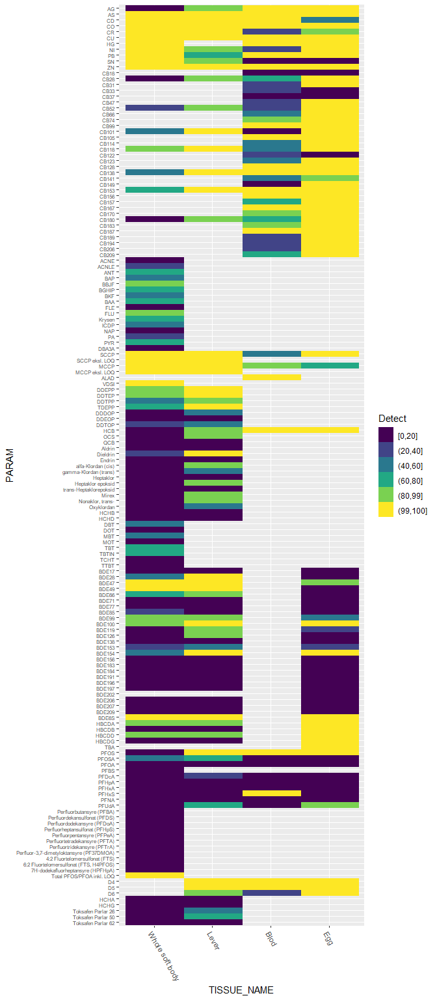
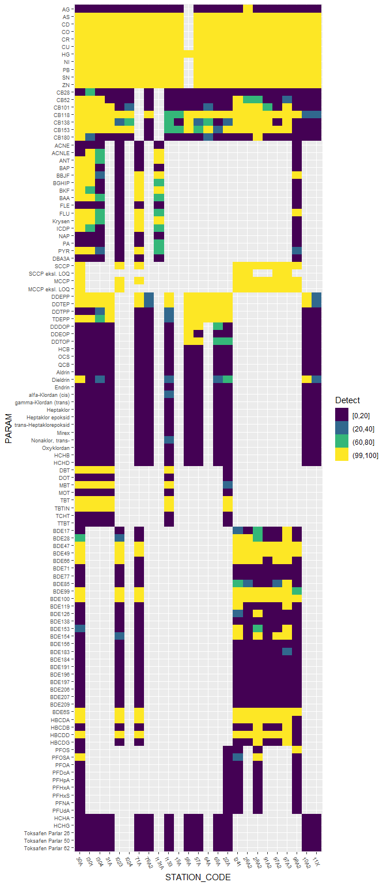
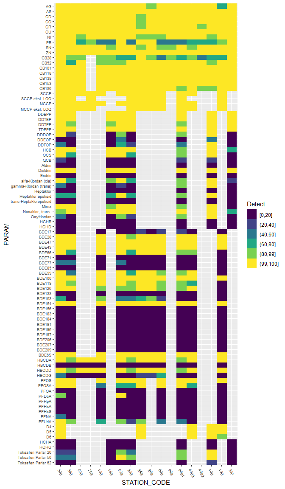
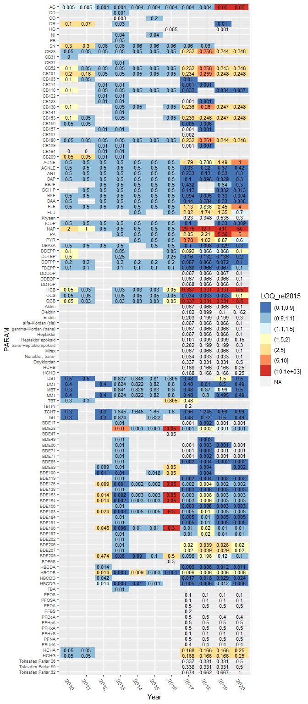
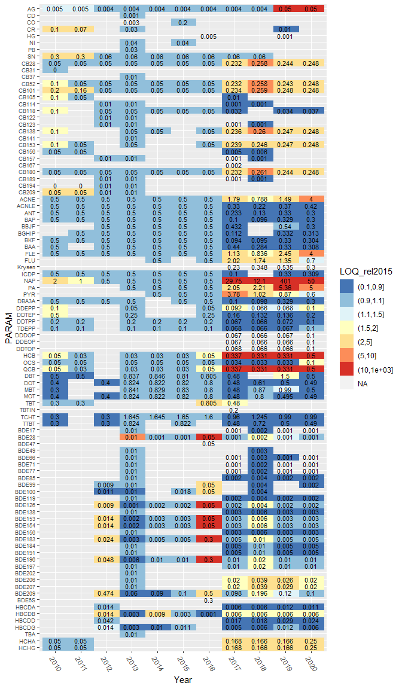
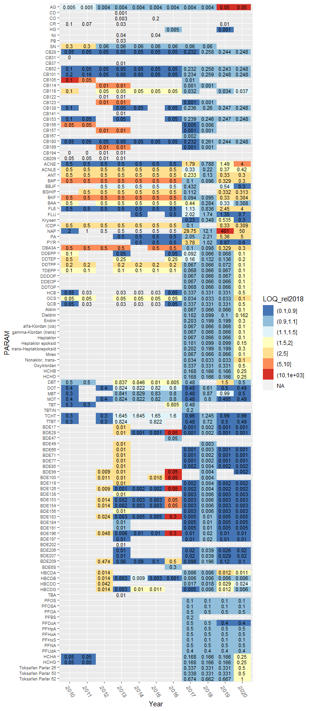
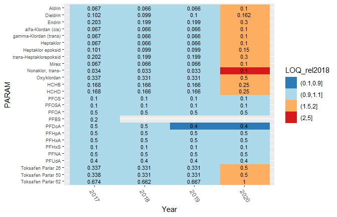
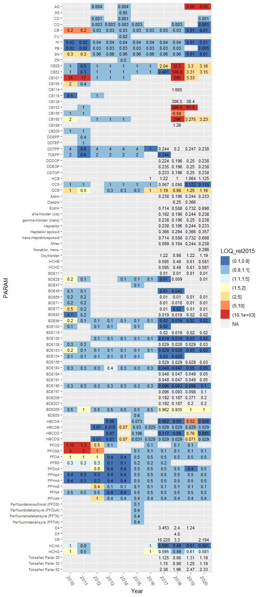
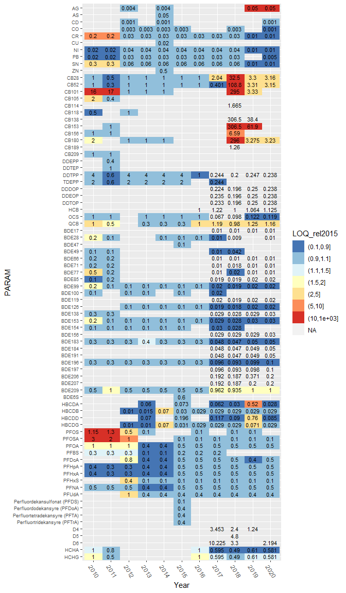
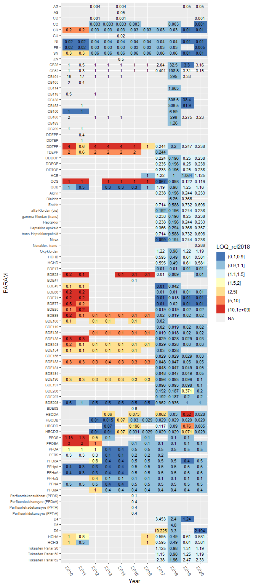

## 0. Settings  

```r
current_year <- 2020

# Don't include code at all
# knitr::opts_chunk$set(echo = FALSE)  

knitr::opts_chunk$set(results = "hold")  
```


## 1. Packages  

```r
suppressPackageStartupMessages(library(dplyr))
library(viridisLite)
library(ggplot2)
library(stringr)    # str_extract
# library(forcats)    # 
# library(viridis)
```

## 2. Data  

```r
dat <- readRDS("Files_from_Jupyterhub_2020/Raw_data/109_adjusted_data_2021-09-15.rds")
```

### Parameter ordering

```r
substance_groups <- c("Metals and metalloids", 
                      "Chlorobiphenyls", 
                      "Polycyclic aromatic hydrocarbons (PAHs)", 
                      "Chlorinated paraffins", 
                      "Biological effects: molecular/biochemical/cellular/assays", "Biomarkers", 
                      "Dichloro-diphenyl-trichloroethane (DDTs)", 
                      "Organochlorines (general)",
                      "Organo-metallic compounds", 
                      "Organobromines", 
                      "Organofluorines", 
                      "Siloxanes", 
                      "Chlorinated flame retardants", 
                      "Dioxins", "Hexachlorocyclohexanes", 
                      "Isotopes", "Organic esters", 
                      "Phenols/chlorophenols", 
                      "Phosphorus flame retardant (PFR)", "Phthalates", 
                      "Triazines",
                      "Support parameters")

if (FALSE){
  
  dat_excel <- readRDS("Files_from_Jupyterhub_2020/Big_excel_table/Data_xl_2021-10-08_ver01.rds")
  
  df_pars_orig <- dat_excel %>%
    filter(!is.na(Yr_2020)) %>%
    distinct(Substance.Group, PARAM) %>%
    mutate(
      Substance.Group = factor(Substance.Group, levels = substance_groups),
      param_no = str_extract(PARAM, "[0-9]+") %>% as.numeric()
    ) %>%   # for ordering CBs and BDEs correctly
    arrange(Substance.Group, param_no, PARAM)
  
  # df_pars_orig$Substance.Group %>% unique() %>% dput()
  
  writexl::write_xlsx(df_pars_orig, "Data/868_df_pars_orig.xlsx")
  
  # edited manually to create '868_df_pars_edit.xlsx'
  # the 'param_no' variable was also edited to form the 'sorting' variable  
  
}

df_pars <- readxl::read_excel("Data/868_df_pars_edit.xlsx") %>%
  mutate(Substance.Group = factor(Substance.Group, levels = substance_groups)) %>%
  arrange(Substance.Group, Sorting)

param_levels <- df_pars %>% pull(PARAM)
# param_levels %>% dput()

# Remove sum and support parameters
param_exclude <- c("CB_S7", "Sum-HepCB", "Sum-HexCB", "Sum-PenCB", "Sum-TetCB", "Sum-TriCB", "PeCB", 
               "P_S", "PK_S", "PAHSS", "BDE6s", "BDESS", "PFAS", 
               "Delta13C", "Delta15N", "C/N", "DRYWT%", "% C", "% N", "Fett")
param_levels <- param_levels[!param_levels %in% param_exclude]

# Remove tin combounds measured as tin atom weight:
sel <- grepl("-Sn", param_levels, fixed = TRUE)
# param_levels[sel]
param_levels <- param_levels[!sel]

# param_levels <- factor(param_levels, levels = param_levels)
```

### Stations, for ordering  

```r
stations_table <- c(
  "30A", "I301", "I304", "31A", "36A", "I023", "I024",     # Blue mussel, Oslofjorden
  "71A", "I714", "76A2", "I131A", "I133", "15A",           # Blue mussel, Grenland - Sørlandet
  "51A", "52A", "56A", "57A", "64A", "65A", "22A",         # Blue mussel, Vestlandet - Trøndelag
     "I241", "26A2", "28A2", "91A2",                       #  - " -
  "97A2", "97A3", "98A2", "10A2", "11X",                   # Blue mussel, Nord-Norge
  "30B", "36B", "02B", "71B","13B", "15B",                 # Cod
    "53B", "23B", "24B", "28B", "80B", "96B",              # Cod            
    "98B1", "43B2", "45B2", "10B", "19B",                  # Cod
    "33F",                                                 # European flounder
  "19N",                                                   # Eider duck - twice (blood and egg)
  "71G",                                                   # Dog whelk / periwinkle
  "36G", "76G", "131G", "15G", "227G",                     # Dog whelk
    "22G", "98G", "11G")                                   # Dog whelk

# stations_table

# Get some line numbers for table - these are used later
a <- which(stations_table == "11X")    # last blue mussel
b <- which(stations_table == "33F")    # last cod and flounder
c <- which(stations_table == "19N")    # first bird    
d <- which(stations_table == "71G")    # first snail
e <- length(stations_table)            # last

stations_mussel <- stations_table[1:a]     # Not including I965, I969
stations_fish <- stations_table[(a+1):b]
```

## 3. Proportion over LOQ, by tissue   

### Calculate detection %  

```r
#
#
df_detect <- dat %>%
  filter(MYEAR %in% current_year &
           PARAM %in% param_levels) %>%
  mutate(PARAM = factor(PARAM, levels = param_levels)) %>%
  group_by(TISSUE_NAME, PARAM) %>%
  summarize(N = sum(!is.na(VALUE_WW)), Nondetect_n = sum(!is.na(FLAG1)), Detect = 100 - 100*Nondetect_n/N )
```

```
## `summarise()` has grouped output by 'TISSUE_NAME'. You can override using the `.groups` argument.
```

```r
# table(df_detect$TISSUE_NAME) %>% names() %>% dput()
```

### Plot    

```r
# tissues_plot <- c("Whole soft body", "Lever", "Muskel", "Blod", "Egg")  # Muskel is not so interesting
tissues_plot <- c("Whole soft body", "Lever", "Blod", "Egg")

ggplot(df_detect %>%
         filter(TISSUE_NAME %in% tissues_plot) %>%
         mutate(
           TISSUE_NAME = factor(TISSUE_NAME, levels = tissues_plot),
           PARAM = factor(PARAM, levels = rev(param_levels)), # rev: for ordering top -> down
           Detect = cut(Detect, breaks = c(0, 20, 40, 60, 80, 99, 100), include.lowest = TRUE)
         ),
       aes(TISSUE_NAME, PARAM, fill = Detect)) +
  geom_raster() +
  scale_fill_viridis_d() +
  theme(axis.text.x = element_text(hjust = 0, angle = -60)) +
  theme(axis.text.y = element_text(size = 6))
```

<!-- -->


## 4. Proportion over LOQ, by blue mussel station     

### Calculate detection %  

```r
df_detect_mussel <- dat %>%
  filter(MYEAR %in% current_year &
           PARAM %in% param_levels &
           LATIN_NAME == "Mytilus edulis" &     # not including I965, I969
           STATION_CODE %in% stations_mussel) %>%
  mutate(PARAM = factor(PARAM, levels = param_levels)) %>%
  group_by(STATION_CODE, PARAM) %>%
  summarize(N = sum(!is.na(VALUE_WW)), Nondetect_n = sum(!is.na(FLAG1)), Detect = 100 - 100*Nondetect_n/N )
```

```
## `summarise()` has grouped output by 'STATION_CODE'. You can override using the `.groups` argument.
```

```r
# table(df_detect$TISSUE_NAME) %>% names() %>% dput()
```

### Plot    

```r
# tissues_plot <- c("Whole soft body", "Lever", "Muskel", "Blod", "Egg")  # Muskel is not so interesting
tissues_plot <- c("Whole soft body", "Lever", "Blod", "Egg")

ggplot(df_detect_mussel %>%
         mutate(
           PARAM = factor(PARAM, levels = rev(param_levels)), # rev: for ordering top -> down
           STATION_CODE = factor(STATION_CODE, levels = stations_mussel),
           Detect = cut(Detect, breaks = c(0, 20, 40, 60, 80, 99, 100), include.lowest = TRUE)
         ),
       aes(STATION_CODE, PARAM, fill = Detect)) +
  geom_raster() +
  scale_fill_viridis_d() +
  theme(axis.text.x = element_text(hjust = 0, angle = -60)) +
  theme(axis.text = element_text(size = 7))
```

<!-- -->


## 5. Proportion over LOQ (liver), by fish station     

### Calculate detection %  

```r
df_detect_fish <- dat %>%
  filter(MYEAR %in% current_year &
           PARAM %in% param_levels &
           TISSUE_NAME == "Lever") %>%
  mutate(PARAM = factor(PARAM, levels = param_levels)) %>%
  group_by(STATION_CODE, PARAM) %>%
  summarize(N = sum(!is.na(VALUE_WW)), Nondetect_n = sum(!is.na(FLAG1)), Detect = 100 - 100*Nondetect_n/N )
```

```
## `summarise()` has grouped output by 'STATION_CODE'. You can override using the `.groups` argument.
```

```r
# table(df_detect$TISSUE_NAME) %>% names() %>% dput()
```

### Plot    

```r
# tissues_plot <- c("Whole soft body", "Lever", "Muskel", "Blod", "Egg")  # Muskel is not so interesting
tissues_plot <- c("Whole soft body", "Lever", "Blod", "Egg")

ggplot(df_detect_fish %>%
         mutate(
           PARAM = factor(PARAM, levels = rev(param_levels)), # rev: for ordering top -> down
           STATION_CODE = factor(STATION_CODE, levels = stations_fish),
           Detect = cut(Detect, breaks = c(0, 20, 40, 60, 80, 99, 100), include.lowest = TRUE)
         ),
       aes(STATION_CODE, PARAM, fill = Detect)) +
  geom_raster() +
  scale_fill_viridis_d() +
  theme(axis.text.x = element_text(hjust = 0, angle = -60)) +
  theme(axis.text = element_text(size = 7))
```

<!-- -->


## 6. Observed LOQ over time,  blue mussel     

### Calculate detection %  

```r
df_loq_mussel_yr_1 <- dat %>%
  # filter(PARAM %in% c("ACNE", "ACNLE")) %>%
  filter(MYEAR %in% 2010:2020 &
           PARAM %in% param_levels &
           LATIN_NAME == "Mytilus edulis" &     # not including I965, I969
           STATION_CODE %in% stations_mussel &
           !is.na(FLAG1)) %>%
  group_by(PARAM, MYEAR) %>%
  summarise(LOQ = median(VALUE_WW), .groups = "drop")

df_loq_mussel_yr_ref2015 <- df_loq_mussel_yr_1 %>%
  filter(MYEAR <= 2015) %>%
  group_by(PARAM) %>%
  summarise(LOQ_ref2015 = LOQ[MYEAR == max(MYEAR)], .groups = "drop")

df_loq_mussel_yr_ref2018 <- df_loq_mussel_yr_1 %>%
  filter(MYEAR %in% 2016:2018) %>%
  group_by(PARAM) %>%
  summarise(LOQ_ref2018 = LOQ[MYEAR == max(MYEAR)], .groups = "drop")

df_loq_mussel_yr <- df_loq_mussel_yr_1 %>%
  left_join(df_loq_mussel_yr_ref2015, by = "PARAM") %>%
  left_join(df_loq_mussel_yr_ref2018, by = "PARAM") %>%
  mutate(
    LOQ_rel2015 = LOQ / LOQ_ref2015,
    LOQ_rel2018 = LOQ / LOQ_ref2018)

# table(df_detect$TISSUE_NAME) %>% names() %>% dput()
```

### Parameter groups for 'selected groups'  

```r
i1 <- seq(which(param_levels == "Aldrin"), which(param_levels == "HCHD"))
i2 <- seq(which(param_levels == "PFOS"), which(param_levels == "PFUdA"))
i3 <- grep("Toksafen", param_levels)
param_levels_mussel1 <- param_levels[-c(i1,i2,i3)]
param_levels_mussel2 <- param_levels[c(i1,i2,i3)]
```


### Plot relative to 2015, all    

```r
cat("Range of LOQ_rel2015: \n")
range(df_loq_mussel_yr$LOQ_rel2015, na.rm = TRUE)

# tissues_plot <- c("Whole soft body", "Lever", "Muskel", "Blod", "Egg")  # Muskel is not so interesting
tissues_plot <- c("Whole soft body", "Lever", "Blod", "Egg")

ggplot(df_loq_mussel_yr %>%
         filter(PARAM %in% param_levels) %>%
         mutate(
           PARAM = factor(PARAM, levels = rev(param_levels)), # rev: ordering top -> down
           Year = factor(MYEAR),
           LOQ_rel2015 = cut(LOQ_rel2015, breaks = c(0.1, 0.9, 1.1, 1.5, 2, 5, 10, 1000))
         ), #%>%
         # filter(PARAM != "NAP"),
       aes(Year, PARAM, fill = LOQ_rel2015)) +
  geom_raster() +
  geom_text(aes(label = round(LOQ, 3)), size = 3) +
  scale_fill_brewer(palette = "RdYlBu", direction = -1) +
  theme(axis.text.x = element_text(hjust = 0, angle = -60)) +
  theme(axis.text.y = element_text(size = 7))
```

```
## Warning: Removed 140 rows containing missing values (geom_raster).
```

<!-- -->

```
## Range of LOQ_rel2015: 
## [1]   0.001 802.000
```


### Plot relative to 2015, selected groups    

```r
# tissues_plot <- c("Whole soft body", "Lever", "Muskel", "Blod", "Egg")  # Muskel is not so interesting
tissues_plot <- c("Whole soft body", "Lever", "Blod", "Egg")

ggplot(df_loq_mussel_yr %>%
         filter(PARAM %in% param_levels_mussel1) %>%
         mutate(
           PARAM = factor(PARAM, levels = rev(param_levels_mussel1)), # rev: ordering top -> down
           Year = factor(MYEAR),
           LOQ_rel2015 = cut(LOQ_rel2015, breaks = c(0.1, 0.9, 1.1, 1.5, 2, 5, 10, 1000))
         ), #%>%
         # filter(PARAM != "NAP"),
       aes(Year, PARAM, fill = LOQ_rel2015)) +
  geom_raster() +
  geom_text(aes(label = round(LOQ, 3)), size = 3) +
  scale_fill_brewer(palette = "RdYlBu", direction = -1) +
  theme(axis.text.x = element_text(hjust = 0, angle = -60)) +
  theme(axis.text.y = element_text(size = 7))
```

```
## Warning: Removed 39 rows containing missing values (geom_raster).
```

<!-- -->


### Plot relative to 2018, all    

```r
cat("Range of LOQ_rel2018: \n")
range(df_loq_mussel_yr$LOQ_rel2018, na.rm = TRUE)

# tissues_plot <- c("Whole soft body", "Lever", "Muskel", "Blod", "Egg")  # Muskel is not so interesting
tissues_plot <- c("Whole soft body", "Lever", "Blod", "Egg")

ggplot(df_loq_mussel_yr %>%
         mutate(
           PARAM = factor(PARAM, levels = rev(param_levels)), # set reverse order, in order to get first values on top
           Year = factor(MYEAR),
           LOQ_rel2018 = cut(LOQ_rel2018, breaks = c(0.1, 0.9, 1.1, 1.5, 2, 5, 10, 1000))
         ), #%>%
         # filter(PARAM != "NAP"),
       aes(Year, PARAM, fill = LOQ_rel2018)) +
  geom_raster() +
  geom_text(aes(label = round(LOQ, 3)), size = 3) +
  scale_fill_brewer(palette = "RdYlBu", direction = -1) +
  theme(axis.text.x = element_text(hjust = 0, angle = -60)) +
  theme(axis.text.y = element_text(size = 7))
```

```
## Warning: Removed 39 rows containing missing values (geom_raster).
```

<!-- -->

```
## Range of LOQ_rel2018: 
## [1]  0.04132231 33.14049587
```


### Plot relative to 2018, selected groups      

```r
# tissues_plot <- c("Whole soft body", "Lever", "Muskel", "Blod", "Egg")  # Muskel is not so interesting
tissues_plot <- c("Whole soft body", "Lever", "Blod", "Egg")

# as "2015, selected groups" but replacing param_levels_mussel1 with param_levels_mussel2
ggplot(df_loq_mussel_yr %>%
         filter(PARAM %in% param_levels_mussel2) %>%
         mutate(
           PARAM = factor(PARAM, levels = rev(param_levels_mussel2)), # set reverse order, in order to get first values on top
           Year = factor(MYEAR),
           LOQ_rel2018 = cut(LOQ_rel2018, breaks = c(0.1, 0.9, 1.1, 1.5, 2, 5, 10, 1000))
         ), #%>%
         # filter(PARAM != "NAP"),
       aes(Year, PARAM, fill = LOQ_rel2018)) +
  geom_raster() +
  geom_text(aes(label = round(LOQ, 3)), size = 3) +
  scale_fill_brewer(palette = "RdYlBu", direction = -1) +
  theme(axis.text.x = element_text(hjust = 0, angle = -60)) +
  theme(axis.text.y = element_text(size = 7))
```

<!-- -->


## 7. Observed LOQ over time, fish liver       

### Calculate detection %  

```r
df_loq_fish_yr_1 <- dat %>%
  # filter(PARAM %in% c("ACNE", "ACNLE")) %>%
  filter(MYEAR %in% 2010:2020 &
           PARAM %in% param_levels &
           TISSUE_NAME == "Lever" &     # not including I965, I969
           STATION_CODE %in% stations_fish &
           !is.na(FLAG1)) %>%
  group_by(PARAM, MYEAR) %>%
  summarise(LOQ = median(VALUE_WW), .groups = "drop")

df_loq_fish_yr_ref2015 <- df_loq_fish_yr_1 %>%
  filter(MYEAR <= 2015) %>%
  group_by(PARAM) %>%
  summarise(LOQ_ref2015 = LOQ[MYEAR == max(MYEAR)], .groups = "drop")

df_loq_fish_yr_ref2018 <- df_loq_fish_yr_1 %>%
  filter(MYEAR %in% 2016:2018) %>%
  group_by(PARAM) %>%
  summarise(LOQ_ref2018 = LOQ[MYEAR == max(MYEAR)], .groups = "drop")

df_loq_fish_yr <- df_loq_fish_yr_1 %>%
  left_join(df_loq_fish_yr_ref2015, by = "PARAM") %>%
  left_join(df_loq_fish_yr_ref2018, by = "PARAM") %>%
  mutate(
    LOQ_rel2015 = LOQ / LOQ_ref2015,
    LOQ_rel2018 = LOQ / LOQ_ref2018)

# table(df_detect$TISSUE_NAME) %>% names() %>% dput()
```


### Parameter groups for 'selected groups'  

```r
i1 <- seq(which(param_levels == "Aldrin"), which(param_levels == "HCHD"))
# i2 <- seq(which(param_levels == "PFOS"), which(param_levels == "PFUdA"))
i3 <- grep("Toksafen", param_levels)
param_levels_fish1 <- param_levels[-c(i1,i3)]
param_levels_fish2 <- param_levels[c(i1,i3)]
```


### Plot relative to 2015, all    

```r
cat("Range of LOQ_rel2015: \n")
range(df_loq_fish_yr$LOQ_rel2015, na.rm = TRUE)

# tissues_plot <- c("Whole soft body", "Lever", "Muskel", "Blod", "Egg")  # Muskel is not so interesting
tissues_plot <- c("Whole soft body", "Lever", "Blod", "Egg")

ggplot(df_loq_fish_yr %>%
         filter(PARAM %in% param_levels) %>%
         mutate(
           PARAM = factor(PARAM, levels = rev(param_levels)), # rev: ordering top -> down
           Year = factor(MYEAR),
           LOQ_rel2015 = cut(LOQ_rel2015, breaks = c(0.1, 0.9, 1.1, 1.5, 2, 5, 10, 1000))
         ), #%>%
         # filter(PARAM != "NAP"),
       aes(Year, PARAM, fill = LOQ_rel2015)) +
  geom_raster() +
  geom_text(aes(label = round(LOQ, 3)), size = 3) +
  scale_fill_brewer(palette = "RdYlBu", direction = -1) +
  theme(axis.text.x = element_text(hjust = 0, angle = -60)) +
  theme(axis.text.y = element_text(size = 7))
```

```
## Warning: Removed 146 rows containing missing values (geom_raster).
```

<!-- -->

```
## Range of LOQ_rel2015: 
## [1]   0.0485 306.5000
```


### Plot relative to 2015, selected groups    

```r
# tissues_plot <- c("Whole soft body", "Lever", "Muskel", "Blod", "Egg")  # Muskel is not so interesting
tissues_plot <- c("Whole soft body", "Lever", "Blod", "Egg")

# Remove PFAS from this list - they had liver data before 2016
i1 <- seq(which(param_levels == "Aldrin"), which(param_levels == "HCHD"))
# i2 <- seq(which(param_levels == "PFOS"), which(param_levels == "PFUdA"))
i3 <- grep("Toksafen", param_levels)
param_levels1 <- param_levels[-c(i1,i3)]
param_levels2 <- param_levels[c(i1,i3)]

ggplot(df_loq_fish_yr %>%
         filter(PARAM %in% param_levels_fish1) %>%
         mutate(
           PARAM = factor(PARAM, levels = rev(param_levels_fish1)), # rev: ordering top -> down
           Year = factor(MYEAR),
           LOQ_rel2015 = cut(LOQ_rel2015, breaks = c(0.1, 0.9, 1.1, 1.5, 2, 5, 10, 1000))
         ), #%>%
         # filter(PARAM != "NAP"),
       aes(Year, PARAM, fill = LOQ_rel2015)) +
  geom_raster() +
  geom_text(aes(label = round(LOQ, 3)), size = 3) +
  scale_fill_brewer(palette = "RdYlBu", direction = -1) +
  theme(axis.text.x = element_text(hjust = 0, angle = -60)) +
  theme(axis.text.y = element_text(size = 7))
```

```
## Warning: Removed 87 rows containing missing values (geom_raster).
```

<!-- -->


### Plot relative to 2018, all    

```r
cat("Range of LOQ_rel2018: \n")
range(df_loq_fish_yr$LOQ_rel2018, na.rm = TRUE)

# tissues_plot <- c("Whole soft body", "Lever", "Muskel", "Blod", "Egg")  # Muskel is not so interesting
tissues_plot <- c("Whole soft body", "Lever", "Blod", "Egg")

ggplot(df_loq_fish_yr %>%
         mutate(
           PARAM = factor(PARAM, levels = rev(param_levels)), # set reverse order, in order to get first values on top
           Year = factor(MYEAR),
           LOQ_rel2018 = cut(LOQ_rel2018, breaks = c(0.1, 0.9, 1.1, 1.5, 2, 5, 10, 1000))
         ), #%>%
         # filter(PARAM != "NAP"),
       aes(Year, PARAM, fill = LOQ_rel2018)) +
  geom_raster() +
  geom_text(aes(label = round(LOQ, 3)), size = 3) +
  scale_fill_brewer(palette = "RdYlBu", direction = -1) +
  theme(axis.text.x = element_text(hjust = 0, angle = -60)) +
  theme(axis.text.y = element_text(size = 7))
```

```
## Warning: Removed 58 rows containing missing values (geom_raster).
```

<!-- -->

```
## Range of LOQ_rel2018: 
## [1]  0.002757353 30.000000000
```


### Plot relative to 2018, selected groups      

```r
# tissues_plot <- c("Whole soft body", "Lever", "Muskel", "Blod", "Egg")  # Muskel is not so interesting
tissues_plot <- c("Whole soft body", "Lever", "Blod", "Egg")

# as "2015, selected groups" but replacing param_levels1 with param_levels2
ggplot(df_loq_fish_yr %>%
         filter(PARAM %in% param_levels_fish2) %>%
         mutate(
           PARAM = factor(PARAM, levels = rev(param_levels_fish2)), # order top->down in plot
           Year = factor(MYEAR),
           LOQ_rel2018 = cut(LOQ_rel2018, breaks = c(0.1, 0.9, 1.1, 1.5, 2, 5, 10, 1000))
         ), #%>%
         # filter(PARAM != "NAP"),
       aes(Year, PARAM, fill = LOQ_rel2018)) +
  geom_raster() +
  geom_text(aes(label = round(LOQ, 3)), size = 3) +
  scale_fill_brewer(palette = "RdYlBu", direction = -1) +
  theme(axis.text.x = element_text(hjust = 0, angle = -60)) +
  theme(axis.text.y = element_text(size = 7))
```

```
## Warning: Removed 2 rows containing missing values (geom_raster).
```

<!-- -->
